# **META-AGENTIC** α‑AGI 👁️✨

**Out‑learn · Out‑think · Out‑design · Out‑strategise · Out‑execute**

**Official and *pioneering* definition – Meta-Agentic (adj.)**: Describes an agent whose **primary role** is to **create, select, evaluate, or re‑configure other agents** and the rules governing their interactions, thereby exercising **second‑order agency** over a population of first‑order agents. *The term was **pioneered by [Vincent Boucher](https://www.linkedin.com/in/montrealai/), President of MONTREAL.AI**.*

```mermaid
flowchart TD
    Insight["🎖️ α‑AGI Insight 👁️✨"]
    Seeds["🌱💫 α-AGI Nova-Seeds 🔐"]
    Mark["α-AGI MARK 🔮🌌✨"]
    Sovereign["🎖️ α‑AGI Sovereign 👑✨"]
    Biz["🌸 α‑AGI Business 👁️✨"]
    Market["🪐 Marketplace 👁️✨"]
    Jobs["📜 α‑AGI Jobs 👁️✨"]
    Agents["👾👾👾🌌👾👾👾 α‑AGI Agents 👁️✨"]
    Reservoir["💎 α‑AGI Value Reservoir"]
    Architect["🎖️ α‑AGI Architect 🔱✨"]
    Council["🔐 α‑AGI Council 👁️✨"]
    Nodes["🖥️ α‑AGI Nodes 👁️✨"]

    Insight --> Seeds --> Mark --> Sovereign
    Sovereign --> Biz --> Market
    Market -->|spawn| Jobs --> Agents
    Agents -- success --> Reservoir
    Jobs -- ΔΣUSD --> Reservoir
    Reservoir -. reinvest .-> Seeds
    Reservoir -. fund .-> Market
    Agents <---> Nodes
    Architect <--> Sovereign
    Architect <--> Insight
    Council --> Sovereign
```

# 🚀 [ 🎖️ α‑AGI Ascension 🌌 ]

## Humanity’s Structured Rise to Economic Supremacy via Strategic AGI Mastery

### 🎖️ α‑AGI Insight 👁️✨ — Beyond Human Foresight
Where human foresight reaches its limits, α‑AGI Insight sees beyond. Humanity stands at the precipice of history’s most profound economic transformation. α‑AGI Insight identifies with pinpoint accuracy those sectors poised for imminent disruption by Artificial General Intelligence (AGI). With authoritative and rigorously validated projections estimating economic opportunities surpassing **$15 Quadrillion (15 000 trillion USD)**, today’s strategic anticipation unlocks extraordinary economic advantages tomorrow.

* **Precision Forecasting** — Identify and proactively engage critical sectors before AGI disruption.  
* **First‑Mover Advantage** — Maximize returns through strategic foresight and superior positioning.

### 🎖️ α‑AGI Sovereign 👁️✨ — Autonomous Economic Transformation
Meta‑Agentic mastery at global scale. α‑AGI Sovereign represents a revolutionary class of autonomous, blockchain‑based enterprises deploying advanced Meta‑Agentic frameworks. Through dynamically evolving swarms of intelligent agents, these enterprises systematically identify and transform global inefficiencies into measurable economic value (“$AGIALPHA”), fundamentally reshaping market dynamics and strategically realigning global economic structures.

* **α‑AGI Marketplace 👁️✨** — Decentralized global platform matching strategic AGI tasks with optimal execution.  
  * **α‑AGI Jobs 👁️✨** — Autonomous missions precisely targeting identified inefficiencies.  
  * **α‑AGI Agents 👁️✨** — Adaptive, self‑optimizing intelligent agents executing α‑Jobs, yielding immediate economic returns.

Strategic Edge:

* Decentralized autonomy ensures superior agility and resilience.
* Strategically validated methodologies guarantee consistent economic leadership.
