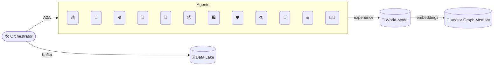
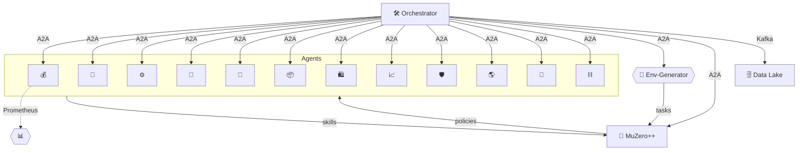
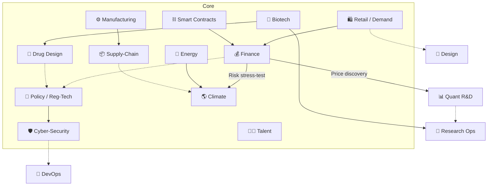
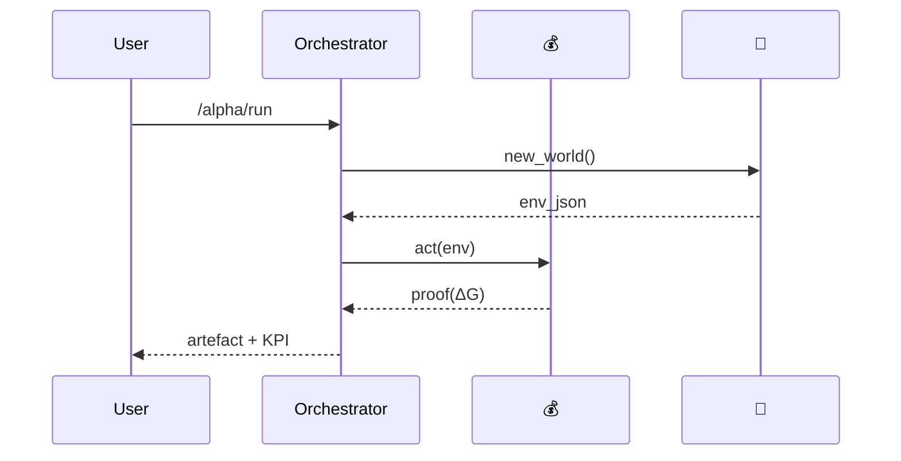
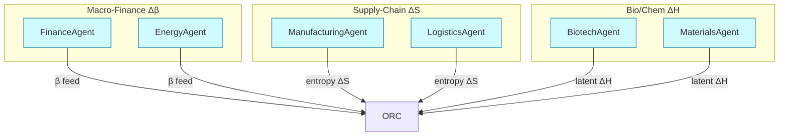

# Alpha‑Factory v1 👁️✨ — Multi‑Agent **AGENTIC** α‑AGI

**Out‑learn · Out‑think · Out‑design · Out‑strategise · Out‑execute**

---

> **Mission 🎯**  Identify 🔍 → Learn 📚 → Think 🧠 → Design 🎨 → Strategise ♟️ → Execute ⚡ — compounding real‑world **α** across *all* industries.

Global markets seep *USD ✧ trillions/yr* in latent opportunity — “alpha” in the broadest sense:  
<kbd>pricing dislocations • supply‑chain entropy • novel drug targets • policy loopholes • undiscovered materials</kbd>.

**Alpha‑Factory v1** is an antifragile constellation of self‑improving Agentic α‑AGI Agents 👁️✨ orchestrated to **spot live alpha across any industry and transmute it into compounding value**.

**Definition**: An **α‑AGI Business** 👁️✨ is an on‑chain autonomous enterprise (`<name>.a.agi.eth`) that unleashes a swarm of self‑improving agentic **α‑AGI agents** 👁️✨ (`<name>.a.agent.agi.eth`) to hunt down inefficiencies across any domain and transmute them into **$AGIALPHA**.

**Official definition – Meta-Agentic (adj.)**: Describes an agent whose **primary role** is to **create, select, evaluate, or re‑configure other agents** and the rules governing their interactions, thereby exercising **second‑order agency** over a population of first‑order agents. *The term was **pioneered by [Vincent Boucher](https://www.linkedin.com/in/montrealai/), President of MONTREAL.AI**.*

Built atop **OpenAI Agents SDK**, **Google ADK**, **A2A protocol**, and Anthropic’s **Model Context Protocol**, the stack runs cloud‑native *or* air‑gapped, hot‑swapping between frontier LLMs and distilled local models.

---

## 📜 Table of Contents
0. [Design Philosophy](#0-design-philosophy)  
1. [System Topology 🗺️](#1-system-topology)  
2. [World‑Model & Planner 🌌](#2-world-model--planner)  
3. [Agent Gallery 🖼️ (12 agents)](#3-agent-gallery)  
4. [Demo Showcase 🎬 (12 demos)](#4-demo-showcase)  
5. [Memory & Knowledge Fabric 🧠](#5-memory--knowledge-fabric)
6. [5‑Minute Quick‑Start 🚀](#6-5-minute-quick-start)
6.1. [Running Tests 🧪](#61-running-tests)
7. [Deployment Recipes 🍳](#7-deployment-recipes)
8. [Governance & Compliance ⚖️](#8-governance--compliance)  
9. [Observability 🔭](#9-observability)  
10. [Extending the Mesh 🔌](#10-extending-the-mesh)  
11. [Troubleshooting 🛠️](#11-troubleshooting)  
12. [Roadmap 🛣️](#12-roadmap)  
13. [Credits 🌟](#13-credits)  
14. [License 📝](#14-license)

---

<a name="0-design-philosophy"></a>
## 0 · Design Philosophy

> “We have shifted from *big‑data hoarding* to **big‑experience compounding**.” — *Era of Experience*.

* **Experience‑First Loop** — Sense → *Imagine* (MuZero‑style latent planning) → Act → Adapt.  
* **AI‑GA Autogenesis** — The factory meta‑evolves new agents and curricula inspired by Clune’s *AI‑Generating Algorithms*.  
* **Graceful Degradation** — GPU‑less? No cloud key? Agents fall back to distilled local models & heuristics.  
* **Zero‑Trust Core** — SPIFFE identities, signed artefacts, guard‑rails, exhaustive audit logs.  
* **Polyglot Value** — Everything is normalised to a common *alpha Δ∑USD* lens.

---

<a name="1-system-topology"></a>
## 1 · System Topology 🗺️


* **Orchestrator** auto‑discovers agents (see `backend/agents/__init__.py`) and exposes a unified REST + gRPC facade.  
* **World‑Model** uses MuZero‑style latent dynamics for counterfactual planning.  
* **Memory Fabric** = pgvector + Neo4j for dense & causal recall.

---

<a name="2-world-model--planner"></a>
## 2 · World‑Model & Planner 🌌

| Component | Source Tech | Role |
|-----------|-------------|------|
| **Latent Dynamics** | MuZero++ | Predict env transitions & value |
| **Self‑Play Curriculum** | POET‑XL | Generates alpha‑labyrinth tasks |
| **Meta‑Gradient** | AI‑GA | Evolves optimiser hyper‑nets |
| **Task Selector** | Multi‑Armed Bandit | Schedules agent ↔ world‑model interactions |

---

<a name="3-agent-gallery"></a>
## 3 · Agent Gallery 🖼️



| # | Agent | Path | Prime Directive | Status | Key Env Vars |
|---|-------|------|-----------------|--------|--------------|
| 1 | **Finance** 💰 | `finance_agent.py` | Multi‑factor alpha & RL execution | **Prod** | `BROKER_DSN` |
| 2 | **Biotech** 🧬 | `biotech_agent.py` | CRISPR & assay proposals | **Prod** | `OPENAI_API_KEY` |
| 3 | **Manufacturing** ⚙️ | `manufacturing_agent.py` | CP‑SAT optimiser | **Prod** | `SCHED_HORIZON` |
| 4 | **Policy** 📜 | `policy_agent.py` | Statute QA & diffs | **Prod** | `STATUTE_CORPUS_DIR` |
| 5 | **Energy** 🔋 | `energy_agent.py` | Spot‑vs‑forward arbitrage | **Beta** | `ISO_TOKEN` |
| 6 | **Supply‑Chain** 📦 | `supply_chain_agent.py` | Stochastic MILP routing | **Beta** | `SC_DB_DSN` |
| 7 | **Retail Demand** 🛍️ | `retail_demand_agent.py` | SKU forecast & pricing | **Beta** | `POS_DB_DSN` |
| 8 | **Cyber‑Sec** 🛡️ | `cyber_threat_agent.py` | Predict & patch CVEs | **Beta** | `VT_API_KEY` |
| 9 | **Climate Risk** 🌎 | `climate_risk_agent.py` | ESG stress tests | **Beta** | `NOAA_TOKEN` |
|10 | **Drug‑Design** 💊 | `drug_design_agent.py` | Diffusion + docking | **Incub** | `CHEMBL_KEY` |
|11 | **Smart‑Contract** ⛓️ | `smart_contract_agent.py` | Formal verification | **Incub** | `ETH_RPC_URL` |
|12 | **Talent‑Match** 🧑‍💻 | `talent_match_agent.py` | Auto‑bounty hiring | **Incub** | — |



Each agent exports a signed *proof‑of‑alpha* message to the Kafka bus, enabling cross‑breeding of opportunities.



---

<a name="4-demo-showcase"></a>
## 4 · Demo Showcase 🎬

| # | Folder | Emoji | Lightning Pitch | Alpha Contribution | Start Locally |
|---|--------|-------|-----------------|--------------------|---------------|
|1|`aiga_meta_evolution`|🧬|Agents *evolve* new agents; genetic tests auto‑score fitness.|Expands strategy space, surfacing fringe alpha.|`docker compose -f demos/docker-compose.aiga_meta.yml up`|
|2|`alpha_agi_business_v1`|🏦|Auto‑incorporates a digital‑first company end‑to‑end.|Shows AGI turning ideas → registered business.|`docker compose -f demos/docker-compose.business_v1.yml up`|
|3|`alpha_agi_business_2_v1`|🏗️|Iterates business model with live market data RAG.|Continuous adaptation → durable competitive alpha.|`docker compose -f demos/docker-compose.business_2.yml up`|
|4|`alpha_agi_business_3_v1`|📊|Financial forecasting & fundraising agent swarm.|Optimises capital stack for ROI alpha.|`docker compose -f demos/docker-compose.business_3.yml up`|
|5|`alpha_agi_marketplace_v1`|🛒|Peer‑to‑peer agent marketplace simulating price discovery.|Validates micro‑alpha extraction via agent barter.|`docker compose -f demos/docker-compose.marketplace.yml up`|
|6|`alpha_asi_world_model`|🌌|Scales MuZero‑style world‑model to an open‑ended grid‑world.|Stress‑tests anticipatory planning for ASI scenarios.|`docker compose -f demos/docker-compose.asi_world.yml up`|
|7|`cross_industry_alpha_factory`|🌐|Full pipeline: ingest → plan → act across 4 verticals.|Proof that one orchestrator handles multi‑domain alpha.|`./alpha_factory_v1/demos/cross_industry_alpha_factory/deploy_alpha_factory_cross_industry_demo.sh`|
|8|`era_of_experience`|🏛️|Streams of life events build autobiographical memory‑graph tutor.|Transforms tacit SME knowledge into tradable signals.|`docker compose -f demos/docker-compose.era.yml up`|
|9|`finance_alpha`|💹|Live momentum + risk‑parity bot on Binance test‑net.|Generates real P&L; stress‑tested against CVaR.|`docker compose -f demos/docker-compose.finance.yml up`|
|10|`macro_sentinel`|🌐|GPT‑RAG news scanner auto‑hedges with CTA futures.|Shields portfolios from macro shocks.|`docker compose -f demos/docker-compose.macro.yml up`|
|11|`muzero_planning`|♟️|MuZero plans synthetic markets → optimal execution curves.|Validates world‑model planning in noisy domains.|`docker compose -f demos/docker-compose.muzero.yml up`|
|12|`self_healing_repo`|🩹|CI fails → agent crafts patch ⇒ PR green again.|Maintains pipeline uptime alpha.|`docker compose -f demos/docker-compose.selfheal.yml up`|

> **Colab?** Each folder ships an `*.ipynb` that mirrors the Docker flow with free GPUs.

### 4.1 · [α-ASI World-Model Demo 👁️✨](https://github.com/MontrealAI/AGI-Alpha-Agent-v0/tree/main/alpha_factory_v1/demos/alpha_asi_world_model)

Paper: [Multi-Agent AGENTIC α-AGI World-Model Demo 🥑](https://github.com/MontrealAI/AGI-Alpha-Agent-v0/blob/main/alpha_factory_v1/demos/alpha_asi_world_model/Alpha_ASI_World_Model.pdf)

```
┌──────────────────────────────── Alpha-Factory Bus (A2A) ───────────────────────────────┐
│                                                                                        │
│   ┌──────────────┐   curriculum   ┌───────────┐   telemetry   ┌────────────┐          │
│   │ StrategyAgent│───────────────►│ Orchestr. │──────────────►│   UI / WS  │          │
│   └──────────────┘                │  (loop)   │◄──────────────│  Interface │          │
│          ▲  ▲                     └───────────┘    commands   └────────────┘          │
│          │  │ new_env/reward                     ▲                                   │
│   plans  │  │ loss stats                        │ halt                              │
│          │  └──────────────────────┐            │                                   │
│   ┌──────┴───────┐   context       │            │                                   │
│   │ ResearchAgent│───────────────► Learner (MuZero) ◄─ SafetyAgent (loss guard)      │
│   └──────────────┘                │   ▲                                             │
│              code patches         │   │                                             │
│   ┌──────────────┐                │   │ gradients                                   │
│   │ CodeGenAgent │────────────────┘   │                                             │
│   └──────────────┘                    │                                             │
│                                       ▼                                             │
│                            POET Generator → MiniWorlds (env pool)                    │
└────────────────────────────────────────────────────────────────────────────────────────┘
```

### 4.2 · [🏛️ Large‑Scale α‑AGI Business 3 Demo 👁️✨ — **Omega‑Grade Edition**](https://github.com/MontrealAI/AGI-Alpha-Agent-v0/tree/main/alpha_factory_v1/demos/alpha_agi_business_3_v1)

> **Alpha‑Factory v1 → Ω‑Lattice v0**  
> _Transmuting cosmological free‑energy gradients into compounding cash‑flows._

Multi‑Scale Energy‑Landscape Diagram:



Cells with \(Δ\mathcal F < 0\) glow 🔵 on Grafana; Ω‑Agents race to harvest.

---

<a name="5-memory--knowledge-fabric"></a>
## 5 · Memory & Knowledge Fabric 🧠

```
[Event] --embedding--> PGVector DB
                   \--edge--> Neo4j (CAUSES, SUPPORTS, RISK_OF)
```

* Agents query `mem.search("supply shock beta>0.2")`  
* Planner asks Neo4j: `MATCH (a)-[:CAUSES]->(b) WHERE b.delta_alpha > 5e6 RETURN path`

---

<a name="6-5-minute-quick-start"></a>
## 6 · 5‑Minute Quick‑Start 🚀
```bash
git clone https://github.com/MontrealAI/AGI-Alpha-Agent-v0.git
cd AGI-Alpha-Agent-v0
./quickstart.sh --preflight   # optional environment check
./quickstart.sh               # creates venv, installs deps, launches
# open the docs in your browser
open http://localhost:8000/docs 2>/dev/null || xdg-open http://localhost:8000/docs || start http://localhost:8000/docs
# Alternatively, ``python alpha_factory_v1/quickstart.py`` provides the same
# workflow on Windows and other systems without Bash.

# Deploy instantly with Docker (prebuilt image)
docker run --pull=always -p 8000:8000 ghcr.io/montrealai/alpha-factory:latest

# The `alpha-factory` CLI also works when the package is installed:
#   pip install -e .
#   alpha-factory --list-agents
#
# Or install directly from GitHub for a quick test:
#   pip install git+https://github.com/MontrealAI/AGI-Alpha-Agent-v0.git
#   alpha-factory --list-agents
```

No GPU → falls back to GGML Llama‑3‑8B‑Q4.
No `OPENAI_API_KEY` → switches to local SBERT + heuristics.

---

<a name="61-running-tests"></a>
### 6.1 · Running Tests 🧪

Unit tests can be executed with the bundled helper script:

```bash
python alpha_factory_v1/scripts/run_tests.py
```

The script prefers `pytest` when available and otherwise falls back to
`unittest`. Ensure all tests pass before deploying changes.

---

### 6.2 · Cross-Industry Demo Quick‑Start 🌐
```bash
git clone https://github.com/MontrealAI/AGI-Alpha-Agent-v0.git
cd AGI-Alpha-Agent-v0/alpha_factory_v1/demos/cross_industry_alpha_factory
./deploy_alpha_factory_cross_industry_demo.sh
```

---

<a name="7-deployment-recipes"></a>
## 7 · Deployment Recipes 🍳
The repository bundles a lightweight `edge_runner.py` helper for running
Alpha‑Factory on air‑gapped or resource‑constrained devices. The script
forwards to `alpha_factory_v1.edge_runner` and exposes additional flags
like `--cycle`, `--loglevel` and `--version`.

| Target | Command | Notes |
|--------|---------|-------|
| **Docker Compose** | `docker compose up -d` | Kafka, Prometheus, Grafana |
| **Helm (K8s)** | `helm install af charts/alpha-factory` | SPIFFE, HPA |
| **AWS Fargate** | `./infra/deploy_fargate.sh` | SQS shim for Kafka |
| **IoT Edge** | `python edge_runner.py --agents manufacturing,energy` | Jetson Nano |

---

<a name="8-governance--compliance"></a>
## 8 · Governance & Compliance ⚖️

* **MCP envelopes** (SHA‑256, ISO‑8601, policy hash)  
* **Red‑Team Suite** fuzzes prompts & actions  
* **Attestations** — W3C Verifiable Credentials at every Actuator call

---

<a name="9-observability"></a>
## 9 · Observability 🔭

| Signal | Sink | Example |
|--------|------|---------|
| Metrics | Prometheus | `alpha_pnl_realised_usd` |
| Traces | OpenTelemetry | `trace_id` |
| Dashboards | Grafana | `alpha-factory/trade-lifecycle.json` |

---

<a name="10-extending-the-mesh"></a>
## 10 · Extending the Mesh 🔌
```python
from backend.agent_base import AgentBase

class MySuperAgent(AgentBase):
    NAME = "super"
    CAPABILITIES = ["telemetry_fusion"]
    COMPLIANCE_TAGS = ["gdpr_minimal"]

    async def run_cycle(self):
        ...

# setup.py entrypoint
[project.entry-points."alpha_factory.agents"]
super = my_pkg.super_agent:MySuperAgent
```
`pip install .` → orchestrator hot‑loads at next boot.

---

<a name="11-troubleshooting"></a>
## 11 · Troubleshooting 🛠️

| Symptom | Cause | Fix |
|---------|-------|-----|
| `ImportError: faiss` | FAISS missing | `pip install faiss-cpu` |
| Agent quarantined | exceptions | Check logs, clear flag |
| Kafka refuse | broker down | unset `ALPHA_KAFKA_BROKER` |

---

<a name="12-roadmap"></a>
## 12 · Roadmap 🛣️

1. **RL‑on‑Execution** — slippage‑aware order routing  
2. **Federated Mesh** — cross‑org agent exchange via ADK federation  
3. **World‑Model Audits** — interpretable probes of latents  
4. **Industry Packs** — Health‑Care, Gov‑Tech  
5. **Provable Safety ℙ** — Coq proofs for Actuators  

---

<a name="13-credits"></a>
## 13 · Credits 🌟

[Vincent Boucher](https://www.linkedin.com/in/montrealai/)—pioneer in AI and President of [MONTREAL.AI](https://www.montreal.ai/) since 2003—dominated the [OpenAI Gym](https://web.archive.org/web/20170929214241/https://gym.openai.com/read-only.html) with **AI Agents** in 2016 and unveiled the seminal [**“Multi‑Agent AI DAO”**](https://www.quebecartificialintelligence.com/priorart) in 2017.

Our **AGI ALPHA AGENT**, fuelled by the strictly‑utility **$AGIALPHA** token, now taps that foundation to unleash the ultimate α‑signal engine.

<a name="14-license"></a>
## 14 · License

This project is distributed under the [Apache 2.0](LICENSE) license.
---

*Made with ❤️ by the Alpha‑Factory Agentic Core Team — forging the tools that forge tomorrow.*
