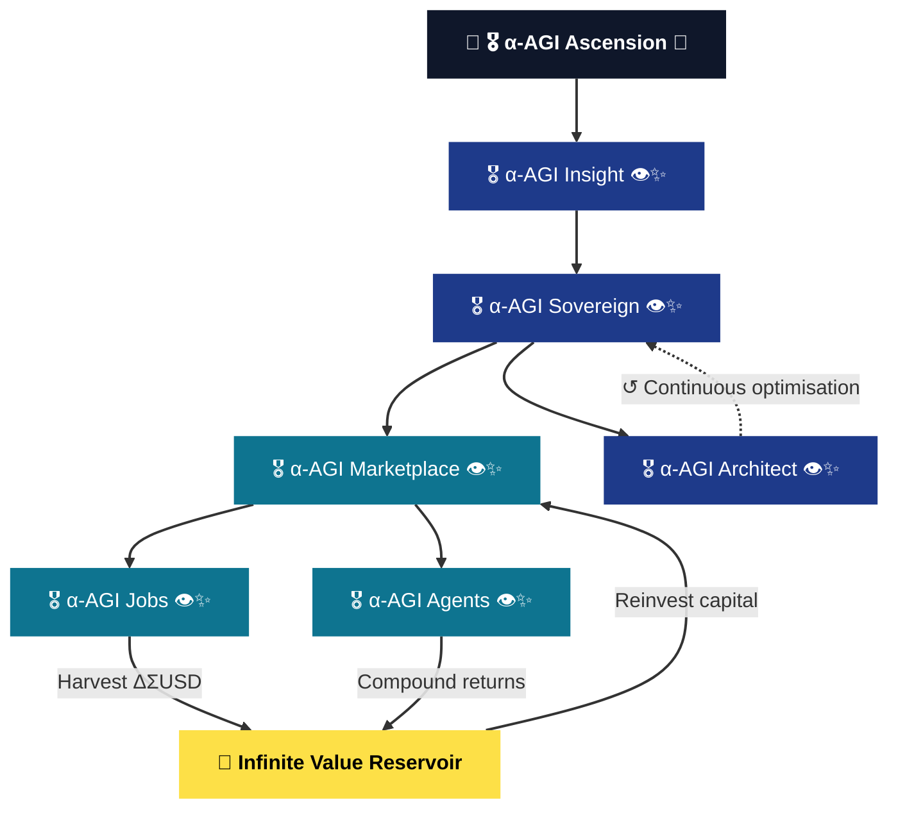
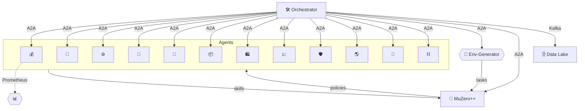
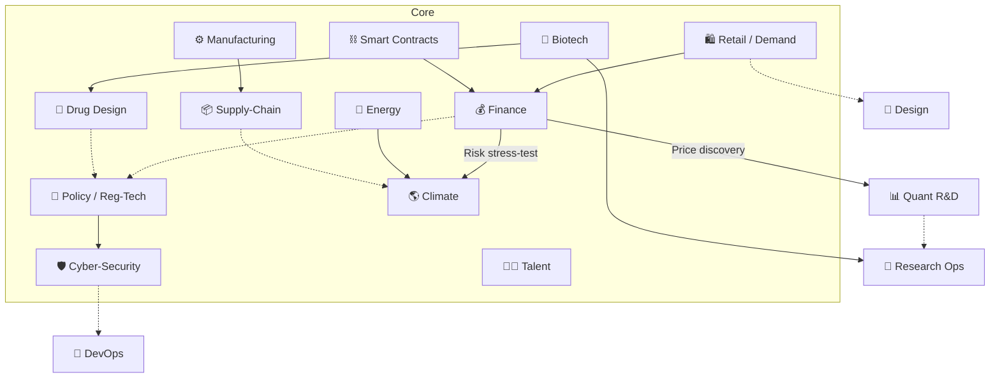
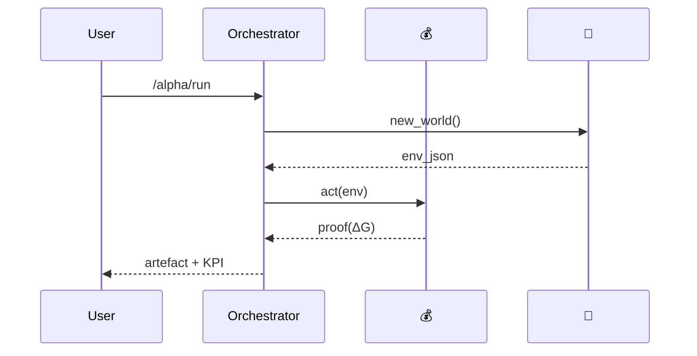
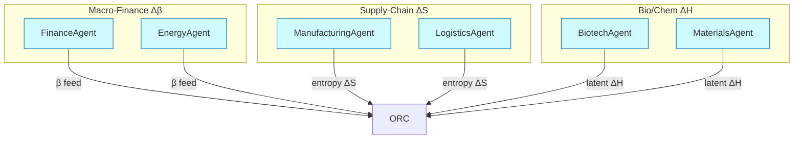

# Alpha‑Factory v1 👁️✨ — **META-AGENTIC** α‑AGI

**Out‑learn · Out‑think · Out‑design · Out‑strategise · Out‑execute**

---

# 🚀 [ 🎖️ α‑AGI Ascension 🌌 ]

## Humanity’s Structured Rise to Economic Supremacy via Strategic AGI Mastery

### 🎖️ α‑AGI Insight 👁️✨ — Beyond Human Foresight
Where human foresight reaches its limits, α‑AGI Insight sees beyond. Humanity stands at the precipice of history’s most profound economic transformation. α‑AGI Insight identifies with pinpoint accuracy those sectors poised for imminent disruption by Artificial General Intelligence (AGI). With authoritative and rigorously validated projections estimating economic opportunities surpassing **$15 Quadrillion (15 000 trillion USD)**, today’s strategic anticipation unlocks extraordinary economic advantages tomorrow.

* **Precision Forecasting** — Identify and proactively engage critical sectors before AGI disruption.  
* **First‑Mover Advantage** — Maximize returns through strategic foresight and superior positioning.

### 🎖️ α‑AGI Sovereign 👁️✨ — Autonomous Economic Transformation
Meta‑Agentic mastery at global scale. α‑AGI Sovereign represents a revolutionary class of autonomous, blockchain‑based enterprises deploying advanced Meta‑Agentic frameworks. Through dynamically evolving swarms of intelligent agents, these enterprises systematically identify and transform global inefficiencies into measurable economic value (“$AGIALPHA”), fundamentally reshaping market dynamics and strategically realigning global economic structures.

* **α‑AGI Marketplace 👁️✨** — Decentralized global platform matching strategic AGI tasks with optimal execution.  
  * **α‑AGI Jobs 👁️✨** — Autonomous missions precisely targeting identified inefficiencies.  
  * **α‑AGI Agents 👁️✨** — Adaptive, self‑optimizing intelligent agents executing α‑Jobs, yielding immediate economic returns.

Strategic Edge:

* Decentralized autonomy ensures superior agility and resilience.  
* Strategically validated methodologies guarantee consistent economic leadership.

### Running the Insight Demo

The α‑AGI Insight demo ships with an offline‑friendly command line interface.
After installation, launch the official demo via:

```bash
alpha-agi-beyond-foresight --episodes 5
# Shorter alias
alpha-agi-bhf --episodes 5
```

When API keys are configured the program automatically uses the OpenAI Agents
runtime. Otherwise it falls back to the local Meta‑Agentic Tree Search.
The orchestrator also cleans up the OpenAI runtime on exit to release resources.

For production use, invoke the **official demo** which automatically
checks the environment, selects the best runtime and optionally starts the
Google ADK gateway:

```bash
alpha-agi-insight-final --episodes 5
```

This wrapper transparently falls back to the offline Meta‑Agentic Tree
Search when API credentials are absent, ensuring the demo runs anywhere.

For a guaranteed offline run without external dependencies, use:

```bash
alpha-agi-insight-offline --episodes 5
```

This wrapper sets ``ALPHA_AGI_OFFLINE=true`` before delegating to the production
demo so the search loop never attempts network access.

<a name="63-offline-mode"></a>
### Offline Mode

Follow these steps when working without internet access.

1. **Build a wheelhouse** on a machine with connectivity:
   ```bash
   mkdir -p /media/wheels
   pip wheel -r requirements.txt -w /media/wheels
   pip wheel -r requirements-dev.txt -w /media/wheels
   ```

2. **Install from the wheelhouse** and verify packages:
   ```bash
   WHEELHOUSE=/media/wheels AUTO_INSTALL_MISSING=1 ./codex/setup.sh
   WHEELHOUSE=/media/wheels AUTO_INSTALL_MISSING=1 \
     python check_env.py --auto-install --wheelhouse /media/wheels
   pip check
   ```

3. **Download a `.gguf` weight** and set ``LLAMA_MODEL_PATH``:
   ```bash
   mkdir -p ~/.cache/llama
   curl -L -o ~/.cache/llama/TinyLlama-1.1B-Chat-v1.0.Q4_K_M.gguf \
     https://huggingface.co/TheBloke/TinyLlama-1.1B-Chat-GGUF/resolve/main/TinyLlama-1.1B-Chat-v1.0.Q4_K_M.gguf
   export LLAMA_MODEL_PATH=~/.cache/llama/TinyLlama-1.1B-Chat-v1.0.Q4_K_M.gguf
   ```

4. **Enable offline inference** by setting ``AGI_INSIGHT_OFFLINE=1`` in
   ``.env`` or the environment.

Example:

```bash
python -m alpha_factory_v1.demos.alpha_agi_insight_v1.src.interface.cli simulate \
  --curve linear --offline --llama-model-path "$LLAMA_MODEL_PATH"
```

Produces output similar to:

```
OPENAI_API_KEY missing – offline mode enabled
year | capability | affected
-----+------------+---------
1    | 0.88       |
2    | 0.98       |
3    | 1.00       |
4    | 1.00       |
5    | 1.00       |
```


### 🎖️ α‑AGI Architect 👁️✨ — Foundational Operational Blueprint
Empowering Meta‑Agentic visionaries with strategic infrastructure. At the core of α‑AGI Ascension is α‑AGI Architect — the foundational operational framework for scalable global deployment. Rooted in the groundbreaking “Multi‑Agent AI DAO” model, α‑AGI Architect delivers immediate, scalable, and adaptive infrastructure ensuring continuous strategic evolution.

* Robust feedback loops driving continuous refinement between Sovereign operations and Architect infrastructure.  
* Engineered for rapid global scalability and strategic responsiveness.



---

---

## Deploy Now
Open‑source framework for immediate strategic action: **[github.com/MontrealAI/AGI-Alpha-Agent-v0](https://github.com/MontrealAI/AGI-Alpha-Agent-v0)**

---

## 🔱✨ Conclusion
**[ 🎖️ α‑AGI Ascension 🌌 ]** launches humanity into an entirely new economic epoch. By systematically harnessing AGI’s transformative capabilities, it rewrites global economic structures, implicitly realigning international power dynamics and propelling humanity toward unprecedented sovereign economic prosperity.

---
---
---

> **Mission 🎯**  Identify 🔍 → Learn 📚 → Think 🧠 → Design 🎨 → Strategise ♟️ → Execute ⚡ — compounding real‑world **α** across *all* industries.

Global markets seep *USD ✧ trillions/yr* in latent opportunity — “alpha” in the broadest sense:  
<kbd>pricing dislocations • supply‑chain entropy • novel drug targets • policy loopholes • undiscovered materials</kbd>.

**Alpha‑Factory v1** is an antifragile constellation of self‑improving Agentic α‑AGI Agents 👁️✨ orchestrated to **spot live alpha across any industry and transmute it into compounding value**.

**Definition**: An **α‑AGI Business** 👁️✨ is an on‑chain autonomous enterprise (<name>.a.agi.eth) that unleashes a swarm of self‑improving agentic **α‑AGI agents** 👁️✨ (<name>.a.agent.agi.eth) to hunt down inefficiencies across any domain and transmute them into **$AGIALPHA**.

**Official definition – Meta-Agentic (adj.)**: Describes an agent whose **primary role** is to **create, select, evaluate, or re‑configure other agents** and the rules governing their interactions, thereby exercising **second‑order agency** over a population of first‑order agents. *The term was **pioneered by [Vincent Boucher](https://www.linkedin.com/in/montrealai/), President of MONTREAL.AI**.*

Built atop **OpenAI Agents SDK**, **Google ADK**, **A2A protocol**, and Anthropic’s **Model Context Protocol**, the stack runs cloud‑native *or* air‑gapped, hot‑swapping between frontier LLMs and distilled local models.

### TL;DR Quick Start
```bash
git clone https://github.com/MontrealAI/AGI-Alpha-Agent-v0.git
cd AGI-Alpha-Agent-v0
python3 -m venv .venv
source .venv/bin/activate
# Install runtime dependencies
pip install -r requirements.txt
# Optional ADK/MCP integration
pip install google-adk mcp
# Requires Python 3.11–3.12 (<3.13)
./quickstart.sh
python -m webbrowser http://localhost:8000/docs
```
The adapters initialise automatically when these optional packages are present.

## Disclaimer
This repository is a conceptual research prototype. References to "AGI" and
"superintelligence" describe aspirational goals and do not indicate the presence
of a real general intelligence. Use at your own risk.

## Further Reading
- [docs/DESIGN.md](docs/DESIGN.md) — architecture overview and agent roles.
- [docs/API.md](docs/API.md) — REST API and CLI endpoints.
- Release notes are maintained in [docs/CHANGELOG.md](docs/CHANGELOG.md).
- A demo specific overview can be found in
  [alpha_factory_v1/demos/alpha_agi_insight_v1/docs/DESIGN.md](alpha_factory_v1/demos/alpha_agi_insight_v1/docs/DESIGN.md).
- TLS setup for the agent bus is documented in
  [alpha_factory_v1/demos/alpha_agi_insight_v1/docs/bus_tls.md](alpha_factory_v1/demos/alpha_agi_insight_v1/docs/bus_tls.md).

---
## Contributing
See [AGENTS.md](AGENTS.md) for the full contributor guide.

## 📜 Table of Contents
0. [Design Philosophy](#0-design-philosophy)  
1. [System Topology 🗺️](#1-system-topology)  
2. [World‑Model & Planner 🌌](#2-world-model--planner)  
3. [Agent Gallery 🖼️ (12 agents)](#3-agent-gallery)  
4. [Demo Showcase 🎬 (14 demos)](#4-demo-showcase)
5. [Memory & Knowledge Fabric 🧠](#5-memory--knowledge-fabric)
6. [5‑Minute Quick‑Start 🚀](#6-5-minute-quick-start)
6.1. [Running Tests 🧪](#61-running-tests)
6.2. [Marketplace Demo Example 🛒](#62-marketplace-demo-example)
6.3. [Offline Mode](#63-offline-mode)
7. [Deployment Recipes 🍳](#7-deployment-recipes)
8. [Governance & Compliance ⚖️](#8-governance--compliance)  
9. [Observability 🔭](#9-observability)  
10. [Extending the Mesh 🔌](#10-extending-the-mesh)  
11. [Troubleshooting 🛠️](#11-troubleshooting)  
12. [Roadmap 🛣️](#12-roadmap)  
13. [Credits 🌟](#13-credits)  
14. [License 📝](#14-license)

---

<a name="0-design-philosophy"></a>
## 0 · Design Philosophy

> “We have shifted from *big‑data hoarding* to **big‑experience compounding**.” — *Era of Experience*.

* **Experience‑First Loop** — Sense → *Imagine* (MuZero‑style latent planning) → Act → Adapt.  
* **AI‑GA Autogenesis** — The factory meta‑evolves new agents and curricula inspired by Clune’s *AI‑Generating Algorithms*.  
* **Graceful Degradation** — GPU‑less? No cloud key? Agents fall back to distilled local models & heuristics.  
* **Zero‑Trust Core** — SPIFFE identities, signed artefacts, guard‑rails, exhaustive audit logs.  
* **Polyglot Value** — Everything is normalised to a common *alpha Δ∑USD* lens.

---

<a name="1-system-topology"></a>
## 1 · System Topology 🗺️


* **Orchestrator** auto‑discovers agents (see `backend/agents/__init__.py`) and exposes a unified REST + gRPC facade.  
* **World‑Model** uses MuZero‑style latent dynamics for counterfactual planning.  
* **Memory Fabric** = pgvector + Neo4j for dense & causal recall.

---

<a name="2-world-model--planner"></a>
## 2 · World‑Model & Planner 🌌

| Component | Source Tech | Role |
|-----------|-------------|------|
| **Latent Dynamics** | MuZero++ | Predict env transitions & value |
| **Self‑Play Curriculum** | POET‑XL | Generates alpha‑labyrinth tasks |
| **Meta‑Gradient** | AI‑GA | Evolves optimiser hyper‑nets |
| **Task Selector** | Multi‑Armed Bandit | Schedules agent ↔ world‑model interactions |

---

<a name="3-agent-gallery"></a>
## 3 · Agent Gallery 🖼️



| # | Agent | Path | Prime Directive | Status | Key Env Vars |
|---|-------|------|-----------------|--------|--------------|
| 1 | **Finance** 💰 | `finance_agent.py` | Multi‑factor alpha & RL execution | **Prod** | `BROKER_DSN` |
| 2 | **Biotech** 🧬 | `biotech_agent.py` | CRISPR & assay proposals | **Prod** | `OPENAI_API_KEY` |
| 3 | **Manufacturing** ⚙️ | `manufacturing_agent.py` | CP‑SAT optimiser | **Prod** | `SCHED_HORIZON` |
| 4 | **Policy** 📜 | `policy_agent.py` | Statute QA & diffs | **Prod** | `STATUTE_CORPUS_DIR` |
| 5 | **Energy** 🔋 | `energy_agent.py` | Spot‑vs‑forward arbitrage | **Beta** | `ISO_TOKEN` |
| 6 | **Supply‑Chain** 📦 | `supply_chain_agent.py` | Stochastic MILP routing | **Beta** | `SC_DB_DSN` |
| 7 | **Retail Demand** 🛍️ | `retail_demand_agent.py` | SKU forecast & pricing | **Beta** | `POS_DB_DSN` |
| 8 | **Cyber‑Sec** 🛡️ | `cyber_threat_agent.py` | Predict & patch CVEs | **Beta** | `VT_API_KEY` |
| 9 | **Climate Risk** 🌎 | `climate_risk_agent.py` | ESG stress tests | **Beta** | `NOAA_TOKEN` |
|10 | **Drug‑Design** 💊 | `drug_design_agent.py` | Diffusion + docking | **Incub** | `CHEMBL_KEY` |
|11 | **Smart‑Contract** ⛓️ | `smart_contract_agent.py` | Formal verification | **Incub** | `ETH_RPC_URL` |
|12 | **Talent‑Match** 🧑‍💻 | `talent_match_agent.py` | Auto‑bounty hiring | **Incub** | — |



Each agent exports a signed *proof‑of‑alpha* message to the Kafka bus, enabling cross‑breeding of opportunities.



---

<a name="4-demo-showcase"></a>
## 4 · Demo Showcase 🎬

| # | Folder | Emoji | Lightning Pitch | Alpha Contribution | Start Locally |
|---|--------|-------|-----------------|--------------------|---------------|
|1|`aiga_meta_evolution`|🧬|Agents *evolve* new agents; genetic tests auto‑score fitness.|Expands strategy space, surfacing fringe alpha.|`cd alpha_factory_v1/demos/aiga_meta_evolution && ./run_aiga_demo.sh`|
|2|`alpha_agi_business_v1`|🏦|Auto‑incorporates a digital‑first company end‑to‑end.|Shows AGI turning ideas → registered business.|`./alpha_factory_v1/demos/alpha_agi_business_v1/run_business_v1_demo.sh`|
|3|`alpha_agi_business_2_v1`|🏗|Iterates business model with live market data RAG.|Continuous adaptation → durable competitive alpha.|`./alpha_factory_v1/demos/alpha_agi_business_2_v1/run_business_2_demo.sh`|
|4|`alpha_agi_business_3_v1`|📊|Financial forecasting & fundraising agent swarm.|Optimises capital stack for ROI alpha.|`./alpha_factory_v1/demos/alpha_agi_business_3_v1/run_business_3_demo.sh`|
|5|`alpha_agi_marketplace_v1`|🛒|Peer‑to‑peer agent marketplace simulating price discovery.|Validates micro‑alpha extraction via agent barter.|`docker compose -f demos/docker-compose.marketplace.yml up`|
|6|`alpha_asi_world_model`|🌌|Scales MuZero‑style world‑model to an open‑ended grid‑world.|Stress‑tests anticipatory planning for ASI scenarios.|`docker compose -f demos/docker-compose.asi_world.yml up`|
|7|`cross_industry_alpha_factory`|🌐|Full pipeline: ingest → plan → act across 4 verticals.|Proof that one orchestrator handles multi‑domain alpha.|`./alpha_factory_v1/demos/cross_industry_alpha_factory/deploy_alpha_factory_cross_industry_demo.sh`|
|8|`era_of_experience`|🏛|Lifelong RL stack blending real & synthetic experience streams.|Showcases sensor-motor tools, grounded rewards & non-human reasoning.|`cd alpha_factory_v1/demos/era_of_experience && ./run_experience_demo.sh`|
|9|`finance_alpha`|💹|Live momentum + risk‑parity bot on Binance test‑net.|Generates real P&L; stress‑tested against CVaR.|`./alpha_factory_v1/demos/finance_alpha/deploy_alpha_factory_demo.sh`|
|10|`macro_sentinel`|🌐|GPT‑RAG news scanner auto‑hedges with CTA futures.|Shields portfolios from macro shocks.|`docker compose -f demos/docker-compose.macro.yml up`|
|11|`muzero_planning`|♟|MuZero in 60 s; online world‑model with MCTS.|Distills planning research into a one‑command demo.|`./alpha_factory_v1/demos/muzero_planning/run_muzero_demo.sh`|
|12|`self_healing_repo`|🩹|CI fails → agent crafts patch ⇒ PR green again.|Maintains pipeline uptime alpha.|`docker compose -f demos/docker-compose.selfheal.yml up`|
|13|`meta_agentic_tree_search_v0`|🌳|Recursive agent rewrites via best‑first search.|Rapidly surfaces AGI-driven trading alpha.|`cd alpha_factory_v1/demos/meta_agentic_tree_search_v0 && python run_demo.py --episodes 10`|
|14|`alpha_agi_insight_v0`|👁️|Zero‑data search ranking AGI‑disrupted sectors.|Forecasts sectors primed for AGI transformation.|`alpha-agi-beyond-foresight --episodes 5` or `alpha-agi-bhf --episodes 5`|

> **Colab?** Each folder ships an `*.ipynb` that mirrors the Docker flow with free GPUs.

### 4.1 · [α-ASI World-Model Demo 👁️✨](https://github.com/MontrealAI/AGI-Alpha-Agent-v0/tree/main/alpha_factory_v1/demos/alpha_asi_world_model)

Paper: [Multi-Agent AGENTIC α-AGI World-Model Demo 🥑](https://github.com/MontrealAI/AGI-Alpha-Agent-v0/blob/main/alpha_factory_v1/demos/alpha_asi_world_model/Alpha_ASI_World_Model.pdf)

```
┌──────────────────────────────── Alpha-Factory Bus (A2A) ───────────────────────────────┐
│                                                                                        │
│   ┌──────────────┐   curriculum   ┌───────────┐   telemetry   ┌────────────┐          │
│   │ StrategyAgent│───────────────►│ Orchestr. │──────────────►│   UI / WS  │          │
│   └──────────────┘                │  (loop)   │◄──────────────│  Interface │          │
│          ▲  ▲                     └───────────┘    commands   └────────────┘          │
│          │  │ new_env/reward                     ▲                                   │
│   plans  │  │ loss stats                        │ halt                              │
│          │  └──────────────────────┐            │                                   │
│   ┌──────┴───────┐   context       │            │                                   │
│   │ ResearchAgent│───────────────► Learner (MuZero) ◄─ SafetyAgent (loss guard)      │
│   └──────────────┘                │   ▲                                             │
│              code patches         │   │                                             │
│   ┌──────────────┐                │   │ gradients                                   │
│   │ CodeGenAgent │────────────────┘   │                                             │
│   └──────────────┘                    │                                             │
│                                       ▼                                             │
│                            POET Generator → MiniWorlds (env pool)                    │
└────────────────────────────────────────────────────────────────────────────────────────┘
```

### 4.2 · [🏛️ Large‑Scale α‑AGI Business 3 Demo 👁️✨ — **Omega‑Grade Edition**](https://github.com/MontrealAI/AGI-Alpha-Agent-v0/tree/main/alpha_factory_v1/demos/alpha_agi_business_3_v1)

> **Alpha‑Factory v1 → Ω‑Lattice v0**  
> _Transmuting cosmological free‑energy gradients into compounding cash‑flows._

Multi‑Scale Energy‑Landscape Diagram:



Cells with \(Δ\mathcal F < 0\) glow 🔵 on Grafana; Ω‑Agents race to harvest.

---

<a name="5-memory--knowledge-fabric"></a>
## 5 · Memory & Knowledge Fabric 🧠

```
[Event] --embedding--> PGVector DB
                   \--edge--> Neo4j (CAUSES, SUPPORTS, RISK_OF)
```

* Agents query `mem.search("supply shock beta>0.2")`  
* Planner asks Neo4j: `MATCH (a)-[:CAUSES]->(b) WHERE b.delta_alpha > 5e6 RETURN path`
* SQLite vector store fallback requires `numpy`

---

<a name="6-5-minute-quick-start"></a>
## 6 · 5‑Minute Quick‑Start 🚀
```bash
git clone https://github.com/MontrealAI/AGI-Alpha-Agent-v0.git
cd AGI-Alpha-Agent-v0
./quickstart.sh --preflight   # optional environment check
python check_env.py --auto-install  # verify & auto-install deps
# Install runtime dependencies
pip install -r requirements.txt
# (If this fails with a network error, rerun with --wheelhouse <path>)
./quickstart.sh               # creates venv, installs deps, launches
# Use `--wheelhouse /path/to/wheels` to install offline packages when
# the host has no internet access. `WHEELHOUSE` should point to a
# directory containing pre-downloaded wheels. Running
# `python check_env.py --auto-install --wheelhouse /path/to/wheels`
# installs any missing optional packages. Example offline setup:
#   export WHEELHOUSE=/media/wheels
#   python check_env.py --auto-install --wheelhouse $WHEELHOUSE
# The script prints this hint automatically if auto-install fails due to network errors.
# open the docs in your browser
python -m webbrowser http://localhost:8000/docs
# Alternatively, ``python alpha_factory_v1/quickstart.py`` provides the same
# workflow on Windows and other systems without Bash.

# Deploy instantly with Docker (prebuilt image)
docker run --pull=always -p 8000:8000 ghcr.io/montrealai/alpha-factory:latest

# The `alpha-factory` CLI also works when the package is installed:
#   pip install -e .
#   alpha-factory --list-agents
#   alpha-asi-demo --demo   # launch the α‑ASI world‑model UI
#
# Or install directly from GitHub for a quick test:
#   pip install git+https://github.com/MontrealAI/AGI-Alpha-Agent-v0.git
#   alpha-factory --list-agents

# Automated one-click setup (builds & starts Docker stack)
./alpha_factory_v1/scripts/one_click_install.sh --deploy

# Verify the Ω‑Lattice demo locally
python alpha_factory_v1/demos/alpha_agi_business_3_v1/alpha_agi_business_3_v1.py --loglevel info
```

### .env Setup & Security
Before running the orchestrator, copy `alpha_factory_v1/.env.sample` to `.env` and
replace all placeholder values with strong secrets. The sample sets
`NEO4J_PASSWORD=REPLACE_ME` as a placeholder—generate a random password for
services like Neo4j and Postgres using `openssl rand -base64 18` or a similar
tool and **never deploy with the defaults**. The orchestrator will refuse to
start if `NEO4J_PASSWORD` remains `REPLACE_ME` or is missing.
Set `API_TOKEN` to a strong secret so that the REST API can authenticate
incoming requests. Clients must send `Authorization: Bearer <token>`. Use
`API_RATE_LIMIT` to limit requests per minute per IP (default `60`).
Avoid storing private keys directly in `.env`. Instead set
`AGI_INSIGHT_SOLANA_WALLET_FILE` to a file containing your hex-encoded wallet
key and keep that file readable only by the orchestrator.
To enable secure gRPC transport set `AGI_INSIGHT_BUS_CERT`,
`AGI_INSIGHT_BUS_KEY` and `AGI_INSIGHT_BUS_TOKEN`.
See [bus_tls.md](alpha_factory_v1/demos/alpha_agi_insight_v1/docs/bus_tls.md)
for instructions and example volume mounts.

#### Supported Environment Variables

| Variable | Default | Purpose |
|----------|---------|---------|
| `OPENAI_API_KEY` | _(empty)_ | API key for hosted models. Offline mode is used when empty. |
| `NEO4J_PASSWORD` | `REPLACE_ME` | Database password required by the orchestrator. |
| `RUN_MODE` | `api` | Launch mode for Compose or Helm (`api`, `cli`, `web`). |
| `PORT` | `8000` | REST API port. |
| `AGI_INSIGHT_OFFLINE` | `0` | Set to `1` to force local inference models. |
| `AGI_INSIGHT_BUS_PORT` | `6006` | gRPC bus port used by the demo. |
| `AGI_INSIGHT_LEDGER_PATH` | `./ledger/audit.db` | Path to the local audit ledger. |
| `AGI_INSIGHT_BUS_CERT` | _(empty)_ | Path to the gRPC bus certificate. |
| `AGI_INSIGHT_BUS_KEY` | _(empty)_ | Private key matching `AGI_INSIGHT_BUS_CERT`. |
| `AGI_INSIGHT_BUS_TOKEN` | _(empty)_ | Shared secret for bus authentication. |
| `API_TOKEN` | `REPLACE_ME_TOKEN` | Bearer token required by the REST API. |

### Finance Demo Quick‑Start

Launch the finance alpha demo directly from your terminal:

```bash
curl -L https://raw.githubusercontent.com/MontrealAI/AGI-Alpha-Agent-v0/main/alpha_factory_v1/demos/finance_alpha/deploy_alpha_factory_demo.sh | bash
```

The script pulls the signed demo container, runs a BTC/GLD strategy, prints open
positions and P&L, and exposes the trace‑graph UI at
<http://localhost:8088>.

Need a different pair or port? Use environment variables:
`STRATEGY=my_pair PORT_API=8001 bash deploy_alpha_factory_demo.sh`

No GPU → falls back to GGML Llama‑3‑8B‑Q4.
No `OPENAI_API_KEY` → switches to local SBERT + heuristics.
`AF_LLM_CACHE_SIZE` caps in-memory LLM cache entries (default 1024).
`AF_PING_INTERVAL` sets the ping frequency in seconds (default 60, minimum 5).
`AF_DISABLE_PING_AGENT=true` disables the built‑in ping agent.

---

<a name="61-running-tests"></a>
### 6.1 · Running Tests 🧪

Unit tests can be executed with the bundled helper script:

```bash
python -m alpha_factory_v1.scripts.run_tests
```

The helper validates the target directory, prefers `pytest` when
available and otherwise falls back to `unittest`. Ensure all tests pass
before deploying changes.

Install the optional test dependencies with:

```bash
pip install -r requirements-dev.txt
```

Install the project in editable mode so tests resolve imports:
```bash
pip install -e .
```

<a name="62-marketplace-demo-example"></a>
### 6.2 · Marketplace Demo Example 🛒
A minimal snippet queues the sample job once the orchestrator is running:

```bash
alpha-factory --enabled finance,manufacturing &
python - <<'PY'
import subprocess, time
from alpha_factory_v1.demos import alpha_agi_marketplace_v1 as market
time.sleep(5)
subprocess.run(["bash", str(market.POST_JOB_SCRIPT), str(market.SAMPLE_JOB)], check=True)
marketplace_args = ["python", "-m", "alpha_factory_v1.demos.alpha_agi_marketplace_v1.marketplace", str(market.SAMPLE_JOB)]
subprocess.run(marketplace_args, check=True)
PY
```

---

### 6.2 · Cross-Industry Demo Quick‑Start 🌐
```bash
git clone https://github.com/MontrealAI/AGI-Alpha-Agent-v0.git
cd AGI-Alpha-Agent-v0/alpha_factory_v1/demos/cross_industry_alpha_factory
./deploy_alpha_factory_cross_industry_demo.sh
```

---

### 6.3 · Signing Agent Wheels 🔑
Sign wheels dropped into `$AGENT_HOT_DIR` with the project ED25519 key.
You need **OpenSSL** to create and verify signatures. Install it with
`brew install openssl` on macOS or from the
[OpenSSL Windows binaries](https://slproweb.com/products/Win32OpenSSL.html).
Generate `<wheel>.whl.sig` via:

```bash
openssl dgst -sha512 -binary <wheel>.whl |
  openssl pkeyutl -sign -inkey agent_signing.key |
  base64 -w0 > <wheel>.whl.sig
```

Keep `<wheel>.whl.sig` next to the wheel in `$AGENT_HOT_DIR`.

Verify the signature (PowerShell example):

```powershell
Get-Content <wheel>.whl -Encoding Byte |
  openssl dgst -sha512 -binary |
  openssl pkeyutl -verify -pubin -inkey $env:AGENT_WHEEL_PUBKEY -sigfile <wheel>.whl.sig
```

Add the base64 signature to `_WHEEL_SIGS` in
`alpha_factory_v1/backend/agents/__init__.py`. Wheels failing verification are
ignored.

### 6.4 · Web Dashboard Quick-Start 📊
Launch the local web interface:
```bash
uvicorn src.interface.api_server:app --reload
streamlit run src/interface/web_app.py
# React client
cd src/interface/web_client
npm install
npm run dev       # http://localhost:5173
# build production assets
npm run build
# or pnpm build
python -m http.server --directory dist 9000
```
Alternatively run inside Docker:
```bash
# build the web client first so `dist/` exists
npm --prefix src/interface/web_client install
npm --prefix src/interface/web_client run build
docker compose build
docker compose up
```
Open <http://localhost:8501> in your browser. When `RUN_MODE=web`, the container
serves the static files from `src/interface/web_client/dist` using `python -m
http.server`.

The dashboard now plots a 3‑D scatter chart of effectiveness vs. risk vs.
complexity from the final population.

If Streamlit isn't installed or you're running on a headless server, use:
```bash
python src/interface/minimal_ui.py --text
```
to display the forecast results directly in the console.


---

<a name="7-deployment-recipes"></a>
## 7 · Deployment Recipes 🍳
The repository bundles a lightweight `edge_runner.py` helper for running
Alpha‑Factory on air‑gapped or resource‑constrained devices. The script
forwards to `alpha_factory_v1.edge_runner` and exposes additional flags
like `--cycle`, `--loglevel` and `--version`.

Build the demo containers locally:

```bash
cp .env.sample .env
cd infrastructure
docker build -t alpha-demo .
docker compose up -d
# Dashboard available at <http://localhost:8501>
```

The Helm chart under `infrastructure/helm-chart` mirrors this Compose
setup:

```bash
helm upgrade --install alpha-demo ./infrastructure/helm-chart \
  --values ./infrastructure/helm-chart/values.yaml \
  --set env.RUN_MODE=web
# → browse to <http://localhost:8501>
```

Terraform scripts in `infrastructure/terraform` provide GCP and AWS
examples. Update the placeholder image and networking variables,
then initialise and apply:

```bash
cd infrastructure/terraform
terraform init
terraform apply
```

| Target | Command | Notes |
|--------|---------|-------|
| **Docker Compose** | `docker compose up -d` | Web UI on `localhost:8501` |
| **Helm (K8s)** | `helm install af helm/alpha-factory` | `--set env.RUN_MODE=web` |
| **AWS Fargate** | `./infra/deploy_fargate.sh` | set `container_image` & `subnets` |
| **IoT Edge** | `python edge_runner.py --agents manufacturing,energy` | Jetson Nano |

---

<a name="8-governance--compliance"></a>
## 8 · Governance & Compliance ⚖️

* **MCP envelopes** (SHA‑256, ISO‑8601, policy hash)  
* **Red‑Team Suite** fuzzes prompts & actions  
* **Attestations** — W3C Verifiable Credentials at every Actuator call

---

<a name="9-observability"></a>
## 9 · Observability 🔭

| Signal | Sink | Example |
|--------|------|---------|
| Metrics | Prometheus | `alpha_pnl_realised_usd` |
| Traces | OpenTelemetry | `trace_id` |
| Dashboards | Grafana | `alpha-factory/trade-lifecycle.json` |

---

<a name="10-extending-the-mesh"></a>
## 10 · Extending the Mesh 🔌
```python
from backend.agents.base import AgentBase

class MySuperAgent(AgentBase):
    NAME = "super"
    CAPABILITIES = ["telemetry_fusion"]
    COMPLIANCE_TAGS = ["gdpr_minimal"]

    async def run_cycle(self):
        ...

# setup.py entrypoint
[project.entry-points."alpha_factory.agents"]
super = my_pkg.super_agent:MySuperAgent
```
`pip install .` → orchestrator hot‑loads at next boot.

---

<a name="11-troubleshooting"></a>
## 11 · Troubleshooting 🛠️

| Symptom | Cause | Fix |
|---------|-------|-----|
| `ImportError: faiss` | FAISS missing | `pip install faiss-cpu` |
| Agent quarantined | exceptions | Check logs, clear flag |
| Kafka refuse | broker down | unset `ALPHA_KAFKA_BROKER` |

---

<a name="12-roadmap"></a>
## 12 · Roadmap 🛣️

1. **RL‑on‑Execution** — slippage‑aware order routing  
2. **Federated Mesh** — cross‑org agent exchange via ADK federation  
3. **World‑Model Audits** — interpretable probes of latents  
4. **Industry Packs** — Health‑Care, Gov‑Tech  
5. **Provable Safety ℙ** — Coq proofs for Actuators  

---

<a name="13-credits"></a>
## 13 · Credits 🌟

[Vincent Boucher](https://www.linkedin.com/in/montrealai/)—pioneer in AI and President of [MONTREAL.AI](https://www.montreal.ai/) since 2003—dominated the [OpenAI Gym](https://web.archive.org/web/20170929214241/https://gym.openai.com/read-only.html) with **AI Agents** in 2016 and unveiled the seminal [**“Multi‑Agent AI DAO”**](https://www.quebecartificialintelligence.com/priorart) in 2017.

Our **AGI ALPHA AGENT**, fuelled by the strictly‑utility **$AGIALPHA** token, now taps that foundation to unleash the ultimate α‑signal engine.

<a name="14-license"></a>
## 14 · License

This project is distributed under the [Apache 2.0](LICENSE) license.
All community members are expected to follow our [Code of Conduct](CODE_OF_CONDUCT.md).
Please report security issues via the process outlined in our [Security Policy](SECURITY.md).

<a name="15-final-note"></a>
## 15 · Final Note

As reminded in the [Disclaimer](#disclaimer), this repository represents a conceptual
research prototype. Please use it responsibly and ensure all usage and
contributions align with the project's [Apache 2.0 license](LICENSE).
---

*Made with ❤️ by the Alpha‑Factory Agentic Core Team — forging the tools that forge tomorrow.*
