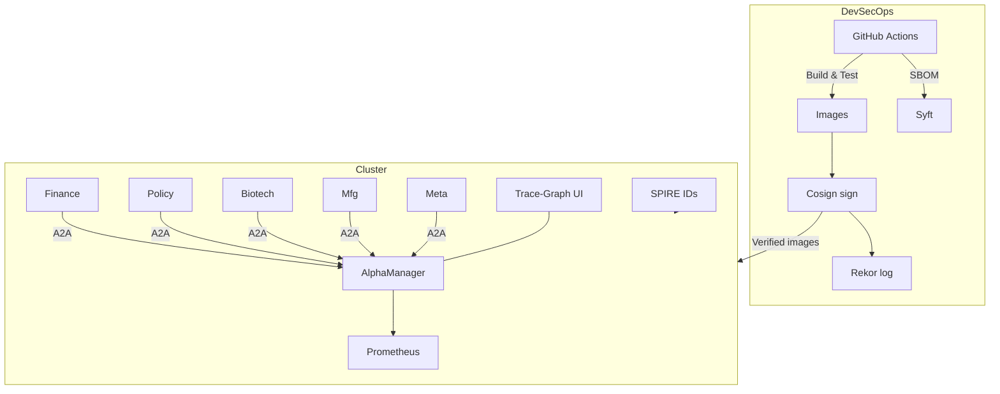

<!-- ========================================================================
  2025‑04‑23 — α‑Factory v1 README
  ======================================================================== -->

<h1 align="center">AGI‑Alpha‑Agent‑v0</h1>
<p align="center"><strong>CA:</strong> <code>tWKHzXd5PRmxTF5cMfJkm2Ua3TcjwNNoSRUqx6Apump</code></p>
<h3 align="center">AGI ALPHA AGENT (<a href="https://app.ens.domains/name/alpha.agent.agi.eth">ALPHA.AGENT.AGI.Eth</a>) ⚡ Powered by <code>$AGIALPHA</code></h3>
<p align="center"><em>Seize the Alpha. Transform the World.</em></p>

> **Vincent Boucher** — President of <a href="https://www.montreal.ai">MONTREAL.AI</a> — conquered the <a href="https://web.archive.org/web/20170929214241/https://gym.openai.com/read-only.html">OpenAI Gym</a> in 2016 and released the pioneering <a href="https://www.quebecartificialintelligence.com/priorart">“Multi‑Agent AI DAO”</a> blueprint (2017). Today that IP culminates in **AGENTIC α‑AGI 👁️✨** — autonomously discovering, governing, and monetising alpha across industries.

<p align="center">
  <a href="https://htmlpreview.github.io/?https://raw.githubusercontent.com/MontrealAI/AGI-Alpha-Agent-v0/main/deploy_sovereign_agentic_agialpha_agent_v0.html">
    
  </a>
</p>

---

## 1. Why α‑Factory?  

```
┌─────────────────────────────────────────────────────────┐
│      RAW DATA   →   VALIDATED α   →   REAL VALUE       │
│─────────────────────────────────────────────────────────│
│ Finance • Policy • Biotech • Manufacturing • 🧬 Meta‑E │
└─────────────────────────────────────────────────────────┘
```

* **Cutting‑Edge Agent Toolchain** — OpenAI Agents SDK, Google ADK, Anthropic MCP, A2A messaging.
* **Plug‑&‑Play Vertical Adapters** — market APIs, genomics datasets, legislative feeds, OPC‑UA.
* **Reg‑Ready by Default** — SPIFFE identities, Cosign + Rekor signatures, SBOM, model‑graded evals.
* **Antifragile Learning Loop** — Every stressor → metrics → continuous fine‑tuning.
* **Offline Friendly** — Automatic Φ‑2 / φ‑3b switch when `OPENAI_API_KEY` not available.

---

## 2. Quick Start 🚀

```bash
# all in one
bash <(curl -fsSL https://raw.githubusercontent.com/MontrealAI/AGI-Alpha-Agent-v0/main/alpha_factory_v1/install_alpha_factory_pro.sh)
```

*Installs prerequisites → verifies signatures → detects live alpha → launches UI on **http://localhost:8080***.

---

## 3. Architecture 🏗️



---

## 4. Demo Gallery (`alpha_factory_v1/demos/`) 🎮

| Demo | ⚙️ Focus | Insight | Command |
|------|---------|---------|---------|
| **AIGA Meta Evolution** 🧬 | Code‑gen | Agents evolve & unit‑test new agents. | `docker compose -f demos/docker-compose.aiga_meta.yml up` |
| **Era of Experience** 🏛️ | Personalised AI | Memory‑graph RAG → tutor agent. | `docker compose -f demos/docker-compose.era.yml up` |
| **Finance Alpha** 💹 | Markets | Live momentum + risk parity. | `docker compose -f demos/docker-compose.finance.yml up` |
| **Macro Sentinel** 🌐 | Macro | GPT‑RAG scanner + CTA hedge test. | `docker compose -f demos/docker-compose.macro.yml up` |
| **MuZero Planning** ♟️ | Reasoning | MuZero vs synthetic markets. | `docker compose -f demos/docker-compose.muzero.yml up` |
| **Self‑Healing Repo** 🩹 | DevOps | Auto‑patch failing tests via Agents SDK. | `docker compose -f demos/docker-compose.selfheal.yml up` |

---

## 5. Vertical Agents Deep Dive

| Agent | Model | Data Feeds | Algo Edge | Guard‑rails |
|-------|-------|-----------|-----------|-------------|
| **FinanceAgent** | GPT‑4o / Φ‑2 | Polygon, Binance, DEX Screener | Factor momentum, risk parity | VaR limit, human‑in‑the‑loop confirm |
| **BiotechAgent** | GPT‑4o | Ensembl, PDB, PubChem | Protein‑target BLAST, CRISPR score | Bio‑safety triage |
| **PolicyAgent** | GPT‑4o | govinfo.gov, RegHub | Bill lineage, lobbying graph | COI log, bias eval |
| **ManufacturingAgent** | GPT‑4o | OPC‑UA, MQTT | OR‑Tools MILP schedule | Safety FMEA |
| **MetaEvolutionAgent** | GPT‑4o | GitHub API | Genetic programming, unit‑test harness | SBOM diff + Cosign gate |

---

## 6. Security & Compliance 🛡️

```text
Dev → GH Actions → Signed Image → Rekor log
             ↘ SBOM          ↗ verify
   SPIRE ID ↔  mTLS mesh  ↔   Agents
```

* **Zero‑Trust Mesh** — SPIFFE IDs, mTLS for every RPC.  
* **Immutable Supply‑Chain** — Cosign signatures stored in Rekor transparency log.  
* **Transparent Software Bill of Materials** — Syft → CycloneDX.  
* **Model‑Graded Evaluations** — OpenAI evals for bias/harm nightly.  
* **Comprehensive Audit Trail** — BLAKE3 hash of every prompt & A2A message.

---

## 7. Developer Workflow 🛠️

```bash
make test        # pytest + red‑team prompts
make eval        # model‑graded evals
make sbom sign   # SBOM + Cosign
docker compose exec orchestrator reflex run --reload
```

### Local Model Mode
```bash
export LLM_ENDPOINT=http://localhost:11434
export LLM_MODEL=phi
```

---

## 8. License 📜  
MIT © 2025 Montreal.AI

<p align="center"><sub>α‑Factory v1 • Out‑learn · Out‑think · Out‑design · Out‑strategise · Out‑execute</sub></p>
