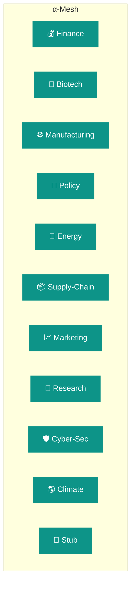

# Alpha-Factory v1 👁️✨ — Multi-Agent **AGENTIC** α-AGI  
*Out-learn | Out-think | Out-design | Out-strategise | Out-execute*

> “[Vincent Boucher](https://www.linkedin.com/in/montrealai/), a pioneer in AI and President of [MONTREAL.AI](https://www.montreal.ai/) since 2003, reshaped the landscape by dominating the [OpenAI Gym] archive with **AI Agents** in 2016 and unveiling the game-changing [**“Multi-Agent AI DAO”**](https://www.quebecartificialintelligence.com/priorart) blueprint in 2017 (“*The Holy Grail of Foundational IP at the Intersection of AI Agents and Blockchain*” — watch the 2018 reveal [🎥](https://youtu.be/Y4_6aZbVlo4), [read the chronicle](https://www.huffpost.com/archive/qc/entry/blockchain-et-lintelligence-artificielle-une-combinaison-puis_qc_5ccc6223e4b03b38d6933d24)).  
> Our **AGI ALPHA AGENT** — fuelled by the strictly-utility **$AGIALPHA** token — now harnesses that visionary foundation — *arguably the world’s most valuable, impactful & important IP* — to unleash the ultimate alpha-signal engine.

Alpha-Factory v1 is a reference-grade, cross-industry **Multi-Agent AGENTIC α-AGI** that **detects live alpha** and **converts it into value** — autonomously, safely and auditable — across any vertical.

Built on the leading agent frameworks:

* **OpenAI Agents SDK** (2024–25)  
* **Google ADK — Agent Development Kit**  
* **Agent-to-Agent (A2A) Protocol**  
* **Model Context Protocol** (MCP)  
* Best-practice guidance from *“A Practical Guide to Building Agents”* (OpenAI, 2025)

…and engineered to operate **with or without** an `OPENAI_API_KEY` (graceful offline fall-back).

---

## 📜 Table of Contents
1. [Design Philosophy](#design-philosophy)  
2. [Capability Graph 🌐](#capability-graph)  
3. [Backend Agents 🖼️](#backend-agents)  
4. [Demo Suite 🎮](#demo-suite)  
5. [5-Minute Quick-Start 🚀](#5-minute-quick-start)  
6. [Deployment Recipes 🍳](#deployment-recipes)  
7. [Runtime Topology 🗺️](#runtime-topology)  
8. [Governance & Compliance ⚖️](#governance--compliance)  
9. [Observability 🔭](#observability)  
10. [Extending the Mesh 🔌](#extending-the-mesh)  
11. [Troubleshooting 🛠️](#troubleshooting)  
12. [Roadmap 🛣️](#roadmap)  
13. [License](#license)  

---

## Design Philosophy

> “We’ve moved from **big-data hoarding** to **big-experience compounding**.” — Sutton & Silver, *Era of Experience* citeturn32file3

Each agent runs a tight **experience loop**:

| Sense 👂 | Imagine 🧠 | Act 🤖 | Adapt 🔄 |
|----------|-----------|--------|---------|
| Stream real-time data / events (Kafka, MQTT, Webhooks) | Plan on a *learned world-model* (MuZero-style where useful) | Execute tool-calls & external actions — every artefact wrapped in MCP | Online learning, antifragile to dependency loss |

Heavy extras (GPU, FAISS, OR-Tools, OpenAI) are **optional**; agents **degrade gracefully** to heuristics while preserving audit artefacts.

---

## Capability Graph 🌐  



Agents self-register; query `GET /capabilities` to discover real-time skills.

---

## Backend Agents 🖼️  

| # | Agent | Core Super-powers | Heavy Deps | Key Env |
|---|-------|------------------|-----------|---------|
| 1 | **Finance** 💰 | Multi-factor α, CVaR 99 %, RL execution, OMS bridge | `pandas`, `lightgbm`, `ccxt` | `ALPHA_UNIVERSE`, `ALPHA_MAX_VAR_USD` |
| 2 | **Biotech** 🧬 | UniProt / PubMed KG-RAG, CRISPR off-target design | `faiss`, `rdflib`, `openai` | `BIOTECH_KG_FILE` |
| 3 | **Manufacturing** ⚙️ | CP-SAT shop-floor optimiser, CO₂ forecaster | `ortools`, `prometheus_client` | `ALPHA_MAX_SCHED_SECONDS` |
| 4 | **Policy** 📜 | Statute QA, red-line diff, ISO-37301 risk tags | `faiss`, `rank_bm25` | `STATUTE_CORPUS_DIR` |
| 5 | **Energy** 🔋 | Demand-response bidding, price elasticity | `numpy` + external APIs | `ENERGY_API_TOKEN` |
| 6 | **Supply-Chain** 📦 | VRP routing, ETA prediction, delay heat-maps | `networkx`, `scikit-learn` | `SC_DB_DSN` |
| 7 | **Marketing** 📈 | Multi-touch attribution, RL campaign tuning | `torch`, `openai` | `MARKETO_KEY` |
| 8 | **Research** 🔬 | Literature RAG, hypothesis ranking | `faiss` | — |
| 9 | **Cyber-Sec** 🛡️ | CVE triage, MITRE ATT&CK reasoning | `faiss`, threat-intel APIs | `VIRUSTOTAL_KEY` |
|10 | **Climate** 🌎 | Emission forecasting, scenario tests | `xarray`, `numpy` | `NOAA_TOKEN` |
|11 | **Stub** 🫥 | Auto-spawns when deps missing | — | — |

**Per-Agent Playbooks** reside in `/alpha_factory_v1/examples/`.

---

## Demo Suite 🎮  

| Demo | Purpose | How it drives Alpha | Launch |
|------|---------|---------------------|--------|
| **1 · AIGA Meta Evolution** 🧬 | Agents evolve *new* agents & test suites | Compound experience → faster discovery of niche alpha | `docker compose -f demos/docker-compose.aiga_meta.yml up` |
| **2 · Era of Experience Tutor** 🏛️ | Memory-graph RAG personal assistant | Converts tacit domain memory into actionable signals | `docker compose -f demos/docker-compose.era.yml up` |
| **3 · Finance Alpha Live** 💹 | Momentum + risk-parity trading bot | Real-time P&L beats equal-weight baseline | `docker compose -f demos/docker-compose.finance.yml up` |
| **4 · Macro Sentinel** 🌐 | GPT news-scanner → CTA hedge | Hedges portfolio draw-downs during macro shocks | `docker compose -f demos/docker-compose.macro.yml up` |
| **5 · MuZero Planning Lab** ♟️ | MuZero vs synthetic markets | Tests planning-under-uncertainty for execution alpha | `docker compose -f demos/docker-compose.muzero.yml up` |
| **6 · Self-Healing Repo** 🩹 | Agents auto-patch failing CI tests | Keeps prod pipeline green → uptime alpha | `docker compose -f demos/docker-compose.selfheal.yml up` |

---

## 5-Minute Quick-Start 🚀  

```bash
git clone https://github.com/MontrealAI/AGI-Alpha-Agent-v0.git
cd AGI-Alpha-Agent-v0/alpha_factory_v1

# Full-fat install
pip install -r requirements.txt

# Minimal env
export ALPHA_KAFKA_BROKER=localhost:9092   # empty → stdout
# (optional) cloud LLM
export OPENAI_API_KEY=sk-...

python -m backend.orchestrator
```

Open:

* **http://localhost:8000** — interactive OpenAPI  
* **http://localhost:3000** — D3 trace-graph UI

---

## Deployment Recipes 🍳  

| Platform | One-liner | Highlights |
|----------|-----------|-----------|
| **Docker Compose** | `docker compose up -d orchestrator` | Kafka, Prometheus, Grafana |
| **Kubernetes** | `helm repo add alpha-factory https://montrealai.github.io/helm-charts && helm install af alpha-factory/stack` | HPA, SPIFFE mTLS, PodMonitor |
| **AWS Fargate** | `infra/deploy_fargate.sh` | Spot-friendly, SQS ↔ Kafka shim |
| **Bare-Metal Edge** | `python edge_runner.py --agents manufacturing,energy` | SQLite persistence, zero external deps |

---

## Runtime Topology 🗺️  

```text
flowchart LR
  subgraph α-Mesh
    ORC([🛠️ Orchestrator])
    FIN(💰) BIO(🧬) MFG(⚙️) POL(📜) ENE(🔋) SUP(📦)
    MKT(📈) RES(🔬) CYB(🛡️) CLI(🌎)
  end
  ORC -- A2A / OpenAI SDK --> FIN & BIO & MFG & POL & ENE & SUP & MKT & RES & CYB & CLI
  ORC -- Kafka bus --> DL[(🗄️ Data Lake)]
  FIN -.->|Prometheus| GRAFANA{{📊}}
```

---

## Governance & Compliance ⚖️  

* **Model Context Protocol** envelopes every artefact (SHA-256, ISO-8601, seeds).  
* Agents declare `COMPLIANCE_TAGS` (`gdpr_minimal`, `sox_traceable`, …).  
* `DISABLED_AGENTS=finance,policy` — boot without restricted domains.  
* Audit chain stored in tamper-evident log (Sigstore + Rekor).

---

## Observability 🔭  

| Signal | Sink | Example Metric |
|--------|------|----------------|
| Health-beats | Kafka `agent.heartbeat` | `latency_ms` |
| Metrics | Prometheus | `af_job_lateness_seconds` |
| Traces | OpenTelemetry → Jaeger | `alpha_factory.trace_id` |

Ready-made Grafana JSON dashboards live in `infra/grafana/`.

---

## Extending the Mesh 🔌  

```bash
pip install my_super_agent
```

```toml
# pyproject.toml
[project.entry-points."alpha_factory.agents"]
super = my_pkg.super_agent:MySuperAgent
```

Restart the orchestrator — your agent self-registers and appears on the graph.

---

## Troubleshooting 🛠️  

| Symptom | Likely Cause | Remedy |
|---------|--------------|--------|
| `ImportError: faiss` | Missing native lib | `pip install faiss-cpu` or rely on **StubAgent** |
| Agent quarantined | Failure streak ≥ 3 | Fix bug → restart (state persisted) |
| Kafka timeout | Broker unreachable | unset `ALPHA_KAFKA_BROKER` → stdout mode |
| 402 (OpenAI) | Quota exhausted | Remove `OPENAI_API_KEY` → offline models |

---

## Roadmap 🛣️  

1. **Execution RL** — live slippage minimiser  
2. **Self-Play Stress-Harness** — antifragile loops  
3. **Reg-Tech Verifiable Credentials** — OpenTelemetry × W3C VC  
4. **Industry Packs** — Energy, Logistics, Health-Care  

---

## License  

**MIT** © 2025 MONTREAL.AI — forging the tools that forge tomorrow.
