[See docs/DISCLAIMER_SNIPPET.md](docs/DISCLAIMER_SNIPPET.md) This repository is a conceptual research prototype.
References to "AGI" and "superintelligence" describe aspirational goals and do not indicate the presence of a real
general intelligence. Use at your own risk. Nothing herein constitutes financial advice. MontrealAI and the maintainers
accept no liability for losses incurred from using this software.

**Ready to explore? [Launch the α‑AGI Insight demo](https://montrealai.github.io/AGI-Alpha-Agent-v0/alpha_agi_insight_v1/) to see it in action.**

### Quick Demo

Non-technical users can try the project with zero setup. Simply visit
<https://montrealai.github.io/AGI-Alpha-Agent-v0/alpha_agi_insight_v1/> in your
browser. The [README](docs/README.md#α‑agi-insight-v1-demo) explains how this
demo is built and deployed.

See [Quick Deployment](docs/HOSTING_INSTRUCTIONS.md#quick-deployment) for build and deployment details. The [📚 Docs workflow](.github/workflows/docs.yml) runs automatically on every push to `main` and publishes the updated site to GitHub Pages.

Full documentation: [https://montrealai.github.io/AGI-Alpha-Agent-v0/](https://montrealai.github.io/AGI-Alpha-Agent-v0/) (use the **Docs** link in the navigation bar)

The GitHub Pages site hosts the interactive demo under the `alpha_agi_insight_v1/` directory. Click **Docs** in the navigation bar for the full manual.

**View the interactive demo here:** <https://montrealai.github.io/AGI-Alpha-Agent-v0/alpha_agi_insight_v1/>

**Browse the visual demo gallery:** <https://montrealai.github.io/AGI-Alpha-Agent-v0/>

**Explore all demos:** <https://montrealai.github.io/AGI-Alpha-Agent-v0/alpha_factory_v1/demos/> – run `./scripts/open_subdir_gallery.py` (or set `AF_GALLERY_URL` to your own mirror) for a local or online launch. Alternatively execute `make subdir-gallery-open` to build the gallery if needed and open it automatically.
All browser demos include a **mode toggle**. Choose **Offline** to run a Pyodide simulation directly in your browser or switch to **OpenAI API** when you provide a key. The key is stored only in memory.

**Important:** Run `npm run fetch-assets` before `npm install` or executing `./setup.sh` to download the browser demo assets. The helper fetches `wasm-gpt2.tar` from the canonical IPFS mirror and uses OpenAI's storage as a mirror when available. Set `WASM_GPT2_URL` to override the list of mirrors, `OPENAI_GPT2_BASE_URL` to change the OpenAI base path, or `OPENAI_GPT2_URL` to specify the full file URL, for example:

```bash
export WASM_GPT2_URL="https://w3s.link/ipfs/bafybeihdwdcefgh4dqkjv67uzcmw7ojee6xedzdetojuzjevtenxquvyku?download=1"
# Official mirror for the small GPT‑2 model (124M parameters)
export OPENAI_GPT2_BASE_URL="https://openaipublic.blob.core.windows.net/gpt-2/models"
export OPENAI_GPT2_URL="https://openaipublic.blob.core.windows.net/gpt-2/models/124M/wasm-gpt2.tar"
```

If `npm run fetch-assets` fails with a 401 or 404 error, download the model
directly using:
```bash
python scripts/download_gpt2_small.py models
# Or download the files individually
curl -O https://openaipublic.blob.core.windows.net/gpt-2/models/124M/encoder.json
curl -O https://openaipublic.blob.core.windows.net/gpt-2/models/124M/hparams.json
curl -O https://openaipublic.blob.core.windows.net/gpt-2/models/124M/vocab.bpe
curl -O https://openaipublic.blob.core.windows.net/gpt-2/models/124M/model.ckpt.index
curl -O https://openaipublic.blob.core.windows.net/gpt-2/models/124M/model.ckpt.data-00000-of-00001
curl -O https://openaipublic.blob.core.windows.net/gpt-2/models/124M/model.ckpt.meta
```
Verify `wasm-gpt2.tar` using checksum `sha384-PLACEHOLDER` before extracting.

See [insight_browser_v1/README.md](alpha_factory_v1/demos/alpha_agi_insight_v1/insight_browser_v1/README.md) for details. You can also retrieve the model directly with `python scripts/download_wasm_gpt2.py`, `python scripts/download_openai_gpt2.py 124M`, or `python scripts/download_gpt2_small.py`.

[](https://montrealai.github.io/AGI-Alpha-Agent-v0/alpha_agi_insight_v1/)

### Automatic Deployment

Pushes to `main` trigger the [Docs workflow](.github/workflows/docs.yml), which
runs [`scripts/edge_human_knowledge_pages_sprint.sh`](scripts/edge_human_knowledge_pages_sprint.sh) to rebuild
the Insight demo and MkDocs site. The workflow publishes the result to GitHub
Pages, so once it completes the live demo is available at
<https://montrealai.github.io/AGI-Alpha-Agent-v0/alpha_agi_insight_v1/> with no
extra setup required.

### Publish Demo Gallery

Ensure **Python 3.11+** and **Node 20+** are installed, then deploy the gallery
and docs with a single command:

```bash
make gallery-deploy
```
`make gallery-deploy` wraps [`scripts/deploy_gallery_pages.sh`](scripts/deploy_gallery_pages.sh),
which calls [`scripts/generate_gallery_html.py`](scripts/generate_gallery_html.py)
to refresh `docs/index.html` and update the `docs/gallery.html` redirect.

See [docs/GITHUB_PAGES_DEMO_TASKS.md](docs/GITHUB_PAGES_DEMO_TASKS.md) for a
detailed walkthrough. Once the build finishes, open the gallery locally with:

```bash
make gallery-open
```

Run `make gallery-build` to regenerate the site without deploying and open it
in one step.

Open an individual demo directly:

```bash
make demo-open DEMO=alpha_agi_business_v1
```

### Edge-of-Human-Knowledge Sprint

Run the wrapper to build and deploy the full GitHub Pages site with environment
checks and offline validation. Use the shell or Python version:

```bash
./scripts/edge_human_knowledge_pages_sprint.sh
python scripts/edge_human_knowledge_pages_sprint.py
```

Ensure **Python 3.11+**, **Node 20+** and `mkdocs` are installed. The
script mirrors the [Docs workflow](.github/workflows/docs.yml) used for automatic
deployment.

## Quickstart

```bash
./quickstart.sh
# or using Docker
docker compose up --build
# or one-click image
./run_quickstart.sh
```

Run `npm run fetch-assets` before `npm install` or executing `./setup.sh` to download the Insight demo assets. The helper retrieves the GPT‑2 model from the official mirror, then tries the OpenAI fallback and finally IPFS. See [insight_browser_v1/README.md](alpha_factory_v1/demos/alpha_agi_insight_v1/insight_browser_v1/README.md) for a detailed guide. You can alternatively run `python scripts/download_wasm_gpt2.py` or `python scripts/download_openai_gpt2.py 124M` to fetch the model directly.

`fetch_assets.py` honors the `IPFS_GATEWAY` environment variable when downloading assets from IPFS. If the default gateway is unreachable, set it before running the helper:

```bash
IPFS_GATEWAY=https://ipfs.io/ipfs npm run fetch-assets
IPFS_GATEWAY=https://cloudflare-ipfs.com/ipfs npm run fetch-assets
```

Requires **Python 3.11 or 3.12** and **Docker Compose ≥2.5**.

Alternatively, run the pre-built image directly:
```bash
docker run --pull=always -p 8000:8000 ghcr.io/montrealai/alpha-factory:latest
```

Set `OPENAI_API_KEY` and other required secrets in your environment or `.env`
before launching the container. The orchestrator prints the
[project disclaimer](docs/DISCLAIMER_SNIPPET.md) when it starts.

**Supported OS:** Ubuntu 22.04+, Debian 12+, macOS 12+ and Windows 11 via
**WSL 2** (recommended for Windows users). Native Windows paths frequently break
volume mounts. Clone this repository inside the WSL file system to avoid these
issues.

```powershell
wsl --install
wsl --set-default-version 2
wsl --update
# enable "Use the WSL 2 based engine" in Docker Desktop
```
Clone the repository inside your WSL home directory to avoid path translation errors.

See [docs/INTRO_BASICS.md](docs/INTRO_BASICS.md) for the bare essentials or
[docs/QUICKSTART_BASICS.md](docs/QUICKSTART_BASICS.md) for a minimal walkthrough.

Watch the run here: [Quickstart video](docs/assets/quickstart_insight.cast) ·
[Asciinema link](https://asciinema.org/a/I0uXbfl9SLa6SjocAb8Ik8Mni)

See the [documentation](https://montrealai.github.io/AGI-Alpha-Agent-v0/) for detailed steps and an overview of the project.
For a concise high-level picture of how the main pieces fit together, see [docs/ARCHITECTURE.md](docs/ARCHITECTURE.md).


# **META-AGENTIC** α‑AGI 👁️✨
## **v0.1.0‑alpha**
**Official and *pioneering* definition – Meta-Agentic (adj.)**: Describes an agent whose **primary role** is to
**create, select, evaluate, or re‑configure other agents** and the rules governing their interactions, thereby
exercising **second‑order agency** over a population of first‑order agents. *The term was **pioneered by
[Vincent Boucher](https://www.linkedin.com/in/montrealai/), President of MONTREAL.AI**.*

```mermaid
flowchart TD
    Insight["🎖️ α‑AGI Insight 👁️✨"]
    Seeds["🌱💫 α-AGI Nova-Seeds 🔐"]
    Mark["α-AGI MARK 🔮🌌✨"]
    Sovereign["🎖️ α‑AGI Sovereign 👑✨"]
    Biz["🌸 α‑AGI Business 👁️✨"]
    Market["🪐 Marketplace 👁️✨"]
    Jobs["📜 α‑AGI Jobs 👁️✨"]
    Agents["👾👾👾🌌👾👾👾 α‑AGI Agents 👁️✨"]
    Reservoir["💎 α‑AGI Value Reservoir"]
    Architect["🎖️ α‑AGI Architect 🔱✨"]
    Council["🔐 α‑AGI Council 👁️✨"]
    Nodes["🖥️ α‑AGI Nodes 👁️✨"]

    Insight --> Seeds --> Mark --> Sovereign
    Sovereign --> Biz --> Market
    Market -->|spawn| Jobs --> Agents
    Agents -- success --> Reservoir
    Jobs -- ΔΣUSD --> Reservoir
    Reservoir -. reinvest .-> Seeds
    Reservoir -. fund .-> Market
    Agents <---> Nodes
    Architect <--> Sovereign
    Architect <--> Insight
    Council --> Sovereign
```



---
## Humanity’s Structured Rise to Economic Supremacy via Strategic AGI Mastery

### 🎖️ α‑AGI Insight 👁️✨ — Beyond Human Foresight
Where human foresight reaches its limits, α‑AGI Insight sees beyond. Humanity stands at the precipice of history’s most
profound economic transformation. α‑AGI Insight identifies with pinpoint accuracy those sectors poised for imminent
disruption by Artificial General Intelligence (AGI). With authoritative and rigorously validated projections estimating
economic opportunities surpassing **$15 Quadrillion (15 000 trillion USD)**, today’s strategic anticipation unlocks
extraordinary economic advantages tomorrow.

* **Precision Forecasting** — Identify and proactively engage critical sectors before AGI disruption.  
* **First‑Mover Advantage** — Maximize returns through strategic foresight and superior positioning.
A static demo is available via [GitHub Pages](https://montrealai.github.io/AGI-Alpha-Agent-v0/alpha_agi_insight_v1/).
See [Quick Deployment](docs/HOSTING_INSTRUCTIONS.md#quick-deployment) for guidance on building the docs and publishing your own copy.

### 🎖️ α‑AGI Sovereign 👁️✨ — Autonomous Economic Transformation
Meta‑Agentic mastery at global scale. α‑AGI Sovereign represents a revolutionary class of autonomous, blockchain‑based
enterprises deploying advanced Meta‑Agentic frameworks. Through dynamically evolving swarms of intelligent agents, these
enterprises systematically identify and transform global inefficiencies into measurable economic value (“$AGIALPHA”),
fundamentally reshaping market dynamics and strategically realigning global economic structures.

* **α‑AGI Marketplace 👁️✨** — Decentralized global platform matching strategic AGI tasks with optimal execution.  
  * **α‑AGI Jobs 👁️✨** — Autonomous missions precisely targeting identified inefficiencies.  
  * **α‑AGI Agents 👁️✨** — Adaptive, self‑optimizing intelligent agents executing α‑Jobs, yielding immediate economic
    returns.

Strategic Edge:

* Decentralized autonomy ensures superior agility and resilience.
* Strategically validated methodologies guarantee consistent economic leadership.

## Quick Start
**Local:** `./quickstart.sh` &nbsp;&nbsp;|&nbsp;&nbsp; **Docker:** `docker compose up --build`

An interactive Colab notebook demonstrates the same zero‑data Insight search loop. Open
[colab_alpha_agi_insight_v1.ipynb](alpha_factory_v1/demos/alpha_agi_insight_v1/colab_alpha_agi_insight_v1.ipynb) in
Google Colab to try it online.

Clone the repository at the `v0.1.0-alpha` tag and run the helper script to start the Insight demo locally:

```bash
git clone --branch v0.1.0-alpha https://github.com/MontrealAI/AGI-Alpha-Agent-v0.git
cd AGI-Alpha-Agent-v0
python -c "import alpha_factory_v1; print(alpha_factory_v1.__version__)"  # prints 0.1.0-alpha
python check_env.py --auto-install  # may run for several minutes
# NumPy and pandas are required for realistic results; omit or add
# `--allow-basic-fallback` to bypass this check.
# Abort with Ctrl+C and rerun with '--timeout 300' to fail fast
./quickstart.sh
Run `pre-commit run --all-files` after the dependencies finish installing.
```

Offline example using a local wheelhouse:

```bash
WHEELHOUSE=$(pwd)/wheels AUTO_INSTALL_MISSING=1 ./quickstart.sh
```

Or launch the full stack with Docker:

```bash
docker compose up --build
```

### Minimal Install

The default `requirements.txt` pulls in a lean set of packages for the
offline demos and tests:

```bash
pip install -r requirements.txt
```

### Full Feature Install

Install the heavier extras for finance, graph back‑ends and large
language models:

```bash
pip install -r alpha_factory_v1/requirements.txt
# or set ALPHA_FACTORY_FULL=1 when running `check_env.py --auto-install`
```

Detailed step‑by‑step instructions, including Colab usage,
are available in the [documentation](https://montrealai.github.io/AGI-Alpha-Agent-v0/).

For advanced options, see the [5‑Minute Quick‑Start](#6-5-minute-quick-start)
and [Docker Quickstart](#docker-quickstart) sections below.

### Running the Insight Demo

For the browser-based version, see
[insight_browser_v1/README.md](alpha_factory_v1/demos/alpha_agi_insight_v1/insight_browser_v1/README.md).
It requires **Node.js ≥20**. Install the dependencies with
`npm ci` and build the static assets with `npm run build` before launching.
The repository includes a `.nvmrc` file so you can simply run `nvm use` to
select the correct Node version.

The α‑AGI Insight demo ships with an offline‑friendly command line interface.
After installation, launch the official demo via:

```bash
alpha-agi-insight-v1 --episodes 5
# Or run directly from the package
python -m alpha_factory_v1.demos.alpha_agi_insight_v1 --episodes 5
```

When API keys are configured the program automatically uses the OpenAI Agents
runtime. Otherwise it falls back to the local Meta‑Agentic Tree Search.
The orchestrator also cleans up the OpenAI runtime on exit to release resources.

For production use, invoke the **official demo** which automatically
checks the environment, selects the best runtime and optionally starts the
Google ADK gateway:

```bash
alpha-agi-insight-v1 --episodes 5
```

This wrapper transparently falls back to the offline Meta‑Agentic Tree
Search when API credentials are absent, ensuring the demo runs anywhere.

For a guaranteed offline run without external dependencies, use:

```bash
AGI_INSIGHT_OFFLINE=1 alpha-agi-insight-v1 --episodes 5
```

Setting ``AGI_INSIGHT_OFFLINE=1`` ensures the search loop never attempts network access.

When the host cannot reach the internet the environment checker prints a warning
and the demos continue in offline mode using any cached data. Optional downloads
are skipped automatically.

Several demos ship with small CSV snapshots for offline mode. These samples
mirror data from the [demo-assets](https://github.com/MontrealAI/demo-assets)
repository and cover roughly March–April 2024.

### Meta-Agentic Tree Search Demo

An offline-friendly reference implementation focused on recursive agent-to-agent rewrites lives in
[meta_agentic_tree_search_v0/README.md](alpha_factory_v1/demos/meta_agentic_tree_search_v0/README.md).
It demonstrates the best‑first search behind the other examples and runs without external APIs.

<a name="63-offline-mode"></a>
### Offline Mode

Follow these steps when working without internet access. See the
[documentation](https://montrealai.github.io/AGI-Alpha-Agent-v0/) for a summary
of required environment variables.

1. **Build a wheelhouse** on a machine with connectivity:
   ```bash
   ./scripts/build_offline_wheels.sh
   ```
   The script collects all required wheels under `wheels/`. Copy this
   directory to the offline host, for example using `scp` or a USB drive:
   ```bash
   scp -r wheels user@offline-host:/path/to/AGI-Alpha-Agent-v0/
   ```
   Then set the environment variable on the target machine:
   ```bash
   export WHEELHOUSE="/path/to/AGI-Alpha-Agent-v0/wheels"
   ```

2. **Install from the wheelhouse** and verify packages. The setup script
   automatically uses a `wheels/` directory in the repository root when
   `WHEELHOUSE` is unset:
   ```bash
   AUTO_INSTALL_MISSING=1 ./codex/setup.sh
   python check_env.py --auto-install --wheelhouse "$WHEELHOUSE"
   pip check
   ```
  When network access is unavailable, install packages directly from the
  wheelhouse:
```bash
pip install --no-index --find-links "$WHEELHOUSE" -r requirements.txt
# Install demo extras offline
pip install --no-index --find-links "$WHEELHOUSE" -r \
  alpha_factory_v1/demos/era_of_experience/requirements.lock
```
 `check_env.py` uses the wheels under `$WHEELHOUSE`. Set
`WHEELHOUSE="$WHEELHOUSE"` when running `pre-commit` or the tests so
dependencies install from the local cache. See
[Offline Setup](alpha_factory_v1/scripts/README.md#offline-setup) for more
details. A short reference lives in the
[documentation](https://montrealai.github.io/AGI-Alpha-Agent-v0/). If package installation hangs
for more than ten minutes,
`check_env.py` will time out and suggest using `--wheelhouse` for
offline installs.

Run the environment check again when the machine is completely
air‑gapped:
```bash
python check_env.py --auto-install --wheelhouse "$WHEELHOUSE"
```
This mirrors the instructions in
[alpha_factory_v1/scripts/README.md](alpha_factory_v1/scripts/README.md#offline-setup).

See the [documentation](https://montrealai.github.io/AGI-Alpha-Agent-v0/)
for a concise summary of the wheelhouse setup.

3. **Download a `.gguf` weight** and set ``LLAMA_MODEL_PATH``:
   ```bash
   mkdir -p ~/.cache/llama
   curl -L -o ~/.cache/llama/TinyLlama-1.1B-Chat-v1.0.Q4_K_M.gguf \
     https://huggingface.co/TheBloke/TinyLlama-1.1B-Chat-GGUF/resolve/main/TinyLlama-1.1B-Chat-v1.0.Q4_K_M.gguf
   export LLAMA_MODEL_PATH=~/.cache/llama/TinyLlama-1.1B-Chat-v1.0.Q4_K_M.gguf
   ```
   Common weights and typical CPU throughput:

   | Model | Size | ~tokens/s |
   |-------|------|-----------|
   | TinyLlama‑1.1B‑Chat Q4_K_M | 380 MB | ~20 |
   | Llama‑3‑8B‑Instruct Q4_K_M | 4 GB | ~5 |
   | Mixtral‑8×7B‑Instruct Q4_0 | 7 GB | ~3 |

   Install `llama-cpp-python` or `ctransformers` to enable offline inference.

4. **Fetch and build the browser assets** (requires **Node.js**) to run the Insight demo fully offline:
   ```bash
   cd alpha_factory_v1/demos/alpha_agi_insight_v1/insight_browser_v1
   npm run fetch-assets
   npm ci
   npm run build
   ```
   Skipping this step or running without Node.js prevents the service worker
   from being generated, so offline functionality is limited.
5. **Bundle Pyodide for offline demos**
   ```bash
   make gallery-build
   ```
   This command generates the `site/` directory with the Pyodide runtime and demo assets so the browser examples work without a network connection. The service worker caches these files. Use a hard refresh (<kbd>Ctrl</kbd>+<kbd>Shift</kbd>+<kbd>R</kbd>) or clear site data to pick up new releases.

6. **Skip browser downloads** when running the web demo tests offline:
   ```bash
   PLAYWRIGHT_SKIP_BROWSER_DOWNLOAD=1 npm test
   ```

7. **Enable offline inference** by setting ``AGI_INSIGHT_OFFLINE=1`` in
   ``.env`` or the environment (ensure `llama-cpp-python` or `ctransformers`
   is installed).

8. **Disable broadcasting** to avoid network calls:
   ```bash
   export AGI_INSIGHT_BROADCAST=0
   ```

9. **Seed the lineage database** from existing DGM logs using ``--import-dgm``.
   ```bash
   python -m alpha_factory_v1.demos.alpha_agi_insight_v1.src.interface.cli \
     simulate --import-dgm path/to/dgm/logs
   ```

   Sample sector definitions live in

   ``alpha_factory_v1/demos/alpha_agi_insight_v1/docs/sectors.sample.json``.
   Pass this file with ``--sectors-file`` to forecast specific industries.

   The built-in **Sector-Shock-10** dataset ships with the package and is
   located using ``importlib.resources`` when running the demo. This allows
   `simulate` to score forecasts even when the repository layout is not
   available.

Example (using ``--sectors-file`` to customise the simulation):

```bash
AGI_INSIGHT_OFFLINE=1 AGI_INSIGHT_BROADCAST=0 \
python -m alpha_factory_v1.demos.alpha_agi_insight_v1.src.interface.cli simulate \
  --curve linear --k 8 --x0 0.0 --llama-model-path "$LLAMA_MODEL_PATH" \
  --offline --energy 2.0 --entropy 0.5 \
  --mut-rate 0.1 --xover-rate 0.5 \
  --sectors-file alpha_factory_v1/demos/alpha_agi_insight_v1/docs/sectors.sample.json
```

Produces output similar to:

```
OPENAI_API_KEY missing – offline mode enabled
year | capability | affected
-----+------------+---------
1    | 0.88       |
2    | 0.98       |
3    | 1.00       |
4    | 1.00       |
5    | 1.00       |
```


### 🎖️ α‑AGI Architect 👁️✨ — Foundational Operational Blueprint
Empowering Meta‑Agentic visionaries with strategic infrastructure. At the core of α‑AGI Ascension is α‑AGI Architect —
the foundational operational framework for scalable global deployment. Rooted in the groundbreaking “Multi‑Agent AI DAO”
model, α‑AGI Architect delivers immediate, scalable, and adaptive infrastructure ensuring continuous strategic
evolution.

* Robust feedback loops driving continuous refinement between Sovereign operations and Architect infrastructure.  
* Engineered for rapid global scalability and strategic responsiveness.

```mermaid
flowchart TD
    %% ───────────────────────────  CORE LAYERS  ───────────────────────────
    A[🚀 🎖️ α-AGI Ascension 🌌]
    B[🎖️ α-AGI Insight 👁️✨]
    C[🎖️ α-AGI Sovereign 👁️✨]
    D[🎖️ α-AGI Marketplace 👁️✨]
    E[🎖️ α-AGI Jobs 👁️✨]
    F[🎖️ α-AGI Agents 👁️✨]
    G[🎖️ α-AGI Architect 👁️✨]
    V[💎 Infinite Value Reservoir]

    %% ───────────────────────────  PRIMARY FLOWS  ─────────────────────────
    A --> B
    B --> C
    C --> D
    D --> E
    D --> F
    C --> G
    G -.↺ Continuous optimisation .-> C

    %% ───────────────────────  WEALTH FEEDBACK LOOPS  ─────────────────────
    E -- Harvest ΔΣUSD --> V
    F -- Compound returns --> V
    V -- Reinvest capital --> D

    %% ──────────────────────────────  STYLE  ──────────────────────────────
    classDef asc     fill:#0f172a,color:#ffffff,font-weight:bold,stroke-width:0px
    classDef insight fill:#1e3a8a,color:#ffffff,stroke-width:0px
    classDef market  fill:#0e7490,color:#ffffff,stroke-width:0px
    classDef value   fill:#fde047,color:#000000,font-weight:bold,stroke-width:0px

    class A asc
    class B insight
    class C,G insight
    class D,E,F market
    class V value

    linkStyle default stroke-width:2px
```



---

---

## Deploy Now
Open‑source framework for immediate strategic action: **[github.com/MontrealAI/AGI-Alpha-
Agent-v0](https://github.com/MontrealAI/AGI-Alpha-Agent-v0)**

---

## 🔱✨ Conclusion
**[ 🎖️ α‑AGI Ascension 🌌 ]** launches humanity into an entirely new economic epoch. By systematically harnessing AGI’s
transformative capabilities, it rewrites global economic structures, implicitly realigning international power dynamics
and propelling humanity toward unprecedented sovereign economic prosperity.

---
---
---

> **Mission 🎯**  Identify 🔍 → Learn 📚 → Think 🧠 → Design 🎨 → Strategise ♟️ → Execute ⚡ —
> compounding real‑world **α** across *all* industries.

Global markets seep *USD ✧ trillions/yr* in latent opportunity — “alpha” in the broadest sense:  
<kbd>pricing dislocations • supply‑chain entropy • novel drug targets • policy loopholes • undiscovered materials</kbd>.

**Alpha‑Factory v1** is an antifragile constellation of self‑improving Agentic α‑AGI Agents 👁️✨ orchestrated to **spot
live alpha across any industry and transmute it into compounding value**.

**Definition**: An **α‑AGI Business** 👁️✨ is an on‑chain autonomous enterprise (<name>.a.agi.eth) that unleashes a swarm
of self‑improving agentic **α‑AGI agents** 👁️✨ (<name>.a.agent.agi.eth) to hunt down inefficiencies across any domain
and transmute them into **$AGIALPHA**.

Built atop **OpenAI Agents SDK**, **Google ADK**, **A2A protocol**, and Anthropic’s **Model Context Protocol**, the
stack runs cloud‑native *or* air‑gapped, hot‑swapping between frontier LLMs and distilled local models.

### TL;DR Quick Start
Check out the `v0.1.0-alpha` tag for a reproducible environment.
```bash
git clone --branch v0.1.0-alpha https://github.com/MontrealAI/AGI-Alpha-Agent-v0.git
cd AGI-Alpha-Agent-v0
python3 -m venv .venv
source .venv/bin/activate
# Install runtime dependencies
# Install runtime dependencies
pip install -r requirements.lock  # pinned versions for deterministic setup
# Optional ADK/MCP integration
pip install google-adk mcp
# Requires Python 3.11–3.12 (<3.13)
./quickstart.sh
Run `pre-commit run --all-files` after the dependencies finish installing.
# Open http://localhost:8000/docs in your browser
```
The adapters initialise automatically when these optional packages are present.

### Optional Packages

Install these extras to unlock additional features:

- `pip install gradio` – enables the MuZero planning dashboard.
- `pip install openai-agents==0.0.17` – activates the official Agents runtime used for commentary.
- `pip install google-adk` and set `ALPHA_FACTORY_ENABLE_ADK=true` – starts the Google ADK gateway for
  cross‑organisation agent exchange.
- Install domain‑specific extras as needed (e.g. `httpx`, `feedparser`, `networkx`, `lightgbm`,
  `kafka-python`, `tldextract`). Each agent logs a warning when a library is missing and continues in
  degraded mode.

Offline installations can omit these lines from the relevant `requirements.txt`
files if the Agents SDK or ADK gateway are not needed.

To regenerate `requirements.lock` from `requirements.txt` with hashes, run:

```bash
pip-compile --generate-hashes --output-file requirements.lock requirements.txt
```

Once the API server is running you can launch a simulation:

```bash
curl -X POST http://localhost:8000/simulate \
  -H "Authorization: Bearer $API_TOKEN" \
  -H "Content-Type: application/json" \
  -d '{"horizon": 5, "pop_size": 6, "generations": 3, "mut_rate": 0.1, "xover_rate": 0.5, "curve": "linear", "energy": 1.0, "entropy": 1.0}'
```

## Further Reading
- Full documentation is available at [https://montrealai.github.io/AGI-Alpha-Agent-v0/](https://montrealai.github.io/AGI-Alpha-Agent-v0/) — click **Docs** in the navigation bar.

---
## Contributing
See [AGENTS.md](AGENTS.md) for the full contributor guide.

### Pre‑commit Hooks
After running `./codex/setup.sh`, install the hooks and run a full check:

```bash
pip install pre-commit
pre-commit install
pre-commit run --all-files   # verify hooks after setup
pre-commit run --files <paths>   # before each commit
```
Run `pre-commit run --all-files` once after the setup script to confirm
everything is formatted correctly. These commands mirror the steps in
[AGENTS.md](AGENTS.md) and keep commits consistent.
Before opening a pull request, run `pre-commit run --all-files` to ensure
all hooks succeed.
Run `python check_env.py --auto-install` before invoking these commands so
optional hook dependencies are installed. When working offline, pass
`--wheelhouse <dir>` or set `WHEELHOUSE` to install from a local cache. If
`pre-commit` isn't found, install it with `pip install pre-commit`.

When editing the web UI, preserve existing ARIA labels so the interface
remains accessible.

### Development Setup
Install the Python dependencies with the helper script:

```bash
scripts/setup_env.sh
```
The script checks for Python 3.11–3.12 and installs `requirements.txt` and
`requirements-dev.txt`.

When preparing an offline environment, build a wheelhouse on a machine with
internet access:

```bash
./scripts/build_offline_wheels.sh
```

Copy the resulting `wheels/` directory to the target host and set
`WHEELHOUSE=$(pwd)/wheels` before running `check_env.py` or the tests so
packages install from the local cache. The repository does not ship these
prebuilt wheels.

## 📜 Table of Contents
0. [Design Philosophy](#0-design-philosophy)  
1. [System Topology 🗺️](#1-system-topology)  
2. [World‑Model & Planner 🌌](#2-world-model--planner)  
3. [Agent Gallery 🖼️ (12 agents)](#3-agent-gallery)  
4. [Demo Showcase 🎬 (14 demos)](#4-demo-showcase)
5. [Memory & Knowledge Fabric 🧠](#5-memory--knowledge-fabric)
6. [5‑Minute Quick‑Start 🚀](#6-5-minute-quick-start)
6.1. [Running Tests 🧪](#61-running-tests)
6.2. [Marketplace Demo Example 🛒](#62-marketplace-demo-example)
6.3. [Offline Mode](#63-offline-mode)
    - Set `LLAMA_MODEL_PATH` to the downloaded `.gguf` weight
    - `AGI_INSIGHT_BROADCAST=0` disables blockchain broadcasting
    - Example:
      ```bash
      AGI_INSIGHT_OFFLINE=1 AGI_INSIGHT_BROADCAST=0
        python -m alpha_factory_v1.demos.alpha_agi_insight_v1.src.interface.cli
        simulate --offline --energy 2.0 --entropy 0.5 \
        --mut-rate 0.1 --xover-rate 0.5 \
        --llama-model-path "$LLAMA_MODEL_PATH"
      ```
7. [Deployment Recipes 🍳](#7-deployment-recipes)
7.1. [Deploying securely 🚀](#71-deploying-securely)
8. [Governance & Compliance ⚖️](#8-governance--compliance)  
9. [Observability 🔭](#9-observability)
10. [Safety & Security 🛡️](#10-safety--security)
11. [Extending the Mesh 🔌](#11-extending-the-mesh)
12. [Troubleshooting 🛠️](#12-troubleshooting)
13. [Roadmap 🛣️](#13-roadmap)
14. [Credits 🌟](#14-credits)
15. [License 📝](#15-license)

---

<a name="0-design-philosophy"></a>
## 0 · Design Philosophy

> “We have shifted from *big‑data hoarding* to **big‑experience compounding**.” — *Era of Experience*.

* **Experience‑First Loop** — Sense → *Imagine* (MuZero‑style latent planning) → Act → Adapt.  
* **AI‑GA Autogenesis** — The factory meta‑evolves new agents and curricula inspired by Clune’s *AI‑Generating
  Algorithms*.
* **Graceful Degradation** — GPU‑less? No cloud key? Agents fall back to distilled local models & heuristics.  
* **Zero‑Trust Core** — SPIFFE identities, signed artefacts, guard‑rails, exhaustive audit logs.  
* **Polyglot Value** — Everything is normalised to a common *alpha Δ∑USD* lens.

---

<a name="1-system-topology"></a>
## 1 · System Topology 🗺️

```mermaid
flowchart LR
  ORC([🛠️ Orchestrator])
  WM[(🌌 World‑Model)]
  MEM[(🔗 Vector‑Graph Memory)]
  subgraph Agents
    FIN(💰)
    BIO(🧬)
    MFG(⚙️)
    POL(📜)
    ENE(🔋)
    SUP(📦)
    RET(🛍️)
    CYB(🛡️)
    CLM(🌎)
    DRG(💊)
    SCT(⛓️)
    TAL(🧑‍💻)
  end
  ORC -- A2A --> Agents
  Agents -- experience --> WM
  WM -- embeddings --> MEM
  ORC -- Kafka --> DL[(🗄️ Data Lake)]
```


* **Orchestrator** auto‑discovers agents (see `backend/agents/__init__.py`) and exposes a unified REST + gRPC facade.  
* **World‑Model** uses MuZero‑style latent dynamics for counterfactual planning.  
* **Memory Fabric** = pgvector + Neo4j for dense & causal recall.

---

<a name="2-world-model--planner"></a>
## 2 · World‑Model & Planner 🌌

| Component | Source Tech | Role |
|-----------|-------------|------|
| **Latent Dynamics** | MuZero++ | Predict env transitions & value |
| **Self‑Play Curriculum** | POET‑XL | Generates alpha‑labyrinth tasks |
| **Meta‑Gradient** | AI‑GA | Evolves optimiser hyper‑nets |
| **Task Selector** | Multi‑Armed Bandit | Schedules agent ↔ world‑model interactions |

---

<a name="3-agent-gallery"></a>
## 3 · Agent Gallery 🖼️

```mermaid
flowchart TD
    ORC["🛠️ Orchestrator"]
    GEN{{"🧪 Env‑Generator"}}
    LRN["🧠 MuZero++"]

    subgraph Agents
        FIN["💰"]
        BIO["🧬"]
        MFG["⚙️"]
        POL["📜"]
        ENE["🔋"]
        SUP["📦"]
        RET["🛍️"]
        MKT["📈"]
        CYB["🛡️"]
        CLM["🌎"]
        DRG["💊"]
        SMT["⛓️"]
    end

    %% message flows
    GEN -- tasks --> LRN
    LRN -- policies --> Agents
    Agents -- skills --> LRN

    ORC -- A2A --> FIN
    ORC -- A2A --> BIO
    ORC -- A2A --> MFG
    ORC -- A2A --> POL
    ORC -- A2A --> ENE
    ORC -- A2A --> SUP
    ORC -- A2A --> RET
    ORC -- A2A --> MKT
    ORC -- A2A --> CYB
    ORC -- A2A --> CLM
    ORC -- A2A --> DRG
    ORC -- A2A --> SMT
    ORC -- A2A --> GEN
    ORC -- A2A --> LRN

    ORC -- Kafka --> DATALAKE["🗄️ Data Lake"]
    FIN -.->|Prometheus| GRAFANA{{"📊"}}
```



| # | Agent | Path | Prime Directive | Status | Key Env Vars |
|---|-------|------|-----------------|--------|--------------|
| 1 | **Finance** 💰 | `finance_agent.py` | Multi‑factor alpha & RL execution | **Prod** | `BROKER_DSN` |
| 2 | **Biotech** 🧬 | `biotech_agent.py` | CRISPR & assay proposals | **Prod** | `OPENAI_API_KEY` |
| 3 | **Manufacturing** ⚙️ | `manufacturing_agent.py` | CP‑SAT optimiser | **Prod** | `SCHED_HORIZON` |
| 4 | **Policy** 📜 | `policy_agent.py` | Statute QA & diffs | **Prod** | `STATUTE_CORPUS_DIR` |
| 5 | **Energy** 🔋 | `energy_agent.py` | Spot‑vs‑forward arbitrage | **Beta** | `ISO_TOKEN` |
| 6 | **Supply‑Chain** 📦 | `supply_chain_agent.py` | Stochastic MILP routing | **Beta** | `SC_DB_DSN` |
| 7 | **Retail Demand** 🛍️ | `retail_demand_agent.py` | SKU forecast & pricing | **Beta** | `POS_DB_DSN` |
| 8 | **Cyber‑Sec** 🛡️ | `cyber_threat_agent.py` | Predict & patch CVEs | **Beta** | `VT_API_KEY` |
| 9 | **Climate Risk** 🌎 | `climate_risk_agent.py` | ESG stress tests | **Beta** | `NOAA_TOKEN` |
|10 | **Drug‑Design** 💊 | `drug_design_agent.py` | Diffusion + docking | **Incub** | `CHEMBL_KEY` |
|11 | **Smart‑Contract** ⛓️ | `smart_contract_agent.py` | Formal verification | **Incub** | `ETH_RPC_URL` |
|12 | **Talent‑Match** 🧑‍💻 | `talent_match_agent.py` | Auto‑bounty hiring | **Incub** | — |

```mermaid
%% Legend
%%  solid arrows  = primary value‑flow
%%  dashed arrows = secondary / supporting influence
%%  node emojis   = domain archetypes

graph TD
    %% Core pillars
    FIN["💰 Finance"]
    BIO["🧬 Biotech"]
    MFG["⚙️ Manufacturing"]
    POL["📜 Policy / Reg‑Tech"]
    ENE["🔋 Energy"]
    SUP["📦 Supply‑Chain"]
    RET["🛍️ Retail / Demand"]
    CYB["🛡️ Cyber‑Security"]
    CLM["🌎 Climate"]
    DRG["💊 Drug Design"]
    SMT["⛓️ Smart Contracts"]
    TLT["🧑‍💼 Talent"]

    %% Derived transversal competences
    QNT["📊 Quant R&D"]
    RES["🔬 Research Ops"]
    DSG["🎨 Design"]
    OPS["🔧 DevOps"]

    %% Primary value‑creation arcs
    FIN -->|Price discovery| QNT
    FIN -->|Risk stress‑test| CLM
    BIO --> DRG
    BIO --> RES
    MFG --> SUP
    ENE --> CLM
    RET --> FIN
    POL --> CYB
    SMT --> FIN

    %% Cross‑pollination (secondary, dashed)
    FIN -.-> POL
    SUP -.-> CLM
    CYB -.-> OPS
    DRG -.-> POL
    QNT -.-> RES
    RET -.-> DSG

    %% Visual grouping
    subgraph Core
        FIN
        BIO
        MFG
        POL
        ENE
        SUP
        RET
        CYB
        CLM
        DRG
        SMT
        TLT
    end
    classDef core fill:#0d9488,color:#ffffff,stroke-width:0px;
```



Each agent exports a signed *proof‑of‑alpha* message to the Kafka bus, enabling cross‑breeding of opportunities.

```mermaid
sequenceDiagram
    participant User
    participant ORC as Orchestrator
    participant FIN as 💰
    participant GEN as 🧪
    User->>ORC: /alpha/run
    ORC->>GEN: new_world()
    GEN-->>ORC: env_json
    ORC->>FIN: act(env)
    FIN-->>ORC: proof(ΔG)
    ORC-->>User: artefact + KPI
```



---

<a name="4-demo-showcase"></a>
## 4 · Demo Showcase 🎬

| # | Folder | Emoji | Lightning Pitch | Alpha Contribution | Start Locally |
|---|--------|-------|-----------------|--------------------|---------------|
|1|`aiga_meta_evolution`|🧬|Agents *evolve* new agents; genetic tests auto‑score fitness.|Expands strategy space, surfacing fringe alpha.|`cd alpha_factory_v1/demos/aiga_meta_evolution && ./run_aiga_demo.sh`|
|2|`alpha_agi_business_v1`|🏦|Auto‑incorporates a digital‑first company end‑to‑end.|Shows AGI turning ideas → registered business.|`./alpha_factory_v1/demos/alpha_agi_business_v1/run_business_v1_demo.sh [--pull] [--gpu]` (docs: `http://localhost:8000/docs`)|
|3|`alpha_agi_business_2_v1`|🏗|Iterates business model with live market data RAG.|Continuous adaptation → durable competitive alpha.|`./alpha_factory_v1/demos/alpha_agi_business_2_v1/run_business_2_demo.sh`|
|4|`alpha_agi_business_3_v1`|📊|Financial forecasting & fundraising agent swarm.|Optimises capital stack for ROI alpha.|`./alpha_factory_v1/demos/alpha_agi_business_3_v1/run_business_3_demo.sh`|
|5|`alpha_agi_marketplace_v1`|🛒|Peer‑to‑peer agent marketplace simulating price discovery.|Validates micro‑alpha extraction via agent barter.|`docker compose -f demos/docker-compose.marketplace.yml up`|
|6|`alpha_asi_world_model`|🌌|Scales MuZero‑style world‑model to an open‑ended grid‑world.|Stress‑tests anticipatory planning for ASI scenarios.|`docker compose -f demos/docker-compose.asi_world.yml up`|
|7|`cross_industry_alpha_factory`|🌐|Full pipeline: ingest → plan → act across 4 verticals.|Proof that one orchestrator handles multi‑domain alpha.|`./alpha_factory_v1/demos/cross_industry_alpha_factory/deploy_alpha_factory_cross_industry_demo.sh`|
|8|`era_of_experience`|🏛|Lifelong RL stack blending real & synthetic experience streams.|Showcases sensor-motor tools, grounded rewards & non-human reasoning.|`cd alpha_factory_v1/demos/era_of_experience && ./run_experience_demo.sh`|
|9|`finance_alpha`|💹|Live momentum + risk‑parity bot on Binance test‑net.|Generates real P&L; stress‑tested against CVaR.|`./alpha_factory_v1/demos/finance_alpha/deploy_alpha_factory_demo.sh`|
|10|`macro_sentinel`|🌐|GPT‑RAG news scanner auto‑hedges with CTA futures.|Shields portfolios from macro shocks.|`docker compose -f demos/docker-compose.macro.yml up`|
|11|`muzero_planning`|♟|MuZero in 60 s; online world‑model with MCTS.|Distills planning research into a one‑command demo.|`./alpha_factory_v1/demos/muzero_planning/run_muzero_demo.sh`|
|12|`self_healing_repo`|🩹|CI fails → agent crafts patch ⇒ PR green again.|Maintains pipeline uptime alpha.|`docker compose -f demos/docker-compose.selfheal.yml up`|
|13|`meta_agentic_tree_search_v0`|🌳|Recursive agent rewrites via best‑first search.|Rapidly surfaces AGI-driven trading alpha.|`mats-bridge --episodes 3`|
|14|`alpha_agi_insight_v1`|👁️|Zero‑data search ranking AGI‑disrupted sectors.|Forecasts sectors primed for AGI transformation.|`alpha-agi-insight-v1 --episodes 5`|

> **Colab?** Each folder ships an `*.ipynb` that mirrors the Docker flow with free GPUs.

The official Docker image bundles **PyTorch&nbsp;2.2.x** and **Ray&nbsp;2.10.0**. The
notebooks install PyTorch from the [PyTorch wheel index](https://download.pytorch.org/whl)
and pin Ray to the same version for compatibility.

* [Solving AGI Governance](alpha_factory_v1/demos/solving_agi_governance/README.md) — Monte‑Carlo governance simulation
  with optional OpenAI‑Agents/ADK integration.
  [Colab](alpha_factory_v1/demos/solving_agi_governance/colab_solving_agi_governance.ipynb)
* [Self‑Healing Repo](alpha_factory_v1/demos/self_healing_repo/README.md) — agents automatically craft patches when CI
  fails.
  The underlying `MetaRefinementAgent` **only simulates** improvement by
  generating placeholder diffs. We hope to replace this with genuine
  optimisation based on real performance metrics—contributions are
  warmly welcomed.
* **Note:** The `alpha_agi_business_3_v1` demo is intentionally left out of the published package. Clone this repository
  to run it from source.

| `USE_GPU` | PyTorch wheel URL |
|:--------:|-------------------------------------------------|
| `True`   | <https://download.pytorch.org/whl/cu118> |
| `False`  | <https://download.pytorch.org/whl/cpu> |

### 4.1 · [α-ASI World-Model Demo 👁️✨](
https://github.com/MontrealAI/AGI-Alpha-Agent-v0/tree/main/alpha_factory_v1/demos/alpha_asi_world_model)

Paper: [Multi-Agent AGENTIC α-AGI World-Model Demo 🥑](https://github.com/MontrealAI/AGI-Alpha-
Agent-v0/blob/main/alpha_factory_v1/demos/alpha_asi_world_model/Alpha_ASI_World_Model.pdf)

```
┌──────────────────────────────── Alpha-Factory Bus (A2A) ───────────────────────────────┐
│                                                                                        │
│   ┌──────────────┐   curriculum   ┌───────────┐   telemetry   ┌────────────┐          │
│   │ StrategyAgent│───────────────►│ Orchestr. │──────────────►│   UI / WS  │          │
│   └──────────────┘                │  (loop)   │◄──────────────│  Interface │          │
│          ▲  ▲                     └───────────┘    commands   └────────────┘          │
│          │  │ new_env/reward                     ▲                                   │
│   plans  │  │ loss stats                        │ halt                              │
│          │  └──────────────────────┐            │                                   │
│   ┌──────┴───────┐   context       │            │                                   │
│   │ ResearchAgent│───────────────► Learner (MuZero) ◄─ SafetyAgent (loss guard)      │
│   └──────────────┘                │   ▲                                             │
│              code patches         │   │                                             │
│   ┌──────────────┐                │   │ gradients                                   │
│   │ CodeGenAgent │────────────────┘   │                                             │
│   └──────────────┘                    │                                             │
│                                       ▼                                             │
│                            POET Generator → MiniWorlds (env pool)                    │
└────────────────────────────────────────────────────────────────────────────────────────┘
```

### 4.2 · [🏛️ Large‑Scale α‑AGI Business 3 Demo 👁️✨ — **Omega‑Grade Edition**](
https://github.com/MontrealAI/AGI-Alpha-Agent-v0/tree/main/alpha_factory_v1/demos/alpha_agi_business_3_v1)

> **Alpha‑Factory v1 → Ω‑Lattice v0**  
> _Transmuting cosmological free‑energy gradients into compounding cash‑flows._

Multi‑Scale Energy‑Landscape Diagram:

```mermaid
flowchart TB
  subgraph Macro["Macro‑Finance Δβ"]
    FIN[FinanceAgent]:::agent
    ENE[EnergyAgent]:::agent
  end
  subgraph Meso["Supply‑Chain ΔS"]
    MFG[ManufacturingAgent]:::agent
    LOG[LogisticsAgent]:::agent
  end
  subgraph Micro["Bio/Chem ΔH"]
    BIO[BiotechAgent]:::agent
    MAT[MaterialsAgent]:::agent
  end
  FIN & ENE -->|β feed| ORC
  MFG & LOG -->|entropy ΔS| ORC
  BIO & MAT -->|latent ΔH| ORC
  classDef agent fill:#cffafe,stroke:#0369a1;
```



Cells with \(Δ\mathcal F < 0\) glow 🔵 on Grafana; Ω‑Agents race to harvest.

---

<a name="5-memory--knowledge-fabric"></a>
## 5 · Memory & Knowledge Fabric 🧠

```
[Event] --embedding--> PGVector DB
                   \--edge--> Neo4j (CAUSES, SUPPORTS, RISK_OF)
```

* Agents query `mem.search("supply shock beta>0.2")`  
* Planner asks Neo4j: `MATCH (a)-[:CAUSES]->(b) WHERE b.delta_alpha > 5e6 RETURN path`
* SQLite vector store fallback requires `numpy`
* Realistic operation also relies on `pandas`

---

<a name="6-5-minute-quick-start"></a>
## 6 · 5‑Minute Quick‑Start 🚀
This guide assumes the repository is cloned at `v0.1.0-alpha`. The walkthrough
requires the `numpy`, `yaml` and `pandas` packages which `check_env.py` installs
automatically when run with `--auto-install`.
```bash
git clone --branch v0.1.0-alpha https://github.com/MontrealAI/AGI-Alpha-Agent-v0.git
cd AGI-Alpha-Agent-v0
./quickstart.sh --preflight   # optional environment check
python check_env.py --auto-install  # verify & auto-install deps (10 min timeout)
# Install runtime dependencies
pip install -r requirements.lock
# (If this fails with a network error, create a wheelhouse and rerun
#  with --wheelhouse <path> or place the wheels under ./wheels)
# Build a wheelhouse if the machine has no internet access:
#   ./scripts/build_offline_wheels.sh
./quickstart.sh               # creates venv, installs deps, launches
# Use `--wheelhouse /path/to/wheels` to install offline packages when
# the host has no internet access. The setup script automatically
# sets `WHEELHOUSE` to `./wheels` when that directory exists. When
# working offline, run `python check_env.py --auto-install --wheelhouse
# /path/to/wheels` to verify and install packages. The setup script
# exits with a message if neither network nor a wheelhouse are available.
# Example offline workflow:
#   export WHEELHOUSE=$(pwd)/wheels
#   python check_env.py --auto-install --wheelhouse "$WHEELHOUSE"
#   WHEELHOUSE=$WHEELHOUSE ./quickstart.sh
#   WHEELHOUSE=$WHEELHOUSE pytest -q
# Open http://localhost:8000/docs in your browser
# Alternatively, ``python alpha_factory_v1/quickstart.py`` provides the same
# workflow on Windows and other systems without Bash.

# Deploy instantly with Docker (prebuilt image)
docker run --pull=always -p 8000:8000 ghcr.io/montrealai/alpha-factory:latest

# The `alpha-factory` CLI also works when the package is installed:
# A short warning is printed before startup.
#   pip install -e .
#   alpha-factory --list-agents
#   alpha-asi-demo --demo   # launch the α‑ASI world‑model UI
#   alpha-agi-insight-v1 orchestrator   # run the Insight orchestrator
#
# Or install directly from GitHub for a quick test:
#   pip install git+https://github.com/MontrealAI/AGI-Alpha-Agent-v0.git@v0.1.0-alpha
#   alpha-factory --list-agents

# Automated one-click setup (builds & starts Docker stack)
./alpha_factory_v1/scripts/one_click_install.sh --deploy

# Verify the Ω‑Lattice demo locally
python alpha_factory_v1/demos/alpha_agi_business_3_v1/alpha_agi_business_3_v1.py --loglevel info
# The entrypoint automatically verifies dependencies via `check_env.py`.
```

Adjust `alpha_factory_v1/demos/alpha_asi_world_model/config.yaml` to tune the world-model loop. Key options include
`env_batch` (parallel environments), `hidden` (latent state size) and `mcts_simulations` (MCTS rollouts per action).


### Insight Browser Demo

A browser-only Pareto explorer lives under
`alpha_factory_v1/demos/alpha_agi_insight_v1/insight_browser_v1`.
Run `npm run build` in that directory to generate the `dist/` assets
(they are not stored in Git) then open `dist/index.html` to run the demo locally.
The quick-start guide is available from the
[documentation](https://montrealai.github.io/AGI-Alpha-Agent-v0/) and is copied
to `dist/insight_browser_quickstart.pdf` during the build so it is available
alongside the compiled assets.
Set `window.DEBUG = true` before loading the page to expose debugging helpers
such as `window.pop`.

For evolutionary experiments you can run the optional
[evolution worker](https://montrealai.github.io/AGI-Alpha-Agent-v0/) container
and POST a tarball of agent code to `/mutate`.

## Docker Quickstart
Start the full stack using Docker Compose:
```bash
docker compose up --build
```
Browse the dashboard at <http://localhost:8080>.

## One-Click Docker Quickstart
Run the minimal image directly:
```bash
./run_quickstart.sh
```
The script prints the project disclaimer, builds `docker/quickstart/Dockerfile`
and launches the container with your `.env` file mounted.

The same configuration can be installed via Helm:
```bash
helm upgrade --install alpha-demo ./infrastructure/helm-chart \
  --values ./infrastructure/helm-chart/values.yaml \
  --set env.RUN_MODE=web
```
This deploys the services to your local Kubernetes cluster.

Generate TLS certificates for the gRPC bus using the bundled helper:
```bash
./infrastructure/gen_bus_certs.sh > .env.bus
source .env.bus
```
The script prints `AGI_INSIGHT_BUS_CERT`, `AGI_INSIGHT_BUS_KEY` and
`AGI_INSIGHT_BUS_TOKEN` which you can append to your `.env` file.

### .env Setup & Security
Before running the orchestrator, copy `alpha_factory_v1/.env.sample` to `.env` and
replace all placeholder values with strong secrets. The sample sets
`NEO4J_PASSWORD=REPLACE_ME` as a placeholder—generate a random password for
services like Neo4j and Postgres using `openssl rand -base64 18` or a similar
tool and **never deploy with the defaults**. The orchestrator will refuse to
start if `NEO4J_PASSWORD` remains `REPLACE_ME` or is missing.
Set `API_TOKEN` to a strong secret so that the REST API can authenticate
incoming requests. Clients must send `Authorization: Bearer <token>`.
The server aborts if `API_TOKEN` equals `REPLACE_ME_TOKEN`.
Use `API_RATE_LIMIT` to limit requests per minute per IP (default `60`).
If more than 5% of requests return HTTP `429` within a minute, the server calls
`utils.alerts.send_alert` to report excessive throttling.
Avoid storing private keys directly in `.env`. Instead set
`AGI_INSIGHT_SOLANA_WALLET_FILE` to a file containing your hex-encoded wallet
key and keep that file readable only by the orchestrator.
To enable secure gRPC transport set `AGI_INSIGHT_BUS_CERT`,
`AGI_INSIGHT_BUS_KEY` and `AGI_INSIGHT_BUS_TOKEN`. If these values are
omitted and `AGI_INSIGHT_ALLOW_INSECURE=1`, the bus starts without TLS.
See the [documentation](https://montrealai.github.io/AGI-Alpha-Agent-v0/)
for instructions and example volume mounts.

`.env.sample` notes that paths on Windows may require quotes (e.g., `C:\\path\\to\\file`).

#### Supported Environment Variables

| Variable | Default | Purpose |
|----------|---------|---------|
| `OPENAI_API_KEY` | _(empty)_ | API key for hosted models. Offline mode is used when empty. |
| `OPENAI_TIMEOUT_SEC` | `30` | Timeout for OpenAI API requests in seconds. |
| `NO_LLM` | `0` | Set to `1` to skip the LLM planner even when `OPENAI_API_KEY` is provided. |
| `ALPHA_ASI_LLM_MODEL` | `gpt-4o-mini` | Planner model name used by the world model demo. |
| `ALPHA_ASI_SEED` | `42` | Deterministic RNG seed for the demo (can also be set via `general.seed` in `config.yaml`). |
| `ALPHA_ASI_MAX_STEPS` | `100000` | Learner steps before auto-stop. |
| `ALPHA_ASI_BUFFER_LIMIT` | `50000` | Replay-buffer length. |
| `ALPHA_ASI_TRAIN_BATCH` | `128` | SGD mini-batch size. |
| `ALPHA_ASI_MAX_GRID` | `64` | Safety clamp on generated mazes. |
| `ALPHA_ASI_HOST` | `0.0.0.0` | FastAPI bind address for the demo. |
| `ALPHA_ASI_PORT` | `7860` | FastAPI port for the demo. |
| `NEO4J_PASSWORD` | `REPLACE_ME` | Database password required by the orchestrator. |
| `RUN_MODE` | `api` | Launch mode for Compose or Helm (`api`, `cli`, `web`). |
| `PORT` | `8000` | REST API port. |
| `AGI_INSIGHT_OFFLINE` | `0` | Set to `1` to force local inference models. |
| `AGI_INSIGHT_BUS_PORT` | `6006` | gRPC bus port used by the demo. |
| `AGI_INSIGHT_LEDGER_PATH` | `./ledger/audit.db` | Path to the local audit ledger. |
| `AGI_INSIGHT_SECRET_BACKEND` | _(empty)_ | Set to `vault`, `aws` or `gcp` to load secrets from an external manager. |
| `VAULT_ADDR`/`VAULT_TOKEN` | _(empty)_ | Connection details for HashiCorp Vault when using the `vault` backend. |
| `AWS_REGION`/`OPENAI_API_KEY_SECRET_ID` | _(empty)_ | AWS Secrets Manager region and secret ID when using the `aws` backend. |
| `GCP_PROJECT_ID`/`OPENAI_API_KEY_SECRET_ID` | _(empty)_ | GCP project and secret name when using the `gcp` backend. |
| `AGI_INSIGHT_BUS_CERT` | _(empty)_ | Path to the gRPC bus certificate. |
| `AGI_INSIGHT_BUS_KEY` | _(empty)_ | Private key matching `AGI_INSIGHT_BUS_CERT`. |
| `AGI_INSIGHT_BUS_TOKEN` | _(empty)_ | Shared secret for bus authentication. |
| `AGI_INSIGHT_ALLOW_INSECURE` | `0` | Set to `1` to run the bus without TLS when no certificate is provided. |
| `API_TOKEN` | `REPLACE_ME_TOKEN` | Bearer token required by the REST API. Startup fails if unchanged. |
| `API_CORS_ORIGINS` | `*` | Comma-separated list of allowed CORS origins. |
| `SANDBOX_CPU_SEC` | `2` | CPU time limit for sandboxed code. |
| `SANDBOX_MEM_MB` | `256` | Memory cap for sandboxed code in MB. |
| `MAX_RESULTS` | `100` | Maximum stored simulation results. |
| `MAX_SIM_TASKS` | `4` | Maximum concurrent simulation tasks. |
| `IPFS_GATEWAY` | `https://ipfs.io/ipfs` | Base URL for IPFS downloads used by `npm run fetch-assets`. Override with `IPFS_GATEWAY=<url> npm run fetch-assets`. |
| `OPENAI_GPT2_BASE_URL` | `https://openaipublic.blob.core.windows.net/gpt-2/models` | Base URL for the GPT‑2 checkpoints. |
| `OPENAI_GPT2_URL` | `https://openaipublic.blob.core.windows.net/gpt-2/models/124M/wasm-gpt2.tar` | Full URL for the wasm‑gpt2 archive. |
| `OTEL_ENDPOINT` | _(empty)_ | OTLP endpoint for anonymous telemetry. |
| `ALPHA_FACTORY_ENABLE_ADK` | `false` | Set to `true` to start the Google ADK gateway. |
| `ALPHA_FACTORY_ADK_PORT` | `9000` | Port for the ADK gateway when enabled. |
| `ALPHA_FACTORY_ADK_TOKEN` | _(empty)_ | Optional auth token for the ADK gateway. |

#### IPFS Gateway

`scripts/fetch_assets.py` uses the `IPFS_GATEWAY` variable to construct URLs when downloading
files from IPFS. The default is `https://ipfs.io/ipfs`, but any reachable mirror will work.
Set `IPFS_GATEWAY` before running the helper to switch gateways.

The values above mirror `.env.sample`. When running the stack with Docker
Compose, adjust the environment section of
`infrastructure/docker-compose.yml` to override any variable—such as the gRPC
bus port or ledger path. Sandbox limits are described in the
[documentation](https://montrealai.github.io/AGI-Alpha-Agent-v0/).
When the `firejail` binary is present, CodeGen snippets run inside `firejail --net=none --private` for stronger
isolation.
If asset downloads fail during `npm run fetch-assets`, specify an alternate gateway:
`IPFS_GATEWAY=https://ipfs.io/ipfs npm run fetch-assets`
`IPFS_GATEWAY=https://cloudflare-ipfs.com/ipfs npm run fetch-assets`
Use whichever mirror is fastest in your region.

#### Troubleshooting Asset Downloads

If `scripts/fetch_assets.py` or `npm run fetch-assets` returns `401` or `404`,
download the checkpoint directly:

```bash
python scripts/download_gpt2_small.py models
# Or fetch manually from OpenAI's mirror
curl -O https://openaipublic.blob.core.windows.net/gpt-2/models/124M/encoder.json
curl -O https://openaipublic.blob.core.windows.net/gpt-2/models/124M/hparams.json
curl -O https://openaipublic.blob.core.windows.net/gpt-2/models/124M/vocab.bpe
curl -O https://openaipublic.blob.core.windows.net/gpt-2/models/124M/model.ckpt.index
curl -O https://openaipublic.blob.core.windows.net/gpt-2/models/124M/model.ckpt.data-00000-of-00001
curl -O https://openaipublic.blob.core.windows.net/gpt-2/models/124M/model.ckpt.meta
```

For a production-ready ADK setup see
[PRODUCTION_GUIDE.md](alpha_factory_v1/demos/alpha_agi_business_v1/PRODUCTION_GUIDE.md).

### Finance Demo Quick‑Start

Launch the finance alpha demo directly from your terminal:

```bash
curl -L https://raw.githubusercontent.com/MontrealAI/AGI-Alpha-Agent-v0/main/alpha_factory_v1/demos/finance_alpha/deploy_alpha_factory_demo.sh | bash
```

The script pulls the signed demo container, runs a BTC/GLD strategy, prints open
positions and P&L, and exposes the trace‑graph UI at
<http://localhost:${TRACE_WS_PORT}>.

Need a different pair or port? Use environment variables:
`STRATEGY=my_pair PORT_API=8001 TRACE_WS_PORT=9000 bash deploy_alpha_factory_demo.sh`

No GPU → falls back to GGML Llama‑3‑8B‑Q4.
No `OPENAI_API_KEY` → switches to local SBERT + heuristics.
`AF_LLM_CACHE_SIZE` caps in-memory LLM cache entries (default 1024).
`AF_PING_INTERVAL` sets the ping frequency in seconds (default 60, minimum 5).
`AF_DISABLE_PING_AGENT=true` disables the built‑in ping agent.

---

<a name="61-running-tests"></a>
### 6.1 · Running Tests 🧪

Unit tests can be executed with the bundled helper script:

```bash
python -m alpha_factory_v1.scripts.run_tests
```

The helper validates the target directory, prefers `pytest` when
available and otherwise falls back to `unittest`. Ensure all tests pass
before deploying changes.

Install the optional test dependencies with:

```bash
pip install -r requirements-dev.txt
pip install -r requirements-demo.txt  # adds numpy, torch and extras
```

Install the project in editable mode so tests resolve imports:
```bash
pip install -e .
python check_env.py --auto-install  # times out after 10 minutes
```
The `run_tests` helper automatically executes `python check_env.py --auto-install`
before running `pytest`. When offline, set `WHEELHOUSE` or pass
`--wheelhouse <dir>` so packages install from the local wheel cache. The
repository ships with a `wheels/` directory that can be used as this cache.
The full test suite relies on optional packages including `numpy`, `torch`,
`pandas`, `prometheus_client`, `gymnasium`, `playwright`, `httpx`, `uvicorn`,
`git` and `hypothesis`.

#### Wheelhouse Setup

Tests install packages from PyPI unless a local wheelhouse is provided. Build
one from `requirements.lock` and point `WHEELHOUSE` to it before verifying the
environment and running the suite:

```bash
mkdir -p wheels
pip wheel -r requirements.lock -w wheels
export WHEELHOUSE=$(pwd)/wheels
python check_env.py --auto-install --wheelhouse "$WHEELHOUSE"
WHEELHOUSE="$WHEELHOUSE" pytest -q
```

If network access is unavailable and the variable is unset these commands fail
instead of falling back to PyPI.

#### Offline or Restricted Environments

Run `./scripts/build_offline_wheels.sh` to populate a wheelhouse on a
machine with internet access, then set `WHEELHOUSE=<path>` before executing
the tests so dependencies install from this local cache.

#### Test Runtime

Running `pytest` may take several minutes on the first run while caches are
created. Execute the suite in verbose mode to see ongoing progress:

```bash
pytest -vv
```

After completion `pytest` prints a summary such as `### passed in 120.00s`.

The suite includes `tests/test_api_rate_limit.py` which spins up
`api_server.app` with `API_RATE_LIMIT=2` and verifies that exceeding the
limit returns HTTP `429`.

<a name="62-marketplace-demo-example"></a>
### 6.2 · Marketplace Demo Example 🛒
A minimal snippet queues the sample job once the orchestrator is running:

```bash
alpha-factory --enabled finance,manufacturing &
python - <<'PY'
import subprocess, time
from alpha_factory_v1.demos import alpha_agi_marketplace_v1 as market
time.sleep(5)
subprocess.run(["bash", str(market.POST_JOB_SCRIPT), str(market.SAMPLE_JOB)], check=True)
marketplace_args = ["python", "-m", "alpha_factory_v1.demos.alpha_agi_marketplace_v1.marketplace", str(market.SAMPLE_JOB)]
subprocess.run(marketplace_args, check=True)
PY
```

---

### 6.2 · Cross-Industry Demo Quick‑Start 🌐
Clone the stable `v0.1.0-alpha` release:
```bash
git clone --branch v0.1.0-alpha https://github.com/MontrealAI/AGI-Alpha-Agent-v0.git
cd AGI-Alpha-Agent-v0/alpha_factory_v1/demos/cross_industry_alpha_factory
# Set AUTO_COMMIT=1 to save generated assets back to the repo
./deploy_alpha_factory_cross_industry_demo.sh
```

---

### 6.3 · Signing Agent Wheels 🔑
Sign wheels dropped into `$AGENT_HOT_DIR` with the project ED25519 key.
You need **OpenSSL** to create and verify signatures. Install it with
`brew install openssl` on macOS or from the
[OpenSSL Windows binaries](https://slproweb.com/products/Win32OpenSSL.html).
Generate `<wheel>.whl.sig` via:

```bash
openssl dgst -sha512 -binary <wheel>.whl |
  openssl pkeyutl -sign -inkey agent_signing.key |
  base64 -w0 > <wheel>.whl.sig
```

Keep `<wheel>.whl.sig` next to the wheel in `$AGENT_HOT_DIR`.

Verify the signature (PowerShell example):

```powershell
Get-Content <wheel>.whl -Encoding Byte |
  openssl dgst -sha512 -binary |
  openssl pkeyutl -verify -pubin -inkey $env:AGENT_WHEEL_PUBKEY -sigfile <wheel>.whl.sig
```

Add the base64 signature to `_WHEEL_SIGS` in
`alpha_factory_v1/backend/agents/__init__.py`. Wheels failing verification are
ignored.

### 6.4 · Web Dashboard Quick-Start 📊
Launch the local web interface:
```bash
uvicorn alpha_factory_v1.demos.alpha_agi_insight_v1.src.interface.api_server:app --reload
streamlit run alpha_factory_v1/demos/alpha_agi_insight_v1/src/interface/web_app.py
# React client
cd alpha_factory_v1/demos/alpha_agi_insight_v1/src/interface/web_client
npm ci          # use the lock file for reproducible installs
npm run dev       # http://localhost:5173
# build production assets
pnpm build
python -m http.server --directory dist 9000
```
Alternatively run inside Docker:
```bash
# build the web client first so `dist/` exists
make build_web
# regenerate protobuf modules and Go stubs
./tools/gen_proto_stubs.sh  # updates alpha_factory_v1/core/utils/a2a_pb2.py and tools/go_a2a_client/a2a.pb.go
make compose-up  # builds and waits for healthy services
```
Run `./tools/gen_proto_stubs.sh` whenever `alpha_factory_v1/core/utils/a2a.proto` changes to keep the
Python and Go stubs up to date.
Open <http://localhost:8080> in your browser. When `RUN_MODE=web`, the container
serves the static files from `alpha_factory_v1/demos/alpha_agi_insight_v1/src/interface/web_client/dist` using `python -m
http.server`. The FastAPI demo also mounts this folder at `/` when present so the
dashboard is reachable without additional tooling.

Once running, Docker Compose marks the services **healthy** when:

- `http://localhost:8000/healthz` returns status `200` for the orchestrator container.
- `http://localhost:8000/status` exposes agent heartbeats and restart counts.
  Use `alpha-agi-insight-v1 agents-status` to view the same data from the CLI.
- `http://localhost:8080/` returns status `200` for the web container.

The dashboard now plots a 3‑D scatter chart of effectiveness vs. risk vs.
complexity from the final population.

If Streamlit isn't installed or you're running on a headless server, use:
```bash
python -m alpha_factory_v1.demos.alpha_agi_insight_v1.src.interface.minimal_ui --text
```
to display the forecast results directly in the console.


---

<a name="7-deployment-recipes"></a>
## 7 · Deployment Recipes 🍳
The repository bundles a lightweight `edge_runner.py` helper for running
Alpha‑Factory on air‑gapped or resource‑constrained devices. The script
forwards to `alpha_factory_v1.edge_runner` and exposes additional flags
like `--cycle`, `--loglevel` and `--version`.
It prints the same warning as the main CLI before launching.

Build the demo containers locally:

```bash
cp .env.sample .env  # fill in NEO4J_PASSWORD, API_TOKEN and optional PINNER_TOKEN
chmod 600 alpha_factory_v1/.env
cd infrastructure
docker build -t alpha-demo .
docker compose up -d
# Dashboard available at <http://localhost:8080>
```

The Compose stack restricts the agents worker using Docker resource limits. The
`agents` service runs with `mem_limit: 8g`, `pids_limit: 512` and
`network_mode: none` to prevent outbound traffic.

The Helm chart under `infrastructure/helm-chart` mirrors this Compose
setup:

```bash
helm upgrade --install alpha-demo ./infrastructure/helm-chart \
  --values ./infrastructure/helm-chart/values.yaml \
  --set env.RUN_MODE=web
# Enable persistent storage for the audit ledger
#   --set persistence.enabled=true --set persistence.size=5Gi
# → browse to <http://localhost:8080>
```

`values.example.yaml` demonstrates typical overrides such as API tokens, service ports and replica counts.

The Helm charts ship with placeholders like `NEO4J_PASSWORD` and
`adminPassword` set to `REPLACE_ME`. Replace these with strong secrets
in `values.yaml` or via `--set` before deploying.

Terraform scripts in `infrastructure/terraform` provide GCP and AWS
examples. Update the placeholder image and networking variables,
then initialise and apply:

```bash
cd infrastructure/terraform
terraform init
terraform apply
```

| Target | Command | Notes |
|--------|---------|-------|
| **Docker Compose** | `docker compose up -d` | Web UI on `localhost:8080` |
| **Helm (K8s)** | `helm install af helm/alpha-factory` | `--set env.RUN_MODE=web` |
| **AWS Fargate** | `./infra/deploy_fargate.sh` | set `container_image` & `subnets` |
| **IoT Edge** | `python edge_runner.py --agents manufacturing,energy` | Jetson Nano |
<a name="71-deploying-securely"></a>
### 🚀 Deploying securely
See the [documentation](https://montrealai.github.io/AGI-Alpha-Agent-v0/) for TLS setup, API tokens and Vault usage. Mount secrets
via Docker or Kubernetes and never commit them.


---

<a name="8-governance--compliance"></a>
## 8 · Governance & Compliance ⚖️

* **MCP envelopes** (SHA‑256, ISO‑8601, policy hash)  
* **Red‑Team Suite** fuzzes prompts & actions  
* **Attestations** — W3C Verifiable Credentials at every Actuator call

---

<a name="9-observability"></a>
## 9 · Observability 🔭

| Signal | Sink | Example |
|--------|------|---------|
| Metrics | Prometheus | `alpha_pnl_realised_usd` |
| Traces | OpenTelemetry | `trace_id` |
| Dashboards | Grafana | `alpha-factory/trade-lifecycle.json` |

Prometheus scrapes metrics from the API server at `/metrics`.

By default traces and metrics print to ``stdout``. To export to a collector such
as **Jaeger**, set ``OTEL_EXPORTER_OTLP_ENDPOINT`` and start Jaeger locally:

```bash
docker run -p 16686:16686 -p 4317:4317 jaegertracing/all-in-one
```

Set ``OTEL_ENDPOINT`` to enable anonymous dashboard telemetry. Users are
prompted for consent before any metrics are sent.

### Telemetry Queue
Anonymous usage metrics are buffered in the browser under the
`telemetryQueue` key in `localStorage`. Each record includes:

- `ts` – the timestamp when the entry was recorded.
- `session` – a deterministic SHA‑256 hash identifying the session.
- `generations` – how many runs were executed.
- `shares` – how many times results were shared.

When the browser is online the queue is flushed to ``OTEL_ENDPOINT`` using
`navigator.sendBeacon` with a `fetch` fallback. The queue holds at most 100
entries and is persisted across page loads until sent. No personal data or IP
addresses are stored.

Telemetry can be disabled from the Analytics panel by clicking **Disable
telemetry**. Clearing the `telemetryConsent` and `telemetryQueue` entries in
browser storage also stops all transmissions.

---

<a name="10-safety--security"></a>
## 10 · Safety & Security 🛡️

The [policy runbook](https://montrealai.github.io/AGI-Alpha-Agent-v0/) outlines sandbox resource limits,
timeout behaviour, required human review and rollback steps.
Operational tips for the governance module reside in the
[documentation](https://montrealai.github.io/AGI-Alpha-Agent-v0/).

---

<a name="11-extending-the-mesh"></a>
## 11 · Extending the Mesh 🔌
```python
from backend.agents.base import AgentBase

class MySuperAgent(AgentBase):
    NAME = "super"
    CAPABILITIES = ["telemetry_fusion"]
    COMPLIANCE_TAGS = ["gdpr_minimal"]

    async def run_cycle(self):
        ...

# setup.py entrypoint
[project.entry-points."alpha_factory.agents"]
super = my_pkg.super_agent:MySuperAgent
```
`pip install .` → orchestrator hot‑loads at next boot.

---

<a name="12-troubleshooting"></a>
## 12 · Troubleshooting 🛠️

| Symptom | Cause | Fix |
|---------|-------|-----|
| `ImportError: faiss` | FAISS missing | `pip install faiss-cpu` |
| Agent quarantined | exceptions | Check logs, clear flag |
| Kafka refuse | broker down | unset `ALPHA_KAFKA_BROKER` |

---

<a name="13-roadmap"></a>
## 13 · Roadmap 🛣️

1. **RL‑on‑Execution** — slippage‑aware order routing  
2. **Federated Mesh** — cross‑org agent exchange via ADK federation  
3. **World‑Model Audits** — interpretable probes of latents  
4. **Industry Packs** — Health‑Care, Gov‑Tech  
5. **Provable Safety ℙ** — Coq proofs for Actuators  

---

<a name="14-credits"></a>
## 14 · Credits 🌟

[Vincent Boucher](https://www.linkedin.com/in/montrealai/)—pioneer in AI and President of
[MONTREAL.AI](https://www.montreal.ai/) since 2003—dominated the
[OpenAI Gym](https://web.archive.org/web/20170929214241/https://gym.openai.com/read-only.html) with **AI Agents**
in 2016 and unveiled the seminal [**“Multi‑Agent AI DAO”**](https://www.quebecartificialintelligence.com/priorart)
in 2017.

Our **AGI ALPHA AGENT**, fuelled by the strictly‑utility **$AGIALPHA** token, now taps that foundation to unleash the
ultimate α‑signal engine.

<a name="15-license"></a>
## 15 · License

This project is distributed under the [Apache 2.0](LICENSE) license.
All community members are expected to follow our [Code of Conduct](CODE_OF_CONDUCT.md).
Please report security issues via the process outlined in our [Security Policy](SECURITY.md).

### Release Tweet

```
🚀 New Alpha-Factory release! Offline dashboard, responsive UI and automated visual tests powered by Percy.
```

<a name="16-final-note"></a>
## 16 · Final Note

Please ensure all usage and contributions align with the project's
[Apache 2.0 license](LICENSE).
---

*Made with ❤️ by the Alpha‑Factory Agentic Core Team — forging the tools that forge tomorrow.*
