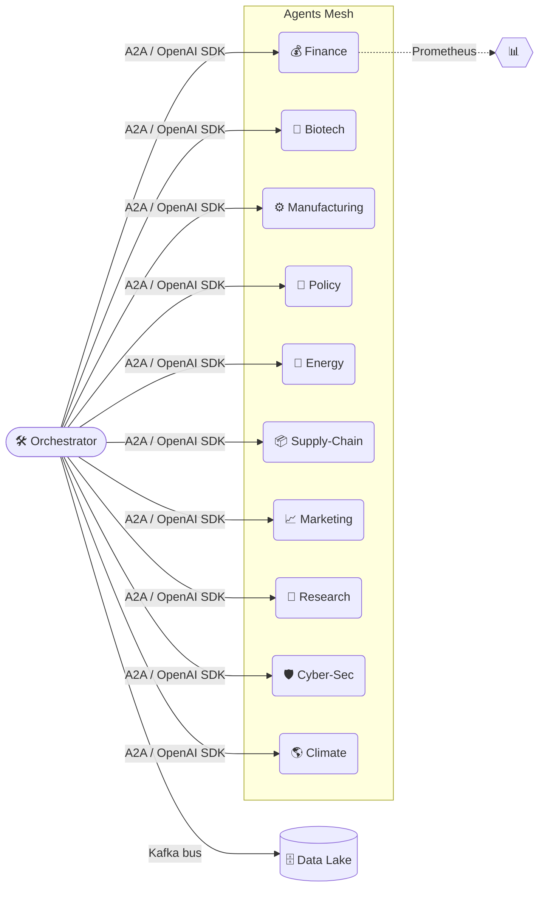

# Alpha‑Factory v1 👁️✨ — Multi‑Agent **AGENTIC** α‑AGI

**Out‑learn · Out‑think · Out‑design · Out‑strategise · Out‑execute**

---

Welcome to **Alpha‑Factory v1**, an antifragile constellation of self‑improving agents orchestrated to **spot live alpha across any industry and turn it into compounding value**. Built on the shoulders of best‑in‑class frameworks — OpenAI Agents SDK, Google ADK, A2A protocol and Model Context Protocol — the stack works *online or fully‑air‑gapped*, switching fluidly between frontier models and local fallbacks.

> **Mission 🎯**  End‑to‑end: **Identify 🔍 → Out‑Learn 📚 → Out‑Think 🧠 → Out‑Design 🎨 → Out‑Strategise ♟️ → Out‑Execute ⚡**

---

## 📜 Table of Contents
1. [Design Philosophy](#design-philosophy)
2. [System Topology 🗺️](#system-topology)
3. [Agent Gallery 🖼️ (11 agents)](#agent-gallery)
4. [Demo Showcase 🎬 (6 demos)](#demo-showcase)
5. [5‑Minute Quick‑Start 🚀](#5-minute-quick-start)
6. [Deployment Recipes 🍳](#deployment-recipes)
7. [Governance & Compliance ⚖️](#governance--compliance)
8. [Observability 🔭](#observability)
9. [Extending the Mesh 🔌](#extending-the-mesh)
10. [Troubleshooting 🛠️](#troubleshooting)
11. [Roadmap 🛣️](#roadmap)

---

## Design Philosophy

> “From data hoarding to **experience compounding**.” — *Silver & Sutton, 2024*

* **Experience‑First Loop** — Sense → Imagine (MuZero‑style planning) → Act → Adapt. Agents learn by *doing*, not by static corpora.
* **Graceful Degradation** — GPU‑less? No key? No problem. Agents swap to distilled local models & heuristics without breaking compliance.
* **Zero‑Trust Core** — SPIFFE identities, signed artefacts, prompt/output guard‑rails, exhaustive audit logs.
* **Polyglot Value** — Finance P&L, manufacturing makespan, biotech discovery rate… all normalised to *alpha* via configurable value lenses.

---

## System Topology 🗺️



* **Orchestrator** (`backend/orchestrator.py`) auto‑discovers agents via Python entry‑points, injects env, launches async tasks and exposes a unified REST/gRPC facade.
* **Kafka topic taxonomy**: `agent.manifest`, `agent.heartbeat`, domain streams (`fx.alpha`, `mfg.schedule`, `bt.experience`, …).

---

## Agent Gallery

| # | Agent | Folder / File | Alpha Contribution | Key Env Vars | Heavy Deps |
|---|-------|---------------|--------------------|--------------|-----------|
| 1 | **Finance** 💰 | `backend/finance_agent.py` | Generates multi‑factor signals, keeps CVaR ≤ `ALPHA_MAX_VAR_USD`, auto‑executes via broker adapters | `ALPHA_UNIVERSE`, `ALPHA_MAX_VAR_USD` | `pandas`, `lightgbm`, `ccxt` |
| 2 | **Biotech** 🧬 | `backend/biotech_agent.py` | KG‑RAG over UniProt/PubMed, proposes assays & CRISPR edits | `BIOTECH_KG_FILE`, `OPENAI_API_KEY` | `faiss`, `rdflib` |
| 3 | **Manufacturing** ⚙️ | `backend/manufacturing_agent.py` | CP‑SAT job‑shop optimiser, energy & CO₂ forecast | `ALPHA_MAX_SCHED_SECONDS` | `ortools`, `prometheus_client` |
| 4 | **Policy** 📜 | `backend/policy_agent.py` | Statute QA & red‑line diffs, ISO‑37301 risk vectors | `STATUTE_CORPUS_DIR` | `faiss`, `rank_bm25` |
| 5 | **Energy** 🔋 | `backend/energy_agent.py` | Demand‑response bidding, price elasticity | `ENERGY_API_TOKEN` | `numpy` |
| 6 | **Supply‑Chain** 📦 | `backend/supply_chain_agent.py` | VRP routing, ETA prediction | `SC_DB_DSN` | `networkx`, `sklearn` |
| 7 | **Marketing** 📈 | `backend/marketing_agent.py` | RL‑optimised campaign spend & copy | `MARKETO_KEY` | `torch`, `openai` |
| 8 | **Research** 🔬 | `backend/research_agent.py` | Literature triage, hypothesis ranking | — | `faiss` |
| 9 | **Cyber‑Sec** 🛡️ | `backend/cybersec_agent.py` | CVE triage, honeypot steering, ATT&CK graph reasoning | `VIRUSTOTAL_KEY` | threat‑intel APIs |
|10 | **Climate** 🌎 | `backend/climate_agent.py` | Emission forecasting, scenario stress tests | `NOAA_TOKEN` | `xarray`, `numpy` |
|11 | **Stub** 🫥 | `backend/stub_agent.py` | Fallback placeholder keeping graph intact when deps missing | — | — |

> All agents implement `AgentBase` → consistent `run_cycle()`, `manifest()`, `health()`.

---

## Demo Showcase 🎬

| Demo Notebook | Path | What You’ll See | Depends On |
|---------------|------|-----------------|-----------|
| **01‑Finance‑Alpha.ipynb** | `demos/finance_alpha_demo.ipynb` | Live factor back‑test → portfolio exec with VaR clamp | FinanceAgent + Broker sim |
| **02‑Biotech‑Assay.ipynb** | `demos/biotech_assay_demo.ipynb` | Query KG → propose CRISPR assay → rank off‑targets | BiotechAgent |
| **03‑Shopfloor‑Optimizer.ipynb** | `demos/manufacturing_shopfloor_demo.ipynb` | Upload CSV of jobs → CP‑SAT schedule → Gantt & CO₂ | ManufacturingAgent |
| **04‑RegTech‑Adviser.ipynb** | `demos/policy_regtech_demo.ipynb` | Upload legal text → red‑line diff & compliance heat‑map | PolicyAgent |
| **05‑Energy‑DR.ipynb** | `demos/energy_demand_response_demo.ipynb` | Simulate grid price spikes → agent bids, shows savings | EnergyAgent |
| **06‑Full‑Stack‑Alpha.ipynb** | `demos/full_stack_end_to_end.ipynb` | Orchestrates 5 agents to evaluate, design & launch a product | All core agents |

Launch demos with:
```bash
jupyter lab --NotebookApp.token=''
```

---

## 5‑Minute Quick‑Start 🚀

```bash
# 1. Clone & install
git clone https://github.com/MontrealAI/AGI-Alpha-Agent-v0.git
cd AGI-Alpha-Agent-v0/alpha_factory_v1
pip install -r requirements.txt  # extras auto‑detect GPU

# 2. Set minimal env
export ALPHA_KAFKA_BROKER=localhost:9092   # empty → stdout
# export OPENAI_API_KEY=sk‑...              # optional cloud boost

# 3. Run orchestrator
python -m backend.orchestrator

# 4. Open UI
http://localhost:8000/docs        # Swagger
http://localhost:3000             # Trace‑graph (Vite/D3)
```

First run spits signed manifests; agents start producing heartbeat & domain topics.

---

## Deployment Recipes 🍳

| Target | One‑liner | Notes |
|--------|-----------|-------|
| **Docker Compose (dev)** | `docker compose up -d orchestrator` | Bundles Kafka, Prometheus, Grafana |
| **Kubernetes** | `helm install af charts/alpha-factory` | SPIFFE, HPA, ServiceMonitor |
| **AWS Fargate** | `./infra/deploy_fargate.sh` | SQS shim for Kafka, spot friendly |
| **IoT Edge** | `python edge_runner.py --agents manufacturing,energy` | Runs on Jetson Nano ✔ |

---

## Governance & Compliance ⚖️

* **MCP envelopes** (SHA‑256 digest, ISO‑8601 ts, determinism seed).
* **Red‑Team Suite** under `tests/` bombards prompts/output for policy breaches.
* **`DISABLED_AGENTS`** env → pre‑import kill‑switch for sensitive demos.
* **Audit trail**: OpenTelemetry spans correlate prompts ↔ tool calls ↔ actions.

---

## Observability 🔭

* **Prometheus**: scrape `/metrics` → dashboards (`infra/grafana/*`).
* **Kafka Heartbeats**: latency, exception streak, quarantine flag.
* **Trace‑Graph WS**: real‑time D3 of planner expansions & tool calls.

---

## Extending the Mesh 🔌

```python
# my_super_agent.py
from backend.agent_base import AgentBase
class MyAgent(AgentBase):
    NAME = "super"
    CAPABILITIES = ["telemetry_fusion"]
    COMPLIANCE_TAGS = ["gdpr_minimal"]
    async def run_cycle(self):
        ...
```

```toml
# pyproject.toml
[project.entry-points."alpha_factory.agents"]
super = my_pkg.my_super_agent:MyAgent
```

`pip install .` → orchestrator hot‑loads at next boot.

---

## Troubleshooting 🛠️

| Issue | Hint |
|-------|------|
| `ImportError: faiss` | `pip install faiss-cpu` or rely on StubAgent |
| Agent shows `"quarantined":true` | Check logs, fix root cause, clear from `DISABLED_AGENTS` |
| Kafka connection refused | unset `ALPHA_KAFKA_BROKER` to log to stdout |
| OpenAI quota exceeded | remove `OPENAI_API_KEY` to switch to local models |

---

## Roadmap 🛣️

1. **RL‑on‑Execution**: slippage‑aware order routing.
2. **Federated Alpha Mesh**: cross‑org agent exchange via ADK federation.
3. **World‑Model Audits**: per Silver & Sutton — inspect learned latents.
4. **Plug‑and‑Play Industry Packs**: Health‑Care, Mar‑Tech, Gov‑Tech.

---

> Made with ❤️ by the **Alpha‑Factory** core team — *forging the tools that forge tomorrow*.

