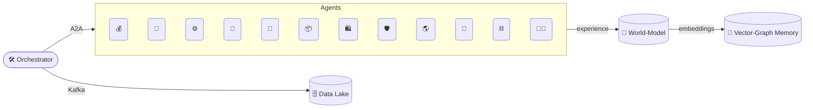

# Alpha‑Factory v1 👁️✨ — Multi‑Agent **AGENTIC** α‑AGI

**Out‑learn · Out‑think · Out‑design · Out‑strategise · Out‑execute**

---

Welcome to **Alpha‑Factory v1**, an antifragile constellation of self‑improving agents orchestrated to **spot live alpha across any industry and turn it into compounding value**.

Built on the shoulders of best‑in‑class frameworks — [OpenAI Agents SDK](https://openai.github.io/openai-agents-python/), Google [ADK](https://google.github.io/adk-docs/), the [A2A protocol](https://github.com/google/A2A) and the [Model Context Protocol](https://www.anthropic.com/news/model-context-protocol) — the stack operates **online or fully‑air‑gapped**, switching fluidly between frontier models and local fallbacks.

> **Mission 🎯**  End‑to‑end: **Identify 🔍 → Out‑Learn 📚 → Out‑Think 🧠 → Out‑Design 🎨 → Out‑Strategise ♟️ → Out‑Execute ⚡**

---

## 📜 Table of Contents
0. [Design Philosophy](#0-design-philosophy)  
1. [System Topology 🗺️](#1-system-topology)  
2. [World‑Model & Planner 🌌](#2-world-model--planner)  
3. [Agent Gallery 🖼️ (12 agents)](#3-agent-gallery)  
4. [Demo Showcase 🎬 (12 demos)](#4-demo-showcase)  
5. [Memory & Knowledge Fabric 🧠](#5-memory--knowledge-fabric)  
6. [5‑Minute Quick‑Start 🚀](#6-5-minute-quick-start)  
7. [Deployment Recipes 🍳](#7-deployment-recipes)  
8. [Governance & Compliance ⚖️](#8-governance--compliance)  
9. [Observability 🔭](#9-observability)  
10. [Extending the Mesh 🔌](#10-extending-the-mesh)  
11. [Troubleshooting 🛠️](#11-troubleshooting)  
12. [Roadmap 🛣️](#12-roadmap)  
13. [Credits 🌟](#13-credits)  

---

<a name="0-design-philosophy"></a>
## 0 · Design Philosophy

> “We have shifted from *big‑data hoarding* to **big‑experience compounding**.” — *Era of Experience*.

* **Experience‑First Loop** — Sense → *Imagine* (MuZero‑style latent planning) → Act → Adapt.  
* **AI‑GA Autogenesis** — The factory meta‑evolves new agents and curricula inspired by Clune’s *AI‑Generating Algorithms*.  
* **Graceful Degradation** — GPU‑less? No cloud key? Agents fall back to distilled local models & heuristics.  
* **Zero‑Trust Core** — SPIFFE identities, signed artefacts, guard‑rails, exhaustive audit logs.  
* **Polyglot Value** — Everything is normalised to a common *alpha Δ∑USD* lens.

---

<a name="1-system-topology"></a>
## 1 · System Topology 🗺️


* **Orchestrator** auto‑discovers agents (see `backend/agents/__init__.py`) and exposes a unified REST + gRPC facade.  
* **World‑Model** uses MuZero‑style latent dynamics for counterfactual planning.  
* **Memory Fabric** = pgvector + Neo4j for dense & causal recall.

---

<a name="2-world-model--planner"></a>
## 2 · World‑Model & Planner 🌌

| Component | Source Tech | Role |
|-----------|-------------|------|
| **Latent Dynamics** | MuZero++ | Predict env transitions & value |
| **Self‑Play Curriculum** | POET‑XL | Generates alpha‑labyrinth tasks |
| **Meta‑Gradient** | AI‑GA | Evolves optimiser hyper‑nets |
| **Task Selector** | Multi‑Armed Bandit | Schedules agent ↔ world‑model interactions |

---

<a name="3-agent-gallery"></a>
## 3 · Agent Gallery 🖼️

| # | Agent | Path | Prime Directive | Status | Key Env Vars |
|---|-------|------|-----------------|--------|--------------|
| 1 | **Finance** 💰 | `finance_agent.py` | Multi‑factor alpha & RL execution | **Prod** | `BROKER_DSN` |
| 2 | **Biotech** 🧬 | `biotech_agent.py` | CRISPR & assay proposals | **Prod** | `OPENAI_API_KEY` |
| 3 | **Manufacturing** ⚙️ | `manufacturing_agent.py` | CP‑SAT optimiser | **Prod** | `SCHED_HORIZON` |
| 4 | **Policy** 📜 | `policy_agent.py` | Statute QA & diffs | **Prod** | `STATUTE_CORPUS_DIR` |
| 5 | **Energy** 🔋 | `energy_agent.py` | Spot‑vs‑forward arbitrage | **Beta** | `ISO_TOKEN` |
| 6 | **Supply‑Chain** 📦 | `supply_chain_agent.py` | Stochastic MILP routing | **Beta** | `SC_DB_DSN` |
| 7 | **Retail Demand** 🛍️ | `retail_demand_agent.py` | SKU forecast & pricing | **Beta** | `POS_DB_DSN` |
| 8 | **Cyber‑Sec** 🛡️ | `cyber_threat_agent.py` | Predict & patch CVEs | **Beta** | `VT_API_KEY` |
| 9 | **Climate Risk** 🌎 | `climate_risk_agent.py` | ESG stress tests | **Beta** | `NOAA_TOKEN` |
|10 | **Drug‑Design** 💊 | `drug_design_agent.py` | Diffusion + docking | **Incub** | `CHEMBL_KEY` |
|11 | **Smart‑Contract** ⛓️ | `smart_contract_agent.py` | Formal verification | **Incub** | `ETH_RPC_URL` |
|12 | **Talent‑Match** 🧑‍💻 | `talent_match_agent.py` | Auto‑bounty hiring | **Incub** | — |

Each agent exports a signed *proof‑of‑alpha* message to the Kafka bus, enabling cross‑breeding of opportunities.

---

<a name="4-demo-showcase"></a>
## 4 · Demo Showcase 🎬

| Notebook | What You’ll See | Agents |
|----------|----------------|--------|
| **AI‑GA Meta Evolution** 🧬 | Agents evolve agents; watch fitness climb | World‑Model + Talent‑Match |
| **Business Builder v1** 🏢 | Launch a company end‑to‑end | Finance + Policy |
| **Cross‑Industry Pipeline** ⚙️ | Plan → Act across 4 verticals | Multi |
| **Fin Momentum Bot** 💹 | Live momentum execution | Finance |
| **MuZero Planner** ♟️ | Counterfactual market rollouts | WM + Finance |
| **Self‑Healing Repo** 🩹 | CI fails → agent patches → PR green | Cyber‑Sec |

Launch with:
```bash
jupyter lab --NotebookApp.token=''
```

---

<a name="5-memory--knowledge-fabric"></a>
## 5 · Memory & Knowledge Fabric 🧠

```
[Event] --embedding--> PGVector DB
                   \--edge--> Neo4j (CAUSES, SUPPORTS, RISK_OF)
```

* Agents query `mem.search("supply shock beta>0.2")`  
* Planner asks Neo4j: `MATCH (a)-[:CAUSES]->(b) WHERE b.delta_alpha > 5e6 RETURN path`

---

<a name="6-5-minute-quick-start"></a>
## 6 · 5‑Minute Quick‑Start 🚀
```bash
git clone https://github.com/MontrealAI/AGI-Alpha-Agent-v0.git
cd AGI-Alpha-Agent-v0/alpha_factory_v1
pip install -r requirements.txt

export ALPHA_KAFKA_BROKER=localhost:9092
python -m backend.orchestrator
open http://localhost:8000/docs
```

No GPU → falls back to GGML Llama‑3‑8B‑Q4.  
No `OPENAI_API_KEY` → switches to local SBERT + heuristics.

---

<a name="7-deployment-recipes"></a>
## 7 · Deployment Recipes 🍳

| Target | Command | Notes |
|--------|---------|-------|
| **Docker Compose** | `docker compose up -d` | Kafka, Prometheus, Grafana |
| **Helm (K8s)** | `helm install af charts/alpha-factory` | SPIFFE, HPA |
| **AWS Fargate** | `./infra/deploy_fargate.sh` | SQS shim for Kafka |
| **IoT Edge** | `python edge_runner.py --agents manufacturing,energy` | Jetson Nano |

---

<a name="8-governance--compliance"></a>
## 8 · Governance & Compliance ⚖️

* **MCP envelopes** (SHA‑256, ISO‑8601, policy hash)  
* **Red‑Team Suite** fuzzes prompts & actions  
* **Attestations** — W3C Verifiable Credentials at every Actuator call

---

<a name="9-observability"></a>
## 9 · Observability 🔭

| Signal | Sink | Example |
|--------|------|---------|
| Metrics | Prometheus | `alpha_pnl_realised_usd` |
| Traces | OpenTelemetry | `trace_id` |
| Dashboards | Grafana | `alpha-factory/trade-lifecycle.json` |

---

<a name="10-extending-the-mesh"></a>
## 10 · Extending the Mesh 🔌
```python
from backend.agent_base import AgentBase

class MySuperAgent(AgentBase):
    NAME = "super"
    CAPABILITIES = ["telemetry_fusion"]
    COMPLIANCE_TAGS = ["gdpr_minimal"]

    async def run_cycle(self):
        ...

# setup.py entrypoint
[project.entry-points."alpha_factory.agents"]
super = my_pkg.super_agent:MySuperAgent
```
`pip install .` → orchestrator hot‑loads at next boot.

---

<a name="11-troubleshooting"></a>
## 11 · Troubleshooting 🛠️

| Symptom | Cause | Fix |
|---------|-------|-----|
| `ImportError: faiss` | FAISS missing | `pip install faiss-cpu` |
| Agent quarantined | exceptions | Check logs, clear flag |
| Kafka refuse | broker down | unset `ALPHA_KAFKA_BROKER` |

---

<a name="12-roadmap"></a>
## 12 · Roadmap 🛣️

1. **RL‑on‑Execution** — slippage‑aware order routing  
2. **Federated Mesh** — cross‑org agent exchange via ADK federation  
3. **World‑Model Audits** — interpretable probes of latents  
4. **Industry Packs** — Health‑Care, Gov‑Tech  
5. **Provable Safety ℙ** — Coq proofs for Actuators  

---

<a name="13-credits"></a>
## 13 · Credits 🌟

[Vincent Boucher](https://www.linkedin.com/in/montrealai/)—pioneer in AI and President of [MONTREAL.AI](https://www.montreal.ai/) since 2003—dominated the [OpenAI Gym](https://web.archive.org/web/20170929214241/https://gym.openai.com/read-only.html) with **AI Agents** in 2016 and unveiled the seminal [**“Multi‑Agent AI DAO”**](https://www.quebecartificialintelligence.com/priorart) in 2017.

Our **AGI ALPHA AGENT**, fuelled by the strictly‑utility **$AGIALPHA** token, now taps that foundation to unleash the ultimate α‑signal engine.

---

*Made with ❤️ by the Alpha‑Factory Agentic Core Team — forging the tools that forge tomorrow.*
