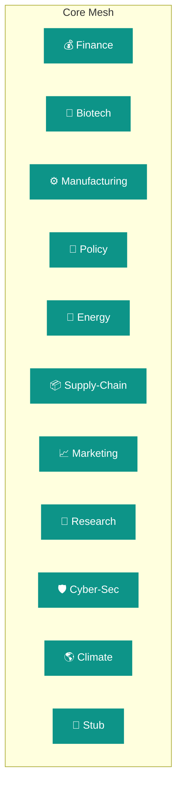
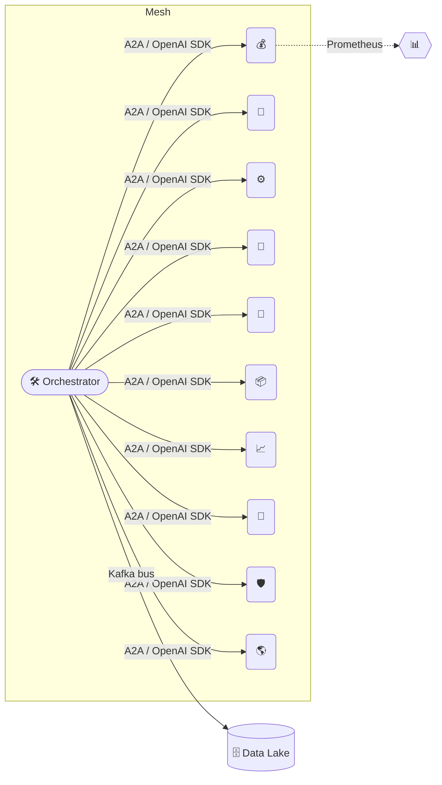

# Alpha‑Factory v1 👁️✨ — Backend Agents Suite  
*Out‑learn · Out‑think · Out‑design · Out‑strategise · Out‑execute*

Welcome to **Alpha‑Factory’s** beating heart: **eleven** self‑improving, cross‑domain agents working in concert to distil *alpha* from chaos and convert insight into decisive action — continuously, securely and under uncompromising governance.

---

## 📜 Contents  
1. [Design Philosophy](#design-philosophy)  
2. [Capability Graph 🌐](#capability-graph)  
3. [Agent Gallery 🖼️](#agent-gallery)  
4. [Per‑Agent Playbooks 📘](#per‑agent-playbooks)  
5. [5‑Minute Quick‑Start 🚀](#5‑minute-quick-start)  
6. [Deployment Recipes 🍳](#deployment-recipes)  
7. [Runtime Topology 🗺️](#runtime-topology)  
8. [Governance & Compliance ⚖️](#governance--compliance)  
9. [Observability 🔭](#observability)  
10. [Extending the Mesh 🔌](#extending-the-mesh)  
11. [Troubleshooting 🛠️](#troubleshooting)  

---

## Design Philosophy  

> “We’ve moved from **big‑data hoarding** to **big‑experience compounding**.” — *Era of Experience* (Silver & Sutton)  

Every agent embodies an **experience‑first loop** inspired by Sutton & Silver’s *Era of Experience* and Clune’s AI‑GA pillars:

1. **Sense 👂** — streaming data (Kafka, MQTT, WebSockets, REST hooks).  
2. **Imagine 🧠** — plan on a learned world‑model (MuZero‑style where useful). citeturn29file3  
3. **Act 🤖** — execute, monitor, log — all enveloped in Model Context Protocol (MCP).  
4. **Adapt 🔄** — online learning, antifragile to stress & dependency loss.

Heavy extras (GPU, OR‑Tools, FAISS, OpenAI) are **optional**; agents *degrade gracefully* to heuristics while preserving audit artefacts.

---

## Capability Graph 🌐  



Agents register automatically at runtime; the orchestrator exposes a **capability graph API** (`/capabilities`) so downstream services can query *who does what* in real‑time.

---

## Agent Gallery  

| # | Agent (File) | Emoji | Core Super‑powers | Status | Heavy Deps | Key Env Vars |
|---|--------------|-------|------------------|--------|-----------|--------------|
| 1 | `finance_agent.py` | 💰 | Multi‑factor alpha, CVaR 99 %, RL execution & OMS bridge | **Prod** | `pandas`, `lightgbm`, `ccxt` | `ALPHA_UNIVERSE`, `ALPHA_MAX_VAR_USD` |
| 2 | `biotech_agent.py` | 🧬 | KG‑RAG over UniProt / PubMed, CRISPR off‑target design | **Prod** | `faiss`, `rdflib`, `openai` | `BIOTECH_KG_FILE`, `OPENAI_API_KEY` |
| 3 | `manufacturing_agent.py` | ⚙️ | CP‑SAT job‑shop optimiser, energy & CO₂ forecast | **Prod** | `ortools`, `prometheus_client` | `ALPHA_MAX_SCHED_SECONDS` |
| 4 | `policy_agent.py` | 📜 | Statute QA, red‑line diff, ISO‑37301 risk tags | **Prod** | `faiss`, `rank_bm25` | `STATUTE_CORPUS_DIR` |
| 5 | `energy_agent.py` | 🔋 | Demand‑response bidding, real‑time price elasticity | **Beta** | `numpy`, External API | `ENERGY_API_TOKEN` |
| 6 | `supply_chain_agent.py` | 📦 | VRP routing, ETA prediction, delay heat‑map | **Beta** | `networkx`, `scikit-learn` | `SC_DB_DSN` |
| 7 | `marketing_agent.py` | 📈 | Multi‑touch attribution, campaign RL tuning | **Beta** | `torch`, `openai` | `MARKETO_KEY` |
| 8 | `research_agent.py` | 🔬 | Literature RAG, hypothesis ranking & ablation design | **Beta** | `faiss` | — |
| 9 | `cybersec_agent.py` | 🛡️ | CVE triage, MITRE ATT&CK reasoning, honeypot control | **Beta** | `faiss`, threat‑intel APIs | `VIRUSTOTAL_KEY` |
|10 | `climate_agent.py` | 🌎 | Emission forecasting, scenario stress tests | **Beta** | `xarray`, `numpy` | `NOAA_TOKEN` |
|11 | `stub_agent.py` | 🫥 | Auto‑generated placeholder when deps missing | **Auto** | — | — |

---

## Per‑Agent Playbooks 📘  

> **Pro‑tip:** every agent is an [OpenAI Agents SDK](https://openai.github.io/openai-agents-python/) *tool*—callable from any LLM prompt or another agent.

<details open>
<summary>Finance 💰</summary>

```python
from backend.agents import get_agent
fin = get_agent("finance")

signals_df = fin.generate_signals(window="1d")  # pandas DataFrame of alpha bets
fin.execute_portfolio(signals_df, broker="paper")  # OMS / exchange bridge
```

*Governance:* Configurable VaR & draw‑down guard‐rails are enforced before every order.
</details>

<details>
<summary>Biotech 🧬</summary>

```python
bio = get_agent("biotech")
answer_json = bio.policy_qa("Explain the role of p53 in DNA repair.")
print(answer_json["answer"])
```

*Offline mode* → SBERT embeddings + bullet summary when `OPENAI_API_KEY` is absent.
</details>

<details>
<summary>Manufacturing ⚙️</summary>

```python
mf = get_agent("manufacturing")
jobs = [{"id": "J1", "ops":[("CNC", 10), ("Paint", 5)]}]
sched = mf.build_schedule({"jobs": jobs, "horizon": 480})
print("Makespan (min):", sched["makespan"])
```

*Observability:* Prometheus metric `af_job_lateness_seconds` exported per run.
</details>

<details>
<summary>Policy / Reg‑Tech 📜</summary>

```python
pl = get_agent("policy")
mcp_json = pl.policy_qa("What is the GDPR lawful basis for biometric data processing?")
print(mcp_json["payload"]["answer"])
```

*Result Format:* Responses wrapped in an MCP envelope with SHA‑256 digest.
</details>

*(See `/examples` notebooks for all other agents.)*

---

## 5‑Minute Quick‑Start 🚀  

```bash
git clone https://github.com/MontrealAI/AGI-Alpha-Agent-v0.git
cd AGI-Alpha-Agent-v0/alpha_factory_v1

# full‑fat install incl. OR‑Tools, FAISS, Kafka‑Python, Prometheus, etc.
pip install -r requirements.txt

# minimal env for a quick demo
export ALPHA_KAFKA_BROKER=localhost:9092   # empty → stdout fallback
export OPENAI_API_KEY=sk-...               # optional
export DISABLED_AGENTS=stub                # block‑list unwanted agents

python -m backend.orchestrator
```

### What happens?  

1. Agents auto‑discover & self‑register.  
2. A signed **manifest** is published on `agent.manifest`.  
3. Continuous **heart‑beats** flow on `agent.heartbeat`.  
4. Demo notebooks connect to the REST gateway at `http://localhost:8000`.

---

## Deployment Recipes 🍳  

| Environment | Command | Highlights |
|-------------|---------|------------|
| **Docker Compose** | `docker compose up -d orchestrator` | Kafka + Prometheus stack |
| **Kubernetes** | `helm install alpha-factory ./charts/alpha-factory` | HPA, PodMonitor, secret injection |
| **AWS Fargate** | `./infra/deploy_fargate.sh` | Spot‑instance friendly, SQS↔Kafka shim |
| **Bare‑metal Edge** | `python edge_runner.py --agents manufacturing,energy` | Zero external deps, SQLite persistence |

---

## Runtime Topology 🗺️  



---

## Governance & Compliance ⚖️  

* **Model Context Protocol (MCP)** wraps every outbound artefact (SHA‑256 digest, ISO‑8601 ts, determinism seed).  
* Agents self‑declare `COMPLIANCE_TAGS` e.g. `gdpr_minimal`, `sox_traceable`.  
* `DISABLED_AGENTS` env flag → pre‑import block‑listing for regulator demos.  
* **Audit Trail:** All decisions logged with causality chain → SOX ready.

---

## Observability 🔭  

| Signal | Sink | Example Metric |
|--------|------|----------------|
| Health‑beat | Kafka `agent.heartbeat` | `latency_ms`, `ok` |
| Metrics | Prometheus | `af_job_lateness_seconds` |
| Traces | OpenTelemetry → Jaeger | `alpha_factory.trace_id` |

Grafana dashboards in `infra/grafana` provide instant situational awareness.

---

## Extending the Mesh 🔌  

```bash
pip install my_super_agent
```

`my_super_agent` declares an entry‑point:

```toml
[project.entry-points."alpha_factory.agents"]
super = my_pkg.super_agent:MySuperAgent
```

On next orchestrator boot your agent is **auto‑discoverable**, hot‑swappable, and visible on the capability graph.

---

## Troubleshooting 🛠️  

| Symptom | Likely Cause | Remedy |
|---------|--------------|--------|
| `ImportError: faiss` | FAISS not installed | `pip install faiss-cpu` or rely on **StubAgent** |
| Agent *quarantined* | repeated exceptions | inspect logs, patch, restart with `DISABLED_AGENTS=` cleared |
| Kafka timeout | Broker unreachable | set `ALPHA_KAFKA_BROKER=` to empty for stdout |
| 402 Payment Required (OpenAI) | key quota exhausted | unset `OPENAI_API_KEY` to switch to offline mode |

---

Made with ❤️ by the **Alpha‑Factory** core team — *forging the tools that forge tomorrow*.
