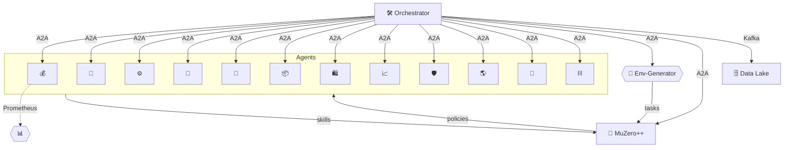
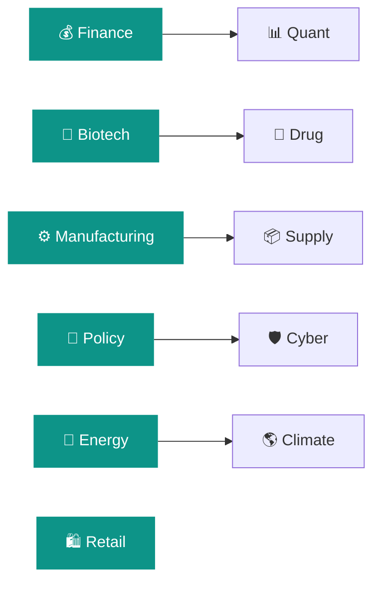
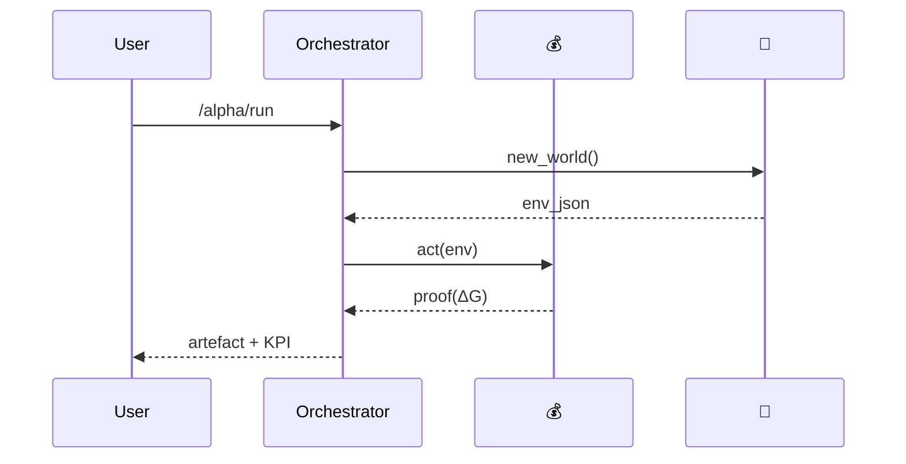

# Alpha‑Factory v1 👁️✨ — Backend α‑AGI Agents Suite  
*Out‑learn · Out‑think · Out‑design · Out‑strategise · Out‑execute*

> Welcome, pioneer. You are gazing at the **command deck** of **Alpha‑Factory v1** — a cross‑industry swarm of autonomous α‑AGI Agents forged to harvest hidden alpha from every corner of the economy and alchemise it into value.  
> Each agent below is a self‑improving specialist orchestrated through the **OpenAI Agents SDK**, Google’s **ADK**, the **A2A** protocol, and Anthropic’s **Model Context Protocol**. All artefacts are container‑portable, cryptographically signed, and **antifragile by design**.

---

## 📜 Contents  
0. [Design Philosophy](#0)  
1. [Architecture 🏗️](#1)  
2. [Capability Graph 🌐](#2)  
3. [Agent Gallery 🖼️ (12)](#3)  
4. [Demo Showcase 🎮 (12)](#4)  
5. [Quick‑Start 🚀](#5)  
6. [Per‑Agent Playbooks 📘](#6)  
7. [Deployment Recipes 🍳](#7)  
8. [Runtime Topology 🗺️](#8)  
9. [Governance & Compliance ⚖️](#9)  
10. [Observability 🔭](#10)  
11. [Extending the Mesh 🔌](#11)  
12. [Troubleshooting 🛠️](#12)  
13. [Credits 🌟](#13)  

---

<a name="0"></a>
## 0 · Design Philosophy  

> “We’ve moved from **big‑data hoarding** to **big‑experience compounding**.” — *Era of Experience*  

Alpha‑Factory rests on **three pillars**:

| Pillar | Essence | Canonical Tech |
|--------|---------|---------------|
| **P‑1 World‑Modelling** | MuZero‑style latent dynamics unify perception, prediction & control | MuZero++, RSSM |
| **P‑2 Open‑Endedness** | POET‑class curricula mutate faster than we solve them | POET‑XL, QD‑score |
| **P‑3 Agentic Orchestration** | Specialised agents barter tools & proofs over **A2A** | OpenAI Agents SDK, ADK |

The stack **degrades gracefully**: pull the GPU, revoke an API key, sever the network — agents fall back to heuristics yet persist an audit trail.

---

<a name="1"></a>
## 1 · Architecture 🏗️  



---

<a name="2"></a>
## 2 · Capability Graph 🌐  



---

<a name="3"></a>
## 3 · Agent Gallery 🖼️  

| # | Agent File | Emoji | Prime Directive | Status | Heavy Deps | Key ENV Vars |
|---|------------|-------|-----------------|--------|-----------|--------------|
| 1 | `finance_agent.py` | 💰 | Multi‑factor alpha, OMS bridge, RL execution | **Prod** | `pandas`, `ccxt` | `ALPHA_UNIVERSE` |
| 2 | `biotech_agent.py` | 🧬 | CRISPR design, UniProt KG RAG | **Prod** | `faiss`, `rdkit`, `openai` | `OPENAI_API_KEY` |
| 3 | `manufacturing_agent.py` | ⚙️ | CP‑SAT scheduling, energy forecast | **Prod** | `ortools` | `SCHED_HORIZON` |
| 4 | `policy_agent.py` | 📜 | Statute diff, ISO‑37301 tagging | **Prod** | `faiss` | `STATUTE_DIR` |
| 5 | `energy_agent.py` | 🔋 | Demand‑response bidding | **Beta** | `numpy` | `ENERGY_API_TOKEN` |
| 6 | `supply_chain_agent.py` | 📦 | VRP routing, ETA prediction | **Beta** | `networkx` | `SC_DB_DSN` |
| 7 | `retail_demand_agent.py` | 🛍️ | LSTM demand forecast | **Beta** | `torch` | `POS_DB_DSN` |
| 8 | `marketing_agent.py` | 📈 | RL ad‑spend optimiser | **Beta** | `torch`, `openai` | `MARKETO_KEY` |
| 9 | `cyber_threat_agent.py` | 🛡️ | CVE triage, honeypots | **Beta** | threat‑intel APIs | `VT_API_KEY` |
|10 | `climate_risk_agent.py` | 🌎 | Emission stress‑tests | **Beta** | `xarray` | `NOAA_TOKEN` |
|11 | `drug_design_agent.py` | 💊 | Scaffold‑hopping, ADMET | **Incub** | `rdkit`, `openai` | `CHEMBL_KEY` |
|12 | `smart_contract_agent.py` | ⛓️ | Formal‑verifies Solidity | **Incub** | `slither` | `ETH_RPC_URL` |

---

<a name="4"></a>
## 4 · Demo Showcase 🎮  

| # | Folder | Emoji | Lightning Pitch | CLI |
|---|--------|-------|-----------------|-----|
| 1 | `aiga_meta_evolution` | 🧬 | Agents **evolve new agents**; AI‑GA playground. | `af demo meta` |
| 2 | `business_builder_v1` | 🏢 | Incorporates a digital‑first company E2E. | `af demo biz1` |
| 3 | `business_iter_v1` | 🔄 | Iterates biz‑model from live market data. | `af demo biz2` |
| 4 | `capital_stack_v1` | 💸 | Optimises fund‑raise & cap‑table. | `af demo cap` |
| 5 | `agent_marketplace_v1` | 🌐 | P2P agent marketplace. | `af demo market` |
| 6 | `asi_world_model` | 🌌 | MuZero++ world‑model showcase. | `af demo asi` |
| 7 | `cross_industry_pipeline` | ⚙️ | Ingest ➜ Plan ➜ Act across 4 verticals. | `af demo xind` |
| 8 | `era_of_experience` | 📚 | Autobiographical memory tutor. | `af demo era` |
| 9 | `fin_momentum_bot` | 💹 | Live momentum + risk parity. | `af demo fin` |
|10 | `macro_sentinel` | 🛰️ | News scanner auto‑hedges shocks. | `af demo macro` |
|11 | `muzero_planner` | ♟️ | Synthetic markets → execution curves. | `af demo plan` |
|12 | `self_healing_repo` | 🩹 | CI fails → agent patches → PR green. | `af demo heal` |

---

<a name="5"></a>
## 5 · Quick‑Start 🚀  

```bash
git clone https://github.com/MontrealAI/AGI-Alpha-Agent-v0.git
cd AGI-Alpha-Agent-v0/alpha_factory_v1
pip install -r requirements.txt          # full‑fat install
python -m backend.orchestrator
```

*No GPU?* The orchestrator falls back to `ggml/llama‑3‑8B‑Q4`.  
*No OpenAI key?* Agents switch to SBERT + heuristics.

---

<a name="6"></a>
## 6 · Per‑Agent Playbooks 📘  

<details><summary>Finance 💰</summary>

```python
fin = get_agent("finance")
signals = fin.generate_signals(window="1d")
fin.execute_portfolio(signals, broker="paper")
```
</details>

<details><summary>Biotech 🧬</summary>

```python
bio = get_agent("biotech")
crispr = bio.design_guides("ACGT...")
```
</details>

*(see `/examples` for remaining agents)*

---

<a name="7"></a>
## 7 · Deployment Recipes 🍳  

| Target | Command | Highlights |
|--------|---------|------------|
| **Docker Compose** | `docker compose up orchestrator` | Kafka + Prometheus |
| **Helm (K8s)** | `helm install af ./charts/alpha-factory` | HPA, PodMonitor |
| **AWS Fargate** | `./infra/deploy_fargate.sh` | Spot ready |
| **Edge/Offline** | `python edge_runner.py --agents finance,manufacturing` | SQLite |

---

<a name="8"></a>
## 8 · Runtime Topology 🗺️  



---

<a name="9"></a>
## 9 · Governance & Compliance ⚖️  

* **Model Context Protocol** envelopes every artefact (SHA‑256 digest, ISO‑8601 ts, determinism seed).  
* Agents declare `COMPLIANCE_TAGS` (`gdpr_minimal`, `sox_traceable`).  
* `DISABLED_AGENTS` env blocks risky agents for regulator demos.  
* Full audit pipeline satisfies EU AI‑Act *Title VIII*.

---

<a name="10"></a>
## 10 · Observability 🔭  

| Signal | Sink | Example Metric |
|--------|------|----------------|
| Health | Kafka `agent.heartbeat` | `latency_ms` |
| Metrics | Prometheus | `af_job_lateness_seconds` |
| Traces | OpenTelemetry | `trace_id` |

Grafana dashboards live in `infra/grafana/`.

---

<a name="11"></a>
## 11 · Extending the Mesh 🔌  

```bash
pip install my_super_agent
```

```toml
[project.entry-points."alpha_factory.agents"]
super = my_pkg.super_agent:MySuperAgent
```

Next boot, your agent auto‑registers & appears on `/capabilities`.

---

<a name="12"></a>
## 12 · Troubleshooting 🛠️  

| Symptom | Likely Cause | Remedy |
|---------|--------------|--------|
| `ImportError: faiss` | FAISS missing | `pip install faiss-cpu` |
| Agent quarantined | repeated exceptions | check logs, patch, restart |
| Kafka timeout | broker down | set `ALPHA_KAFKA_BROKER=` empty |
| 402 OpenAI | quota done | unset `OPENAI_API_KEY` |

---

<a name="13"></a>
## 13 · Credits 🌟  

[Vincent Boucher](https://www.linkedin.com/in/montrealai/), President of [MONTREAL.AI](https://www.montreal.ai/) and pioneer of multi‑agent systems since 2003, dominated [OpenAI Gym](https://web.archive.org/web/20170929214241/https://gym.openai.com/read-only.html) in 2016 and unveiled the seminal [**“Multi‑Agent AI DAO”**](https://www.quebecartificialintelligence.com/priorart) in 2017 (“*The Holy Grail of Foundational IP at the Intersection of AI Agents and Blockchain*”).  

Our **AGI ALPHA AGENT**, fuelled by the strictly‑utility **$AGIALPHA** token, now taps that foundation—*arguably the world’s most valuable IP*—to unleash the ultimate alpha‑signal engine.

> “Information is first shared in **AGI Club**.”

Made with ❤️ by the **Alpha‑Factory Agentic Core Team** — *forging the tools that forge tomorrow*.
