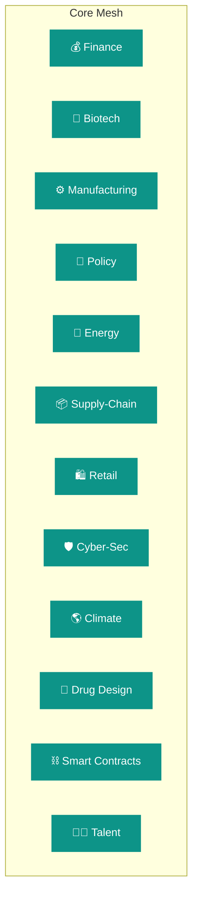
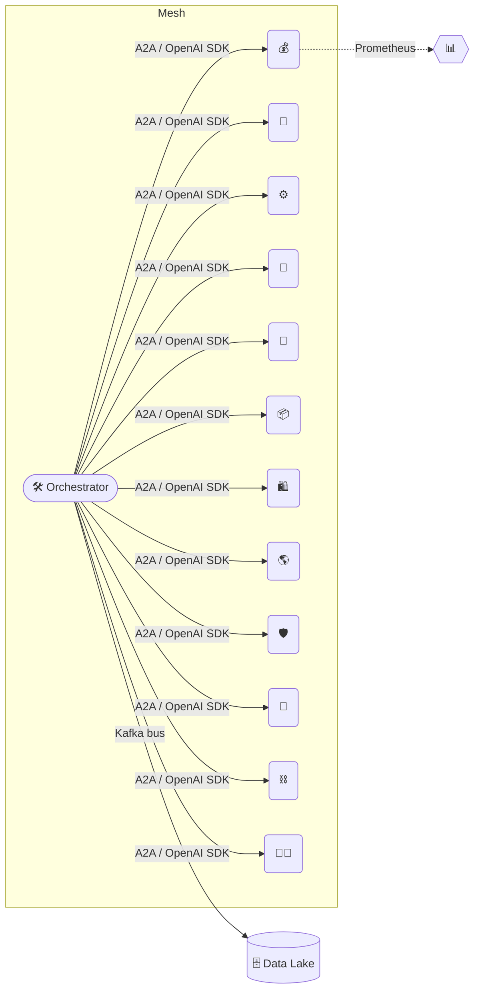

# Alpha‑Factory v1 👁️✨ — Backend Agents Suite  
*Out‑learn · Out‑think · Out‑design · Out‑strategise · Out‑execute*

Welcome to **Alpha‑Factory’s** beating heart: **twelve** self‑improving, cross‑domain agents working in concert to distil *alpha* from chaos and convert insight into decisive action — continuously, securely and under uncompromising governance.

---

## 📜 Contents  
1. [Design Philosophy](#design-philosophy)  
2. [Capability Graph 🌐](#capability-graph)  
3. [Agent Gallery 🖼️](#agent-gallery)  
4. [Demo Showcase 🎮](#demo-showcase)  
5. [Per‑Agent Playbooks 📘](#per‑agent-playbooks)  
6. [5‑Minute Quick‑Start 🚀](#5-minute-quick-start)  
7. [Deployment Recipes 🍳](#deployment-recipes)  
8. [Runtime Topology 🗺️](#runtime-topology)  
9. [Governance & Compliance ⚖️](#governance--compliance)  
10. [Observability 🔭](#observability)  
11. [Extending the Mesh 🔌](#extending-the-mesh)  
12. [Troubleshooting 🛠️](#troubleshooting)  
13. [Credits & Foundational Vision 🌟](#credits--foundational-vision)  

---

## Design Philosophy  

> “We’ve moved from **big‑data hoarding** to **big‑experience compounding**.” — *Era of Experience* (Silver & Sutton)  

Every agent embodies an **experience‑first loop** inspired by Sutton & Silver’s *Era of Experience* and Clune’s AI‑GA pillars:

1. **Sense 👂** — streaming data (Kafka, MQTT, WebSockets, REST hooks).  
2. **Imagine 🧠** — plan on a learned world‑model (MuZero‑style where useful).  
3. **Act 🤖** — execute, monitor, log — all enveloped in Model Context Protocol (MCP).  
4. **Adapt 🔄** — online learning, antifragile to stress & dependency loss.

GPU‑heavy extras (OR‑Tools, FAISS, OpenAI) are **optional**; agents *degrade gracefully* to heuristics while preserving audit artefacts.

---

## Capability Graph 🌐  



Agents self‑register at runtime; the Orchestrator offers a `/capabilities` endpoint so downstream services can query *who does what* in real‑time.

---

## Agent Gallery 🖼️  

| # | Agent (File) | Emoji | Core Super‑powers | Status | Heavy Deps | Key Env Vars |
|---|--------------|-------|------------------|--------|-----------|--------------|
| 1 | `finance_agent.py` | 💰 | Multi‑factor alpha signals, CVaR 99 % guard‑rails, RL execution bridge | **Prod** | `pandas`, `lightgbm`, `ccxt` | `ALPHA_UNIVERSE`, `ALPHA_MAX_VAR_USD` |
| 2 | `biotech_agent.py` | 🧬 | UniProt/PubMed KG‑RAG, CRISPR off‑target design | **Prod** | `faiss`, `rdkit`, `openai` | `BIOTECH_KG_FILE`, `OPENAI_API_KEY` |
| 3 | `manufacturing_agent.py` | ⚙️ | CP‑SAT job‑shop optimiser, energy & CO₂ forecast | **Prod** | `ortools`, `prometheus_client` | `ALPHA_MAX_SCHED_SECONDS` |
| 4 | `policy_agent.py` | 📜 | Statute QA, ISO‑37301 risk tags, automated red‑line diff | **Prod** | `faiss`, `rank_bm25` | `STATUTE_CORPUS_DIR` |
| 5 | `energy_agent.py` | 🔋 | Demand‑response bidding, real‑time elasticity curves | **Beta** | `numpy`, external API | `ENERGY_API_TOKEN` |
| 6 | `supply_chain_agent.py` | 📦 | VRP solver, ETA predictor, delay heat‑map | **Beta** | `networkx`, `scikit-learn` | `SC_DB_DSN` |
| 7 | `retail_demand_agent.py` | 🛍️ | LSTM demand forecast + promo uplift optimiser | **Beta** | `torch`, `pandas` | `POS_DB_DSN` |
| 8 | `climate_risk_agent.py` | 🌎 | Climate VaR, emission scenario stress‑test | **Beta** | `xarray`, `numpy` | `NOAA_TOKEN` |
| 9 | `cyber_threat_agent.py` | 🛡️ | CVE triage, MITRE ATT&CK reasoning, honeypot control | **Beta** | threat‑intel APIs | `VIRUSTOTAL_KEY` |
|10 | `drug_design_agent.py` | 💊 | Generative scaffold‑hopping, ADMET filter | **Incub** | `rdkit`, `openai` | `CHEMBL_KEY` |
|11 | `smart_contract_agent.py` | ⛓️ | Formal‑verifies Solidity, auto‑patches re‑entrancy | **Incub** | `slither`, `openai` | `ETH_RPC_URL` |
|12 | `talent_match_agent.py` | 🧑‍💼 | Vector‑match CV ↔ project gigs in seconds | **Incub** | `faiss`, `openai` | `ATS_DB_DSN` |

---

## Demo Showcase 🎮  

| # | Folder | Emoji | Lightning Pitch | Launch |
|---|--------|-------|-----------------|--------|
| 1 | `aiga_meta_evolution` | 🧬 | Agents evolve new agents; genetic fitness sparks open‑ended strategy space. | `docker compose -f demos/docker-compose.aiga_meta.yml up` |
| 2 | `alpha_agi_business_v1` | 🏢 | Incorporates a digital‑first company end‑to‑end. | `docker compose -f demos/docker-compose.business_v1.yml up` |
| 3 | `alpha_agi_business_2_v1` | 🏢 | Iterates business model with live market data RAG. | `docker compose -f demos/docker-compose.business_2.yml up` |
| 4 | `alpha_agi_business_3_v1` | 🏢 | Forecasts & fundraises, optimising capital stack for ROI alpha. | `docker compose -f demos/docker-compose.business_3.yml up` |
| 5 | `alpha_agi_marketplace_v1` | 🔄 | Peer‑to‑peer agent marketplace for price discovery. | `docker compose -f demos/docker-compose.marketplace.yml up` |
| 6 | `alpha_asi_world_model` | 🌌 | MuZero‑style world model for ASI scenarios. | `docker compose -f demos/docker-compose.asi_world.yml up` |
| 7 | `cross_industry_alpha_factory` | 🌐 | Full pipeline: ingest → plan → act across 4 verticals. | `docker compose -f demos/docker-compose.cross_industry.yml up` |
| 8 | `era_of_experience` | 📚 | Streams autobiographical memory tutor for tacit SME transfer. | `docker compose -f demos/docker-compose.era.yml up` |
| 9 | `finance_alpha` | 💹 | Live momentum + risk‑parity bot (Binance test‑net). | `docker compose -f demos/docker-compose.finance.yml up` |
|10 | `macro_sentinel` | 🛰️ | GPT‑RAG news scanner auto‑hedges macro shocks. | `docker compose -f demos/docker-compose.macro.yml up` |
|11 | `muzero_planning` | ♟️ | Plans synthetic markets → optimal execution curves. | `docker compose -f demos/docker-compose.muzero.yml up` |
|12 | `self_healing_repo` | 🩹 | CI fails → agent crafts patch ⇒ PR green again. | `docker compose -f demos/docker-compose.selfheal.yml up` |

> **Colab?** Each folder ships an `*.ipynb` mirroring the Docker flow (free GPU).

---

## Per‑Agent Playbooks 📘  

Agents are exposed as [OpenAI Agents SDK](https://openai.github.io/openai-agents-python/) *tools* and REST endpoints (`/v1/agents/<name>`).

<details>
<summary>Finance 💰</summary>

```python
from backend.agents import get_agent
fin = get_agent("finance")
signals = fin.generate_signals(window="4h")
fin.execute_portfolio(signals, broker="paper")
```
*Governance:* VaR & draw‑down guard‑rails enforced pre‑trade.
</details>

<details>
<summary>Biotech 🧬</summary>

```python
bio = get_agent("biotech")
answer = bio.policy_qa("Explain p53 in DNA repair.")["answer"]
```
*Offline mode:* SBERT embeddings + summary when `OPENAI_API_KEY` is absent.
</details>

<details>
<summary>Manufacturing ⚙️</summary>

```python
mf = get_agent("manufacturing")
jobs = [{"id":"J1","ops":[("CNC",10),("Paint",5)]}]
sched = mf.build_schedule({"jobs":jobs,"horizon":480})
print(sched["makespan"])
```
*Observability:* Prometheus metric `af_job_lateness_seconds` exported per run.
</details>

*(All other playbooks live in `/examples`.)*

---

## 5‑Minute Quick‑Start 🚀  

```bash
git clone https://github.com/MontrealAI/AGI-Alpha-Agent-v0.git
cd AGI-Alpha-Agent-v0/alpha_factory_v1

# Full‑fat install (GPU, OR‑Tools, FAISS, Kafka, Prometheus)
pip install -r requirements.txt

# Spin orchestrator + default agents
python -m backend.orchestrator
```

No GPU? No key? Fallback models (`ggml/llama‑3‑instruct‑8B‑Q4`) auto‑activate; demos degrade *gracefully* not *fail*.

---

## Deployment Recipes 🍳  

| Environment | Command | Highlights |
|-------------|---------|------------|
| **Docker Compose** | `docker compose up -d orchestrator` | Kafka + Prometheus |
| **Kubernetes/Helm** | `helm install af ./charts/alpha-factory` | HPA, PodMonitor, secret mounts |
| **AWS Fargate** | `./infra/deploy_fargate.sh` | Spot‑friendly, SQS ↔︎ Kafka |
| **Edge/Offline** | `python edge_runner.py --agents finance,manufacturing` | SQLite persistence |

---

## Runtime Topology 🗺️  



---

## Governance & Compliance ⚖️  

* **Model Context Protocol (MCP)** envelopes every artefact (SHA‑256 digest, ISO‑8601 timestamp, determinism seed).  
* Agents declare `COMPLIANCE_TAGS` e.g. `gdpr_minimal`, `sox_traceable`.  
* `DISABLED_AGENTS` env flag → pre‑import block‑listing for regulator demos.  
* **Audit Trail:** All decisions logged with causality chain → SOX ready.

---

## Observability 🔭  

| Signal | Sink | Example Metric |
|--------|------|----------------|
| Health‑beat | Kafka `agent.heartbeat` | `latency_ms` |
| Metrics | Prometheus | `af_job_lateness_seconds` |
| Traces | OpenTelemetry → Jaeger | `alpha_factory.trace_id` |

Grafana dashboards live in `infra/grafana/`.

---

## Extending the Mesh 🔌  

```bash
pip install my_super_agent
```

Declare entry‑point:

```toml
[project.entry-points."alpha_factory.agents"]
super = my_pkg.super_agent:MySuperAgent
```

On next orchestrator boot your agent is **auto‑discoverable** and hot‑swappable.

---

## Troubleshooting 🛠️  

| Symptom | Likely Cause | Remedy |
|---------|--------------|--------|
| `ImportError: faiss` | FAISS not installed | `pip install faiss-cpu` or rely on StubAgent |
| Agent quarantined | repeated exceptions | inspect logs, patch, restart |
| Kafka timeout | Broker unreachable | set `ALPHA_KAFKA_BROKER=` empty for stdout |
| 402 OpenAI | key quota exhausted | unset `OPENAI_API_KEY` for offline mode |

---

## Credits & Foundational Vision 🌟  

[Vincent Boucher](https://www.linkedin.com/in/montrealai/), a pioneer in AI and President of [MONTREAL.AI](https://www.montreal.ai/) since 2003, reshaped the landscape by dominating the [OpenAI Gym](https://web.archive.org/web/20170929214241/https://gym.openai.com/read-only.html) with **AI Agents** in 2016 and unveiling the game‑changing [**“Multi‑Agent AI DAO”**](https://www.quebecartificialintelligence.com/priorart) blueprint in 2017 (“*The Holy Grail of Foundational IP at the Intersection of AI Agents and Blockchain*” #PriorArt: 🎥 [Watch](https://youtu.be/Y4_6aZbVlo4); 📖 [Read](https://www.huffpost.com/archive/qc/entry/blockchain-et-lintelligence-artificielle-une-combinaison-puis_qc_5ccc6223e4b03b38d6933d24)).  
Our **AGI ALPHA AGENT**—fueled by the strictly‑utility **$AGIALPHA** token—now harnesses that visionary foundation—*arguably the world’s most valuable, impactful and important IP*—to unleash the **ultimate alpha signal engine**.

Made with ❤️ by the **Alpha‑Factory** core team — *forging the tools that forge tomorrow*.

