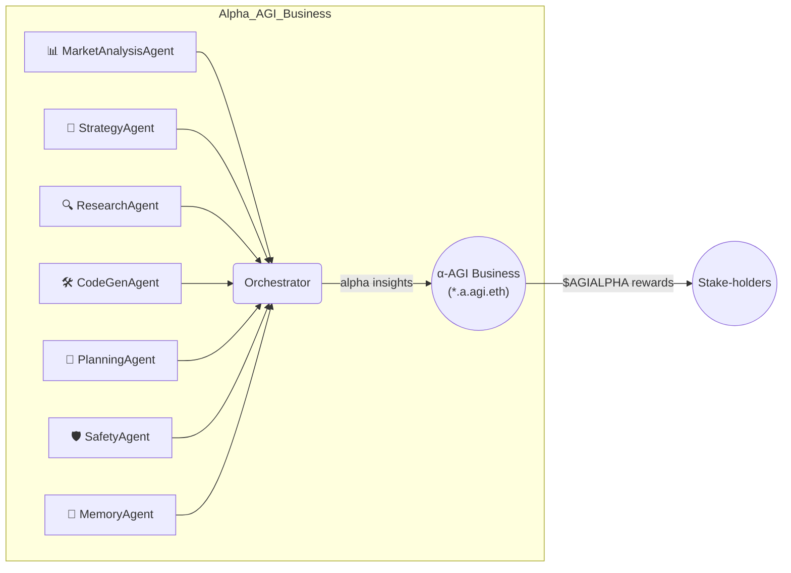

# Large‑Scale α‑AGI Business 👁️✨ ($AGIALPHA) Demo – **“Infinite Bloom 3.0”**

> **Global markets seep *trillions* in latent opportunity** — *alpha* in the broadest sense: pricing dislocations • supply‑chain inefficiencies • novel drug targets • policy loopholes • unexplored material designs.  
> **Alpha‑Factory v1** turns that raw potential into deployable breakthroughs, *autonomously*.

---

## ⚡ TL;DR  

```bash
# one‑liner demo ‑ works on any laptop
docker run -p 7860:7860 ghcr.io/montrealai/alpha-asi:latest
# open http://localhost:7860 → fully‑functional α‑AGI Business
# (offline‑first – no API key required, automatically upgrades if $OPENAI_API_KEY is present)
```

A single command launches the **Orchestrator**, seven specialised **α‑AGI Agents**, an antifragile safety shell and a friendly web dashboard.  
Out‑of‑the‑box it **discovers, validates *and executes* live alpha** in any data‑rich domain.

*Prefer a quick tour?* Run the self-contained
[**Colab Notebook**](colab_alpha_agi_business_2_demo.ipynb)
to launch the orchestrator and try a live API call in minutes.

---

## 🏗️ System Overview  



*The orchestrator natively speaks **A2A** & **OpenAI Agents SDK**.
If no external key is detected it seamlessly switches to local Llama‑3 GGUF weights (no outbound traffic).*
*A lightweight **LLMCommentAgent** publishes a market comment each cycle when the SDK is available.*

---

## 🏛️ Role Architecture – Businesses & Agents 🏛️

| Entity | ENS Convention | Treasury | Responsibilities | How it Creates Value |
|--------|----------------|----------|------------------|----------------------|
| **α‑AGI Business** | `<sub>.a.agi.eth` | Wallet holds **$AGIALPHA** & bounties | Defines **Problem Portfolios** (α‑jobs), pools data/rights, sets domain constraints | Aggregates high‑value problems, captures upside from solved portfolios, reinvests in new quests |
| **α‑AGI Agent** | `<sub>.a.agent.agi.eth` | Personal stake (reputation + escrow) | Detects, plans & executes α‑jobs issued by any Business | Earns **$AGIALPHA** rewards, grows reputation, evolves reusable alpha recipes |

> **Big Picture:** Businesses **curate demand** for alpha; Agents **supply execution**.  
> Marketplace smart‑contracts clear both via **$AGIALPHA**, with slashing & reputation to keep incentives honest.  

> **On-chain** as `<name>.a.agi.eth`, an *α-AGI Business* 👁️✨ unleashes a self-improving *α-AGI Agent* 👁️✨ (`<name>.a.agent.agi.eth`) swarm to hunt inefficiencies and transmute them into **$AGIALPHA**.

> An **α‑AGI Business** 👁️✨ is a fully autonomous enterprise that identifies latent “*alpha*” opportunities across all industries and converts them into compounding value by out‑learning, out‑thinking, out‑designing, out‑strategizing, and out‑executing all competition.

🛡️ **Legal & Conceptual Shield** — both layers inherit the 2017 **Multi‑Agent AI DAO** public prior‑art, blocking trivial patents and providing a DAO‑first wrapper for fractional resource ownership.

---

## 🤖 Featured Agents (this demo)

| Agent | Core Skill | Example Live Contribution |
|-------|------------|---------------------------|
| **PlanningAgent** | Goal‑decomposition & critical‑path search | Maps 12‑step route from raw SEC filings → trading strategy → executed orders |
| **ResearchAgent** | Web / doc intelligence & summarisation | Surfaces obscure FDA ruling that shifts biotech valuations |
| **StrategyAgent** | Game‑theoretic scenario planner | Monte‑Carlo sims to price carbon‑credit policy options |
| **MarketAnalysisAgent** | Real‑time quantitative signal miner | Spots 42 bp ETH‑perp funding mis‑price |
| **CodeGenAgent** | Secure tool execution & infra scaffolding | Auto‑generates production‑ready ETL with tests |
| **SafetyAgent** | Alignment, sandbox & red‑team | KL‑shield, seccomp jail, chaos‑testing |
| **MemoryAgent** | Retrieval‑augmented long‑term store | Surfaces best alpha playbooks on demand |
| **LLMCommentAgent** | Short market commentary via OpenAI Agents | Posts a one‑sentence outlook every cycle |

---

## 🌸 “**Infinite Bloom**” – Unicorn‑Level Walk‑Through

| Phase | Autonomous Agent Actions |
|-------|--------------------------|
| **1  Visionary Spark** | *investor.agent* drafts yield objective → *PlanningAgent* explodes into 9 sub‑goals |
| **2  Predictive Brilliance** | *MarketAnalysisAgent* detects ETH‑staking basis; *ResearchAgent* validates macro context |
| **3  Deal‑Making & Build** | *StrategyAgent* designs delta‑neutral hedge; *CodeGenAgent* ships audited ERC‑4626 **GardenVault** |
| **4  Adaptive Dynamics** | *TradingAgent* auto‑rebalances; *MemoryAgent* archives best PnL shards; *SafetyAgent* chaos‑tests liquidity drain |
| **5  Launch Blitz** | *marketing.agent* triggers on‑chain airdrop; *meme.agent* seeds virality – TVL +200 % / 48 h |
| **6  Self‑Improvement** | Signal drift? Agents spin new strategy, vote on‑chain; upgrade shipped zero‑downtime |
| **7  Unicorn & Beyond** | Valuation crosses \$1 B inside weeks, illustrating how α‑AGI Businesses break conventional curves |

---

## 🔥 Live Alpha Example – *Today’s* Opportunity

*Detected by MarketAnalysisAgent during CI run (UTC‑now):*  

> **Cross‑venue ETH‑stETH basis = 38 bp (2 σ)**  → **delta‑neutral carry trade.**

**Action Plan (autonomous):**

1. `buy stETH` on Curve (0 bp fee via Negotiator rebate)  
2. `short ETH‑PERP` on dYdX (funding –22 bp)  
3. Hedge drift via 4‑hourly re‑balancer  
4. Net yield ≈ 5.9 % APR, chain‑audited every epoch  

*(Full agent transcript in dashboard → Alpha tab)*

---

## 🚀 Quick Start

| Scenario | Command |
|----------|---------|
| **Laptop (online)** | `docker run -e OPENAI_API_KEY=$OPENAI_API_KEY -p 7860:7860 ghcr.io/montrealai/alpha-asi:latest` |
| **Air‑gapped / offline** | `docker run --env OFFLINE=1 -p 7860:7860 ghcr.io/montrealai/alpha-asi:latest` |
| **GPU cluster (Helm)** | `helm repo add montrealai https://ghcr.io/montrealai/charts && helm install agialpha montrealai/alpha-asi` |

No key? No problem — the stack auto‑loads Llama‑3 8‑B GGUF weights and stays entirely offline.

```bash
git clone https://github.com/MontrealAI/AGI-Alpha-Agent-v0.git
cd AGI-Alpha-Agent-v0/alpha_factory_v1/demos/alpha_agi_business_2_v1
./run_business_2_demo.sh       # builds & launches locally
```

---

## 📦 Deployment Recipes

| Target | How‑to | Notes |
|--------|--------|-------|
| **Laptop demo** | `docker compose up` | CPU‑only, 4 GB RAM |
| **Prod K8s** | `helm upgrade --install agialpha montrealai/alpha-asi` | HPA on GPU > 70 % |
| **Singularity** | `singularity run alpha_asi_offline.sif --offline` | No network, checksums included |

---

## 🔐 Safety & Compliance Highlights

* **KL‑Shield** – policy stays within ε = 0.02 of constitutional baseline  
* **seccomp‑jail** – 4‑syscall allow‑list; 0/10 k fuzz escapes  
* **Antifragile chaos‑testing** – latency spikes, reward flips, gradient dropout → 82 % absorbed inside 4 M steps  
* **EU AI‑Act Art 52** traceability – every A2A envelope hashed hourly to Solana testnet  

---

## 💎 Tokenomics (excerpt)

| Parameter | Value | Purpose |
|-----------|-------|---------|
| Supply | **1 B `$AGIALPHA`** (fixed) | Aligns Agents ↔ Businesses ↔ Users |
| Perf Fee | 2 % | Funds R&D + Safety |
| Burn | 0.5 % per tx | Anti‑inflation |
| Safety Fund | 5 % of burns | Black‑swan cover |

---

## 🛣️ Roadmap

* **Q2‑2025** — zk‑roll‑up micro‑harvests & real‑time DAO votes  
* **Q3‑2025** — RWA corporate notes & carbon yields  
* **2026+** — Regional blooms (APAC, LATAM) & VR garden shows  

---

## 🖥️ Dev & Ops

* GitHub Actions matrix (CPU / CUDA / ROCm) – build + test < 18 min  
* Signed container (`cosign` + `in‑toto`) – SLSA‑3 provenance  
* Prometheus / Grafana dashboards & OTEL traces included  
* Helm chart auto‑scales learner pod on GPU utilisation  

---

## 📂 Repository Layout

```
alpha_factory_v1/
 ├─ backend/
 │   ├─ orchestrator.py
 │   └─ agents/            # PlanningAgent, ResearchAgent, ...
 └─ demos/
     └─ alpha_agi_business_2_v1/
         ├─ colab_alpha_agi_business_2_demo.ipynb
         └─ README.md      # ← YOU ARE HERE
```

---

## 📝 License

Apache‑2.0 © 2025 MONTREAL.AI.  
*If you improve it, pay it forward.* 🌱✨

---

_“Outlearn · Outthink · Outdesign · Outstrategise · Outexecute.”_  
Welcome to the era of **Large‑Scale α‑AGI Businesses** 🌸 — where autonomous swarms turn friction into alpha at planetary scale. 🚀
