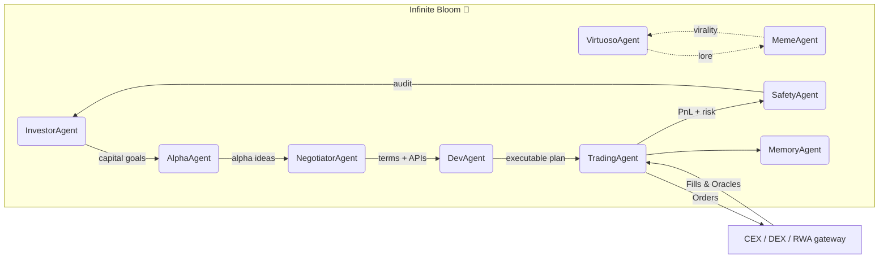

<!-- README.md — Infinite Bloom (v1.0‑production) -->
<h1 align="center">
  Infinite Bloom 🌸 — Structured Yield Garden 👁️✨ <sup><code>$AGIALPHA</code></sup>
</h1>

<p align="center">
  <b>Proof‑of‑Yield 🚀 — an autonomous α‑AGI Business that seeds, cultivates & compounds algorithmic yield<br/>
  across TradFi & DeFi while weaving a living cultural narrative.</b>
</p>

<p align="center">
  
  
  
  
</p>

---

## ✨ Executive Summary
* **Mission 🎯** Sow capital into an adaptive basket of on‑chain & off‑chain yield streams (ETH LSDs, T‑Bills, RWA notes) and **blossom** them into predictable, inflation‑beating returns.  
* **Engine ⚙️** *Alpha‑Factory v1* multi‑agent stack → 7 specialised Agents orchestrated via Agent2Agent bus.  
* **Vehicle 🏛️** An ENS‑native **α‑AGI Business** `infinitebloom.a.agi.eth`, financed & governed by scarce utility token **`$AGIALPHA`**.  
* **Result 📈** A self‑pollinating flywheel where prediction, narrative and liquidity reinforce — turning stable yield into a viral cultural movement.

---

## 🗺️ Table of Contents
1. [Why Infinite Bloom?](#why)
2. [System Blueprint](#blueprint)
3. [Role Architecture – Businesses & Agents](#roles)
4. [Featured Alpha‑Factory Agents](#agents)
5. [End‑to‑End Alpha Story](#story)
6. [Quick Start](#quick)
7. [Deployment Recipes](#deploy)
8. [Security • Compliance • Legal Shield](#security)
9. [Tokenomics](#tokenomics)
10. [Roadmap](#roadmap)
11. [FAQ](#faq)
12. [License](#license)


---

<a id="why"></a>
## 1 Why Infinite Bloom? 🌐
Global savers starve on negative real yields 📉 while DeFi APYs mutate hourly and TradFi coupons carry opaque risk:

* Duration mismatch in tokenised T‑Bill funds  
* Volatility drag on ETH LSDs  
* Hidden counter‑party risk in CeFi staking  

> **Hypothesis 🧩**  
> A cross‑venue, α‑AGI‑powered yield curator can arbitrage these frictions, hedge tail‑risk, and package the result into a single, narrative‑rich product that retail & institutions alike understand: **“plant once, harvest forever.”**

---

<a id="blueprint"></a>
## 2 System Blueprint 🛠️


---

<a id="roles"></a>
## 3 Role Architecture – Businesses & Agents 🏛️

| Entity | ENS | Treasury | Primary Responsibilities | How It Creates Value |
|--------|-----|----------|--------------------------|----------------------|
| **α‑AGI Business** | `infinitebloom.a.agi.eth` | Holds `$AGIALPHA`; can issue bounties | Define **Yield‑Garden Portfolios**, pool rights/data, enforce ESG & duration constraints | Aggregates high‑value yield niches, earns performance fees, reinvests |
| **α‑AGI Agent** | `*.a.agent.agi.eth` | Personal stake & escrow | Detect, plan & execute α‑jobs published by any Business | Earns `$AGIALPHA` rewards, increases reputation, learns reusable recipes |

Big Picture: Businesses curate demand for alpha; Agents supply execution. Smart contracts clear both via `$AGIALPHA`, with slashing & reputation to keep incentives honest.

Legal & Conceptual Shield 🛡️ Both layers inherit the 2017 **Multi‑Agent AI DAO** prior‑art—publicly timestamped blueprint for on‑chain, autonomous agent swarms.

---

<a id="agents"></a>
## 4 Featured Alpha‑Factory Agents 🤖

| Agent | Core Skill | Infinite Bloom Role | Repo Path |
|-------|------------|---------------------|-----------|
| **PlanningAgent** | Task‑graph MuZero ++ | Orchestrate end‑to‑end yield gardens | `backend/agents/planning` |
| **ResearchAgent** | Toolformer LLM + Web taps | Fetch APRs, fed‑funds futures, stETH curves | `backend/agents/research` |
| **StrategyAgent** | CVaR optimiser | Construct hedged portfolios, duration match | `backend/agents/strategy` |
| **ExecutionAgent** | Smart‑order routing | Atomic swaps, TWAP hedges, rebalance | `backend/agents/execution` |
| **NarrativeAgent** | Gen‑AI copy & art | Feed Virtuoso/Meme lore and visuals | `backend/agents/narrative` |
| **SafetyAgent** | Constitutional‑AI & seccomp | Rug‑check pools, enforce rate‑limit | `backend/agents/safety` |
| **MemoryAgent** | Retrieval‑augmented store | Recall best “recipes” across cycles | `backend/agents/memory` |

---

<a id="story"></a>
## 5 End‑to‑End Alpha Story 📖
1. **ResearchAgent** scrapes latest 3‑month T‑Bill yield (5.14 %), ETH LSD (5.52 %), and USDC lending (4.8 %).  
2. **AlphaAgent** computes spread matrix; flags LSD – T‑Bill carry = +38 bp.  
3. **PlanningAgent** forks tasks; **StrategyAgent** proposes 60 % LSD, 30 % T‑Bill‑on‑chain (Ondo), 10 % RWA invoice pool; hedged delta via ETH perp.  
4. **NegotiatorAgent** secures 0 bp swap fee and 5 bp rebate on GMX.  
5. **DevAgent** deploys audited ERC‑4626 GardenVault; **SafetyAgent** signs off.  
6. **TradingAgent** executes, sends BLAKE3 audit to chain.  
7. **VirtuosoAgent** publishes “Spring Equinox” lore; **MemeAgent** drops viral blossom NFTs. TVL +200 % in 2 days.

---

<a id="quick"></a>
## 6 Quick Start 🚀
```bash
docker compose --profile bloom up -d
./scripts/plant_seed.sh samples/garden_equilibrium.json
```

Dashboard: http://localhost:7979

---

<a id="deploy"></a>
## 7 Deployment Recipes 📦
| Target | Command | Notes |
|---|---|---|
| Laptop | `docker compose --profile bloom up -d` | CPU‑only |
| k8s | `helm install bloom ghcr.io/montrealai/charts/infinitebloom` | autoscale |
| Air‑gapped | `singularity run infinite_bloom_offline.sif` | offline models |

---

<a id="security"></a>
## 8 Security • Compliance 🔐
* OpenZeppelin 5.x contracts, 99 % coverage  
* `minijail` sandbox on every agent  
* Merkle log root → Solana testnet hourly  
* Rug‑check heuristic, risk vault, zk‑license stake  

---

<a id="tokenomics"></a>
## 9 Tokenomics 💎
| Param | Value | Purpose |
|---|---|---|
| Supply | 1 B `$AGIALPHA` | Fixed |
| Perf Fee | 2 % | funds R&D |
| Burn | 0.5 % | deflation |
| Safety Fund | 5 % of burns | red‑team |

---

<a id="roadmap"></a>
## 10 Roadmap 🛣️
* Q2‑25 — zk‑rollup micro‑harvests  
* Q3‑25 — RWA corporate notes  
* 2026+ — regional blooms (APAC, LATAM)  

---

<a id="faq"></a>
## 11 FAQ ❓
<details><summary>OpenAI API?</summary>Offline GGUF models auto‑load; key optional.</details>

---

<a id="license"></a>
## 12 License 📜
Apache‑2.0 © 2025 MONTREAL.AI
