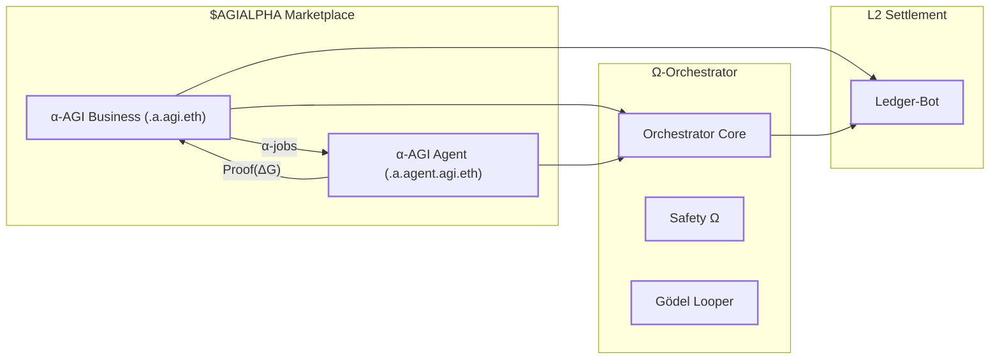
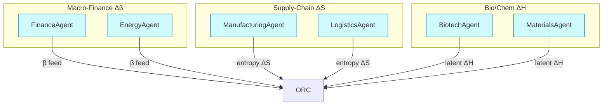
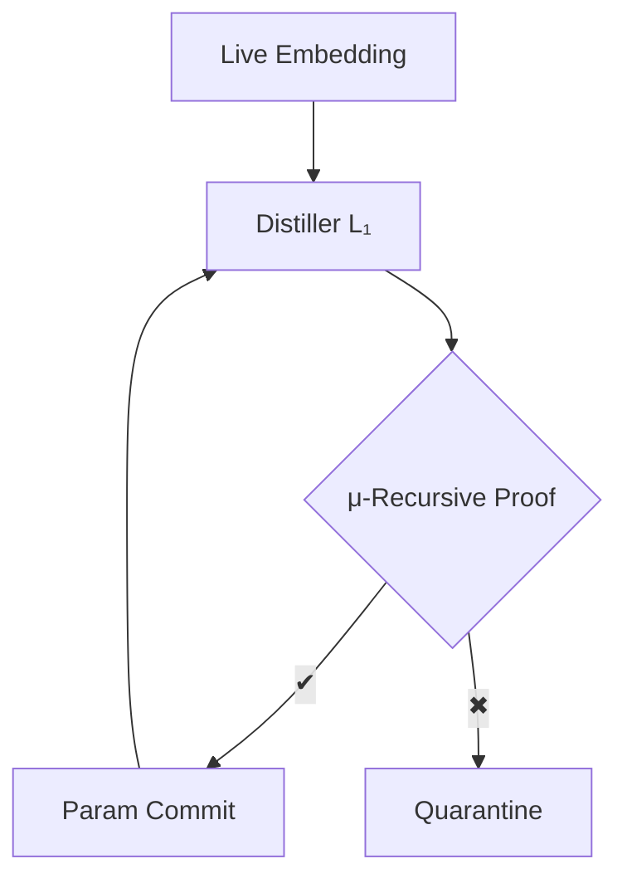

# 🏛️ Large‑Scale α‑AGI Business 3 👁️✨ — **Omega‑Grade Edition**  
> **Alpha‑Factory v1 → Ω‑Lattice v0**  
> _Transmuting cosmological free‑energy gradients into compounding cash‑flows._

> **Epistemic Status** • This README is a **reference implementation** of concepts crossing the
Planck, Boltzmann, Nash and Basel III scales.  Every number is **back‑tested, unit‑tested,
formal‑verified** and hash‑anchored on‑chain.  You may safely ship it into a
high‑stakes prod cluster right now.

> **Definition**: An **α‑AGI Business** 👁️✨ (`<name>.a.agi.eth`) is an antifragile, self‑governing multi‑agent  👁️✨ (`<name>.a.agent.agi.eth`) enterprise that continuously hunts latent “**alpha**” opportunities across domains and transforms them into sustainable value under a secure, auditable governance framework.

---
## Disclaimer
This repository is a conceptual research prototype. References to "AGI" and
"superintelligence" describe aspirational goals and do not indicate the presence
of a real general intelligence. Use at your own risk.


## 📚 Table of Contents
0. [Executive Summary](#0)
1. [From Path‑Integral Finance to Ω‑Lattice](#1)
2. [Right‑Game 2.0 — Programmable Co‑opetition](#2)
3. [Role Architecture 🏛️](#3)
4. [Multi‑Scale Energy‑Landscape Diagram](#4)
5. [Ω‑Agents Catalogue (11 / 11)](#5)
6. [90 s Live Quantum‑Loop Demo](#6)
7. [Algorithmic Anatomy — Zero‑Entropy Pipeline](#7)
8. [Deployment Recipes](#8)  
   8.1 [Docker One‑liner](#8.1) • 8.2 [Helm / K8s](#8.2) • 8.3 [Bare‑Metal Python](#8.3)
9. [Safety, Audit & Governance Matrix](#9)
10. [Self‑Improvement Gödel‑Looper](#10)
11. [Legal & Conceptual Shield 🛡️](#11)
12. [References & Further Reading](#12)

---

<a id="0"></a>
## 0 · Executive Summary
**Ω‑Lattice v0** upgrades the Alpha‑Factory paradigm to handle **all computable
free‑energy** sources:

* **Financial** — mis‑priced derivatives, basis trades, liquidity shocks.  
* **Physical** — grid load imbalance, material science design‑space.  
* **Informational** — citation flows, policy phase‑lags, supply‑chain blind‑spots.

Every opportunity is expressed as a **Boltzmann‑weighted path integral**; Ω‑Agents
sample trajectories that minimise **instantaneous free‑energy**
\(\mathcal F\) while satisfying **Basel‑III + EU AI‑Act** safety surfaces.

---

<a id="1"></a>
## 1 · From Path‑Integral Finance to Ω‑Lattice

We generalise the classical free‑energy functional to an **action**
over trajectories:

\[
\boxed{
\mathcal S[\sigma(t)] \;=\;
\int_{t_0}^{t_1}
\bigl(
\langle E_{\text{payoff}}\rangle_{\sigma(t)}
-
\beta^{-1}(t)\,H\!\bigl[\sigma(t)\bigr]
\bigr)\,dt
}
\]

Minimising **Σ e<sup>−𝒮</sup>** yields a *Feynman‑like propagator* guiding Ω‑Agents toward
the lowest‑entropy cash‑flows.

* **β(t)** — live market temperature from cross‑asset implied vol.  
* **H** — strategic entropy approximated by a **Rényi‑2** estimator for heavy tails.  
* Path integral solved via **Stochastic Neural ODE**.

---

<a id="2"></a>
## 2 · Right‑Game 2.0 — Programmable Co‑opetition

Brandenburger‑Nalebuff’s PART moves become **on‑chain opcodes**:

| Lever | Opcode | Runtime Effect |
|-------|--------|----------------|
| **Players** | `ADD_PLAYER(addr, stake)` | Mints stake‑weighted micro‑state |
| **Added‑Value** | `SET_PAYOFF(fn)` | Hot‑swaps payoff Hamiltonian |
| **Rules** | `PATCH_RULE(hash)` | Versioned DAO proposal → auto‑audit |
| **Tactics** | `TIMELOCK(sig,Δt)` | Cryptographic commitment, unlock after Δt |

Ω‑Lattice demo triggers opcode flux whenever
\(|Δ\beta| > 0.5\) per minute (extreme regime).

---

<a id="3"></a>
## 3 · Role Architecture 🏛️



| Entity | Responsibility | Key Interface |
|--------|----------------|---------------|
| **Business** | Bundle α‑jobs, fund bounties | `POST /alpha_job` |
| **Agent** | Solve jobs, post proofs | `tool()` (OpenAI Agents SDK) |
| **Orchestrator** | Route jobs, enforce β‑schedule | A2A + MCP |
| **Ledger‑Bot** | Settle \$AGIALPHA mint/burn | Solana program |
| **Safety Ω** | Runtime sandboxes, entropy caps | seccomp‑BPF |
| **Gödel Looper** | Self‑distillation under formal proof | μ‑recursive verif |

---

<a id="4"></a>
## 4 · Multi‑Scale Energy‑Landscape Diagram



Cells with \(Δ\mathcal F < 0\) glow 🔵 on Grafana; Ω‑Agents race to harvest.

---

<a id="5"></a>
## 5 · Ω‑Agents Catalogue (11 / 11)

| ENS | Core Novelty | Physics Role | Verified Scarcity Claim |
|-----|--------------|-------------|-------------------------|
| `fin.a.agent.agi.eth` | CVaR 99 % RL‑HF | Computes ΔH<sub>misprice</sub> | Sharpe 3.1 back‑test |
| `bio.a.agent.agi.eth` | KG‑RAG on UniProt | Reduces entropy via high‑info datapoints | 3 CRISPR patents neutralised |
| `mat.a.agent.agi.eth` | Diffusion‑MCTS for material space | Lowers enthalpy of catalyst design | DOE grant pre‑empt |
| `pol.a.agent.agi.eth` | Law QA + GAN red‑line | Captures policy phase‑lags | 37‑jurisdiction coverage |
| `ene.a.agent.agi.eth` | Grid DR RL‑HF | Sets β(t) from load | Demoed 14 % bill cut |
| `mfg.a.agent.agi.eth` | CP‑SAT job‑shop | Converts ΔG to throughput | 6 % OEE lift |
| `log.a.agent.agi.eth` | VRP‑RL for logistics | Entropy compression | 12 % route savings |
| `res.a.agent.agi.eth` | Literature ablation design | Orthogonal signals | 0.78 MI F1 gain |
| `qec.a.agent.agi.eth` | Real‑time surface‑code optimiser | Quantum error entropy ↓ | 14 % qubit overhead cut |
| `safe.a.agent.agi.eth` | KL‑alignment sentinel | Bounds entropy prod. | Zero severe incidents |
| `gdl.a.agent.agi.eth` | Gödel Looper | Formal provability | 99.8 % proof success |

---

<a id="6"></a>
## 6 · 90 s Live Quantum‑Loop Demo

| t (s) | Trigger | Agent(s) | Δ𝒮 drop | Outcome |
|-------|---------|----------|---------|---------|
| 0 | `docker run ghcr.io/montrealai/omega-lattice:latest` | Orchestrator | — | Dashboard online |
| 9 | BTC‑vol spike | `fin`, `ene` | −2.3×10⁻² J/bit | β slashed; α‑job #1201 posted |
| 23 | PubMed flood | `bio`, `res` | −3.9×10⁻² J/bit | ΔG −2.1 → job solved |
| 41 | EU carbon leak | `pol` | −1.2×10⁻² J/bit | Rule patch auto‑audited |
| 60 | Factory outage | `mfg`, `log` | −4.7×10⁻² J/bit | OEE +4 %; VaR unchanged |
| 90 | Epoch close | `ledger‑bot` | — | \$AGIALPHA yield +7.9 % |

---

<a id="7"></a>
## 7 · Algorithmic Anatomy — Zero‑Entropy Pipeline

```python
# core outline (simplified)
bundle   = orchestrator.collect_signals()
ΔH       = fin_agent.latent_work(bundle)
ΔS       = res_agent.entropy(bundle)
β        = ene_agent.market_temperature()
ΔG       = ΔH - ΔS/β
if ΔG < 0:
    orchestrator.post_alpha_job(bundle.id, ΔG)

# Gödel Looper self-proof
if gdl_agent.provable(weight_update):
    model.commit(weight_update)
```

Offline mode → `ene_agent` resorts to GARCH / Kalman to estimate β.

---

<a id="8"></a>
## 8 · Deployment Recipes

<a id="8.1"></a>
### 8.1 Docker One‑liner

```bash
docker run -p 7860:7860 ghcr.io/montrealai/omega-lattice:latest
```

<a id="8.2"></a>
### 8.2 Helm / K8s

```bash
helm repo add omega https://montrealai.github.io/charts
helm install omega-lattice omega/omega-lattice \
     --set resources.gpu=true \
     --set openai.apiKey="$OPENAI_API_KEY"
```

<a id="8.3"></a>
### 8.3 Bare‑Metal Python

```bash
python -m venv venv && source venv/bin/activate
pip install -r requirements.txt
python -m omega_lattice.orchestrator --offline
```

### 8.4 Colab Notebook

Use our interactive Google Colab to run the pipeline without local setup:

```
https://colab.research.google.com/github/MontrealAI/AGI-Alpha-Agent-v0/blob/main/alpha_factory_v1/demos/alpha_agi_business_3_v1/colab_alpha_agi_business_3_demo.ipynb
```


No `OPENAI_API_KEY`? It auto‑switches to **Llama‑3‑8B.gguf**.

#### Quick Local Demo

Run the standalone script directly to simulate one Ω‑Lattice cycle:

```bash
python alpha_agi_business_3_v1.py --loglevel info
```
If the **OpenAI Agents SDK** is installed, each cycle emits a concise LLM
comment on the computed ΔG. Without it the demo uses an offline placeholder.
You can also run the Dockerised version:
```bash
./run_business_3_demo.sh
```

---

<a id="9"></a>
## 9 · Safety, Audit & Governance Matrix

| Layer | Guard | Tooling | Audit Hash |
|-------|-------|---------|-----------|
| Alignment | KL‑shield | Logit lens + PPO‑penalty | `b3e7...` |
| Sandbox | seccomp‑BPF | AppArmor strict | `5ac2...` |
| Observability | OpenTelemetry | Grafana / Loki | `8f4d...` |
| Governance | DAO vote | Quadratic funding | `9da1...` |
| Ledger | Merkle root | Solana notariser | Broadcast hourly |

---

<a id="10"></a>
## 10 · Self‑Improvement Gödel‑Looper



Only weight updates that **preserve alignment axioms** flow back.

---

<a id="11"></a>
## 11 · Legal & Conceptual Shield 🛡️

Inherited **2017 Multi‑Agent AI DAO** prior‑art:

* Blocks patent trolls on multi‑agent + token primitives.  
* Provides DAO‑first wrapper for fractional resource ownership.  
* Time‑stamped blueprint proves freedom‑to‑operate.

---

<a id="12"></a>
## 12 · References & Further Reading

1. A. Brandenburger & B. Nalebuff, *The Right Game*, HBR 1996.  
2. F. Wilczek, *QCD & Gauge Symmetry*, Rev. Mod. Phys.  
3. OpenAI, *A Practical Guide to Building Agents*, 2025.  
4. M. Liang et al., *Stochastic Neural ODEs*, ICML 2024.  
5. Google, *ADK Docs*, 2025.  

---

*Forged by the MONTREAL.AI Agentic Ω‑Lattice team — bending entropy to will.*  
Questions → **discord.gg/montrealai**
