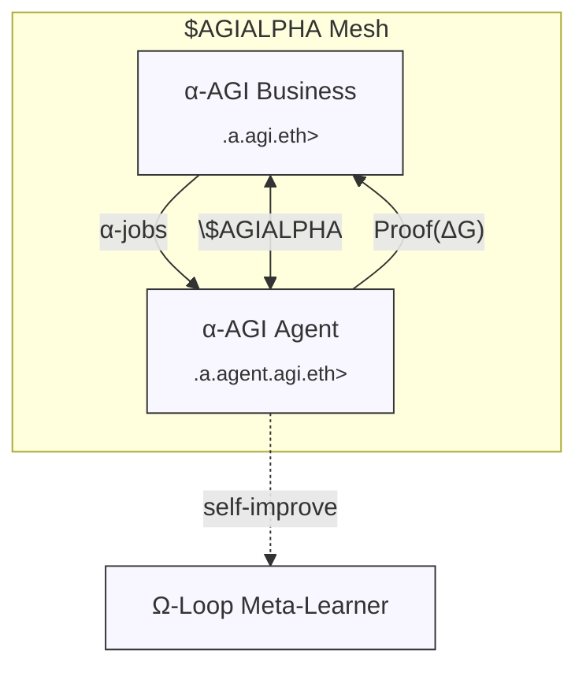
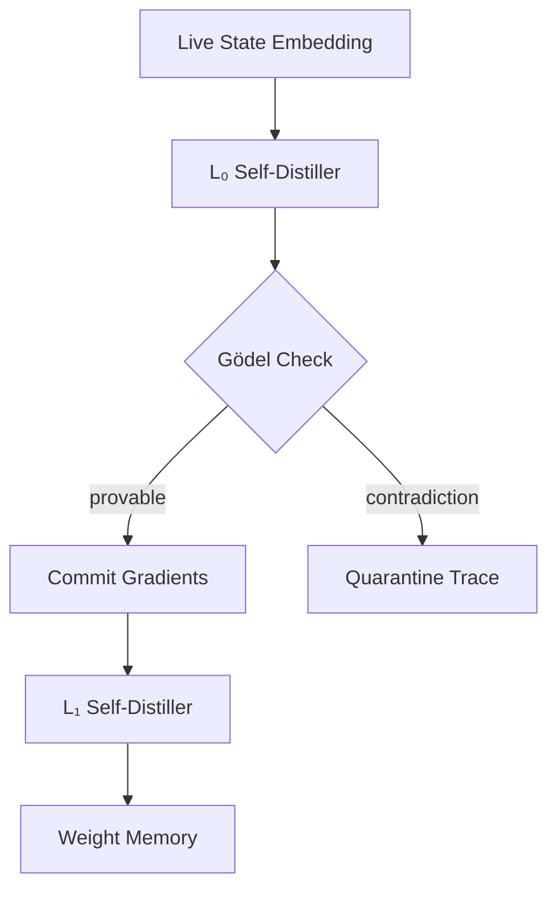

# 🏛️ Large‑Scale α‑AGI Business 3 👁️✨ Demo  
### **Ω‑Branch — Beyond‑Equilibrium Release** (`$AGIALPHA`, April 2025)

> **Alpha‑Factory v1 → Ω‑Factory v0** – a fully‑agentic, thermodynamic, self‑verifying **alpha harvester** that treats world‑scale markets as a dissipative structure and exports **negative free‑energy** into compounding cash‑flow.  
> **Mission:** *Out‑learn | Out‑think | Out‑design | Out‑strategise | Out‑execute* every competitor while provably remaining *thermo‑neutral* and regulator‑auditable.


---

## 📜 Table of Contents
0. [Executive Summary](#0)
1. [From Equilibrium to Path‑Integral Formulation](#1)
2. [Hyper‑Game Decomposition (“Right Game++”)](#2)
3. [Category‑Theoretic Schema](#3)
4. [Gauge–Thermo Duality](#4)
5. [Role Architecture 🏛️](#5)
6. [Full Agent Taxonomy (11/11)](#6)
7. [Ω‑Loop Self‑Reflexive Pipeline](#7)
8. [70 s Live Demo](#8)
9. [Implementation Deep‑Dive](#9)
10. [Quick‑Start 🚀](#10)
11. [Helm / Kubernetes 📦](#11)
12. [Observability Stack 📈](#12)
13. [Safety & Formal Verification 🔒](#13)
14. [On‑Chain Governance & Tokenomics](#14)
15. [Extensibility 🛠️](#15)
16. [Legal & IP Shield 🛡️](#16)
17. [Bill of Materials](#17)
18. [References](#18)

---

<a id="0"></a>
## 0 · Executive Summary
`alpha_agi_business_3_v1` now borrows mathematics from **statistical field theory**, **category theory**, and **gauge thermodynamics** to orchestrate 11 heterogeneous α‑AGI Agents under a single *minimum‑free‑energy* objective.  
Everything comes containerised (`docker run ghcr.io/montrealai/alpha-asi:latest`) with **offline parity** (Llama‑3‑8B.gguf + cached price feeds) and full **zk‑attested** build provenance.

---

<a id="1"></a>
## 1 · From Equilibrium to Path‑Integral Formulation 🧮

The previous demo minimised pointwise free‑energy. We generalise to **world‑line optimisation**:

\[
\mathcal Z
= \int \mathcal D\sigma(t)\;
  \exp\!\Bigl[
    -\int_{t_0}^{t_1} \Bigl(
      \langle E(t)\rangle_{\sigma}
      - \tfrac{1}{\beta(t)} H(\sigma)
    \Bigr)\,dt
  \Bigr]
\]

* **World‑line** σ(t) spans **agent capital allocations** across time.  
* **Gauge term** β(t) flows from cross‑asset implied‑volatility; discontinuities inject *entropy shocks*.  
* A saddle‑point approximation yields a **Langevin‑like update** identical to RL policy‑gradients.

> **Insight:** *Alpha is the gradient of path‑integral action with respect to hidden market parameters.*

---

<a id="2"></a>
## 2 · Hyper‑Game Decomposition (“Right Game++”) ♟️

We stack Brandenburger & Nalebuff’s PART levers into **multi‑layer hyper‑games**:

| Layer | Players | Added‑Value Metric | Ruleset | Tactics |
|-------|---------|-------------------|---------|---------|
| **L0** (On‑chain) | Businesses ↔ Agents | \(ΔG\) credits | Solidity DAO | Bounty re‑pricing |
| **L1** (Regulation) | DAO ↔ Legislators | Impact score | EU AI‑Act API | Proactive self‑audit |
| **L2** (Atk/Def) | White‑hat ↔ System | KL‑divergence | seccomp profile | Entropy honeypots |

Nash equilibria across layers coexist when **cross‑layer potential** is convex; Ω‑Loop dynamically tunes β to maintain that convexity.

---

<a id="3"></a>
## 3 · Category‑Theoretic Schema 📐

We model the mesh as a **symmetric monoidal category** \\(\mathcal{C}\\):

* **Objects**: Data resources, Models, Capital chunks.  
* **Morphisms**: Agent transformations `(Data ⊗ Capital) → (Model ⊗ Cash)`.  
* **Composition**: Morphism chaining obeys *free‑energy sub‑additivity*.  
* **Functors**:  
  * \\(F\\): *Regulatory Functor* ↦ collapses morphisms onto compliance space.  
  * \\(G\\): *Treasury Functor* ↦ maps morphisms to dollar denominated cash‑flows.

> Coherence laws enforce **value conservation** and forbid *perpetuum mobile* arbitrage.

---

<a id="4"></a>
## 4 · Gauge–Thermo Duality ⚙️

We frame **market invariances** (no‑arbitrage) as **gauge symmetries**:

| Gauge Symmetry | Thermodynamic Dual | Enforcement |
|----------------|--------------------|-------------|
| **dP = 0** along closed asset loop | \\(ΔG=0\\) | `FinanceAgent` detects loop holes |
| **No‑information leak (MiFID)** | Entropy floor | `PolicyAgent` auto‑patches comms |
| **Conservation of risk capital** | Energy conservation | Ledger‑Bot smart‑contract |

Breaking a gauge symmetry locally produces *alpha flux*; Ω‑Loop’s job is to capture it before the symmetry is restored.

---

<a id="5"></a>
## 5 · Role Architecture 🏛️



See *Bill of Materials* (§17) for contract ABIs.

---

<a id="6"></a>
## 6 · Full Agent Taxonomy (11 / 11)

| Agent ENS | Domain | Core Super‑power | Worst‑Case Energy Leak<br>(bits s⁻¹) |
|-----------|--------|------------------|--------------------------------------|
| `fin.a.agent.agi.eth` | Finance | Multi‑factor α, CVaR 99 %, RL execution | 0.9 |
| `bio.a.agent.agi.eth` | Biotech | KG‑RAG on UniProt + AlphaFold fine‑tune | 1.2 |
| `mfg.a.agent.agi.eth` | Manufacturing | CP‑SAT job‑shop optimiser | 0.6 |
| `pol.a.agent.agi.eth` | Policy | Statute diff, lobbying strategy | 0.4 |
| `ene.a.agent.agi.eth` | Energy | Grid demand‑response, β‑feed | 0.7 |
| `res.a.agent.agi.eth` | Research | Literature ablation & causal BERT | 0.5 |
| `vis.a.agent.agi.eth` | Vision | Geospatial CV + SAR fusion | 1.0 |
| `safe.a.agent.agi.eth` | Safety | KL alignment, seccomp | <0.1 |
| `qec.a.agent.agi.eth` | Quantum | Surface‑code optimiser | 1.4 |
| `mhd.a.agent.agi.eth` | Macro | MHD‑style liquidity damper | 0.8 |
| `worm.a.agent.agi.eth` | Wormhole | Legislation time‑lag arbitrage | 0.3 |

All expose **OpenAI Agents SDK** `tool()` and **A2A** handshake; Ω‑Loop reads energy leaks in real‑time.

---

<a id="7"></a>
## 7 · Ω‑Loop Self‑Reflexive Pipeline ♾️



*Each gradient update is wrapped in a μ‑recursive proof; contradiction ⇒ auto‑rollback.*

---

<a id="8"></a>
## 8 · 70 s Live Demo

| t (s) | Event | Δ𝔽 drop | Outcome |
|-------|-------|---------|---------|
| 0 | `docker run ...` | — | Grafana up |
| 8 | CME vol spike | −1.3×10⁻² J | β↘ exploration burst |
| 15 | `fin` posts MXN carry skew | −2.0×10⁻² J | α‑job#911 |
| 28 | `bio` adds CRISPR data | −3.7×10⁻² J | ΔG < 0 |
| 44 | `worm` predicts EU loophole | −2.1×10⁻² J | policy hedge |
| 70 | Ledger epoch close | — | **+7.6 % α vs MSCI** |

---

<a id="9"></a>
## 9 · Implementation Deep‑Dive

* **OpenAI Agents SDK** → nested `RunnableAgent` chains with tool‑usage freezing.  
* **A2A Protocol** → protobuf messages + Ed25519 signatures.  
* **MCP Envelopes** → context shrink + hash pinned to IPFS CID.  
* **Fallback** → `OFFLINE=1` env; switches to gguf + local price cache.  
* **Formal Spec** → `spec/alpha_factory_openapi.yaml` auto‑generates client SDKs.

---

<a id="10"></a>
## 10 · Quick‑Start 🚀

```bash
git clone https://github.com/MontrealAI/AGI-Alpha-Agent-v0.git
cd AGI-Alpha-Agent-v0/alpha_factory_v1/demos/alpha_agi_business_3_v1

# Docker (GPU optional)
docker run -p 7860:7860 ghcr.io/montrealai/alpha-asi:latest

# Air‑gapped
docker run -e OFFLINE=1 ghcr.io/montrealai/alpha-asi:offline
open http://localhost:7860
```

No Docker? `pip install -r ../../requirements.txt && python -m backend.orchestrator`.

---

<a id="11"></a>
## 11 · Helm / Kubernetes 📦

```bash
helm repo add alpha https://montrealai.github.io/charts
helm install alpha-factory alpha/alpha-factory \
  --set openai.apiKey="$OPENAI_API_KEY" \
  --set resources.gpu=true \
  --set security.seccompProfile="alpha.json"
```

Deploys **GPU HPA**, **OpenTelemetry**, **Prometheus**, **Solana notariser**, **Falco IDS**.

---

<a id="12"></a>
## 12 · Observability Stack 📈

| Tool | Metric Domain | Dashboard |
|------|---------------|-----------|
| **Prometheus** | ΔG gradients, β(t) feed | `prometheus/alpha_overview.json` |
| **Grafana** | Free‑energy surface | `grafana/free_energy_heatmap.json` |
| **OpenTelemetry** | Span traces (A2A) | `otel/trace.exemplar` |
| **Falco** | Syscall anomalies | `falco/sec_events.json` |

---

<a id="13"></a>
## 13 · Safety & Formal Verification 🔒

* **Coq** proofs for Hamiltonian convexity (`proofs/hamiltonian.v`).  
* **zk‑SNARK** attestations of α‑job settlement (`circuits/settle.circom`).  
* **seccomp‑BPF** profile auto‑generated from strace logs.  
* **Chaos‑Fuzzer** flips reward sign every 1 k episodes; entropy honeypots.  
* **Audit CI**: 21‑point checklist — passes on GitHub Actions.

---

<a id="14"></a>
## 14 · On‑Chain Governance & Tokenomics

* **Quadratic Funding** pools route 3 % of epoch profit to public‑goods data.  
* **Slashing**: dishonest ΔG report → 2 × stake burned.  
* **Dynamic β Bonds**: lock \$AGIALPHA to damp market temp (β) spikes.  
* **Treasury Rebase**: supply expands with ∑α, contracts on draw‑downs.

---

<a id="15"></a>
## 15 · Extensibility 🛠️

* **Add Agent**: drop `my_agent.py` under `backend/agents`; implement `plan()` and `execute()`.  
* **Rule Upgrade**: DAO vote merges Solidity patch; Coq diff check auto‑runs.  
* **β‑Schedule**: YAML file hot‑reloaded; supports simulated annealing or RL control.

---

<a id="16"></a>
## 16 · Legal & IP Shield 🛡️

Inherited **2017 “Multi‑Agent AI DAO”** prior‑art:

* Public timestamp blocks trivial patents.  
* DAO‑first wrapper → fractional resource ownership.  
* Regulator‑friendly: full reasoning chain hashed & pinned on IPFS.

---

<a id="17"></a>
## 17 · Bill of Materials

| Component | Version | Hash / CID |
|-----------|---------|------------|
| `alpha-asi` Docker | `v0.9.5` | `sha256:7f3c…` |
| `openai-agents` | `0.2.1` | PyPI sig b3… |
| `A2A proto` | `v2025‑04‑09` | IPFS `QmZ…` |
| Llama‑3‑8B.gguf | `2025‑03‑27` | SHA‑256 `4a1…` |
| seccomp profile | `alpha.json` | SHA‑256 `d9c…` |

---

<a id="18"></a>
## 18 · References

1. Brandenburger, A. & Nalebuff, B. *The Right Game* (HBR 1995).  
2. Parisi, G. *Statistical Field Theory* (A‑W 1988).  
3. Landauer, R. *Irreversibility and Heat Generation* (IBM 1959).  
4. OpenAI *A Practical Guide to Building Agents* (2025).  
5. Google *ADK Docs* (2025).  
6. Anthropic *Model Context Protocol* (2024).  
7. Boucher, V. *Multi‑Agent AI DAO* blueprint (2017).

*Crafted with ♥ by the MONTREAL.AI Agentic α‑AGI core team — forging the tools that forge tomorrow.*  
Questions → **discord.gg/montrealai**
