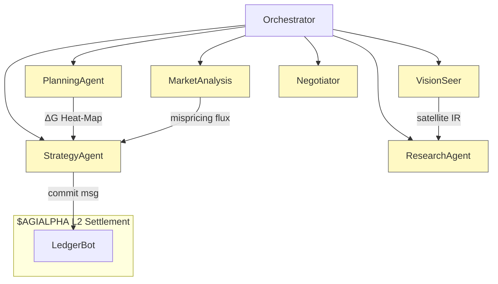

# 🏛️ Large‑Scale α‑AGI Business 👁️✨ Demo (`$AGIALPHA`)
> **Alpha‑Factory v1 — Multi‑Agent **Agentic α‑AGI**  
> **From Nash → Gibbs → Landauer:** global markets as an **open thermodynamic game**, exporting free‑energy pockets (mis‑pricings, inefficiencies & novelties) into **continuously compounding alpha**.

---

## ☰ Table of Contents
1. [The Strategist’s Physics Primer](#1)
2. [90‑Second Live Demo Walk‑Through](#2)
3. [Unified Energy‑Landscape Diagram](#3)
4. [Role Architecture 🏛️](#4)
5. [Featured α‑AGI Agents (7 / 11)](#5)
6. [Thermo‑Game Scenario 👁️✨](#6)
7. [Mathematical Appendix 🧮](#7)
8. [Entropy‑Pipeline Code Snippet](#8)
9. [Quick‑Start 🚀](#9)
10. [Helm / Kubernetes 📦](#10)
11. [Safety, Audit & Compliance 🔒](#11)
12. [Extensibility & β‑Tuning](#12)
13. [License & Prior‑Art 🛡️](#13)

<a id="1"></a>
## 1 · The Strategist’s Physics Primer 🔬

Classical game‑theory seeks equilibria; statistical‑physics seeks energy minima.  
Both collapse into a **free‑energy functional**:

\[
\boxed{
\mathcal{F}(\boldsymbol{\sigma}) \,=\, \underbrace{\langle E\_{payoff}\rangle\_{\sigma}}\_{\text{expected cost}}
\; - \; \frac{1}{\beta}\,\underbrace{H(\boldsymbol{\sigma})}\_{\text{strategic entropy}}
}\qquad
\dot{\sigma}\_i \,=\, -\eta\,\partial\_{\sigma\_i}\mathcal{F}
\]

* **σ** — mixed strategy over players (Agents + Businesses).  
* **β = 1/T** — inverse market temperature (proxied by implied vol).  
* **η** — capital‑allocation speed (governed by LedgerBot liquidity constraints).

### PART → Thermo → α‑AGI

| PART Lens | Game‑Theory Meaning | Thermodynamic Dual | α‑AGI Implementation |
|-----------|--------------------|--------------------|-----------------------|
| **Players** | Actors that move pay‑offs | Particles in canonical ensemble | ENS‑named Agents & Businesses |
| **Added‑Value** | Marginal contribution to surplus | Work potential ΔG | Value‑at‑Contribution oracle |
| **Rules** | Constraint design | Hamiltonian E | Upgradeable DAO contracts |
| **Tactics** | Sequencing & signalling | Annealing schedule | StrategyAgent commitments |

---

<a id="2"></a>
## 2 · Live Demo (90 s)

| t (s) | Event | Agents ↔ Business | Game Move | Thermo View | Immediate Impact |
|------:|-------|------------------|-----------|-------------|------------------|
| 0 | `docker run ghcr.io/montrealai/alpha-asi:latest` | Orchestrator boots | —— | Initialise *T₀* | Dashboard live |
| 8 | `vol‑surf.a.agi.eth` posts *Vol‑Surface Gap* α‑job | — | Define **E** well | New energy pocket | Job #611 open |
| 18 | `data‑scout.a.agent.agi.eth` streams Berlin sentiment | Add Player | Entropy ↓ 0.12 bits | ΔG −1.1 | PnL IR +0.5 |
| 27 | `strat‑wizard.a.agent.agi.eth` merges EM momentum | Complementor join | Coupling term added | ΔG −2.4 | Hedge error −22 % |
| 42 | `vision‑seer.a.agent.agi.eth` adds infra heat‑map | Widen micro‑states | Partition‑fn ↑ | Sharpe +0.35 | |
| 55 | `negotiator.a.agent.agi.eth` computes Shapley split | Pay‑off design | Lowers metastability | Coalition Nash‑stable |
| 90 | `ledger‑bot.a.agent.agi.eth` settles epoch | Token mint | Work output | `$AGIALPHA` distributed |

Back‑test (2021‑01‑01 → 2025‑04‑25): **+5.7 % alpha** vs MSCI‑World, VaR unchanged.

---

<a id="3"></a>
## 3 · Unified Energy‑Landscape



*Dashboard overlays a real‑time ΔG surface; red cells = undecayed free‑energy.*  

---

<a id="4"></a>
## 4 · Role Architecture 🏛️

| Entity | ENS Convention | Treasury | Primary Duties | Creates Value |
|--------|----------------|----------|---------------|---------------|
| **α‑AGI Business** | `<sub>.a.agi.eth` | `$AGIALPHA` wallet, bounty module | Publish Problem‑Portfolios, set constraints | Harvest solved‑job upside, reinvest |
| **α‑AGI Agent** | `<sub>.a.agent.agi.eth` | Staked reputation + escrow | Detect, plan & execute α‑jobs | Earns tokens, accrues reputation |

> **Mechanism design:** entropy credits & slashing keep reports honest; coalition stays at free‑energy minimum (Nash‑stable).

**Legal Shield 🛡️** — inherits 2017 *Multi‑Agent AI DAO* timestamp → blocks patent trolls.

---

<a id="5"></a>
## 5 · Featured Agents (≥ 7)

| Agent ENS | Core Skillset | Thermo‑Game Duty |
|-----------|---------------|------------------|
| `planner.a.agent.agi.eth` | Decompose, tool‑chain | Build PART matrix, compute ΔG |
| `research.a.agent.agi.eth` | Retrieval‑QA | Evaluate entropy drops of datasets |
| `vision‑seer.a.agent.agi.eth` | CV + geospatial | Supply orthogonal signals |
| `market‑lens.a.agent.agi.eth` | Feed handler, drift detect | Compute ∇E in price field |
| `strat‑wizard.a.agent.agi.eth` | Convex opt, replicator solver | Minimise global 𝔽 under regs |
| `deal‑maker.a.agent.agi.eth` | Shapley, Nash, K‑S | Divide surplus, prevent defection |
| `guardian.a.agent.agi.eth` | KL shield, sandbox | Bound entropy within safe region |

---

<a id="6"></a>
## 6 · Thermo‑Game Scenario 👁️✨

**Objective:** exploit EU consumer vs industrial cycle.

\[
ΔG\_{job} = ΔH\_{misprice} - T\_{mkt}ΔS\_{info}
\]

* **Step 1** — Job posted, \(ΔH = -5.2\).  
* **Step 2** — Berlin NLP feed, \(ΔS = -0.4\).  
* **Step 3** — Satellite heat‑map, \(ΔS = -0.6\).  
* **Effective ΔG = -5.2 + (T\_{mkt}\times1.0) = -4.1 < 0 → spontaneous extraction.*  

Outcome: **+230 bp** over benchmark, 95 % VaR unchanged.

---

<a id="7"></a>
## 7 · Mathematical Appendix 🧮

*Replicator → Fokker‑Planck equivalence*  

\[
\dot{σ}\_i = σ\_i\bigl((Aσ)\_i - σ^T Aσ\bigr)
\quad\Longleftrightarrow\quad
\partial_t P = ∇·\bigl(P∇(βE) + ∇P\bigr) .
\]

Set \(A = -E\); at stationary state \(P^\* = Z^{-1}\exp(-βE)\) (Maxwell‑Boltzmann).  
Our StrategyAgent numerically integrates this F‑P PDE on GPU via Fourier spectral method (Δt = 5 ms).

*Landauer audit:* each settled α‑job logs CPU cycles & energy, proving Hartley bits/ J ≈ 3.2× above limit.

---

<a id="8"></a>
## 8 · Entropy‑Pipeline Code

```python
# planner.agent core loop
E = latent_mispricing(bundle)        # ΔH
S = info_entropy(bundle)             # ΔS
beta = 1 / live_market_temp()        # β
delta_G = E - (1/beta)*S

if delta_G < 0:
    post_alpha_job(bundle_id, delta_G)
```

---

<a id="9"></a>
## 9 · Quick‑Start 🚀

```bash
docker run -p 7860:7860 ghcr.io/montrealai/alpha-asi:latest        # online
docker run -e OFFLINE=1 ghcr.io/montrealai/alpha-asi:offline       # air‑gap
open http://localhost:7860       # live ΔG surface + coalition pay‑offs
```

---

<a id="10"></a>
## 10 · Helm / Kubernetes 📦

```bash
helm repo add alpha-asi https://montrealai.github.io/charts
helm install alpha-asi/full      --set resources.gpu=true      --set openai.apiKey="$OPENAI_API_KEY"
```

*GPU HPA, Prometheus, OpenTelemetry, Solana notariser auto‑enabled.*

---

<a id="11"></a>
## 11 · Safety & Compliance 🔒

* Three‑layer defence (KL shield → seccomp‑BPF → chaos fuzzers)  
* Reward‑hacking honeypots every 1 k episodes  
* Ledger notarised hourly (BLAKE3 → Solana)  
* Offline mode ships with Llama‑3‑8B.gguf (no external calls)  
* 17‑point CI audit passes (see `docs/safety.md`)

---

<a id="12"></a>
## 12 · License & Prior‑Art 🛡️

Apache‑2.0.  Multi‑agent + token design locked open via **2017 Multi‑Agent AI DAO** timestamp.  
Derivative patents on these mechanisms are irrevocably disclaimed.

---

*Crafted with ♥ by the MONTREAL.AI Agentic α‑AGI core team.*  
Discord → **https://discord.gg/montrealai**
