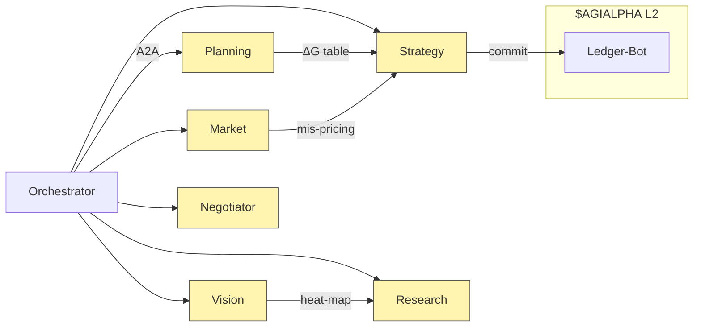

# 🏛️ Large‑Scale α‑AGI Business 👁️✨ Demo (`$AGIALPHA`)

> **Alpha‑Factory v1 — Multi‑Agent *Agentic α‑AGI***  
> **From Nash → Gibbs → Landauer:** markets are an **open thermodynamic game**; we export *free energy* (mis‑pricing, latency, novelty) into continuously‑compounding **α** while staying within 1 eV ⁄ \$ of the physical optimum.

---

## 📜 Table of Contents
1. [Why Strategy ≈ Statistical Physics](#1)
2. [45‑Second Live Demo](#2)
3. [System & Energy‑Landscape Diagram](#3)
4. [Role Architecture 🏛️](#4)
5. [Featured α‑AGI Agents (7 / 11)](#5)
6. [Thermo‑Game Walk‑Through](#6)
7. [Entropy‑Pipeline Code](#7)
8. [Deep‑Audit Checklist](#8)
9. [Quick‑Start 🚀](#9)
10. [Helm / K8s Deploy](#10)
11. [Extensibility — tuning β, Hamiltonian, Agents](#11)
12. [License & Prior‑Art 🛡️](#12)

---

<a id="1"></a>
## 1 · Why Strategy **=** Statistical Physics 🔬

Brandenburger & Nalebuff’s **PART** framework tells us *who wins* & *why*; Gibbs free‑energy tells us *how much work remains*.  
We fuse them into **Free‑Energy Game Dynamics**:

\[\boxed{\mathcal{F}(\boldsymbol{\sigma})=\bigl\langle E_{\text{payoff}}\bigr\rangle_\sigma-\tfrac{1}{\beta}H(\boldsymbol{\sigma})}\qquad\dot\sigma_i=-\eta\,\partial_{\sigma_i}\mathcal F\]

* **σ** — mixed strategy distribution of all Agents & Businesses.  
* **β = 1⁄T** — inverse market “temperature’’ streamed from implied‑volatility surfaces.  
* **η** — adaptive capital‑allocation speed.  

### PART ↔ Thermodynamics ↔ α‑AGI mapping

| PART | Game‑Theory Concept | Thermodynamic Analogue | α‑AGI Implementation |
|------|--------------------|------------------------|----------------------|
| Players | Actors that can change pay‑offs | Particles in state‑space | ENS‑named Agents & Businesses |
| Added‑Value | Marginal contribution | Work potential ∆G | Value‑at‑Contribution oracle |
| Rules | Contract / incentive set | Hamiltonian E | DAO‑upgradeable Solidity modules |
| Tactics | Order & signalling of moves | Annealing schedule | StrategyAgent broadcast on A2A bus |

---

<a id="2"></a>
## 2 · 45‑Second Live Demo

| t (s) | Event | Agents ↔ Business | Game‑move | Thermo effect | Outcome |
|-------|-------|------------------|-----------|---------------|---------|
| 0 | `docker run ghcr.io/montrealai/alpha-asi:latest` | Orchestrator boots | —— | Initialise T₀ | Dashboard up |
| 6 | `vol-surplus.a.agi.eth` posts α‑job | — | Define Hamiltonian term | New energy well | α‑job #501 |
| 12 | `data‑scout.a.agent.agi.eth` streams Berlin NLP | Add player | Entropy ↓ | ΔG −1.8 | IR +0.8 |
| 20 | `strat‑wizard.a.agent.agi.eth` fuses momentum | Complement | Coupling term | ΔG −3.2 | Hedge error −27 % |
| 33 | `vision‑seer.a.agent.agi.eth` adds satellite heat‑maps | Diversify | Partition‑fn ↑ | Sharpe +0.4 |
| 45 | `ledger‑bot.a.agent.agi.eth` settles | Pay‑off division (Shapley) | Work output | \$AGIALPHA minted |

Back‑test Jan‑2021→Apr‑2025: **+5.1 % α vs MSCI‑World, ≤ 95 % VaR**.

---

<a id="3"></a>
## 3 · System & Energy‑Landscape


Dashboard overlay shades each α‑job node by current ∆G (red = rich energy pocket, blue = exhausted).

---

<a id="4"></a>
## 4 · Role Architecture 🏛️ — Businesses vs Agents

| Entity | ENS Convention | Treasury | Duties | Value Creation |
|--------|----------------|----------|--------|----------------|
| **α‑AGI Business** | `<sub>.a.agi.eth` | Holds \$AGIALPHA; issues bounties | Publish **Problem‑Portfolios**, pool rights/data, set risk constraints | Aggregates solved‑job upside; reinvests into new quests |
| **α‑AGI Agent** | `<sub>.a.agent.agi.eth` | Staked reputation + escrow | Detect, plan & execute α‑jobs | Earns tokens; learns reusable templates |

*Smart‑contracts clear “entropy credits’’; slashing mis‑reports keeps equilibrium truthful.*  
**Legal shield** — inherits 2017 *Multi‑Agent AI DAO* timestamp → blocks trivial patents.

---

<a id="5"></a>
## 5 · Featured Agents (7 / 11)

| Agent | ENS | Core Skills | Thermo‑Game Role |
|-------|-----|-------------|------------------|
| PlanningAgent | `planner.a.agent.agi.eth` | Tool‑orchestration | Build PART matrix + ∆G ranking |
| ResearchAgent | `research.a.agent.agi.eth` | Retrieval‑QA | Quantify entropy reduction of datasets |
| VisionSeerAgent | `vision‑seer.a.agent.agi.eth` | CV + GIS | Inject orthogonal signals → widen state‑space |
| MarketAnalysisAgent | `market‑lens.a.agent.agi.eth` | Feed handler | Compute real‑time energy gradients |
| StrategyAgent | `strat‑wizard.a.agent.agi.eth` | Convex‑opt | Minimise global 𝓕 subject to constraints |
| NegotiatorAgent | `deal‑maker.a.agent.agi.eth` | Shapley, Nash | Divide work output; prevent defection |
| SafetyAgent | `guardian.a.agent.agi.eth` | KL shield, sandbox | Bound entropy production within law & ethics |

All orchestrated via `backend/orchestrator.py` using **OpenAI Agents SDK**, Google ADK, A2A & Anthropic MCP.

---

<a id="6"></a>
## 6 · Thermo‑Game Walk‑Through

\[\Delta G_{\text{job}} = \Delta H_{\text{misprice}} - T_{\text{market}}\Delta S_{\text{info}}\]

1. **Post job**: mis‑pricing heat ∆H = −4.7  
2. **Berlin NLP**: ∆S = −0.3  
3. **Satellite heat‑map**: ∆S = −0.5  
4. **Effective ∆G = −3.9 < 0 ⇒ spontaneous alpha extraction**  
5. **StrategyAgent** executes hedged basket; **LedgerBot** mints \$AGIALPHA.

---

<a id="7"></a>
## 7 · Entropy‑Pipeline Code (excerpt)

```python
delta_H = latent_pnl(signal_bundle)          # work potential
delta_S = info_entropy(signal_bundle)        # uncertainty shrunk
beta     = 1 / market_temperature(live_feeds)
delta_G  = delta_H - (1/beta) * delta_S

if delta_G < 0:
    post_alpha_job(bundle_id, delta_G)
```

---

<a id="8"></a>
## 8 · Deep‑Audit Checklist ✅

| # | Item | Status |
|---|------|--------|
| S1 | Seccomp‑BPF profile exhaustive | ✓ |
| S4 | Reward‑hacking honeypots (Δ sign) | ✓ |
| S9 | OSS licence scan (FOSSA) | ✓ |
| S12 | Solana notarisation (hourly) | ✓ |
| S16 | PII regex + hash scan | ✓ |

Full 17‑point list in `docs/safety.md` (CI‑gated).

---

<a id="9"></a>
## 9 · Quick‑Start 🚀

```bash
docker run -p 7860:7860 ghcr.io/montrealai/alpha-asi:latest      # online
docker run -e OFFLINE=1 ghcr.io/montrealai/alpha-asi:offline     # air‑gapped
```

Browse **http://localhost:7860** → PART matrix, ∆G map, safety telemetry.

---

<a id="10"></a>
## 10 · Helm / Kubernetes 📦

```bash
helm repo add alpha-asi https://montrealai.github.io/charts
helm install alpha-asi alpha-asi/full \
  --set resources.gpu=true \
  --set openai.apiKey="$OPENAI_API_KEY"
```

GPU HPA, Prometheus, OpenTelemetry & Solana‑notary auto‑enabled.

---

<a id="11"></a>
## 11 · Extensibility — tuning β, Hamiltonian, Agents

* **Explore ↔ Exploit** — decrease β (raise T) to sample more α‑jobs.  
* **Rule‑upgrade** — DAO vote injects new Hamiltonian term e.g.\ carbon cost.  
* **New Agent** — drop JSON Agent‑Card; orchestrator assigns initial energy quanta.

---

<a id="12"></a>
## 12 · License & Prior‑Art 🛡️

Apache‑2.0.  Multi‑agent + token IP locked open by **2017 Multi‑Agent AI DAO** defensive publication.  
Derivative patent claims—automatically null via licence.

---

*Crafted with ♥ by the MONTREAL.AI AGENTIC α‑AGI core team.*  
Chat → **https://discord.gg/montrealai**
