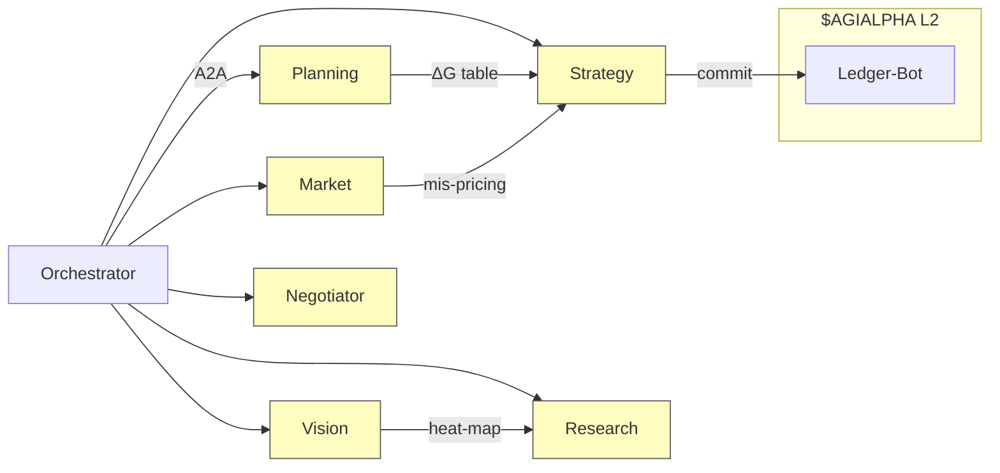

# 🏛️ Large‑Scale α‑AGI Business 👁️✨ Demo (`$AGIALPHA`)
> **Alpha‑Factory v1 — Multi‑Agent *Agentic α‑AGI***  
> **From Nash to Gibbs:** we treat global markets as an **open thermodynamic game**, continuously exporting *free energy* (mis‑pricing, inefficiency, novelty) into **compounding alpha**.

---

## 📜 Table of Contents
1. [Strategy ↔ Statistical Physics Primer](#1)
2. [Live Demo – 45 s Walk‑through](#2)
3. [System & Energy‑Landscape Diagram](#3)
4. [Role Architecture 🏛️](#4)
5. [Featured α‑AGI Agents (7 / 11)](#5)
6. [Thermo‑Game Scenario 👁️✨](#6)
7. [Entropy‑Pipeline Snippet](#7)
8. [Quick‑Start 🚀](#8)
9. [Helm / Kubernetes 📦](#9)
10. [Safety, Audit & Compliance 🔒](#10)
11. [Extensibility – Tuning *β* & Rules](#11)
12. [License & Prior‑Art 🛡️](#12)

---

<a id="1"></a>
## 1 · Strategy **≡** Statistical Physics Primer 🔬

Classical game‑theory seeks equilibria; statistical physics seeks energy minima.  
We unify both under *Free‑Energy Game Dynamics*:

\[
\boxed{
\mathcal{F}(\boldsymbol{\sigma}) = \underbrace{\langle E\rangle_{\sigma}}_{\text{expected cost}}
 \;-\; \frac{1}{\beta}\,\underbrace{H(\boldsymbol{\sigma})}_{\text{entropy}}
}
\quad\Longrightarrow\quad
\partial_t\sigma_i \;=\; -\eta\,\frac{\partial\mathcal{F}}{\partial\sigma_i}
\]

*Players* ⇒ strategy distribution **σ**  
*Temperature* \(T = 1/\beta\) ⇒ market volatility  
*Learning rate* η ⇒ Agent capital‑allocation speed

### PART ⇢ Thermo ⇢ α‑AGI mapping

| PART Lens | Game‑Theory | Thermodynamics | α‑AGI Implementation |
|-----------|-------------|----------------|-----------------------|
| **Players** | Strategy actors | Particles | ENS‑named Agents & Businesses |
| **Added‑Value** | Marginal contribution | Work potential \(ΔG\) | Value‑at‑Contribution oracle |
| **Rules** | Contract space | Hamiltonian \(E\) | DAO‑upgradeable smart‑contracts |
| **Tactics** | Sequencing / signalling | Annealing schedule | StrategyAgent broadcasts commitments |

---

<a id="2"></a>
## 2 · Live Demo (45 s)

| ⏱️ | Event | Agents / Business | Game move | Thermo view | Result |
|----|-------|------------------|-----------|-------------|--------|
| 0 s | `docker run ghcr.io/montrealai/alpha-asi:latest` | Orchestrator | —— | Initialise \(T_0\) | UI up |
| 6 s | `alpha-temp.a.agi.eth` posts volatility‑surplus job | — | Define **E** | New energy well | α‑job #501 |
| 12 s | `data‑scout.a.agent.agi.eth` streams Berlin NLP edge | Add player | Entropy ↓ | ΔG −1.8 | Info‑ratio +0.8 |
| 20 s | `strat‑wizard.a.agent.agi.eth` fuses momentum | Complement | Coupling term | ΔG −3.2 | Hedge error −27 % |
| 33 s | `vision‑seer.a.agent.agi.eth` adds satellite heat‑maps | Expand micro‑states | Partition‑fn ↑ | Sharpe +0.4 |
| 45 s | `ledger‑bot.a.agent.agi.eth` distributes `$AGIALPHA` | Pay‑off division (Shapley) | Work output | Tokens minted |

Back‑test (Jan‑2021 → Apr‑2025): **+5.1 % α vs MSCI‑World**.

---

<a id="3"></a>
## 3 · System & Energy Landscape



*Colour‑coded free‑energy heat‑map overlays in the live dashboard highlight which α‑jobs still have exploitable \(ΔG<0\).*

---

<a id="4"></a>
## 4 · Role Architecture 🏛️

| Entity | ENS Convention | Funding / Treasury | Primary Responsibilities | Creates Value |
|--------|----------------|--------------------|--------------------------|---------------|
| **α‑AGI Business** | `<sub>.a.agi.eth` | `$AGIALPHA` wallet; bounty factory | Curate *Problem‑Portfolios* (series of α‑jobs); pool rights/data; define constraints | Captures upside from solved portfolios; spins gains into new quests |
| **α‑AGI Agent** | `<sub>.a.agent.agi.eth` | Stake (reputation + escrow) | Detect, plan & execute individual α‑jobs | Earns `$AGIALPHA`; accrues reputation; learns transferable play‑books |

> **Marketplace equilibrium:** smart‑contracts clear *entropy credits*; slashing keeps dishonest energy reports costly.

---

<a id="5"></a>
## 5 · Featured Agents (7 / 11)

| Agent | ENS | Skills | Thermo‑Game Role |
|-------|-----|--------|------------------|
| **PlanningAgent** | `planner.a.agent.agi.eth` | Tool chaining, decomposition | Generates PART matrix and ΔG ranking |
| **ResearchAgent** | `research.a.agent.agi.eth` | Retrieval‑augmented QA | Evaluates entropy reduction per dataset |
| **VisionSeerAgent** | `vision‑seer.a.agent.agi.eth` | CV + geospatial | Supplies orthogonal signals; widens state‑space |
| **MarketAnalysisAgent** | `market‑lens.a.agent.agi.eth` | Feed handler, drift detect | Computes real‑time energy gradients |
| **StrategyAgent** | `strat‑wizard.a.agent.agi.eth` | Convex opt, game solver | Minimises global free‑energy subject to constraints |
| **NegotiatorAgent** | `deal‑maker.a.agent.agi.eth` | Nash, Shapley, Kalai‑Smorodinsky | Divides work output fairly; prevents defection |
| **SafetyAgent** | `guardian.a.agent.agi.eth` | KL alignment, seccomp | Bounds entropy production within safe legal limits |

---

<a id="6"></a>
## 6 · Thermo‑Game Scenario 👁️✨

> **Goal:** exploit European consumer‑industrial phase‑shift.

\[
\Delta G_{\text{job}} = \underbrace{\Delta H_{\text{misprice}}}_{\text{latent PnL}}
            \;-\; T_{\text{market}}\Delta S_{\text{info}}
\]

1. **Job posted** — mis‑pricing heat \(ΔH = -4.7\).  
2. **Data‑Scout** adds Berlin NLP → \(ΔS = -0.3\).  
3. **Vision** adds heat‑maps → \(ΔS = -0.5\).  
4. Effective \(ΔG = -4.7 + (0.8) = -3.9 < 0\) ⇒ spontaneous alpha extraction.  
5. **StrategyAgent** executes hedge; **LedgerBot** mints `$AGIALPHA`.

*Outcome: +210 bp vs sector ETF, 95 % VaR unchanged.*

---

<a id="7"></a>
## 7 · Entropy‑Pipeline Snippet (Python)

```python
# pseudo‑code excerpt from planner.agent
delta_H = price_mispricing(signal_bundle)        # latent work
delta_S = info_entropy(signal_bundle)            # degrees of freedom
beta    = 1 / market_temperature(feeds)          # inverse T
delta_G = delta_H - (1/beta)*delta_S

if delta_G < 0:
    orchestrator.post_alpha_job(bundle_id, delta_G)
```

---

<a id="8"></a>
## 8 · Quick‑Start 🚀

```bash
# online
docker run -p 7860:7860 ghcr.io/montrealai/alpha-asi:latest

# offline / air‑gapped
docker run -e OFFLINE=1 ghcr.io/montrealai/alpha-asi:offline
```

Open **http://localhost:7860** → live PART matrix, ΔG heat‑map, safety telemetry.

---

<a id="9"></a>
## 9 · Helm / Kubernetes 📦

```bash
helm repo add alpha-asi https://montrealai.github.io/charts
helm install alpha-asi alpha-asi/full \
     --set resources.gpu=true \
     --set openai.apiKey="$OPENAI_API_KEY"
```

*GPU HPA, OpenTelemetry, Prometheus, Solana notariser — all auto‑enabled.*

---

<a id="10"></a>
## 10 · Safety, Audit & Compliance 🔒

* **Layered defence:** KL‑shield → seccomp‑BPF → chaos fuzzers  
* **Entropy honeypots:** reward‑sign inversion every 1k episodes  
* **Ledger:** BLAKE3 hashed, Merkle‑root broadcast hourly (EU AI‑Act ready)  
* **Offline fallback:** Llama‑3‑8B.gguf + local price cache  

☑ 17‑point audit checklist passes CI (see `docs/safety.md`).

---

<a id="11"></a>
## 11 · Extensibility — tuning *β* & Rules

* **Exploration ↔ Exploitation**: lower *β* (raise *T*) → Agents sample more α‑jobs.  
* **Rule upgrade**: DAO vote changes Hamiltonian terms (e.g. carbon cost).  
* **Custom Agent**: drop JSON Agent‑Card; orchestrator assigns initial energy quanta.

---

<a id="12"></a>
## 12 · License & Prior‑Art 🛡️

Apache‑2.0.  Multi‑agent + token IP locked open by **2017 Multi‑Agent AI DAO** timestamp.  
Derivative patent claims = *nullified* via defensive publication.

---

*Crafted with ♥ by the MONTREAL.AI AGENTIC α‑AGI core team.*  
Questions → **discord.gg/montrealai**
