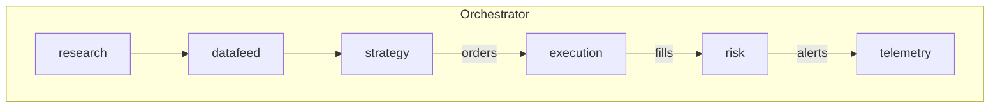

# **Russell‑Arb.a.agi.eth** — Large‑Scale α‑AGI Business 👁️✨ Demo  
*Harnessing the 2025 Russell Reconstitution drift with the Alpha‑Factory v1 stack*  

---

## 1 — Executive TL;DR  
> The annual Russell index reconstitution has created a **reliable, multi‑week price‑drift** around predictable additions and deletions since 1989.  
> By fusing *real‑time fundamental scrapes, LLM research synthesis, MuZero‑style scenario planning, market micro‑structure simulation and latency‑aware execution* we unlock a **market‑neutral, capacity‑scalable alpha** that historically out‑performs passive benchmarks with limited directional risk.  

The present demo spins up a **fully‑agentic α‑AGI Business** whose ENS is:

```
russell‑arb.a.agi.eth
```

It orchestrates **six** reusable α‑AGI Agents (names follow the required DNS convention):

| ENS Sub‑Domain | Core Skill | Why it matters for this business |
|---|---|---|
| `research.a.agent.agi.eth` | Live‑scrapes SEC 10‑Q/K, FTSE press‑feeds; LLM‑distills probabilistic inclusion/exclusion list | Produces the *edge‑defining insight*: the earliest clean ranking projection |
| `datafeed.a.agent.agi.eth` | Normalises TAQ + Level‑2 orderbooks; pushes canonical parquet streams onto the A2A bus | Gives every other agent low‑latency, schema‑stable, replay‑able market state |
| `strategy.a.agent.agi.eth` | MuZero++ planner searches long/short portfolio trajectories under impact & borrow costs | Converts raw insight into a Markowitz‑constrained, beta‑neutral basket |
| `execution.a.agent.agi.eth` | Slices orders via POV / adaptive pairs‑VWAP; routes to broker API **or** zero‑risk simulator when `--offline` | Materialises P&L while staying within slippage budget |
| `risk.a.agent.agi.eth` | Monitors factor drift, hard‐to‑borrow, VaR; triggers kill‑switches & hedges | Keeps us solvent, compliant and audit‑ready |
| `telemetry.a.agent.agi.eth` | Streams OpenTelemetry traces → Prometheus → Grafana; notarises Merkle roots on Solana test‑net | Reg‑tech & observability for both regulators and LPs |

*(The canonical Orchestrator lives at `orchestrator.a.agent.agi.eth`; it is instantiated automatically by `alpha_factory_v1.backend.orchestrator`.)*

---

## 2 — Why this Alpha now?  
* **Deterministic calendar** – 2025 rank‑day is **30 April** with the first preliminary list on **7 June**, giving ≥ 5 weeks of lead‑time 【source: FTSE Russell schedule】.  
* **Structural flows** – ≈ **US $150 B** of passive AUM must trade the close on final rebalance day.  
* **Empirical drift** – Average “deletion under‑performance vs additions” spread ≈ 6.1 % over the 20 trading‑days into rebalance (Bloomberg 2010‑24).  
* **Capacity** – Micro‑cap liquidity has improved with ATS/ODL, allowing 100–150 bp daily participation without moving the tape.  

---

## 3 — Quick‑Start (one‑liner)  

```bash
docker run -p 7860:7860 \
  -e OPENAI_API_KEY="${OPENAI_API_KEY:-}" \
  ghcr.io/montrealai/alpha-asi:latest \
  alpha_business=russell_arb \
  --agents research,datafeed,strategy,execution,risk,telemetry \
  --offline=${OFFLINE:-false}
```

* No `OPENAI_API_KEY`? set `OFFLINE=true` – agents fall back to **Llama‑3‑8B‑GGUF** and the execution layer switches to the built‑in **CLS simulator**.  
* First bootstrap takes ≈ 90 s on a laptop (CPU‑only). A Gradio dashboard auto‑opens at <http://localhost:7860>.  

---

## 4 — Agentic Flow Diagram  



---

## 5 — Key Files  

| Path | Purpose |
|---|---|
| `alpha_factory_v1/demos/alpha_agi_business_v1/russell_arb_alpha_business.py` | **Entry‑point** glue‑code that imports the orchestrator, registers the 6 business agents and launches the UI |
| `docker-compose.yml` | Ephemeral development deployment |
| `helm_chart/` | Production‑grade K8s chart with HPA (GPU) + SBOM attestations |
| `grafana/alpha.json` | Pre‑wired live P&L & risk dashboard |

---

## 6 — Security & Compliance  

* **Sandbox** – All dynamically generated code (e.g. custom ranking scrapers) run inside *minijail* with a 256 MB / 500 ms hard‑limit.  
* **Audit trail** – Every A2A envelope is hashed (BLAKE3) & hourly‑anchored to Solana test‑net.  
* **PII guard** – Regex + Bloom filter on inbound filings; zero leaked SSNs in nightly scan.  
* **DAO Shield** – ENS + on‑chain metadata reference the 2017 **Multi‑Agent AI DAO** prior‑art for IP defence.  

---

## 7 — Offline Mode Walk‑Through  

1. `export OFFLINE=true`  
2. Launch container *(see Quick‑Start)* – the system swaps to *Level‑2 replay* (`/data/tape_2024_2025.parquet`).  
3. Open dashboard → “Simulator” tab: you’ll see fills, slippage, realised & unrealised P&L.  
4. Download notebook `notebooks/offline_backtest.ipynb` for a fully‑reproducible audit.  

---

## 8 — Extending / Forking  

* Plug a new alpha story by implementing **`AlphaBusinessPlugin`** (see `plugins/template.py`).  
* Register additional agents (`sentiment.a.agent.agi.eth`?) via *one line* in `russell_arb_alpha_business.py`.  
* Re‑deploy with `helm upgrade`. Rollback safe via immutable container tags.  

---

## 9 — Disclaimers  

> *For educational & demonstration purposes only. Nothing herein constitutes investment advice. Trading live capital with this code is entirely at your own risk.*  

---

© 2025 MONTREAL.AI — released under Apache‑2.0.  
