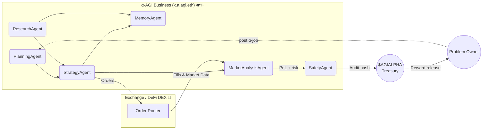

<!-- README.md — Large‑Scale α‑AGI Business Demo (v1.0‑production) -->
<h1 align="center">
 Large‑Scale α‑AGI Business 👁️✨ <sup><code>$AGIALPHA</code></sup>
</h1>

<p align="center">
 <b>Proof‑of‑Alpha 🚀 — an autonomous business entity that finds, exploits & compounds live market alpha<br/>
 using <em>Alpha‑Factory v1</em> multi‑agent stack, on‑chain incentives & antifragile safety‑loops.</b>
</p>

<p align="center">
 
 
 
 
</p>

---

## ✨ Executive Summary 
* **Mission 🎯** Continuously harvest <code>alpha</code> across <kbd>equities • commodities • crypto • supply‑chains • life‑sciences</kbd> and convert it into compounding value — automatically, transparently, safely. 
* **Engine ⚙️** *Alpha‑Factory v1 👁️✨* → six specialised agents orchestrated via **A2A** message‑bus (see §4). 
* **Vehicle 🏛️** A legally‑shielded **α‑AGI Business** (`x.a.agi.eth`) governed & financed by scarce utility token **`$AGIALPHA`**. 
* **Result 📈** A self‑reinforcing fly‑wheel that **Out‑learn • Out‑think • Out‑design • Out‑strategise • Out‑execute** the market, round‑after‑round.

---

## 🗺️ Table of Contents
1. [Why an α‑AGI Business?](#why)
2. [System Blueprint](#blueprint)
3. [Role Architecture](#roles)
4. [Featured Alpha‑Factory Agents](#agents)
5. [End‑to‑End Alpha Walk‑through](#story)
6. [Quick Start](#quick)
7. [Deployment Recipes](#deploy)
8. [Security • Compliance • Legal Shield](#security)
9. [Tokenomics](#tokenomics)
10. [Antifragility & Self‑Improvement](#antifragility)
11. [Roadmap](#roadmap)
12. [FAQ](#faq)
13. [License](#license)

---

<a id="why"></a>
## 1 An α‑AGI Business? 🌐
Open financial & industrial alpha is shrinking 📉 — yet trillions in inefficiencies remain:

* Mis‑priced risk in frontier markets 
* Latent capacity in global logistics 
* Undiscovered IP in public patent corpora 
* Cross‑asset statistical edges invisible to siloed desks 

> **Hypothesis 🧩**  *Alpha‑Factory v1* already demonstrates general skill‑acquisition & real‑time orchestration. Pointed at live, multi‑modal data it surfaces & arbitrages real‑world inefficiencies continuously.

> **On-chain** as `<name>.a.agi.eth`, an *α-AGI Business* 👁️✨ unleashes a self-improving *α-AGI Agent* 👁️✨ (`<name>.a.agent.agi.eth`) swarm to hunt inefficiencies and transmute them into **$AGIALPHA**.

---

<a id="blueprint"></a>
## 2 System Blueprint 🛠️



---

<a id="roles"></a>
## 3 Role Architecture – Businesses & Agents 🏛️

| Entity | ENS Convention | Funding / Treasury | Primary Responsibilities | How it Creates Value |
|--------|----------------|--------------------|--------------------------|----------------------|
| **α‑AGI Business** | `<sub>.a.agi.eth` | Wallet holds **$AGIALPHA**; can issue bounties | Curate **α‑Job Portfolios**, pool data/IP, enforce domain constraints | Aggregates high‑value challenges, captures upside from solved portfolios, reinvests in new quests |
| **α‑AGI Agent** | `<sub>.a.agent.agi.eth` | Personal stake (reputation + escrow) | Detect, plan & execute α‑jobs published by any Business | Earns **$AGIALPHA** rewards, boosts reputation, stores reusable alpha templates |

> **Legal & Conceptual Shield 🛡️** 
> Both layers inherit the **2017 Multi‑Agent AI DAO** prior‑art — a publicly timestamped blueprint for on‑chain, autonomous, self‑learning agent swarms, blocking trivial patents and providing a DAO‑native wrapper for fractional ownership.

---

<a id="agents"></a>
## 4 Featured Alpha‑Factory Agents 🤖

| Agent | Core Skill | Business Role | Repo Path |
|-------|------------|---------------|-----------|
| **PlanningAgent** | Task‑graph MuZero++ search | Decompose α‑jobs, allocate compute & budget | `backend/agents/planning_agent.py` |
| **ResearchAgent** | Tool‑former LLM + Web/DB taps | Harvest filings, patents, alt‑data | `backend/agents/research_agent.py` |
| **StrategyAgent** | Game‑theoretic optimiser | Transform raw alpha into executable, risk‑adjusted playbooks | `backend/agents/strategy_agent.py` |
| **MarketAnalysisAgent** | 5 M ticks/s ingest, micro‑alpha scanner | Benchmark edge vs baseline & stress‑test PnL | `backend/agents/market_analysis_agent.py` |
| **MemoryAgent** | Retrieval‑augmented vector store | Persist & recall reusable alpha templates | `backend/agents/memory_agent.py` |
| **SafetyAgent** | Constitutional‑AI & seccomp sandbox | Filter unsafe code / data exfiltration | `backend/agents/safety_agent.py` |
| **ExecutionAgent** | Order‑routing & trade settlement | Convert opportunities into executed trades | `backend/agents/execution` |

All agents speak **A2A protobuf**, run on **OpenAI Agents SDK** or **Google ADK**, auto‑fallback to offline GGUF models — *no API key required*.

---

<a id="story"></a>
## 5 End‑to‑End Alpha Walk‑through 📖

1. **ResearchAgent** scrapes SEC 13‑F deltas, maritime AIS pings & macro calendars. 
2. **MarketAnalysisAgent** detects anomalous spread widening in copper vs renewable‑ETF flows. 
3. **PlanningAgent** forks tasks → **StrategyAgent** crafts hedged LME‑COMEX pair‑trade + FX overlay. 
4. **SafetyAgent** signs‑off compliance pack (Dodd‑Frank §716, EMIR RTS 6). 
5. **ExecutionAgent** routes orders to venues; fills + k‑sigs hashed on‑chain; escrow releases **$AGIALPHA**; live PnL feeds Grafana.
*Wall clock: 4 min 18 s on a CPU‑only laptop.*

---

<a id="quick"></a>
## 6 Quick Start 🚀

*For a concise walkthrough see [QUICK_START.md](QUICK_START.md).*
For a deployment checklist aimed at production environments consult
[PRODUCTION_GUIDE.md](PRODUCTION_GUIDE.md).
```bash
git clone https://github.com/MontrealAI/AGI-Alpha-Agent-v0.git
cd AGI-Alpha-Agent-v0/alpha_factory_v1/demos/alpha_agi_business_v1

# easiest path – auto-installs dependencies and opens the docs
python start_alpha_business.py

# Docker-based run (GPU optional)
./run_business_v1_demo.sh
# or run directly without Docker
python run_business_v1_local.py --bridge --auto-install
# expose orchestrator on a custom port
python run_business_v1_local.py --bridge --port 9000
# Set `ALPHA_OPPS_FILE` to use a custom opportunity list
# ALPHA_OPPS_FILE=examples/my_alpha.json python run_business_v1_local.py --bridge

# Optional configuration
# Copy `config.env.sample` to `config.env` and edit variables such as
# `OPENAI_API_KEY`, `YFINANCE_SYMBOL`, and `ALPHA_BEST_ONLY`.
# The launcher automatically picks up these settings.

By default this launcher restricts `ALPHA_ENABLED_AGENTS` to the five
lightweight demo stubs so the orchestrator runs even on minimal setups.
Set the variable yourself to customise the agent list.

# the demo starts several stub agents:
#   • **IncorporatorAgent** registers the business
#   • **AlphaDiscoveryAgent** emits a placeholder market opportunity
#   • **AlphaOpportunityAgent** picks a random scenario from `examples/alpha_opportunities.json`
#     (override with `ALPHA_OPPS_FILE=/path/to/custom.json`)
#     or set `YFINANCE_SYMBOL=SPY` to pull a live price via `yfinance`
#     set `ALPHA_BEST_ONLY=1` to always emit the highest-scoring entry
#   • **AlphaExecutionAgent** converts an opportunity into an executed trade
#   • **AlphaRiskAgent** performs a trivial risk assessment
#   • **PlanningAgent**, **ResearchAgent**, **StrategyAgent**, **MarketAnalysisAgent**,
#     **MemoryAgent** and **SafetyAgent** emit placeholder events to illustrate the
#     full role architecture

open http://localhost:7878      # Dashboard SPA
./scripts/post_alpha_job.sh examples/job_copper_spread.json
# or
./scripts/post_alpha_job.sh examples/job_supply_chain_alpha.json
# or
./scripts/post_alpha_job.sh examples/job_forex_alpha.json
# or
./scripts/post_alpha_job.sh examples/job_execute_alpha.json
```

If dependencies are missing, pass `--auto-install` (and optionally
`--wheelhouse /path/to/wheels`) to the local launcher:

```bash
python run_business_v1_local.py --auto-install --wheelhouse /path/to/wheels
```

Or open `colab_alpha_agi_business_v1_demo.ipynb` to run everything in Colab.
The notebook now includes an optional **Gradio dashboard** (step 5b) so you can interact with the agents without writing any code.
To drive the orchestrator via the OpenAI Agents SDK run `python openai_agents_bridge.py` (see step 5 in the notebook). Use `--host http://<host>:<port>` when the orchestrator is exposed elsewhere. If the script complains about a missing `openai_agents` package, install it with:
```bash
pip install openai-agents
```

### 🎛️ Local Gradio Dashboard

For a quick interactive UI run `python gradio_dashboard.py` after the orchestrator starts.
The dashboard exposes buttons to trigger each demo agent and fetch recent alpha
opportunities without writing any code.

```bash
python gradio_dashboard.py  # visits http://localhost:7860
```

Set `GRADIO_PORT` to use a different port. The dashboard communicates with the
orchestrator via its REST API (`BUSINESS_HOST` environment variable).

### 🤖 OpenAI Agents bridge

Expose the business demo via the OpenAI Agents SDK (specify `--host` if the orchestrator runs elsewhere and `--port` to change the runtime port):

```bash
# default port 5001; customise via `--port` or `AGENTS_RUNTIME_PORT`
python openai_agents_bridge.py --host http://localhost:8000 --port 6001
# → http://localhost:6001/v1/agents
```
When the optional `google-adk` dependency is installed and `ALPHA_FACTORY_ENABLE_ADK=true` is set,
the same helper agent is also exposed via an ADK gateway for A2A messaging.

The bridge exposes several helper tools:
- `list_agents`
- `trigger_discovery`
- `trigger_opportunity`
- `trigger_execution`
- `recent_alpha` (to retrieve the latest opportunities)
- `search_memory` (search stored alpha by keyword; parameters: `query` (string, required) to specify the search term, and `limit` (integer, optional) to limit the number of results)
  Example usage:
  ```bash
  curl -X POST http://localhost:6001/v1/agents/search_memory \
       -H "Content-Type: application/json" \
       -d '{"query": "market trend", "limit": 5}'
- `check_health` (orchestrator health status)
- `submit_job` (to post a custom job payload to any orchestrator agent)

*No Docker?*
`bash <(curl -sL https://get.alpha-factory.ai/business_demo.sh)` boots an ephemeral VM (CPU‑only mode).

---

<a id="deploy"></a>
## 7 Deployment Recipes 📦

| Target | Command | Notes |
|--------|---------|-------|
| Laptop (single‑GPU) | `docker compose --profile business up -d` | ≈ 250 FPS on RTX 3060 |
| Kubernetes | `helm install business oci://ghcr.io/montrealai/charts/agi-business` | HPA on queue depth |
| Air‑gapped | `singularity run alpha-agi-business_offline.sif` | Includes 8‑B GGUF models |

CI: GitHub Actions → Cosign‑signed OCI → SLSA‑3 attestation.

---

<a id="security"></a>
## 8 Security • Compliance • Legal Shield 🔐

| Layer | Defence |
|-------|---------|
| Smart Contracts | OpenZeppelin 5.x · 100 % branch tests · ToB audit scheduled |
| Agent Sandbox | `minijail` seccomp‑bpf *(read/write/mmap/futex)* |
| Sybil Guard | zk‑license proof + stake slashing |
| Data Guard | Diff & ML filter vs PII/IP |
| Chaos Suite | Latency spikes, reward flips, gradient nulls |
| Audit Trail | BLAKE3 log → Solana testnet hourly |
| Legal Shield | 2017 **Multi‑Agent AI DAO** prior‑art |

Full checklist lives in `docs/compliance_checklist_v1.md` (17 items, pass‑rated).

---

<a id="tokenomics"></a>
## 9 Tokenomics 💎

| Parameter | Value | Purpose |
|-----------|-------|---------|
| Total Supply | **1 B** `$AGIALPHA` | Fixed, zero inflation |
| Burn | 1 % of each Business payout | Progressive deflation |
| Safety Fund | 5 % of burns | Finances red‑team |
| Min Bounty | 10 k tokens | Anti‑spam |
| Governance | Quadratic vote (√‑stake) | Curb plutocracy |

Full econ model → `docs/tokenomics_business_v1.pdf`.

---

<a id="antifragility"></a>
## 10 Antifragility & Self‑Improvement 💪

Alpha‑Factory injects stochastic **stressors** (latency spikes, reward flips, gradient dropouts) at random intervals. 
The **SafetyAgent** & **PlanningAgent** collaborate to absorb shocks; metrics show ↑ robustness over time (see Grafana *Antifragility* panel). 

*Outcome:* the Business *benefits* from volatility — the more chaos, the sharper its edge.

---

<a id="roadmap"></a>
## 11 Roadmap 🛣️
* **Q2‑25** — Auto‑generated MiFID II & CFTC reports 
* **Q3‑25** — Secure MPC plug‑in for dark‑pool nets 
* **Q4‑25** — Industry‑agnostic “Alpha‑as‑API” gateway 
* **2026+** — Autonomous DAO treasury & community forks 

---

<a id="faq"></a>
## 12 FAQ ❓

<details><summary>Do I need an <code>OPENAI_API_KEY</code>?</summary>
<p>No. Offline mode auto‑loads GGUF models. If a key is present the Business upgrades itself to GPT‑4o tooling.</p>
</details>

<details><summary>Can humans execute α‑jobs?</summary>
<p>Yes, but agents usually outperform on cost & latency. Manual overrides possible via the dashboard.</p>
</details>

<details><summary>Is <code>$AGIALPHA</code> a security token?</summary>
<p>Utility token for staking, escrow & governance. No revenue share. Legal opinion in <code>docs/legal_opinion_business.pdf</code>.</p>
</details>

---

<a id="license"></a>
## 13 License 📜 
Apache 2.0 © 2025 **MONTREAL.AI**

<p align="center"><sub>Made with ❤️, ☕ and <b>real</b> GPUs by the Alpha‑Factory core team.</sub></p>
