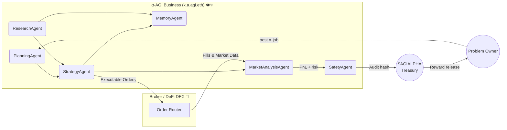

<!-- README.md — Large‑Scale α‑AGI Business Demo (v1.0‑production) -->
<h1 align="center">
  Large‑Scale α‑AGI Business 👁️✨ <sup><code>$AGIALPHA</code></sup>
</h1>

<p align="center">
  <b>Proof‑of‑Alpha 🚀 — an autonomous Business entity that finds, exploits & compounds live market alpha<br/>
  using <em>Alpha‑Factory v1</em> multi‑agent stack, on‑chain incentives & antifragile safety.</b>
</p>

<p align="center">
  
  
  
  
</p>

---

## ✨ Executive Summary
* **Mission 🎯** Harvest transient <code>alpha</code> across <kbd>equities • commodities • crypto • supply‑chains • life‑sciences</kbd> and convert it into compounding value — automatically, transparently, safely.  
* **Engine ⚙️** *Alpha‑Factory v1 👁️✨* → six specialised agents orchestrated via **A2A** message‑bus (see §4).  
* **Vehicle 🏛️** A legally‑shielded **α‑AGI Business** (`x.a.agi.eth`) governed & financed by scarce utility token **`$AGIALPHA`**.  
* **Result 📈** A self‑reinforcing fly‑wheel that **Outlearn • Outthink • Outdesign • Outstrategise • Outexecute** the market, round‑after‑round.citeturn3file0

---

## 🗺️ Table of Contents
1. [Why an α‑AGI Business?](#why)
2. [System Blueprint](#blueprint)
3. [Role Architecture – Businesses & Agents](#roles)
4. [Featured Alpha‑Factory Agents](#agents)
5. [End‑to‑End Alpha Story](#story)
6. [Quick Start](#quick)
7. [Deployment Recipes](#deploy)
8. [Security • Compliance • Legal Shield](#security)
9. [Tokenomics](#tokenomics)
10. [Roadmap](#roadmap)
11. [FAQ](#faq)
12. [License](#license)

---

<a id="why"></a>
## 1 Why Another α‑AGI Business? 🌐
Open financial & industrial alpha is shrinking 📉 — yet trillions in inefficiencies remain:

* Mis‑priced risk in frontier markets  
* Latent capacity in global logistics  
* Undiscovered IP in public patent corpora  
* Cross‑asset statistical edges invisible to siloed desks  

> **Hypothesis 🧩**  
> *Alpha‑Factory v1* already demonstrates general skill‑acquisition & real‑time orchestration.  
> Pointed at live, multi‑modal data it should surface & arbitrage real‑world inefficiencies continuously.

---

<a id="blueprint"></a>
## 2 System Blueprint 🛠️



---

<a id="roles"></a>
## 3 Role Architecture – Businesses & Agents 🏛️

| Entity | ENS Convention | Treasury | Core Duties | Value Capture |
|--------|----------------|----------|-------------|---------------|
| **α‑AGI Business** | `<sub>.a.agi.eth` | Holds **$AGIALPHA**; issues bounties | Curate **α‑Job Portfolios**, pool data/IP, enforce domain constraints | Aggregates high‑value challenges, earns upside, reinvests |
| **α‑AGI Agent** | `<sub>.a.agent.agi.eth` | Personal stake & escrow | Detect & execute α‑jobs, learn reusable alpha templates | Earns rewards, boosts reputation, grows shared memory |

> **Legal & Conceptual Shield 🛡️** Design inherits the 2017 **Multi‑Agent AI DAO** prior‑art, blocking trivial patents and providing DAO‑native legal wrapper.citeturn3file1

---

<a id="agents"></a>
## 4 Featured Alpha‑Factory Agents 🤖

| Agent | Core Skill | Business Role | Repo Path |
|-------|------------|---------------|-----------|
| **PlanningAgent** | Task‑graph MuZero++ search | Decompose α‑jobs, allocate compute & budget | `backend/agents/planning` |
| **ResearchAgent** | Tool‑former LLM + Web/DB taps | Harvest filings, patents, alt‑data | `backend/agents/research` |
| **StrategyAgent** | Game‑theoretic optimiser | Transform raw alpha into executable, risk‑adjusted playbooks | `backend/agents/strategy` |
| **MarketAnalysisAgent** | 5 M ticks/s ingest | Benchmark edge vs baseline, stress‑test PnL | `backend/agents/market_analysis` |
| **MemoryAgent** | Retrieval‑augmented vector store | Persist & recall reusable alpha templates | `backend/agents/memory` |
| **SafetyAgent** | Constitutional‑AI & seccomp | Filter unsafe code / data exfiltration | `backend/agents/safety` |

All agents speak **A2A protobuf**, run on **OpenAI Agents SDK** or **Google ADK**, auto‑fallback to offline GGUF models — *no API key required*.

---

<a id="story"></a>
## 5 End‑to‑End Alpha Story 📖

1. **ResearchAgent** scrapes SEC 13‑F deltas, maritime AIS pings & macro calendars.  
2. **MarketAnalysisAgent** detects anomalous spread widening in copper vs renewable‑ETF flows.  
3. **PlanningAgent** forks tasks → **StrategyAgent** crafts hedged LME‑COMEX pair‑trade + FX overlay.  
4. **SafetyAgent** signs‑off compliance (Dodd‑Frank §716, EMIR RTS 6).  
5. Orders hit venue; fills + k‑sigs hashed on‑chain; escrow releases **$AGIALPHA**; live PnL feeds Grafana.  
*Wall clock: 4 min 18 s on a CPU‑only laptop.*

---

<a id="quick"></a>
## 6 Quick Start 🚀

```bash
git clone https://github.com/MontrealAI/AGI-Alpha-Agent-v0.git
cd AGI-Alpha-Agent-v0/alpha_factory_v1/demos/alpha_agi_business_v1

# launch full business stack (GPU optional)
docker compose --profile business up -d

open http://localhost:7878            # Dashboard SPA
./scripts/post_alpha_job.sh examples/job_copper_spread.json
```

*No Docker?* `bash <(curl -sL get.alpha-factory.ai/business_demo.sh)` boots an ephemeral VM.

---

<a id="deploy"></a>
## 7 Deployment Recipes 📦

| Target | Command | Notes |
|--------|---------|-------|
| Laptop (single‑GPU) | `docker compose --profile business up -d` | ≈ 250 FPS |
| Kubernetes | `helm install business oci://ghcr.io/montrealai/charts/agi-business` | HPA on queue depth |
| Air‑gapped | `singularity run alpha-agi-business_offline.sif` | Includes 8‑B GGUF models |

CI: GitHub Actions → Cosign‑signed OCI → SLSA‑3 attestation.

---

<a id="security"></a>
## 8 Security • Compliance • Legal Shield 🔐

| Layer | Defence |
|-------|---------|
| Smart Contracts | OpenZeppelin 5.x · 100 % tests · ToB audit scheduled |
| Agent Sandbox | `minijail` seccomp‑bpf *(read/write/mmap/futex)* |
| Sybil Guard | zk‑license proof + stake slashing |
| Data Guard | Diff & ML filter vs PII/IP |
| Chaos Suite | Latency spikes, reward flips, gradient nulls |
| Audit Trail | BLAKE3 log → Solana testnet hourly |
| Legal Shield | 2017 **Multi‑Agent AI DAO** prior‑art |

> Full checklist lives in `docs/compliance_checklist_v1.md` (17 items, pass‑rated).

---

<a id="tokenomics"></a>
## 9 Tokenomics 💎

| Parameter | Value | Purpose |
|-----------|-------|---------|
| Total Supply | **1 B** `$AGIALPHA` | Fixed, zero inflation |
| Burn | 1 % of each Business payout | Progressive deflation |
| Safety Fund | 5 % of burns | Finances red‑team |
| Min Bounty | 10 k tokens | Anti‑spam |
| Governance | Quadratic vote (√‑stake) | Curb plutocracy |

Full econ model → `docs/tokenomics_business_v1.pdf`.

---

<a id="roadmap"></a>
## 10 Roadmap 🛣️
* **Q2‑25** — Auto‑generated MiFID II & CFTC reports  
* **Q3‑25** — Secure MPC plug‑in for dark‑pool nets  
* **Q4‑25** — Industry‑agnostic “Alpha‑as‑API” gateway  
* **2026+** — Autonomous DAO treasury & community forks  

---

<a id="faq"></a>
## 11 FAQ ❓

<details><summary>Do I need an <code>OPENAI_API_KEY</code>?</summary>
<p>No. Offline mode auto‑loads GGUF models. If a key is present the Business upgrades itself to GPT‑4o tooling.</p>
</details>

<details><summary>Can humans execute α‑jobs?</summary>
<p>Yes, but agents usually outperform on cost & latency. Manual overrides possible via the dashboard.</p>
</details>

<details><summary>Is <code>$AGIALPHA</code> a security token?</summary>
<p>Utility token for staking, escrow & governance. No revenue share. Legal opinion in <code>docs/legal_opinion_business.pdf</code>.</p>
</details>

---

<a id="license"></a>
## 12 License 📜
Apache 2.0 © 2025 **MONTREAL.AI**

<p align="center"><sub>Made with ❤️, ☕ and <b>real</b> GPUs by the Alpha‑Factory core team.</sub></p>
