<!-- README.md — Large‑Scale α‑AGI Business Demo (v1.0‑production) -->
<h1 align="center">
 Large‑Scale α‑AGI Business 👁️✨ <sup><code>$AGIALPHA</code></sup>
</h1>

 <b>Proof‑of‑Alpha 🚀 — an autonomous business entity that finds, exploits & compounds live market alpha<br/>
 using <em>Alpha‑Factory v1</em> multi‑agent stack, on‑chain incentives & antifragile safety‑loops.</b>
</p>

 
 
 
 
</p>

---

## ✨ Executive Summary 
* **Mission 🎯** Continuously harvest <code>alpha</code> across <kbd>equities • commodities • crypto • supply‑chains •
  life‑sciences</kbd> and convert it into compounding value — automatically, transparently, safely.
* **Engine ⚙️** *Alpha‑Factory v1 👁️✨* → six specialised agents orchestrated via **A2A** message‑bus (see §4). 
* **Vehicle 🏛️** A legally‑shielded **α‑AGI Business** (`x.a.agi.eth`) governed & financed by scarce utility token
  **`$AGIALPHA`**.
* **Result 📈** A self‑reinforcing fly‑wheel that **Out‑learn • Out‑think • Out‑design • Out‑strategise • Out‑execute**
  the market, round‑after‑round.

---

## 🗺️ Table of Contents
1. [Why an α‑AGI Business?](#why)
2. [System Blueprint](#blueprint)
3. [Role Architecture](#roles)
4. [Featured Alpha‑Factory Agents](#agents)
5. [End‑to‑End Alpha Walk‑through](#story)
6. [Quick Start](#quick)
7. [Deployment Recipes](#deploy)
8. [Security • Compliance • Legal Shield](#security)
9. [Tokenomics](#tokenomics)
10. [Antifragility & Self‑Improvement](#antifragility)
11. [Roadmap](#roadmap)
12. [FAQ](#faq)
13. [License](#license)
14. [Resources](#resources)
15. [Local Checks](#local-checks)

> **Quick Start**
> ```bash
> python start_alpha_business.py      # launch the orchestrator
> python openai_agents_bridge.py      # expose via OpenAI Agents
> python gradio_dashboard.py          # interactive dashboard
> ```
> See the [Quick Start](#quick) and [Deployment Recipes](#deploy) sections for advanced options.

---

<a id="why"></a>
## 1 An α‑AGI Business? 🌐
Open financial & industrial alpha is shrinking 📉 — yet trillions in inefficiencies remain:

* Mis‑priced risk in frontier markets 
* Latent capacity in global logistics 
* Undiscovered IP in public patent corpora 
* Cross‑asset statistical edges invisible to siloed desks 

> **Hypothesis 🧩**  *Alpha‑Factory v1* already demonstrates general skill‑acquisition & real‑time orchestration. Pointed
  at live, multi‑modal data it surfaces & arbitrages real‑world inefficiencies continuously.

> **On-chain** as `<name>.a.agi.eth`, an *α-AGI Business* 👁️✨ unleashes a self-improving *α-AGI Agent* 👁️✨
  (`<name>.a.agent.agi.eth`) swarm to hunt inefficiencies and transmute them into **$AGIALPHA**.

---

<a id="blueprint"></a>
## 2 System Blueprint 🛠️

```mermaid
flowchart LR
  subgraph "α‑AGI Business (x.a.agi.eth) 👁️✨"
    direction LR
    P(PlanningAgent)
    R(ResearchAgent)
    S(StrategyAgent)
    M(MarketAnalysisAgent)
    T(MemoryAgent)
    F(SafetyAgent)
    P --> S
    R --> S
    S --> M
    M -->|PnL + risk| F
    S --> T
    R --> T
  end

  subgraph Broker["Exchange / DeFi DEX 🏦"]
    E[Order Router]
  end

  Client((Problem Owner))
  Treasury(($AGIALPHA\nTreasury))

  Client -. post α‑job .-> P
  S -->|Orders| E
  E -->|Fills & Market Data| M
  F -->|Audit hash| Treasury
  Treasury -->|Reward release| Client
```



---

<a id="roles"></a>
## 3 Role Architecture – Businesses & Agents 🏛️

**α‑AGI Business**
- ENS: `<sub>.a.agi.eth`
- Treasury: wallet holds **$AGIALPHA**; can issue bounties
- Responsibilities: curate job portfolios, pool data/IP, enforce constraints
- Value: captures upside from solved quests and reinvests

**α‑AGI Agent**
- ENS: `<sub>.a.agent.agi.eth`
- Treasury: personal stake (reputation + escrow)
- Responsibilities: detect, plan & execute α‑jobs published by any Business
- Value: earns **$AGIALPHA** rewards, boosts reputation, stores reusable templates

> **Legal & Conceptual Shield 🛡️** 
> Both layers inherit the **2017 Multi‑Agent AI DAO** prior‑art — a publicly timestamped blueprint for on‑chain,
  autonomous, self‑learning agent swarms, blocking trivial patents and providing a DAO‑native wrapper for fractional
  ownership.

---

<a id="agents"></a>
## 4 Featured Alpha‑Factory Agents 🤖

**Featured Alpha‑Factory Agents**
- **PlanningAgent** – MuZero++ task graph search; decomposes jobs and allocates resources (`planning_agent.py`).
- **ResearchAgent** – Tool-former LLM with web and DB taps (`research_agent.py`).
- **StrategyAgent** – Game-theoretic optimiser; crafts risk-adjusted playbooks (`strategy_agent.py`).
- **MarketAnalysisAgent** – 5M ticks/s ingest; benchmarks edge vs baseline (`market_analysis_agent.py`).
- **MemoryAgent** – Retrieval-augmented vector store (`memory_agent.py`).
- **SafetyAgent** – Constitutional-AI and seccomp sandbox (`safety_agent.py`).
- **ExecutionAgent** – Order routing and trade settlement (`execution`).
- **AlphaComplianceAgent** – Regulatory checklist (`alpha_agi_business_v1.py`).
- **AlphaPortfolioAgent** – Portfolio snapshot (`alpha_agi_business_v1.py`).
All agents speak **A2A protobuf**, run on **OpenAI Agents SDK** or **Google ADK**, auto‑fallback to offline GGUF models
  — *no API key required*.

---

<a id="story"></a>
## 5 End‑to‑End Alpha Walk‑through 📖

1. **ResearchAgent** scrapes SEC 13‑F deltas, maritime AIS pings & macro calendars.
2. **MarketAnalysisAgent** detects anomalous spread widening in copper vs renewable‑ETF flows.
3. **PlanningAgent** forks tasks → **StrategyAgent** crafts hedged LME‑COMEX pair‑trade + FX overlay.
4. **SafetyAgent** signs‑off compliance pack (Dodd‑Frank §716, EMIR RTS 6).
5. **ExecutionAgent** routes orders to venues; fills + k‑sigs hashed on‑chain; escrow releases **$AGIALPHA**; live PnL
  feeds Grafana.
6. **Best Alpha Example**
   *Using the bundled sample opportunities the top ranked item is “gene therapy patent undervalued by market”
     (score 88). Launching the demo with `--submit-best` automatically queues this opportunity for execution.*
*Wall clock: 4 min 18 s on a CPU‑only laptop.*

---

<a id="quick"></a>
## 6 Quick Start 🚀

*For a concise walkthrough see [QUICK_START.md](QUICK_START.md).*
For a deployment checklist aimed at production environments consult
[PRODUCTION_GUIDE.md](PRODUCTION_GUIDE.md).
```bash
git clone https://github.com/MontrealAI/AGI-Alpha-Agent-v0.git
cd AGI-Alpha-Agent-v0/alpha_factory_v1/demos/alpha_agi_business_v1

# easiest path – auto-installs dependencies and opens the docs
python start_alpha_business.py

# automatically queue the highest scoring demo opportunity
python start_alpha_business.py --submit-best

# Docker-based run (add --pull to use GHCR, --gpu for NVIDIA)
./run_business_v1_demo.sh [--pull] [--gpu]
# REST docs → http://localhost:8000/docs
# or run directly without Docker
python run_business_v1_local.py --bridge --auto-install
# expose orchestrator on a custom port
python run_business_v1_local.py --bridge --port 9000
# expose the Agents runtime on a custom port
python run_business_v1_local.py --bridge --runtime-port 6001
# automatically open the REST docs in your browser
python run_business_v1_local.py --bridge --open-ui
# Set `ALPHA_OPPS_FILE` to use a custom opportunity list
# ALPHA_OPPS_FILE=examples/my_alpha.json python run_business_v1_local.py --bridge

```bash
# Optional configuration
python scripts/setup_config.py
# Edit the `config.env` file to set variables such as:
#   - OPENAI_API_KEY
#   - YFINANCE_SYMBOL
#   - ALPHA_BEST_ONLY
#   - API_TOKEN (REST auth token, defaults to "demo-token" — change for production)
#   - MCP_ENDPOINT (optional Model Context Protocol URL)
#   - MCP_TIMEOUT_SEC (optional timeout in seconds for MCP network requests)
#   - AUTO_INSTALL_MISSING=1 to let `check_env.py` install any missing packages
#   - WHEELHOUSE=/path/to/wheels for offline package installs
# The launcher automatically picks up these settings.

> **Security Note:** `API_TOKEN` defaults to `demo-token` for quick demos. Replace it with a strong, unique value before
  any production deployment.

By default this launcher restricts `ALPHA_ENABLED_AGENTS` to the five
lightweight demo stubs so the orchestrator runs even on minimal setups.
Set the variable yourself to customise the agent list.

# the demo starts several stub agents:
#   • **IncorporatorAgent** registers the business
#   • **AlphaDiscoveryAgent** generates a short opportunity via the LLM provider
#     (logged via MCP when `MCP_ENDPOINT` is set)
#   • **AlphaOpportunityAgent** emits market inefficiencies from `examples/alpha_opportunities.json`
#     (override with `ALPHA_OPPS_FILE=/path/to/custom.json`)
#     set `ALPHA_TOP_N=N` to broadcast the top-N entries or
#     set `ALPHA_BEST_ONLY=1` to only emit the single highest-scoring one
#     and optionally `YFINANCE_SYMBOL=SPY` to pull a live price via `yfinance`
#     set `ALPHA_TOP_N=3` to publish the top 3 opportunities each cycle
#     or run `python examples/find_best_alpha.py` to print the current highest-scoring entry
#   • **AlphaExecutionAgent** converts an opportunity into an executed trade
#   • **AlphaRiskAgent** performs a trivial risk assessment
#   • **AlphaComplianceAgent** validates regulatory compliance
#   • **AlphaPortfolioAgent** summarises portfolio state
#   • **PlanningAgent**, **ResearchAgent**, **StrategyAgent**, **MarketAnalysisAgent**,
#     **MemoryAgent** and **SafetyAgent** emit placeholder events to illustrate the
#     full role architecture

open http://localhost:7860      # Dashboard SPA
./scripts/post_alpha_job.sh examples/job_copper_spread.json
# or
./scripts/post_alpha_job.sh examples/job_supply_chain_alpha.json
# or
./scripts/post_alpha_job.sh examples/job_forex_alpha.json
# or
./scripts/post_alpha_job.sh examples/job_execute_alpha.json
```

If dependencies are missing, pass `--auto-install` (and optionally
`--wheelhouse /path/to/wheels`) to the local launcher:

```bash
python run_business_v1_local.py --auto-install --wheelhouse /path/to/wheels
```

Or open `colab_alpha_agi_business_v1_demo.ipynb` to run everything in Colab.
[Open in Colab][open-colab-link]
The notebook now includes an optional **Gradio dashboard** (step 5b) so you can
interact with the agents without writing any code.
To drive the orchestrator via the OpenAI Agents SDK run `python openai_agents_bridge.py`
(see step 5 in the notebook). Use `--host http://<host>:<port>` when the orchestrator
is exposed elsewhere. If the script complains about a missing `openai_agents`
package, install it with:
```bash
pip install openai-agents
```
In fully offline environments provide a local wheel via the `WHEELHOUSE` environment variable and run
`check_env.py --auto-install` before launching the bridge.

### 💾 Offline wheel install

Build a wheelhouse as shown in [AGENTS.md](../../../AGENTS.md#offline-setup) and
set `WHEELHOUSE` to its path. Run the environment check to install any missing
packages from those wheels:

```bash
python check_env.py --auto-install --wheelhouse "$WHEELHOUSE"
```

### 🎛️ Local Gradio Dashboard

For a quick interactive UI run `python gradio_dashboard.py` after the orchestrator starts.
The dashboard exposes buttons to trigger each demo agent and fetch recent alpha
opportunities without writing any code.
It now also supports searching the orchestrator memory and fetching recent log
lines for quick troubleshooting.

```bash
python gradio_dashboard.py  # visits http://localhost:7860
```

Set `GRADIO_PORT` to use a different port. The dashboard communicates with the
orchestrator via its REST API (`BUSINESS_HOST` environment variable). Use
`--token YOUR_TOKEN` or set `API_TOKEN` to authenticate requests.

### 🤖 OpenAI Agents bridge

Expose the business demo via the OpenAI Agents SDK (specify `--host` if the orchestrator runs elsewhere
and `--port` to change the runtime port):

```bash
# default port 5001; customise via `--port` or `AGENTS_RUNTIME_PORT`
# wait up to 10s for the orchestrator (override with --wait-secs)
python openai_agents_bridge.py --host http://localhost:8000 --port 6001 --wait-secs 10
# → http://localhost:6001/v1/agents
```
Pass `--open-ui` to automatically open the runtime URL in your browser. Use
`--token YOUR_TOKEN` or set `API_TOKEN` when the orchestrator requires
authentication.
When the optional `google-adk` dependency is installed and `ALPHA_FACTORY_ENABLE_ADK=true` is set,
the same helper agent is also exposed via an ADK gateway for A2A messaging.
Visit `http://localhost:9000/docs` to explore the gateway when enabled (default port: 9000).
To use a custom port, set the `GATEWAY_PORT` environment variable accordingly.

- The bridge exposes several helper tools:
- `list_agents`
- `trigger_discovery`
- `trigger_opportunity`
- `trigger_best_alpha` (send the highest scoring demo opportunity)
- `trigger_execution`
- `trigger_risk`
- `trigger_compliance`
- `trigger_portfolio`
- `trigger_planning`
- `trigger_research`
- `trigger_strategy`
- `trigger_market_analysis`
- `trigger_memory`
- `trigger_safety`
- `recent_alpha` (retrieve latest opportunities)
- `search_memory` (search stored alpha by keyword;
  parameters: `query` (string, required) and `limit` (integer, optional))
  Example usage:
  ```bash
  curl -X POST http://localhost:6001/v1/agents/search_memory \
       -H "Content-Type: application/json" \
       -d '{"query": "market trend", "limit": 5}'
- `fetch_logs` (return recent orchestrator log lines)
- `check_health` (orchestrator health status)
- `submit_job` (to post a custom job payload to any orchestrator agent)

For a programmatic example see `examples/openai_agent_client.py`:
```bash
python examples/openai_agent_client.py --action recent_alpha
```

*No Docker?*
`bash <(curl -sL https://get.alpha-factory.ai/business_demo.sh)` boots an ephemeral VM (CPU‑only mode).

---

<a id="deploy"></a>
## 7 Deployment Recipes 📦

| Target | Command | Notes |
|--------|---------|-------|
| Laptop (single‑GPU) | `docker compose --profile business up -d` | ≈ 250 FPS on RTX 3060 |
| Kubernetes | `helm install business oci://ghcr.io/montrealai/charts/agi-business` | HPA on queue depth |
| Air‑gapped | `singularity run alpha-agi-business_offline.sif` | Includes 8‑B GGUF models |

CI: GitHub Actions → Cosign‑signed OCI → SLSA‑3 attestation.

---

<a id="security"></a>
## 8 Security • Compliance • Legal Shield 🔐

| Layer | Defence |
|-------|---------|
| Smart Contracts | OpenZeppelin 5.x · 100 % branch tests · ToB audit scheduled |
| Agent Sandbox | `minijail` seccomp‑bpf *(read/write/mmap/futex)* |
| Sybil Guard | zk‑license proof + stake slashing |
| Data Guard | Diff & ML filter vs PII/IP |
| Chaos Suite | Latency spikes, reward flips, gradient nulls |
| Audit Trail | BLAKE3 log → Solana testnet hourly |
| Legal Shield | 2017 **Multi‑Agent AI DAO** prior‑art |

Full checklist lives in `docs/compliance_checklist_v1.md` (17 items, pass‑rated).

---

<a id="tokenomics"></a>
## 9 Tokenomics 💎

| Parameter | Value | Purpose |
|-----------|-------|---------|
| Total Supply | **1 B** `$AGIALPHA` | Fixed, zero inflation |
| Burn | 1 % of each Business payout | Progressive deflation |
| Safety Fund | 5 % of burns | Finances red‑team |
| Min Bounty | 10 k tokens | Anti‑spam |
| Governance | Quadratic vote (√‑stake) | Curb plutocracy |

Full econ model → `docs/tokenomics_business_v1.pdf`.

---

<a id="antifragility"></a>
## 10 Antifragility & Self‑Improvement 💪

Alpha-Factory injects stochastic **stressors** (latency spikes, reward flips, gradient dropouts) at random intervals.
The **SafetyAgent** & **PlanningAgent** collaborate to absorb shocks;
metrics show ↑ robustness over time (see Grafana *Antifragility* panel).

*Outcome:* the Business *benefits* from volatility — the more chaos, the sharper its edge.

---

<a id="roadmap"></a>
## 11 Roadmap 🛣️
* **Q2‑25** — Auto‑generated MiFID II & CFTC reports 
* **Q3‑25** — Secure MPC plug‑in for dark‑pool nets 
* **Q4‑25** — Industry‑agnostic “Alpha‑as‑API” gateway 
* **2026+** — Autonomous DAO treasury & community forks 

---

<a id="faq"></a>
## 12 FAQ ❓

<details><summary>Do I need an <code>OPENAI_API_KEY</code>?</summary>
<p>No. Offline mode auto‑loads GGUF models. If a key is present the Business upgrades itself to GPT‑4o tooling.</p>
</details>

<details><summary>Can humans execute α‑jobs?</summary>
<p>Yes, but agents usually outperform on cost & latency. Manual overrides possible via the dashboard.</p>
</details>

<details><summary>Is <code>$AGIALPHA</code> a security token?</summary>
<p>Utility token for staking, escrow & governance. No revenue share.
Legal opinion in <code>docs/legal_opinion_business.pdf</code>.</p>
</details>

---

<a id="license"></a>
## 13 License 📜 
Apache 2.0 © 2025 **MONTREAL.AI**


---

<a id="resources"></a>
## 14 Resources 📚

- [OpenAI Agents SDK documentation](https://openai.github.io/openai-agents-python/)
- [A practical guide to building agents][guide-pdf]
- [Google Agent Development Kit docs](https://google.github.io/adk-docs/)
- [Agent‑to‑Agent protocol](https://github.com/google/A2A)
- [Model Context Protocol](https://www.anthropic.com/news/model-context-protocol)
- [Conceptual Framework](CONCEPTUAL_FRAMEWORK.md)
- [Best Alpha Workflow](BEST_ALPHA_WORKFLOW.md)
[open-colab-link]:
  https://colab.research.google.com/github/MontrealAI/AGI-Alpha-Agent-v0/blob/main/
  alpha_factory_v1/demos/alpha_agi_business_v1/colab_alpha_agi_business_v1_demo.ipynb
[guide-pdf]: https://cdn.openai.com/business-guides-and-resources/a-practical-guide-to-building-agents.pdf

<a id="local-checks"></a>
## 15 Local Checks

Run the standard checks from this folder before committing:

```bash
python ../../check_env.py --auto-install   # verify optional packages
pre-commit run --files <paths>             # format only the staged files
pytest -q ../../../tests                   # execute the root test suite
```
