# α‑AGI Insight 👁️✨ — Beyond Human Foresight — Official Demo

The **α‑AGI Insight** demo predicts which industry sector is most likely to be
transformed by Artificial General Intelligence. It runs a small
**Meta‑Agentic Tree Search** (MATS) over a list of sector names. No external
 data is required so the script executes fully offline.  Pass a custom sector
 list with ``--sectors`` to experiment with your own domains. When the argument
 points to a text file, each non-empty line is treated as a sector name.

**Quick Start:** run ``alpha-agi-insight --episodes 5`` or
``alpha-agi-beyond-foresight --episodes 5`` to launch the final production demo
with automatic environment selection. Both commands map to
``official_demo_final.py`` and transparently choose between the hosted runtime
and offline mode depending on available credentials.
You may also run ``alpha-agi-insight-final`` for the same behaviour or
``alpha-agi-insight-production`` to verify the environment and enable the
optional ADK gateway when available. The companion
``official_demo_production.py`` script offers identical behaviour and is
recommended when deploying the demo in production settings.

Highlights:
- Automatic offline fallback when no API key is detected.
- Optional OpenAI Agents runtime for hosted execution.
- Built-in Google ADK gateway support via `--enable-adk`.
- Runs entirely with zero external data by default.

## Overview

```mermaid
%% α-AGI Insight — Meta-Agentic Tree Search Architecture (ZERO-DATA Demo)
flowchart TD
    %% ─────────────  Core components  ─────────────
    Controller["<b>Controller</b><br/>(Meta-Agent<br/>Orchestrator)"]:::controller
    DB["<b>Knowledge&nbsp;Base</b><br/>(Program&nbsp;DB / Insight Archive)"]:::db
    Sampler["<b>Prompt&nbsp;/&nbsp;Task Sampler</b><br/>(Curriculum Generator)"]:::sampler
    Ensemble["<b>LLM&nbsp;Ensemble</b><br/>(Insight Generators)"]:::ensemble
    Evaluator["<b>Evaluator&nbsp;Pool</b><br/>(Sandbox &amp; Scorers)"]:::evaluator

    %% ─────────────  Evolutionary loop (dashed ring)  ─────────────
    subgraph EvolutionaryLoop
        direction TB
        Controller
        DB
        Sampler
        Ensemble
        Evaluator
    end
    class EvolutionaryLoop loopStyle

    %% ─────────────  Data-flow arrows  ─────────────
    Controller -- "stores results" --> DB
    DB         -- "past programs / metrics" --> Controller

    Controller -- "request prompt" --> Sampler
    Sampler    -- "context-rich prompt" --> Controller

    Controller -- "dispatch program&nbsp;stubs" --> Ensemble
    Ensemble   -- "candidate code / insights" --> Controller

    Controller -- "submit programs" --> Evaluator
    Evaluator  -- "metrics &amp; scores" --> Controller

    %% ─────────────  Styling  ─────────────
    classDef controller fill:#e9d8ff,stroke:#7844ca,color:#29065d,font-weight:bold
    classDef db         fill:#d7e7ff,stroke:#3e7edb,color:#0a2e59
    classDef sampler    fill:#d8f8d4,stroke:#3b9e3b,color:#0d2f0d
    classDef ensemble   fill:#ffe1e1,stroke:#d45050,color:#5a0d0d
    classDef evaluator  fill:#fff0d5,stroke:#d4a44c,color:#694a00
    classDef loopStyle  stroke-dasharray:4 4,stroke-width:2,stroke:#14c4ff,fill:transparent

    linkStyle default stroke-width:1.5px
```



- **Zero Data Dependency**: runs entirely offline by default. The default
  sector list ships with the package so no external resources are required.
  It covers Finance, Healthcare, Education, Manufacturing, Transportation,
  Energy, Retail, Agriculture, Defense and Real Estate.
- **OpenAI Agents SDK Integration**: seamlessly switches to hosted execution when API credentials are present.
- **Automatic ADK Support**: optional Google ADK gateway activates when available.
- **Model Context Protocol Logging**: export `MCP_ENDPOINT` to persist all prompts and replies.


```bash
python -m alpha_factory_v1.demos.alpha_agi_insight_v0.insight_demo --episodes 5
```

### Single Command Launcher

Run the package itself to automatically select the best interface. By default it
routes through the OpenAI Agents runtime when available and transparently
degrades to the local CLI otherwise:

```bash
python -m alpha_factory_v1.demos.alpha_agi_insight_v0
```

Pass ``--offline`` to skip the agent runtime entirely.
Use ``--skip-verify`` to bypass the startup environment check if desired.

For a quick offline run from anywhere:

```bash
python -m alpha_factory_v1.demos.alpha_agi_insight_v0 --offline --episodes 2
```

When installed as a package the ``alpha-agi-insight-demo`` command provides the
same behaviour without specifying the module path:

```bash
alpha-agi-insight-demo --episodes 2
```

To expose the demo via the OpenAI Agents runtime (and optional ADK gateway), use
the companion ``alpha-agi-insight-bridge`` command:

```bash
alpha-agi-insight-bridge --episodes 5
```

### REST API

Launch a small FastAPI server that exposes the search loop via ``/insight``. The
service runs entirely offline by default and mirrors the CLI options:

```bash
alpha-agi-insight-api --port 8000
```

Send a POST request with JSON payload ``{"episodes":5}`` to ``/insight`` to
retrieve the ranking as structured data.

### Streamlit Dashboard

Launch an interactive web dashboard for exploring the demo:

```bash
alpha-agi-insight-dashboard
```

The dashboard lets you tweak parameters and immediately visualise the ranked
sector scores in a browser.

### Quick Start Script

Ensure the shell helper is executable by running ``chmod +x run_insight_demo.sh`` if needed.
Execute ``./run_insight_demo.sh`` from this directory for an instant launch. The
wrapper delegates to the package entry point so the demo works with or without
OpenAI API credentials.  Alternatively invoke ``run_demo.py`` directly with
Python for the same behaviour:

```bash
python run_demo.py --episodes 5
```

To always verify dependencies before running, launch the companion
``official_demo.py`` script instead:

```bash
python official_demo.py --episodes 5
```

When installed as a package, the `alpha-agi-insight-official` command
offers the same behaviour.

The standalone ``official_demo_final.py`` wrapper combines environment
verification with automatic runtime selection. Invoke it directly or via
the ``alpha-agi-insight-final`` command:

```bash
python official_demo_final.py --episodes 5
```
For a quick offline run with minimal dependencies:

```bash
python official_demo_final.py --offline --episodes 2
```
Use ``--enable-adk`` to expose the agent via the optional Google ADK gateway.
Pass ``--list-sectors`` to display the resolved sector list without running the search.
Use ``--no-banner`` or set ``ALPHA_AGI_NO_BANNER=true`` to suppress the startup banner when embedding the demo in automated scripts. The same flag also works with ``alpha-agi-insight-production``.
``--adk-host`` and ``--adk-port`` customise the gateway bind address.
Use ``--version`` to print the installed package version and exit.
For production deployments launch ``official_demo_production.py`` or use the
``alpha-agi-insight-production`` entrypoint. This variant verifies the
environment by default and automatically selects between the hosted runtime
and the offline CLI.  For a splashier startup message run
``alpha-agi-beyond-foresight`` which displays a short banner before delegating
to the same production demo:

```bash
alpha-agi-beyond-foresight --offline --episodes 2
```
The arguments mirror ``alpha-agi-insight-production``.
Use ``--version`` to show the installed package version and exit.

## Usage

The command line interface mirrors the options of the general MATS demo:

```bash
python -m alpha_factory_v1.demos.alpha_agi_insight_v0.insight_demo \
    --episodes 10 \
    --rewriter openai \
    --model gpt-4o \
    --log-dir logs \
    --sectors Finance,Healthcare,Energy
```

Use ``--list-sectors`` to display the resolved sector list without running the
search. This is helpful when providing custom lists via ``--sectors``.

Set the ``ALPHA_AGI_SECTORS`` environment variable to override the default
sector list without editing configuration files.  Provide a comma-separated
string or the path to a text file containing one sector per line.  The
``openai_agents_bridge`` respects the same variable when launching via the
Agents runtime so your custom sector lists work in both modes.

Export ``MCP_ENDPOINT`` to capture all prompts and replies for later audit using
the Model Context Protocol. When unset the logging step is silently skipped.

When optional dependencies such as ``openai`` or ``anthropic`` are not
installed, the program automatically falls back to a simple offline rewriter so
the demo remains functional anywhere.  Episode scores are printed to the console
and optionally written to ``scores.csv`` when ``--log-dir`` is supplied.  The
path to the log file is displayed after the run completes. When ``matplotlib``
is available a ``ranking.png`` chart summarizing the sector scores is also
generated in the log directory.

### Environment Variables

- ``OPENAI_API_KEY`` – enable OpenAI-based rewriting via ``openai_rewrite``.
- ``ANTHROPIC_API_KEY`` – use ``anthropic_rewrite`` with Claude models.
- ``OPENAI_MODEL`` – override the OpenAI model (default ``gpt-4o``).
- ``MATS_REWRITER`` – select the rewrite strategy when unspecified.
- ``ALPHA_AGI_SECTORS`` – comma-separated sector list or path to a text file.
- ``MCP_ENDPOINT`` – optional URL for Model Context Protocol logging.
- ``ALPHA_AGI_EPISODES`` – override the number of search episodes.
- ``ALPHA_AGI_EXPLORATION`` – set the exploration constant for UCB1.
- ``ALPHA_AGI_TARGET`` – specify the target sector index.
- ``ALPHA_AGI_SEED`` – RNG seed for deterministic runs.
- ``ALPHA_AGI_OFFLINE`` – force offline mode even when OpenAI Agents is available.
- ``ALPHA_AGI_ENABLE_ADK`` – enable the ADK gateway without ``--enable-adk``.
- ``ALPHA_AGI_ADK_HOST`` – custom bind host for the ADK gateway.
- ``ALPHA_AGI_ADK_PORT`` – custom bind port for the ADK gateway.
- ``ALPHA_AGI_NO_BANNER`` – suppress the startup banner when set to ``true``.
- ``ALPHA_AGI_SKIP_VERIFY`` – skip environment checks when set to ``true``.

### Graceful Offline Mode

The demo automatically falls back to an offline search strategy whenever the
required API keys are absent or network access is restricted. Dependency checks
run automatically at launch.

## OpenAI Agents Bridge

Launch ``openai_agents_bridge.py`` to control the demo via the
`openai-agents` runtime and optionally the Google ADK A2A protocol:

```bash
python -m alpha_factory_v1.demos.alpha_agi_insight_v0.openai_agents_bridge
```

Run with ``--enable-adk`` to expose the agent via the optional Google ADK gateway when available. Custom host and
port may be specified via ``--adk-host`` and ``--adk-port``. The following example launches the runtime with five
episodes and stores episode metrics in ``scores.csv``:

```bash
python -m alpha_factory_v1.demos.alpha_agi_insight_v0.openai_agents_bridge \
    --enable-adk --adk-host 0.0.0.0 --adk-port 9000 --episodes 5 --log-dir logs
```
The bridge automatically falls back to offline mode when the optional
packages or API keys are missing. Use ``--enable-adk`` to expose the agent via
the optional Google ADK gateway when available. Use ``--list-sectors`` to view
the resolved sector list without running the search. Pass ``--log-dir`` to store
episode metrics in ``scores.csv``. Use ``--no-banner`` or set ``ALPHA_AGI_NO_BANNER=true``
to suppress the startup message in automated scripts. Additional ``--exploration``
and ``--seed`` arguments mirror the offline CLI options.

### MCP Logging

Set the ``MCP_ENDPOINT`` environment variable to automatically store all
LLM prompts and replies using the
[Model Context Protocol](https://www.anthropic.com/news/model-context-protocol).
This best-effort persistence operates transparently and never blocks the
search loop.
For additional command details, run `alpha-agi-insight-production --help`.
