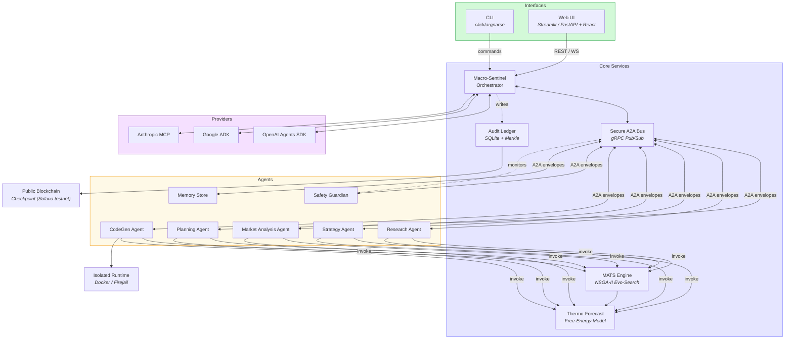
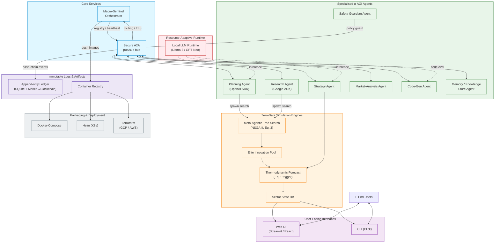

<!--
  🎖️ α-AGI Insight 👁️✨ — Beyond Human Foresight
  Production-grade Demo  ·  Version 1.0  (2025-05-24)
  © 2025 Montreal.AI — All rights reserved
-->

<p align="center">
  <b>Forecast AGI-driven economic phase-transitions<br>
  with a zero-data Meta-Agentic Tree-Search engine</b>
</p>

<p align="center">
  <a href="#quickstart">Quick-start</a> •
  <a href="#architecture">Architecture</a> •
  <a href="#cli-usage">CLI</a> •
  <a href="#web-ui">Web UI</a> •
  <a href="#deployment">Deployment</a> •
  <a href="#testing">Testing</a> •
  <a href="#safety--security">Safety&nbsp;&amp;&nbsp;Security</a>
</p>

---

## 1 Overview

**α-AGI Insight** is a turnkey multi-agent platform that **predicts when and
how Artificial General Intelligence will disrupt individual economic sectors**.
It fuses

* **Meta-Agentic Tree Search (MATS)** — an NSGA-II evolutionary loop that
  self-improves a population of *agent-invented* innovations **from zero data**;
* a **thermodynamic disruption trigger**  
  \( \Gibbs_s(t)=U_s-T_{\text{AGI}}(t)\,S_s \) that detects
  capability-driven phase-transitions;
* an interoperable **agent swarm** written with  
  **OpenAI Agents SDK ∙ Google ADK ∙ A2A protocol ∙ MCP tool calls**.

### α‑AGI Insight — Architectural Overview



The demo ships with both a **command-line interface** *and* an
optional **web dashboard** (Streamlit *or* FastAPI + React) so that analysts,
executives, and researchers can explore “what-if” scenarios in minutes.

> **Runs anywhere – with or without an `OPENAI_API_KEY`.**  
> When the key is absent, the system automatically switches to a local
> open-weights model and offline toolset.

### Repository Layout


---

## 2 Quick-start

> **Prerequisites**  
> • Python ≥ 3.11 • Git • Docker (only for container mode)  
> *(Optional)* Node ≥ 20 + pnpm if you plan to rebuild the React front-end.

```bash
# ❶ Clone & enter demo
git clone https://github.com/MontrealAI/AGI-Alpha-Agent-v0.git
cd AGI-Alpha-Agent-v0/alpha_factory_v1/demos/alpha_agi_insight_v1

# ❷ Create virtual-env & install deps
python -m venv .venv && source .venv/bin/activate
pip install -U pip
pip install -r requirements.txt     # ~2 min

# ❸ Fire up the all-in-one live demo
python src/interface/cli.py simulate --horizon 10
```

### Container in one line

```bash
docker run -it --rm -p 8501:8501   -e OPENAI_API_KEY=$OPENAI_API_KEY   ghcr.io/montrealai/alpha-agi-insight:latest
# →  open http://localhost:8501  (Streamlit dashboard)
```

---

## 3 Architecture



* **Macro-Sentinel / Orchestrator** – registers agents, routes **A2A** messages
  over a TLS gRPC bus, maintains a BLAKE3-hashed audit ledger whose Merkle root
  is checkpointed to the Solana test-net.
* **Agent Swarm** – seven sandboxed micro-services (Planning, Research,
  Strategy, Market, CodeGen, SafetyGuardian, Memory).  
  Each agent implements both an **OpenAI SDK** adapter *and* a **Google ADK**
  adapter and communicates through standard envelopes.
* **Simulation kernel** – `mats.py` (zero-data evolution) + `forecast.py`
  (thermodynamic trigger, baseline growth).
* **Interfaces** – `cli.py`, `web_app.py` (Streamlit) or
  `api_server.py` + `web_client/` (React) with live Pareto-front and
  disruption-timeline charts.

---

## 4 CLI usage

```bash
# Run ten-year forecast with default parameters
python src/interface/cli.py simulate --horizon 10

# Use a custom AGI growth curve (logistic) and fixed random seed
python src/interface/cli.py simulate --curve logistic --seed 42

# Display last run in pretty table form
python src/interface/cli.py show-results

# Monitor agent health in a live session
python src/interface/cli.py agents-status --watch
```

Helpful flags: `--offline` (force local models), `--pop-size`, `--generations`,
`--export csv|json`, `--verbose`.

---

## 5 Web UI

### 5.1 Streamlit (local demo)

```bash
streamlit run src/interface/web_app.py
# browse to http://localhost:8501
```

### 5.2 FastAPI + React (scalable)

```bash
# backend
uvicorn src/interface/api_server:app --reload --port 8000
# frontend (if you want to rebuild)
cd src/interface/web_client
pnpm install && pnpm dev
```

The React dashboard streams year-by-year events via WebSocket and renders:

* **Sector performance** with jump markers,
* **AGI capability curve**,
* **MATS Pareto front** evolution,
* real-time **agent logs**.

---

## 6 Configuration

| Variable | Purpose | Default |
|----------|---------|---------|
| `OPENAI_API_KEY` | Enables OpenAI-hosted LLMs | _unset_ → offline |
| `AGI_INSIGHT_OFFLINE` | Force offline mode | `0` |
| `AGI_INSIGHT_BUS_PORT` | gRPC bus port | `6006` |
| `AGI_INSIGHT_LEDGER_PATH` | Audit DB path | `./ledger/audit.db` |
| `AGI_INSIGHT_BROADCAST` | Enable blockchain broadcasting | `1` |
| `AGI_INSIGHT_SOLANA_URL` | Solana RPC endpoint | `https://api.testnet.solana.com` |
| `AGI_INSIGHT_SOLANA_WALLET` | Wallet private key (hex) | _unset_ |
| `AGI_INSIGHT_SOLANA_WALLET_FILE` | Path to wallet key file | _unset_ |

Create `.env` or pass via `docker -e`. Store wallet keys outside of `.env` and
use `AGI_INSIGHT_SOLANA_WALLET_FILE` to reference the file containing the
hex-encoded private key.

---

## 7 Deployment

| Target | Command | Notes |
|--------|---------|-------|
| **Docker (single)** | `docker run ghcr.io/montrealai/alpha-agi-insight` | Streamlit UI |
| **docker-compose** | `docker compose up` | Orchestrator + agents + UI |
| **Kubernetes** | `helm install agi-insight ./infrastructure/helm-chart` | GKE/EKS-ready |
| **Cloud Run** | `terraform apply -chdir=infrastructure/terraform` | GCP example |

All containers are x86-64/arm64 multi-arch and GPU-aware (CUDA 12).

---

## 8 Testing

```bash
pytest -q          # unit + integration suite
pytest -m e2e      # full 5-year forecast smoke-test
```

CI (GitHub Actions) runs lint, safety scan, and a headless simulation on every
push; only green builds are released to GHCR.

---

## 9 Safety & Security

* **Guardrails** – every LLM call passes through content filters and
  `SafetyGuardianAgent`; code generated by `CodeGenAgent` runs inside a
  network-isolated container with 512 MB memory & 30 s CPU cap.
* **Encrypted transport** – all agent traffic uses mTLS.
* **Immutable ledger** – every A2A envelope hashed with BLAKE3; Merkle root
  pinned hourly to a public chain for tamper-evidence.

---

## 10 Repository structure

```text
alpha_agi_insight_v1/
├─ README.md                 # ← you are here
├─ requirements.txt
├─ src/
│  ├─ orchestrator.py
│  ├─ agents/
│  │   ├─ base_agent.py
│  │   ├─ planning_agent.py
│  │   ├─ research_agent.py
│  │   ├─ strategy_agent.py
│  │   ├─ market_agent.py
│  │   ├─ codegen_agent.py
│  │   ├─ safety_agent.py
│  │   └─ memory_agent.py
│  ├─ simulation/
│  │   ├─ mats.py
│  │   ├─ forecast.py
│  │   └─ sector.py
│  ├─ interface/
│  │   ├─ cli.py
│  │   ├─ web_app.py
│  │   ├─ api_server.py
│  │   └─ web_client/
│  └─ utils/
│     ├─ messaging.py
│     ├─ config.py
│     └─ logging.py
├─ tests/
│  ├─ test_mats.py
│  ├─ test_forecast.py
│  ├─ test_agents.py
│  └─ test_cli.py
├─ infrastructure/
│  ├─ Dockerfile
│  ├─ docker-compose.yml
│  ├─ helm-chart/
│  └─ terraform/
│     ├─ main_gcp.tf
│     └─ main_aws.tf
└─ docs/
   ├─ DESIGN.md
   ├─ API.md
   └─ CHANGELOG.md
```

---

## 11 Contributing

Pull requests are welcome!  
Please read `docs/CONTRIBUTING.md` and file issues for enhancements or bugs.

---

## 12 License

This demo is released for **research & internal evaluation only**.

---

### ✨ See beyond human foresight. Build the future, today. ✨

