<!--
  🎖️ α-AGI Insight 👁️✨ — Beyond Human Foresight
  Production-grade Demo  ·  Version 1.0  (2025-05-24)
  © 2025 Montreal.AI — All rights reserved
-->

<p align="center">
  <b>Forecast AGI-driven economic phase-transitions<br>
  with a zero-data Meta-Agentic Tree-Search engine</b>
</p>

<p align="center">
  <a href="#quickstart" aria-label="Jump to quickstart">Quick-start</a> •
  <a href="#architecture">Architecture</a> •
  <a href="#cli-usage">CLI</a> •
  <a href="#web-ui">Web UI</a> •
  <a href="#deployment">Deployment</a> •
  <a href="#testing">Testing</a> •
  <a href="#safety--security">Safety&nbsp;&amp;&nbsp;Security</a>
</p>

---

## 1 Overview

**α-AGI Insight** is a turnkey multi-agent platform that **predicts when and
how Artificial General Intelligence will disrupt individual economic sectors**.
It fuses

* **Meta-Agentic Tree Search (MATS)** — an NSGA-II evolutionary loop that
  self-improves a population of *agent-invented* innovations **from zero data**;
* a **thermodynamic disruption trigger**  
  \( \Gibbs_s(t)=U_s-T_{\text{AGI}}(t)\,S_s \) that detects
  capability-driven phase-transitions;
* an interoperable **agent swarm** written with  
  **OpenAI Agents SDK ∙ Google ADK ∙ A2A protocol ∙ MCP tool calls**.

### α‑AGI Insight — Architectural Overview

```mermaid
flowchart TD
  %% ---------- Interface Layer ----------
  subgraph Interfaces
    CLI["CLI<br/><i>click/argparse</i>"]
    WEB["Web UI<br/><i>Streamlit / FastAPI + React</i>"]
  end

  %% ---------- Core Services ----------
  subgraph Core["Core Services"]
    ORCH["Macro‑Sentinel<br/>Orchestrator"]
    BUS["Secure A2A Bus<br/><i>gRPC Pub/Sub</i>"]
    LEDGER["Audit Ledger<br/><i>SQLite + Merkle</i>"]
    MATS["MATS Engine<br/><i>NSGA‑II Evo‑Search</i>"]
    FORECAST["Thermo‑Forecast<br/><i>Free‑Energy Model</i>"]
  end

  %% ---------- Agents ----------
  subgraph Agents
    PLAN["Planning Agent"]
    RESEARCH["Research Agent"]
    STRAT["Strategy Agent"]
    MARKET["Market Analysis Agent"]
    CODE["CodeGen Agent"]
    SAFE["Safety Guardian"]
    MEMORY["Memory Store"]
  end

  %% ---------- Providers & Runtime ----------
  subgraph Providers
    OPENAI["OpenAI Agents SDK"]
    ADK["Google ADK"]
    MCP["Anthropic MCP"]
  end
  SANDBOX["Isolated Runtime<br/><i>Docker / Firejail</i>"]
  CHAIN["Public Blockchain<br/><i>Checkpoint (Solana testnet)</i>"]

  %% ---------- Edges ----------
  CLI -->|commands| ORCH
  WEB -->|REST / WS| ORCH

  ORCH <--> BUS
  BUS <-->|A2A envelopes| PLAN
  BUS <-->|A2A envelopes| RESEARCH
  BUS <-->|A2A envelopes| STRAT
  BUS <-->|A2A envelopes| MARKET
  BUS <-->|A2A envelopes| CODE
  BUS <-->|A2A envelopes| SAFE
  BUS <-->|A2A envelopes| MEMORY

  SAFE -. monitors .-> BUS

  PLAN & RESEARCH & STRAT & MARKET & CODE -->|invoke| MATS
  PLAN & RESEARCH & STRAT & MARKET & CODE -->|invoke| FORECAST
  MATS --> FORECAST

  CODE --> SANDBOX

  ORCH -. writes .-> LEDGER
  LEDGER --> CHAIN

  ORCH <--> OPENAI
  ORCH <--> ADK
  ORCH <--> MCP

  MEMORY --- Agents

  %% ---------- Styling ----------
  classDef iface fill:#d3f9d8,stroke:#34a853,stroke-width:1px;
  classDef core fill:#e5e5ff,stroke:#6b6bff,stroke-width:1px;
  classDef agents fill:#fef9e7,stroke:#f39c12,stroke-width:1px;
  classDef provider fill:#f5e0ff,stroke:#8e44ad,stroke-width:1px;
  class Interfaces iface
  class Core core
  class Agents agents
  class Providers provider
```



The demo ships with both a **command-line interface** *and* an
optional **web dashboard** (Streamlit *or* FastAPI + React) so that analysts,
executives, and researchers can explore “what-if” scenarios in minutes.

> **Runs anywhere – with or without an `OPENAI_API_KEY`.**  
> When the key is absent, the system automatically switches to a local
> open-weights model and offline toolset.

### Repository Layout


---

## 2 Quick-start

> **Prerequisites**  
> • Python ≥ 3.11 • Git • Docker (only for container mode)  
> *(Optional)* Node ≥ 20 + pnpm if you plan to rebuild the React front-end.

```bash
# ❶ Clone & enter demo
git clone https://github.com/MontrealAI/AGI-Alpha-Agent-v0.git
cd AGI-Alpha-Agent-v0/alpha_factory_v1/demos/alpha_agi_insight_v1

# ❷ Create virtual-env & install deps
python -m venv .venv && source .venv/bin/activate
pip install -U pip
pip install -r requirements.lock    # ~2 min

# ❸ Fire up the all-in-one live demo
python -m alpha_factory_v1.demos.alpha_agi_insight_v1.src.interface.cli simulate --horizon 10
```

Launch the CLI using the `-m` flag or after installing the package so Python
can resolve module paths correctly.

### Container in one line

```bash
docker run -it --rm -p 8501:8501   -e OPENAI_API_KEY=$OPENAI_API_KEY   ghcr.io/montrealai/alpha-agi-insight:latest
# →  open http://localhost:8501  (Streamlit dashboard)
```

For offline builds or the browser-based PWA, see
[insight_browser_v1/README.md](insight_browser_v1/README.md).

---

## 3 Architecture

* **Macro-Sentinel / Orchestrator** – registers agents, routes **A2A** messages
  over a TLS gRPC bus, maintains a BLAKE3-hashed audit ledger whose Merkle root
  is checkpointed to the Solana test-net.
* **Agent Swarm** – seven sandboxed micro-services (Planning, Research,
  Strategy, Market, CodeGen, SafetyGuardian, Memory).  
  Each agent implements both an **OpenAI SDK** adapter *and* a **Google ADK**
  adapter and communicates through standard envelopes.
* **Simulation kernel** – `mats.py` (zero-data evolution) + `forecast.py`
  (thermodynamic trigger, baseline growth).
* **Interfaces** – `cli.py`, `web_app.py` (Streamlit) or
  `api_server.py` + `web_client/` (React) with live Pareto-front and
  disruption-timeline charts.

---

## 4 CLI usage

```bash
# Run ten-year forecast with default parameters
python -m alpha_factory_v1.demos.alpha_agi_insight_v1.src.interface.cli simulate --horizon 10

# Use a custom AGI growth curve (logistic) and fixed random seed
python -m alpha_factory_v1.demos.alpha_agi_insight_v1.src.interface.cli simulate --curve logistic --seed 42

# Display last run in pretty table form
python -m alpha_factory_v1.demos.alpha_agi_insight_v1.src.interface.cli show-results

# Monitor agent health in a live session
python -m alpha_factory_v1.demos.alpha_agi_insight_v1.src.interface.cli agents-status --watch

# Replay ledger events to inspect past runs
python -m alpha_factory_v1.demos.alpha_agi_insight_v1.src.interface.cli replay --count 20
```

`replay` replays ledger events stored under `AGI_INSIGHT_LEDGER_PATH` so you can step through previous runs.

Helpful flags: `--offline` (force local models), `--pop-size`, `--generations`,
`--export csv|json`, `--verbose`.

| Command | Description |
|---------|-------------|
| `simulate` | Run a forecast simulation. |
| `agents-status` | Show registered agents and health metrics. |
| `replay` | Replay events from `AGI_INSIGHT_LEDGER_PATH`. |

Example offline invocation:

```bash
LLAMA_MODEL_PATH=~/models/tinyllama.gguf \
python -m alpha_factory_v1.demos.alpha_agi_insight_v1.src.interface.cli simulate \
  --offline --llama-model-path "$LLAMA_MODEL_PATH"
```

### 4.1 Self-improver

`self-improver` evaluates a patch and merges it when the score in
`metric.txt` improves. It runs the `SelfImproverAgent` used by the
orchestrator.

```bash
python -m alpha_factory_v1.demos.alpha_agi_insight_v1.src.interface.cli self-improver \
  --repo ../../.. \
  --patch ../../../benchmarks/patch_library/task004_increment.diff
```

Set the following variables to load the agent automatically:

* `AGI_SELF_IMPROVE_PATCH` – unified diff file.
* `AGI_SELF_IMPROVE_REPO` – repository path.
* `AGI_SELF_IMPROVE_ALLOW` – comma-separated globs of allowed files.

Example:

```bash
export AGI_SELF_IMPROVE_PATCH=../../../benchmarks/patch_library/task004_increment.diff
export AGI_SELF_IMPROVE_REPO=../../..
export AGI_SELF_IMPROVE_ALLOW="**"

python -m alpha_factory_v1.demos.alpha_agi_insight_v1.src.interface.cli self-improver \
  --repo "$AGI_SELF_IMPROVE_REPO" --patch "$AGI_SELF_IMPROVE_PATCH"
```

---

## 5 Web UI

Streamlit is for demo-mode only—**not recommended for production**.
Use the **FastAPI + React** stack for production deployments.
### 5.1 Streamlit (demo mode only)

```bash
streamlit run src/interface/web_app.py
# browse to http://localhost:8501
```

### 5.2 FastAPI + React (production path)

```bash
# backend
uvicorn src/interface/api_server:app --reload --port 8000
# or via the CLI
python -m alpha_factory_v1.demos.alpha_agi_insight_v1 api-server
# frontend
cd alpha_factory_v1/demos/alpha_agi_insight_v1/src/interface/web_client
pnpm install
pnpm dev            # http://localhost:5173
# build production assets
pnpm build          # outputs to src/interface/web_client/dist/
# or run `make build_web` from the repo root
# or use `npm install && npm run build`
```

The built dashboard lives under `alpha_factory_v1/demos/alpha_agi_insight_v1/src/interface/web_client/dist/` and is copied
into the demo container.

The React client exposes an input form for **horizon**, **population size** and
**generations**. It listens to `/ws/progress` events and updates Plotly charts in
real-time as the simulation runs.

```bash
# build and launch containers
docker compose build
docker compose up
```

The React dashboard streams year-by-year events via WebSocket and renders:

* **Sector performance** with jump markers,
* **AGI capability curve**,
* **MATS Pareto front** evolution,
* real-time **agent logs**.

Typical REST endpoints:

- `POST /simulate` – launch a new run.
- `GET /results` – latest completed run.
- `GET /results/{id}` – specific run data.
- `GET /population/{id}` – MATS population only.
- `WS  /ws/progress` – live progress updates.

### 5.3 Rebuilding the React dashboard

Install [Node.js](https://nodejs.org/) **≥ 20** and
[pnpm](https://pnpm.io/installation) if you want to rebuild the front‑end.
From the repository root run:

```bash
cd alpha_factory_v1/demos/alpha_agi_insight_v1/src/interface/web_client
pnpm install && pnpm build
```

If the API runs on a different host, set `VITE_API_BASE_URL` when building:

```bash
VITE_API_BASE_URL=http://api.example.com pnpm build
```

Launch the container stack afterwards or serve `dist/` with any static server,
e.g. `python -m http.server --directory dist 8080`.

For advanced options see
[src/interface/web_client/README.md](src/interface/web_client/README.md).

For details see [docs/API.md](docs/API.md).

### 5.4 Building the Web Dashboard

Run the following commands under `src/interface/web_client` to compile the
React dashboard:

```bash
pnpm install
pnpm build
```

This installs dependencies and outputs static files in `dist/`. The provided
`Dockerfile` already runs these steps, so manual builds are only needed for
local development or customization. See the
[web_client/README.md](src/interface/web_client/README.md) for advanced usage.

---

## 6 Configuration

| Variable | Purpose | Default |
|----------|---------|---------|
| `OPENAI_API_KEY` | Enables OpenAI-hosted LLMs | _unset_ → offline |
| `AGI_INSIGHT_OFFLINE` | Force offline mode | `0` |
| `LLAMA_MODEL_PATH` | Path to local .gguf weights | `~/.cache/llama/TinyLlama-1.1B-Chat-v1.0.Q4_K_M.gguf` |
| `AGI_INSIGHT_BUS_PORT` | gRPC bus port | `6006` |
| `AGI_INSIGHT_BUS_CERT` | TLS certificate path | _unset_ |
| `AGI_INSIGHT_BUS_KEY` | TLS private key path | _unset_ |
| `AGI_INSIGHT_BUS_TOKEN` | Shared token for the gRPC bus | _unset_ |
| `AGI_INSIGHT_BROKER_URL` | Kafka broker URL for mirroring | _unset_ |
| `AGI_INSIGHT_ALLOW_INSECURE` | Allow non‑TLS bus (`1` to enable) | `0` |
| `AGI_INSIGHT_LEDGER_PATH` | Audit DB path | `./ledger/audit.db` |
| `AGI_INSIGHT_MEMORY_PATH` | Path used by `MemoryAgent` for persistent storage | _unset_ |
| `AGI_INSIGHT_JSON_LOGS` | Emit JSON formatted console logs (`1` to enable) | `0` |
| `OTEL_EXPORTER_OTLP_ENDPOINT` | Collector URL for traces/metrics | `http://tempo:4317` *(see `.env.sample`)* |
| `AGI_INSIGHT_DB` | Ledger backend (`sqlite`, `duckdb` or `postgres`) | `sqlite` |
| `AGI_INSIGHT_BROADCAST` | Enable blockchain broadcasting | `1` |
| `AGI_INSIGHT_SOLANA_URL` | Solana RPC endpoint | `https://api.testnet.solana.com` |
| `AGI_INSIGHT_SOLANA_WALLET` | Wallet private key (hex) | _unset_ |
| `AGI_INSIGHT_SOLANA_WALLET_FILE` | Path to wallet key file | _unset_ |
| `SIM_RESULTS_DIR` | Folder for simulation JSON results (created with mode `0700`) | `$ALPHA_DATA_DIR/simulations` |
| `MAX_RESULTS` | Number of results to keep on disk | `100` |
| `BUSINESS_HOST` | Base orchestrator URL for bridges | `"http://localhost:8000"` |
| `API_TOKEN` | Bearer token required by the REST API | `REPLACE_ME_TOKEN` |
| `API_RATE_LIMIT` | Requests allowed per minute for the API server | `60` |
| `AGI_ISLAND_BACKENDS` | Comma-separated mapping of island names to LLM backends | `default=gpt-4o` |
| `ALERT_WEBHOOK_URL` | Optional URL for orchestrator alert messages | _unset_ |
| `AGENT_ERR_THRESHOLD` | Consecutive errors before restart | `3` |
| `AGENT_BACKOFF_EXP_AFTER` | Restarts before exponential backoff | `3` |
| `PROMOTION_THRESHOLD` | Stake needed to auto-promote an agent | `0` |

`BUSINESS_HOST` sets the orchestrator URL used by helper commands to reach the REST API.

`API_TOKEN` must be set to a non-empty value before launching the API server. The
container exits during startup when this variable is empty.

To secure the gRPC bus provide `AGI_INSIGHT_BUS_CERT`,
`AGI_INSIGHT_BUS_KEY` and `AGI_INSIGHT_BUS_TOKEN`. When these are omitted set
`AGI_INSIGHT_ALLOW_INSECURE=1` to run without TLS. See
[docs/bus_tls.md](docs/bus_tls.md) for detailed setup.

Agents restart automatically when they fail or stop sending heartbeats.
`AGENT_ERR_THRESHOLD` controls how many consecutive errors trigger a restart.
Once an agent has restarted more than `AGENT_BACKOFF_EXP_AFTER` times,
the orchestrator doubles the delay before each subsequent attempt. The
`PROMOTION_THRESHOLD` value determines the stake needed for an agent to
start without manual approval at boot time.

### 6.1 Securing the A2A bus

Run `infrastructure/gen_bus_certs.sh` to create `certs/bus.crt` and
`certs/bus.key`. The script prints the environment variables
`AGI_INSIGHT_BUS_CERT`, `AGI_INSIGHT_BUS_KEY` and
`AGI_INSIGHT_BUS_TOKEN`.

Set these variables before starting the orchestrator. When provided,
`docker-compose.yml` automatically mounts the `certs` directory so the
containers can reference `/certs/bus.crt` and `/certs/bus.key`.

Before running the demo, copy `.env.sample` to `.env` (or pass variables via `docker -e`). Store wallet keys outside of `.env` and
use `AGI_INSIGHT_SOLANA_WALLET_FILE` to reference the file containing the
hex-encoded private key.
When `AGI_INSIGHT_MEMORY_PATH` is not set the MemoryAgent keeps records only in memory.
The API server stores simulation results as JSON files under `SIM_RESULTS_DIR`.
The directory is created with permissions `0700` when missing.

---

## 7 Deployment

| Target | Command | Notes |
|--------|---------|-------|
| **Docker (single)** | `docker run ghcr.io/montrealai/alpha-agi-insight` | Streamlit UI |
| **docker-compose** | `docker compose up` | Orchestrator + agents + UI |
| **Kubernetes** | `helm install agi-insight ./infrastructure/helm-chart` | GKE/EKS-ready |
| **Cloud Run** | `terraform apply -chdir=infrastructure/terraform` | GCP example |

All containers are x86-64/arm64 multi-arch and GPU-aware (CUDA 12).
`infrastructure/helm-chart/values.example.yaml` shows typical overrides such as API tokens, service ports and replica counts.

---

## 8 Testing

Running the suite directly from the repository root requires Python to locate
the `alpha_factory_v1` package. Either install the project or export
`PYTHONPATH=$(pwd)` before invoking `pytest`:

```bash
export PYTHONPATH=$(pwd)  # if running from the repo root without installation
pytest -q          # unit + integration suite
pytest -m e2e      # full 5-year forecast smoke-test
```

CI (GitHub Actions) runs lint, safety scan, and a headless simulation on every
push; only green builds are released to GHCR.

### 8.1 Offline test setup

Build wheels for all dependencies on a machine with connectivity:

```bash
mkdir -p /media/wheels
pip wheel -r requirements.txt -w /media/wheels
pip wheel -r requirements-dev.txt -w /media/wheels
```

Set the wheelhouse before running the environment check and tests:

```bash
WHEELHOUSE=/media/wheels python check_env.py --auto-install
WHEELHOUSE=/media/wheels pytest -q
```

`playwright` and other heavy packages must exist in the wheelhouse for tests to
pass offline.

---

## 9 Safety & Security

* **Guardrails** – every LLM call passes through content filters and
  `SafetyGuardianAgent`; code generated by `CodeGenAgent` runs inside a
  network-isolated container with 256 MB memory & 30 s CPU cap.
* **Encrypted transport** – all agent traffic uses mTLS.
* **Immutable ledger** – every A2A envelope hashed with BLAKE3; Merkle root
  pinned hourly to a public chain for tamper-evidence.
* **Secure tar extraction** – the `/mutate` endpoint validates archive members to
  block path traversal.

---

## 10 Repository structure

```text
alpha_agi_insight_v1/
├─ README.md                 # ← you are here
├─ requirements.lock
├─ src/
│  ├─ orchestrator.py
│  ├─ agents/
│  │   ├─ base_agent.py
│  │   ├─ planning_agent.py
│  │   ├─ research_agent.py
│  │   ├─ strategy_agent.py
│  │   ├─ market_agent.py
│  │   ├─ codegen_agent.py
│  │   ├─ safety_agent.py
│  │   └─ memory_agent.py
│  ├─ simulation/
│  │   ├─ mats.py
│  │   ├─ forecast.py
│  │   └─ sector.py
│  ├─ interface/
│  │   ├─ cli.py
│  │   ├─ web_app.py
│  │   ├─ api_server.py
│  │   └─ web_client/
│  └─ utils/
│     ├─ messaging.py
│     ├─ config.py
│     └─ logging.py
├─ tests/
│  ├─ test_mats.py
│  ├─ test_forecast.py
│  ├─ test_agents.py
│  └─ test_cli.py
├─ infrastructure/
│  ├─ Dockerfile
│  ├─ docker-compose.yml
│  ├─ helm-chart/
│  └─ terraform/
│     ├─ main_gcp.tf
│     └─ main_aws.tf
└─ docs/
   ├─ DESIGN.md
   ├─ API.md
   └─ CHANGELOG.md
```

---

## 11 Contributing

Pull requests are welcome!  
Please read `docs/CONTRIBUTING.md` and file issues for enhancements or bugs.

---

## 12 License

This demo is released for **research & internal evaluation only**.

---

### ✨ See beyond human foresight. Build the future, today. ✨

