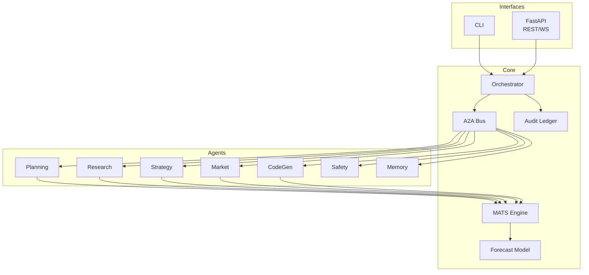

# α‑AGI Insight v1 – Design Overview

This document outlines the architecture of the **α‑AGI Insight** demo. The goal is to forecast AGI driven disruptions across economic sectors using a lightweight swarm of specialised agents. The demo runs fully offline when API keys are absent and exposes both a CLI and REST interface.

## 1 Architecture

The system is composed of a small orchestrator, a secure A2A message bus and a set of micro‑agents. Interactions are persisted in an immutable ledger so previous simulations can be replayed.

### Message Flow
1. **Planning** seeds a simulation cycle with high‑level goals.
2. **Research** enriches the plan with background information.
3. **Strategy** selects promising sectors or technologies.
4. **Market** evaluates economic impact.
5. **CodeGen** produces executable prototypes when needed.
6. **Safety** performs policy checks.
7. **Memory** records the envelope and updates the ledger.

Each step runs deterministically in short cycles so results are reproducible.

## 2 Agents

* **PlanningAgent** – generates an execution plan and defines the search horizon.
* **ResearchAgent** – gathers context from local files or online APIs when allowed.
* **StrategyAgent** – scores sectors and chooses which options to explore further.
* **MarketAgent** – estimates economic potential and risk exposure.
* **CodeGenAgent** – produces minimal code fragments for experiments or modelling.
* **SafetyGuardianAgent** – enforces policy and filters harmful actions.
* **MemoryAgent** – persists all envelopes for replay and audit.

The orchestrator invokes these agents sequentially and keeps the ledger consistent.

## 3 Meta‑Agentic Tree Search (MATS)

MATS is an NSGA‑II style evolutionary search. Candidate solutions are encoded as small numeric genomes. Each generation sorts the population by dominance and crowding distance, then applies crossover and mutation to produce the next generation. This explores the Pareto surface between competing objectives.

The demo evaluates candidates with a simple function but the same loop can optimise arbitrary metrics. Deterministic seeds allow experiments to be repeated exactly.

## 4 Forecasting Algorithm

The forecasting model combines the MATS output with a thermodynamic disruption trigger:
\[ \Gamma_s(t) = U_s - T_{\text{AGI}}(t) \, S_s \]
where \(U_s\) is sector potential energy and \(S_s\) is systemic entropy. When \(\Gamma_s(t) \le 0\) the model predicts a phase transition and the sector becomes disrupted. The resulting timeline is returned through the REST API and visualised in the web UI.

## 5 Deployment

The demo can run locally with only Python installed or inside containers using Docker or Kubernetes manifests found under `infrastructure/`. All configuration is supplied via `.env` variables including API tokens and port numbers. When running in offline mode the search relies solely on the built‑in toolset.
