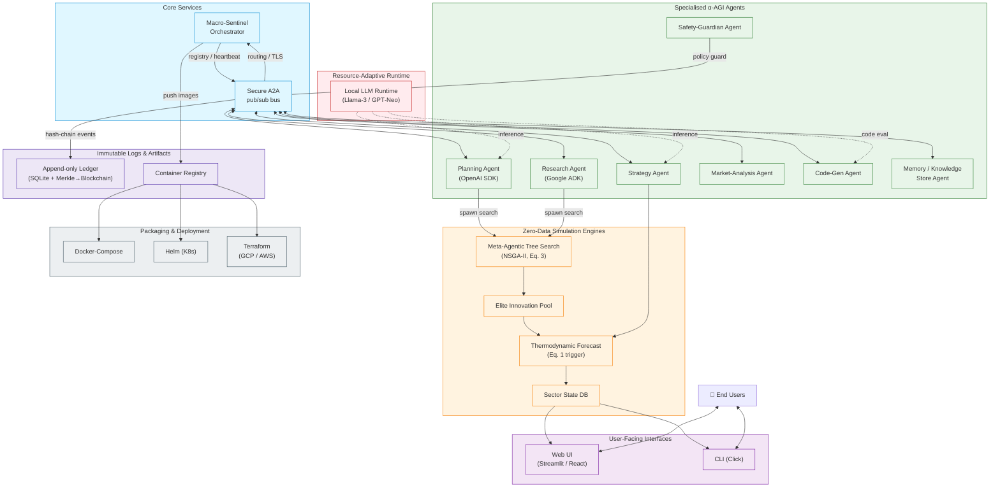

# 🎖️ α‑AGI Insight 👁️✨ — Beyond Human Foresight — Official Demo  
## Production‑grade System & Repository Blueprint (Mermaid)

Below are **two complementary Mermaid diagrams** that can be embedded directly in
`alpha_factory_v1/demos/alpha_agi_insight_v1/README.md`.

1. **High‑level runtime architecture** – shows how users, interfaces, the
   Orchestrator, specialised agents, the secure A2A bus, the zero‑data MATS
   simulation engine and the audit‑ledger fit together in production.
2. **Repository layout** – a living map of the code‑base so contributors and
   auditors can instantly understand where every responsibility lives.

---

```mermaid
%% =====================================================================
%%  1️⃣  RUNTIME ARCHITECTURE – α‑AGI Insight (Zero‑Data Edition)
%% =====================================================================
flowchart TD
    subgraph C[🟢 Client Tier]
        User([User<br/>(decision‑maker)])
        CLI[[`alpha-insight` CLI]]
        WebUI[[Web&nbsp;UI<br/>(Streamlit / React)]]
        User -- "commands / scripts" --> CLI
        User -- "interactive flows" --> WebUI
    end

    subgraph O[🔵 Orchestration Core]
        Orchestrator[[Macro‑Sentinel<br/>(Orchestrator)]]
        A2A[[Secure A2A&nbsp;Bus<br/>(gRPC + TLS)]]
    end

    subgraph AG[🟣 Specialised α‑AGI Agents]
        Planning[PlanningAgent]
        Research[ResearchAgent]
        Strategy[StrategyAgent]
        Market[MarketAnalysisAgent]
        CodeGen[CodeGenAgent]
        Safety[SafetyGuardian]
        Memory[MemoryAgent]
    end

    subgraph SIM[🟠 Zero‑Data Simulation]
        Engine[[MATS + Thermo‑Forecast Engine]]
    end

    subgraph ST[🟡 Persistence & Audit]
        Ledger[(Append‑only Audit Ledger<br/>+ Merkle roots)]
        KStore[(Shared Knowledge Store)]
    end

    subgraph DEPLOY[⚙️  Deployment Fabric]
        Docker[(Docker / K8s&nbsp;Pods)]
        Helm[(Helm Charts)]
        TF[(Terraform IaC)]
    end

    %% --- Interface paths ---
    CLI --> Orchestrator
    WebUI --> Orchestrator

    %% --- Orchestrator <-> agents ---
    Orchestrator -- "register / heartbeat" --> A2A
    A2A <---> Planning & Research & Strategy & Market & CodeGen & Safety & Memory

    %% --- Simulation calls ---
    Orchestrator -- "spawn run / collect results" --> Engine
    Planning & Research & Strategy & Market & CodeGen --> Engine
    Engine -- "trajectories / KPIs" --> Orchestrator
    Engine -- "sector curves" --> WebUI

    %% --- Persistence ---
    Orchestrator --> Ledger
    Planning & Research & Strategy & Market & CodeGen --> Ledger
    Safety --> Ledger
    Memory --- KStore
    Engine --> KStore

    %% --- Deployment mapping ---
    Docker --> Orchestrator & A2A & Engine & Planning & Research & Strategy & Market & CodeGen & Safety & Memory & WebUI
    Helm --> Docker
    TF --> Docker
```

---

```mermaid
%% =====================================================================
%% 2️⃣  MONOREPO STRUCTURE – alpha_agi_insight_v1
%% =====================================================================
flowchart TD
    R[alpha_agi_insight_v1]:::root
    R --> READM[README.md]
    R --> REQ[requirements.txt]

    subgraph SRCDIR["src/"]:::dir
        SRCDIR --> ORCH[orchestrator.py]
        SRCDIR --> AGENTS[agents/]:::dir
        SRCDIR --> SIMS[simulation/]:::dir
        SRCDIR --> INTF[interface/]:::dir
        SRCDIR --> UTIL[utils/]:::dir
    end
    R --> SRCDIR

    %% agents subtree
    AGENTS --> BASE[base_agent.py]
    AGENTS --> PLA[planning_agent.py]
    AGENTS --> RES[research_agent.py]
    AGENTS --> STR[strategy_agent.py]
    AGENTS --> MAR[market_agent.py]
    AGENTS --> CG[codegen_agent.py]
    AGENTS --> SAF[safety_agent.py]
    AGENTS --> MEM[memory_agent.py]

    %% simulation subtree
    SIMS --> MATS[mats.py]
    SIMS --> FORE[forecast.py]
    SIMS --> SECT[sector.py]

    %% interface subtree
    INTF --> CLI[cli.py]
    INTF --> WAPP[web_app.py]
    INTF --> API[api_server.py]
    INTF --> WEBCL[web_client/]:::dir

    %% utils subtree
    UTIL --> MSG[messaging.py]
    UTIL --> CFG[config.py]
    UTIL --> LOG[logging.py]

    %% top‑level peers
    R --> TESTS[tests/]:::dir
    R --> INFRA[infrastructure/]:::dir
    R --> DOCS[docs/]:::dir

    classDef dir fill:#e6f7ff,stroke:#0284c7,stroke-width:1px;
    classDef root fill:#fffbe6,stroke:#d97706,stroke-width:2px;
```

