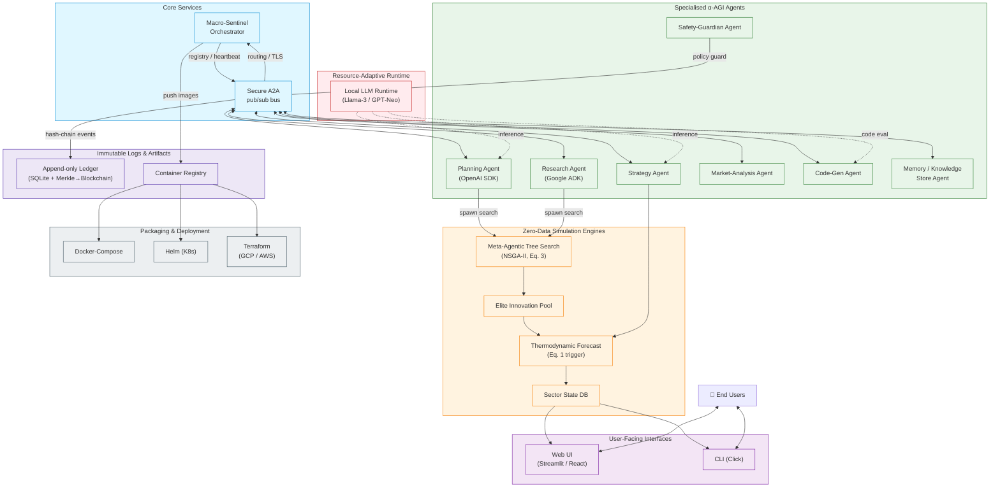

```mermaid
%% 🎖️ α‑AGI Insight 👁️✨ — Beyond Human Foresight — Official Demo
%% Comprehensive architecture & workflow diagram (ZERO‑DATA)

flowchart TD
  %% === Core Orchestration Layer ===
  subgraph Core["Core Services"]
    Orchestrator["Macro‑Sentinel<br/>Orchestrator"]
    MessageBus["Secure A2A<br/>pub/sub bus"]
  end

  Orchestrator -- "registry / heartbeat" --> MessageBus
  MessageBus -- "routing / TLS" --> Orchestrator

  %% === Agents Swarm ===
  subgraph AgentsPool["Specialised α‑AGI Agents"]
    PlanningAgent["Planning Agent<br/>(OpenAI SDK)"]
    ResearchAgent["Research Agent<br/>(Google ADK)"]
    StrategyAgent["Strategy Agent"]
    MarketAgent["Market‑Analysis Agent"]
    CodeGenAgent["Code‑Gen Agent"]
    SafetyAgent["Safety‑Guardian Agent"]
    MemoryAgent["Memory / Knowledge<br/>Store Agent"]
  end

  MessageBus <--> PlanningAgent
  MessageBus <--> ResearchAgent
  MessageBus <--> StrategyAgent
  MessageBus <--> MarketAgent
  MessageBus <--> CodeGenAgent
  MessageBus <--> MemoryAgent
  SafetyAgent -- "policy guard" --- MessageBus

  %% === Simulation & Analytics Engines ===
  subgraph Simulation["Zero‑Data Simulation Engines"]
    MATS["Meta‑Agentic Tree Search<br/>(NSGA‑II, Eq. 3)"]
    Forecast["Thermodynamic Forecast<br/>(Eq. 1 trigger)"]
    InnovationPool["Elite Innovation Pool"]
    SectorDB["Sector State DB"]
  end

  PlanningAgent -- "spawn search" --> MATS
  ResearchAgent -- "spawn search" --> MATS
  MATS --> InnovationPool
  InnovationPool --> Forecast
  StrategyAgent --> Forecast
  Forecast --> SectorDB

  %% === User Interfaces ===
  subgraph Interfaces["User‑Facing Interfaces"]
    WebUI["Web UI<br/>(Streamlit / React)"]
    CLI["CLI (Click)"]
  end

  SectorDB --> WebUI
  SectorDB --> CLI
  Users["👤 End Users"] <--> WebUI
  Users <--> CLI

  %% === Storage & Audit ===
  subgraph Storage["Immutable Logs & Artifacts"]
    Ledger["Append‑only Ledger<br/>(SQLite + Merkle→Blockchain)"]
    ContainerRegistry["Container Registry"]
  end

  MessageBus -- "hash‑chain events" --> Ledger
  Orchestrator -- "push images" --> ContainerRegistry

  %% === Deployment & Ops ===
  subgraph DevOps["Packaging & Deployment"]
    DockerCompose["Docker‑Compose"]
    HelmChart["Helm (K8s)"]
    Terraform["Terraform<br/>(GCP / AWS)"]
  end

  ContainerRegistry --> DockerCompose
  ContainerRegistry --> HelmChart
  ContainerRegistry --> Terraform

  %% === Offline / Air‑gapped Mode ===
  subgraph OfflineMode["Resource‑Adaptive Runtime"]
    LocalLLM["Local LLM Runtime<br/>(Llama‑3 / GPT‑Neo)"]
  end
  LocalLLM -. "inference" .-> PlanningAgent
  LocalLLM -. "inference" .-> StrategyAgent
  LocalLLM -. "code eval" .-> CodeGenAgent

  %% Styling
  classDef core fill:#e0f7ff,stroke:#0288d1,stroke-width:1px;
  classDef agents fill:#e8f5e9,stroke:#2e7d32,stroke-width:1px;
  classDef sim fill:#fff3e0,stroke:#f57c00,stroke-width:1px;
  classDef iface fill:#f3e5f5,stroke:#7b1fa2,stroke-width:1px;
  classDef storage fill:#ede7f6,stroke:#512da8,stroke-width:1px;
  classDef devops fill:#eceff1,stroke:#455a64,stroke-width:1px;
  classDef offline fill:#ffebee,stroke:#c62828,stroke-width:1px;

  class Core,Orchestrator,MessageBus core;
  class AgentsPool,PlanningAgent,ResearchAgent,StrategyAgent,MarketAgent,CodeGenAgent,SafetyAgent,MemoryAgent agents;
  class Simulation,MATS,Forecast,InnovationPool,SectorDB sim;
  class Interfaces,WebUI,CLI iface;
  class Storage,Ledger,ContainerRegistry storage;
  class DevOps,DockerCompose,HelmChart,Terraform devops;
  class OfflineMode,LocalLLM offline;
```
