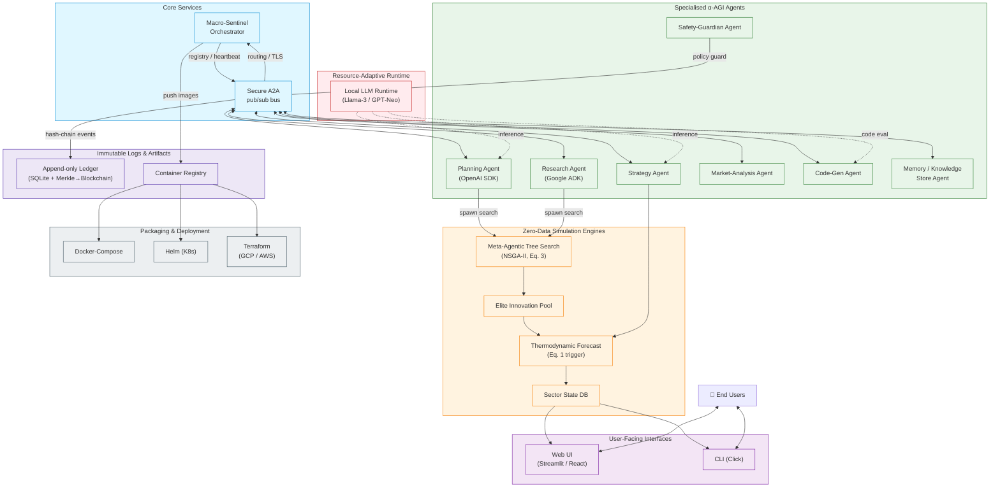
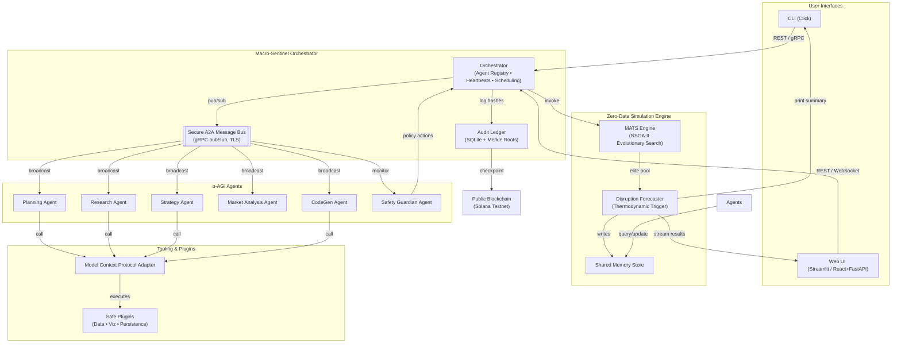

# 🎖️ α‑AGI Insight 👁️✨ — Beyond Human Foresight — Official Demo  
### Production‑Grade System – Mermaid Specification
> **Note:** Copy‑paste the following Mermaid blocks into your README.md (or any Mermaid‑enabled renderer) to obtain interactive architecture, repository, and DevOps diagrams.

---

## 1. End‑to‑End System Architecture


---

## 2. Repository Layout
```mermaid
%% Logical Repository Tree (folders collapsed for brevity)
graph LR
    R[alpha_agi_insight_v0/]---README[README.md]
    R---REQ[requirements.txt]

    subgraph SRC[/src]
        SRC_ORCH[orchestrator.py]
        SRC_AGENTS[/agents]
        SRC_SIM[/simulation]
        SRC_INT[/interface]
        SRC_UTIL[/utils]
    end
    R---SRC

    subgraph AGENTS_TREE
        SRC_AGENTS_BASE[base_agent.py]
        SRC_AGENTS_PLAN[planning_agent.py]
        SRC_AGENTS_RES[research_agent.py]
        SRC_AGENTS_STR[strategy_agent.py]
        SRC_AGENTS_MAR[market_agent.py]
        SRC_AGENTS_CODE[codegen_agent.py]
        SRC_AGENTS_SAFE[safety_agent.py]
        SRC_AGENTS_MEM[memory_agent.py]
    end
    SRC_AGENTS---AGENTS_TREE

    subgraph SIM_TREE
        SRC_SIM_MATS[mats.py]
        SRC_SIM_FORE[forecast.py]
        SRC_SIM_SECT[sector.py]
    end
    SRC_SIM---SIM_TREE

    subgraph INT_TREE
        SRC_INT_CLI[cli.py]
        SRC_INT_WEB[web_app.py]
        SRC_INT_API[api_server.py]
        SRC_INT_REACT[/web_client]
    end
    SRC_INT---INT_TREE

    subgraph UTIL_TREE
        SRC_UTIL_MSG[messaging.py]
        SRC_UTIL_CFG[config.py]
        SRC_UTIL_LOG[logging.py]
    end
    SRC_UTIL---UTIL_TREE

    R---TESTS[/tests]
    R---INFRA[/infrastructure]
    R---DOCS[/docs]
```

---

## 3. CI/CD & Deployment Pipeline
```mermaid
flowchart LR
    Dev[Developer Push]-->CI[GitHub Actions / CI]
    CI-->|Unit & Integration Tests|TestPass{All Tests Pass?}
    TestPass-->|Yes|Build[Docker Multi‑Arch Build]
    TestPass-->|No|Fail[Fail Pipeline]

    Build-->Scan[Security Scan (Snyk/Trivy)]
    Scan-->|Pass|PushReg[Push Image to Registry]

    PushReg-->|Tag Release|HelmChart[Helm Package Update]
    HelmChart-->CD[ArgoCD / Flux]

    CD-->|Deploy|K8s[Kubernetes Cluster<br/>(Prod / Staging)]
    K8s-->|Health Checks|Monitor[Prometheus / Grafana]
    Monitor-->|Alerts|Ops[Ops Team]

    K8s-->|Rolling Update Success|Users[End Users]
```

---

## 4. Legend
- **Solid arrows**: primary data/control flow  
- **Dashed arrows**: monitoring / logging / audit paths  
- **Rounded rectangles**: active services or agents  
- **Parallelograms**: data stores or ledgers  
- **Cylinders**: external persistent storage / blockchain  
