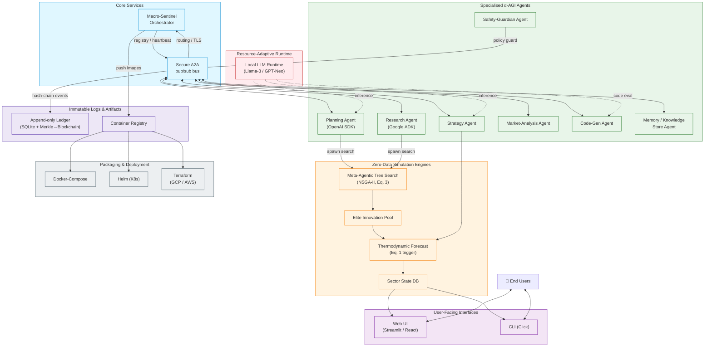

```mermaid
%% α‑AGI Insight — Beyond Human Foresight
%% System‑level & Repository Structure overview
%% Place this block inside README.md for live rendering.

%% ------------------------------------------------------------------
%% 1. High‑Level Architecture
%% ------------------------------------------------------------------
graph TD
    %% Core orchestration
    Orchestrator["🧠 Macro‑Sentinel<br/>Orchestrator"]:::core
    
    %% Secure message backbone
    Bus["🔗 Secure Pub/Sub<br/>A2A Bus"]:::bus
    
    Orchestrator <-->|register/heartbeat| Bus
    
    %% Primary agent cluster
    subgraph "Agent Swarm"
        direction LR
        Planning["🗺️ Planning<br/>Agent"]:::agent
        Research["🔎 Research<br/>Agent"]:::agent
        Strategy["🎯 Strategy<br/>Agent"]:::agent
        Market["📈 MarketAnalysis<br/>Agent"]:::agent
        CodeGen["💻 CodeGen<br/>Agent"]:::agent
        Safety["🛡️ Safety Guardian"]:::safety
        Memory["📚 Memory Store"]:::memory
    end
    
    Bus --"A2A envelopes"--> Planning
    Bus --> Research
    Bus --> Strategy
    Bus --> Market
    Bus --> CodeGen
    Bus --> Safety
    Bus --> Memory
    
    %% Simulation engine (invoked by agents)
    SimEngine["⚙️ MATS + Thermo‑Forecast Engine"]:::engine
    CodeGen -->|invoke| SimEngine
    Planning --> SimEngine
    Research --> SimEngine
    Strategy --> SimEngine
    
    %% Interfaces
    subgraph "User Interfaces"
        CLI["💻 Hybrid CLI"]:::ui
        WebUI["🌐 Web Dashboard<br/>(Streamlit / FastAPI + React)"]:::ui
    end
    
    CLI -->|gRPC / local call| Orchestrator
    WebUI -->|REST / WebSocket| Orchestrator
    
    %% External connectors
    Plugins["🔌 Plugin Gateway<br/>(MCP Tools)"]:::plugin
    SimEngine <-->|tool calls| Plugins
    
    %% Data & Audit
    Ledger["🗄️ Append‑only Audit Ledger<br/>(SQLite + Merkle Roots)"]:::data
    Memory --> Ledger
    Safety --> Ledger
    Orchestrator --> Ledger
    
    %% Style definitions
    classDef core fill:#ffd9b3,stroke:#333,stroke-width:1.5px;
    classDef agent fill:#d0e6ff,stroke:#1b4f9c,stroke-width:1.5px;
    classDef safety fill:#ffcccc,stroke:#b22222,stroke-width:1.5px;
    classDef memory fill:#e6ffe6,stroke:#2e8b57,stroke-width:1.5px;
    classDef engine fill:#f0f0f0,stroke:#555,stroke-width:1.5px;
    classDef bus fill:#e0d7ff,stroke:#5d3fd3,stroke-width:1.5px,stroke-dasharray: 5 5;
    classDef ui fill:#fff2b2,stroke:#c38f00,stroke-width:1.5px;
    classDef plugin fill:#f7e6ff,stroke:#663399,stroke-width:1.5px;
    classDef data fill:#cccccc,stroke:#333,stroke-width:1.5px;
    
%% ------------------------------------------------------------------
%% 2. Repository Structure (simplified)
%% ------------------------------------------------------------------
    
    classDiagram
        class alpha_agi_insight_v1 {
            +README.md
            +requirements.txt
            +infrastructure/
            +docs/
            +tests/
            +src/
        }
        alpha_agi_insight_v1 --> src
        src --> orchestrator.py
        src --> utils
        src --> simulation
        src --> interface
        src --> agents
        
        class agents {
            +base_agent.py
            +planning_agent.py
            +research_agent.py
            +strategy_agent.py
            +market_agent.py
            +codegen_agent.py
            +safety_agent.py
            +memory_agent.py
        }
        class simulation {
            +mats.py
            +forecast.py
            +sector.py
        }
        class interface {
            +cli.py
            +web_app.py
            +api_server.py
            +web_client/
        }
        class utils {
            +messaging.py
            +config.py
            +logging.py
        }
```
