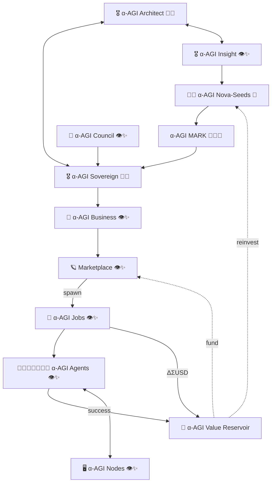

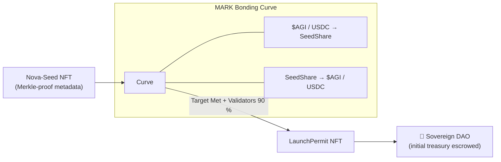

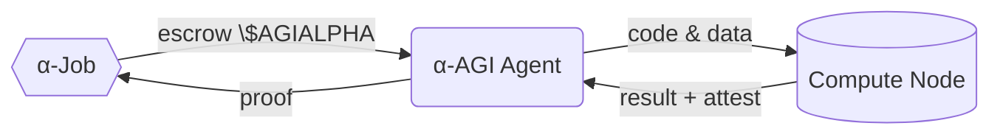

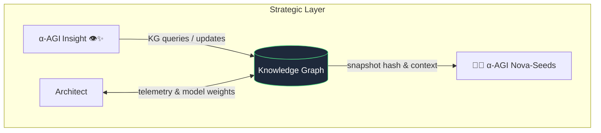

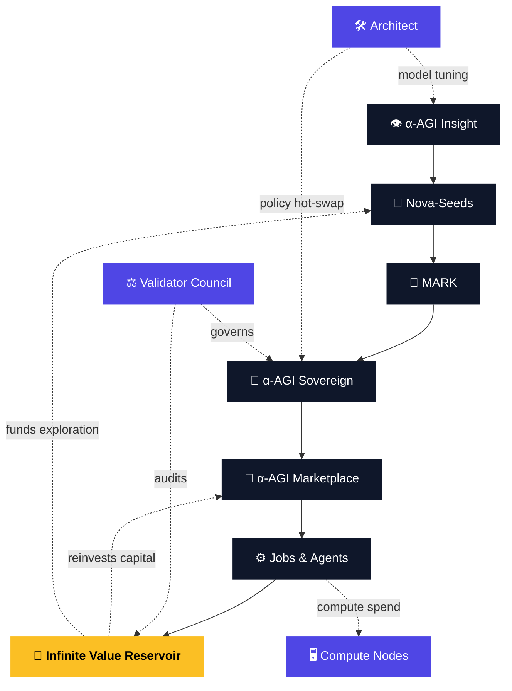

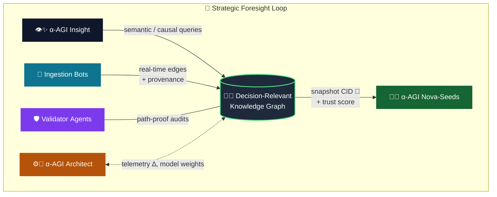

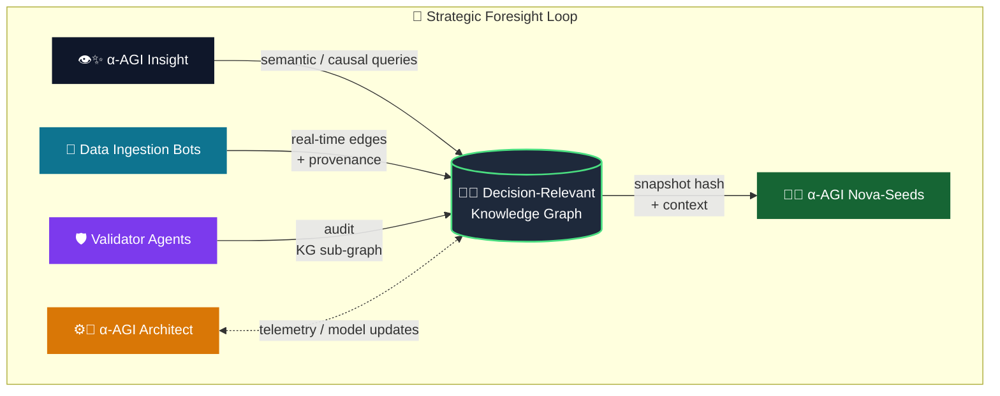

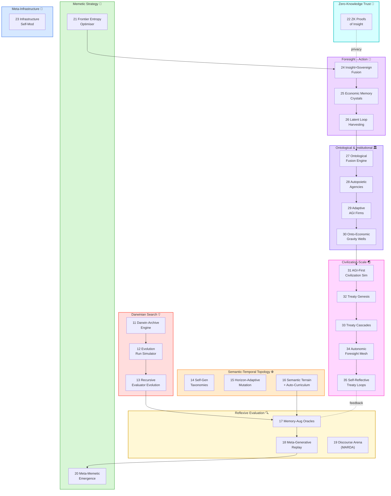

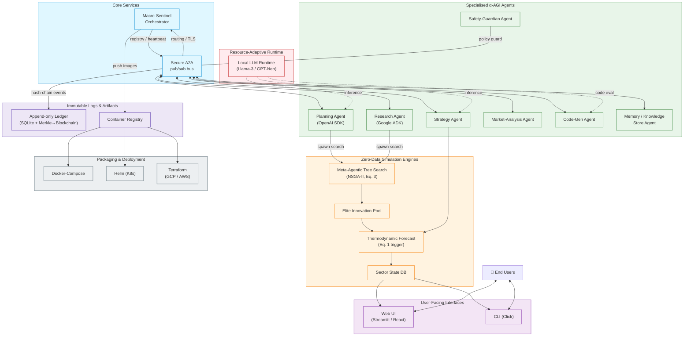

# 🎖️ α‑AGI Insight 👁️✨ — Beyond Human Foresight — Official Demo  
### Production‑Grade System – Mermaid Specification
> **Note:** Copy‑paste the following Mermaid blocks into your README.md (or any Mermaid‑enabled renderer) to obtain interactive architecture, repository, and DevOps diagrams.

---

## 1. End‑to‑End System Architecture
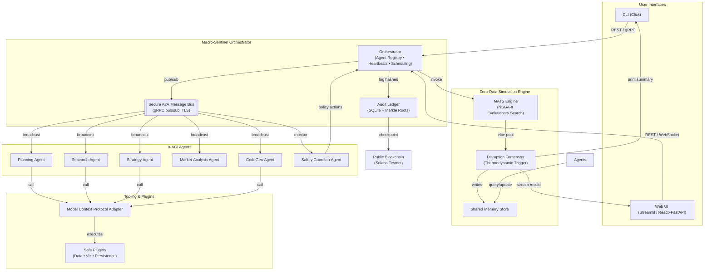

---

## 4. Legend
- **Solid arrows**: primary data/control flow  
- **Dashed arrows**: monitoring / logging / audit paths  
- **Rounded rectangles**: active services or agents  
- **Parallelograms**: data stores or ledgers  
- **Cylinders**: external persistent storage / blockchain

# α‑AGI Insight — Architectural Overview (Mermaid diagrams)

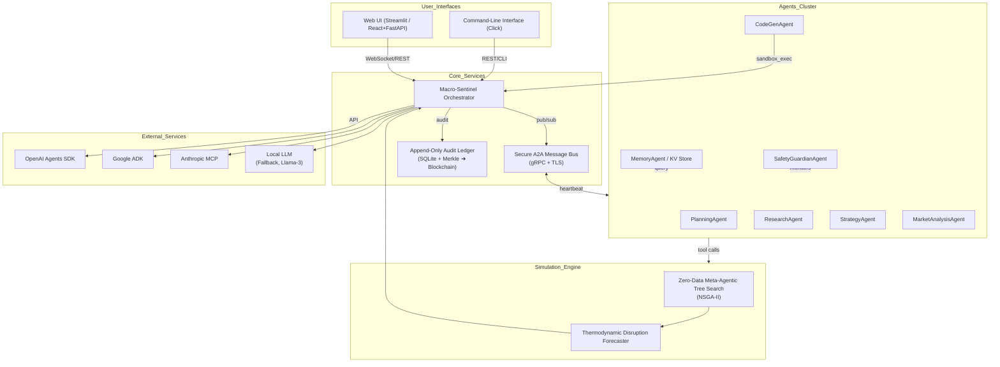

%% 🎖️ α‑AGI Insight 👁️✨ — Beyond Human Foresight — Official Demo (ZERO‑DATA)
%% Production‑grade Mermaid specification for README.md

### System Architecture

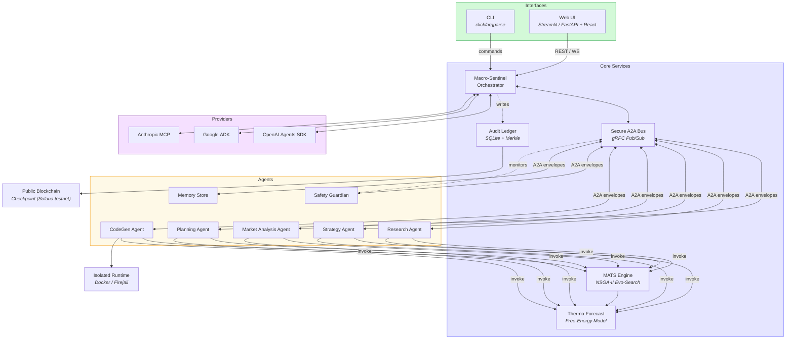

### Repository Layout

```mermaid
graph TD
  ROOT["alpha_agi_insight_v1/"]
  subgraph Root
    ROOT_README["README.md"]
    REQ["requirements.txt"]
    SRC["src/"]
    TEST["tests/"]
    INFRA["infrastructure/"]
    DOCS["docs/"]
  end

  %% src subtree
  subgraph Source["src/"]
    ORCH_PY["orchestrator.py"]
    UTILS["utils/"]
    AGENTS_DIR["agents/"]
    SIM["simulation/"]
    IFACE["interface/"]
  end
  SRC -->|contains| Source

  %% utils subtree
  UTILS_CFG["config.py"]
  UTILS_MSG["messaging.py"]
  UTILS_LOG["logging.py"]
  UTILS --> UTILS_CFG & UTILS_MSG & UTILS_LOG

  %% agents subtree
  AG_BASE["base_agent.py"]
  AG_PLAN["planning_agent.py"]
  AG_RES["research_agent.py"]
  AG_STRAT["strategy_agent.py"]
  AG_MARK["market_agent.py"]
  AG_CODE["codegen_agent.py"]
  AG_SAFE["safety_agent.py"]
  AG_MEM["memory_agent.py"]
  AGENTS_DIR --> AG_BASE & AG_PLAN & AG_RES & AG_STRAT & AG_MARK & AG_CODE & AG_SAFE & AG_MEM

  %% simulation subtree
  SIM_MATS["mats.py"]
  SIM_FC["forecast.py"]
  SIM_SEC["sector.py"]
  SIM --> SIM_MATS & SIM_FC & SIM_SEC

  %% interface subtree
  IF_CLI["cli.py"]
  IF_WEB["web_app.py"]
  IF_API["api_server.py"]
  IF_REACT["web_client/"]
  IFACE --> IF_CLI & IF_WEB & IF_API & IF_REACT

  %% tests subtree
  TEST_MATS["test_mats.py"]
  TEST_FC["test_forecast.py"]
  TEST_AG["test_agents.py"]
  TEST_CLI["test_cli.py"]
  TEST --> TEST_MATS & TEST_FC & TEST_AG & TEST_CLI

  %% infrastructure subtree
  INF_DOCK["Dockerfile"]
  INF_COMPOSE["docker-compose.yml"]
  INF_HELM["helm-chart/"]
  INF_TF["terraform/"]
  INFRA --> INF_DOCK & INF_COMPOSE & INF_HELM & INF_TF

  %% docs subtree
  DOC_DESIGN["DESIGN.md"]
  DOC_API["API.md"]
  DOC_CHANGE["CHANGELOG.md"]
  DOCS --> DOC_DESIGN & DOC_API & DOC_CHANGE
```

> **Download** this file to embed the diagrams directly in your README.

