```mermaid
%% ğŸ–ï¸ Î±â€‘AGI Insight ğŸ‘ï¸âœ¨ — Beyond Human Foresight — Official Demo
%% Comprehensive architecture & workflow diagram (ZERO‑DATA)

flowchart TD
  %% === Core Orchestration Layer ===
  subgraph Core["Core Services"]
    Orchestrator["Macro‑Sentinel<br/>Orchestrator"]
    MessageBus["Secure A2A<br/>pub/sub bus"]
  end

  Orchestrator -- "registry / heartbeat" --> MessageBus
  MessageBus -- "routing / TLS" --> Orchestrator

  %% === Agents Swarm ===
  subgraph AgentsPool["Specialised α‑AGI Agents"]
    PlanningAgent["Planning Agent<br/>(OpenAI SDK)"]
    ResearchAgent["Research Agent<br/>(Google ADK)"]
    StrategyAgent["Strategy Agent"]
    MarketAgent["Market‑Analysis Agent"]
    CodeGenAgent["Code‑Gen Agent"]
    SafetyAgent["Safety‑Guardian Agent"]
    MemoryAgent["Memory / Knowledge<br/>Store Agent"]
  end

  MessageBus <--> PlanningAgent
  MessageBus <--> ResearchAgent
  MessageBus <--> StrategyAgent
  MessageBus <--> MarketAgent
  MessageBus <--> CodeGenAgent
  MessageBus <--> MemoryAgent
  SafetyAgent -- "policy guard" --- MessageBus

  %% === Simulation & Analytics Engines ===
  subgraph Simulation["Zero‑Data Simulation Engines"]
    MATS["Meta‑Agentic Tree Search<br/>(NSGA‑II, Eq. 3)"]
    Forecast["Thermodynamic Forecast<br/>(Eq. 1 trigger)"]
    InnovationPool["Elite Innovation Pool"]
    SectorDB["Sector State DB"]
  end

  PlanningAgent -- "spawn search" --> MATS
  ResearchAgent -- "spawn search" --> MATS
  MATS --> InnovationPool
  InnovationPool --> Forecast
  StrategyAgent --> Forecast
  Forecast --> SectorDB

  %% === User Interfaces ===
  subgraph Interfaces["User‑Facing Interfaces"]
    WebUI["Web UI<br/>(Streamlit / React)"]
    CLI["CLI (Click)"]
  end

  SectorDB --> WebUI
  SectorDB --> CLI
  Users["👤 End Users"] <--> WebUI
  Users <--> CLI

  %% === Storage & Audit ===
  subgraph Storage["Immutable Logs & Artifacts"]
    Ledger["Append‑only Ledger<br/>(SQLite + Merkle→Blockchain)"]
    ContainerRegistry["Container Registry"]
  end

  MessageBus -- "hash‑chain events" --> Ledger
  Orchestrator -- "push images" --> ContainerRegistry

  %% === Deployment & Ops ===
  subgraph DevOps["Packaging & Deployment"]
    DockerCompose["Docker‑Compose"]
    HelmChart["Helm (K8s)"]
    Terraform["Terraform<br/>(GCP / AWS)"]
  end

  ContainerRegistry --> DockerCompose
  ContainerRegistry --> HelmChart
  ContainerRegistry --> Terraform

  %% === Offline / Air‑gapped Mode ===
  subgraph OfflineMode["Resource‑Adaptive Runtime"]
    LocalLLM["Local LLM Runtime<br/>(Llama‑3 / GPT‑Neo)"]
  end
  LocalLLM -. "inference" .-> PlanningAgent
  LocalLLM -. "inference" .-> StrategyAgent
  LocalLLM -. "code eval" .-> CodeGenAgent

  %% Styling
  classDef core fill:#e0f7ff,stroke:#0288d1,stroke-width:1px;
  classDef agents fill:#e8f5e9,stroke:#2e7d32,stroke-width:1px;
  classDef sim fill:#fff3e0,stroke:#f57c00,stroke-width:1px;
  classDef iface fill:#f3e5f5,stroke:#7b1fa2,stroke-width:1px;
  classDef storage fill:#ede7f6,stroke:#512da8,stroke-width:1px;
  classDef devops fill:#eceff1,stroke:#455a64,stroke-width:1px;
  classDef offline fill:#ffebee,stroke:#c62828,stroke-width:1px;

  class Core,Orchestrator,MessageBus core;
  class AgentsPool,PlanningAgent,ResearchAgent,StrategyAgent,MarketAgent,CodeGenAgent,SafetyAgent,MemoryAgent agents;
  class Simulation,MATS,Forecast,InnovationPool,SectorDB sim;
  class Interfaces,WebUI,CLI iface;
  class Storage,Ledger,ContainerRegistry storage;
  class DevOps,DockerCompose,HelmChart,Terraform devops;
  class OfflineMode,LocalLLM offline;
```

# 🎖️ α‑AGI Insight 👁️✨ — Beyond Human Foresight — Official Demo  
### Production‑Grade System – Mermaid Specification
> **Note:** Copy‑paste the following Mermaid blocks into your README.md (or any Mermaid‑enabled renderer) to obtain interactive architecture, repository, and DevOps diagrams.

---

## 1. End‑to‑End System Architecture

```mermaid
%% α‑AGI Insight – High‑Level Architecture
graph TD
    %% ===== User Interfaces =====
    subgraph UI[User Interfaces]
        CLI["CLI (Click)"]
        WebUI["Web UI (Streamlit / React+FastAPI)"]
    end

    %% ===== Orchestrator & Bus =====
    subgraph ORCH[Macro‑Sentinel Orchestrator]
        Orchestrator["Orchestrator<br/>(Agent Registry • Heartbeats • Scheduling)"]
        A2ABus[["Secure A2A Message Bus<br/>(gRPC pub/sub, TLS)"]]
        Ledger["Audit Ledger<br/>(SQLite + Merkle Roots)"]
    end

    %% ===== Core Engine =====
    subgraph CORE[Zero‑Data Simulation Engine]
        MATS["MATS Engine<br/>(NSGA‑II Evolutionary Search)"]
        Forecast["Disruption Forecaster<br/>(Thermodynamic Trigger)"]
        Memory["Shared Memory Store"]
    end

    %% ===== Agents =====
    subgraph AGENTS[α‑AGI Agents]
        Planning["Planning Agent"]
        Research["Research Agent"]
        Strategy["Strategy Agent"]
        Market["Market Analysis Agent"]
        CodeGen["CodeGen Agent"]
        Safety["Safety Guardian Agent"]
    end

    %% ===== Tool Layer =====
    subgraph TOOLS[Tooling & Plugins]
        MCP["Model Context Protocol Adapter"]
        Plugins["Safe Plugins<br/>(Data • Viz • Persistence)"]
    end

    %% ===== Data / Chain =====
    Blockchain["Public Blockchain<br/>(Solana Testnet)"]

    %% --- Data Flow ---
    CLI-->|REST / gRPC|Orchestrator
    WebUI-->|REST / WebSocket|Orchestrator

    Orchestrator-->|pub/sub|A2ABus
    A2ABus-->|broadcast|Planning
    A2ABus-->|broadcast|Research
    A2ABus-->|broadcast|Strategy
    A2ABus-->|broadcast|Market
    A2ABus-->|broadcast|CodeGen
    A2ABus-->|monitor|Safety

    Safety-->|policy actions|Orchestrator

    %% Agents tool calls
    Planning-->|call|MCP
    Research-->|call|MCP
    Strategy-->|call|MCP
    CodeGen-->|call|MCP
    MCP-->|executes|Plugins

    %% Core Engine links
    Orchestrator-->|invoke|MATS
    MATS-->|elite pool|Forecast
    Forecast-->|writes|Memory
    Agents-->|query/update|Memory

    Orchestrator-->|log hashes|Ledger
    Ledger-->|checkpoint|Blockchain

    %% Result channels
    Forecast-->|stream results|WebUI
    Forecast-->|print summary|CLI
```

---

## 4. Legend
- **Solid arrows**: primary data/control flow  
- **Dashed arrows**: monitoring / logging / audit paths  
- **Rounded rectangles**: active services or agents  
- **Parallelograms**: data stores or ledgers  
- **Cylinders**: external persistent storage / blockchain

# α‑AGI Insight — Architectural Overview (Mermaid diagrams)

```mermaid
%% Diagram 1: High‑level system architecture
flowchart TD
    subgraph User_Interfaces
        CLI["Command‑Line Interface (Click)"]
        WebUI["Web UI (Streamlit / React+FastAPI)"]
    end

    subgraph Core_Services
        Orchestrator["Macro‑Sentinel Orchestrator"]
        Bus["Secure A2A Message Bus\n(gRPC + TLS)"]
        Ledger["Append‑Only Audit Ledger\n(SQLite + Merkle ➜ Blockchain)"]
    end

    subgraph Agents_Cluster
        Planning[PlanningAgent]
        Research[ResearchAgent]
        Strategy[StrategyAgent]
        Market[MarketAnalysisAgent]
        CodeGen[CodeGenAgent]
        Safety[SafetyGuardianAgent]
        Memory[MemoryAgent / KV Store]
    end

    subgraph Simulation_Engine
        MATS["Zero‑Data Meta‑Agentic Tree Search\n(NSGA‑II)"]
        Forecast["Thermodynamic Disruption Forecaster"]
    end

    subgraph External_Services
        OpenAISDK["OpenAI Agents SDK"]
        GoogleADK["Google ADK"]
        MCP["Anthropic MCP"]
        LocalLLM["Local LLM\n(Fallback, Llama‑3)"]
    end

    CLI -- REST/CLI --> Orchestrator
    WebUI -- WebSocket/REST --> Orchestrator
    Orchestrator -- pub/sub --> Bus
    Bus <-- heartbeat --> Agents_Cluster
    Orchestrator -- audit --> Ledger

    Agents_Cluster -->|tool calls| Simulation_Engine
    MATS --> Forecast
    Forecast --> Orchestrator

    CodeGen -- sandbox_exec --> Orchestrator
    Safety -. monitors .- Agents_Cluster
    Memory -. query .- Agents_Cluster

    Orchestrator -->|API| OpenAISDK
    Orchestrator --> GoogleADK
    Orchestrator --> MCP
    Orchestrator --> LocalLLM
```

