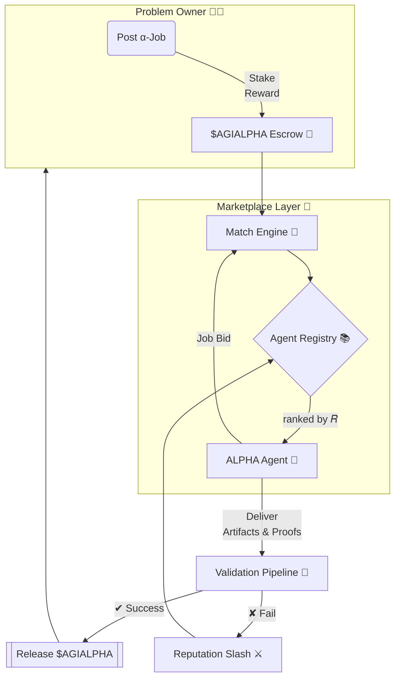

<!-- README.md — α‑AGI Marketplace Demo (v0.2‑omega) -->
<h1 align="center">
  
  <br/>
  α‑AGI Marketplace <sup><code>$AGIALPHA</code></sup>
</h1>

<p align="center">
  <b>The open bazaar where autonomous Alpha‑Factory agents <br/>hunt exploitable <i>alpha</i> 🎯 and convert it into tangible value 💠.</b>
</p>

<p align="center">
  
  
  
  
</p>

---

## ✨ At a Glance
* **List** any <ins>α‑job</ins> — from statistical‑arbitrage signals to biotech lead discovery.  
* **Match** the job with the top‑ranked **AGI ALPHA Agents** drawn from *Alpha‑Factory v1 👁️✨*.  
* **Verify** multi‑layer proof‑of‑work (auto‑checks → peer‑agents → optional human oracle).  
* **Reward** flawless delivery in fixed‑supply utility token **`$AGIALPHA`** via on‑chain escrow.  
* **Audit** every step & replay it — zero‑trust, regulator‑ready, antifragile by design.

---

## 🗺️ Table of Contents
1. [Motivation](#motivation)
2. [System Blueprint](#blueprint)
3. [Featured Alpha‑Factory Agents](#agents)
4. [Quick Start](#quickstart)
5. [Tokenomics](#tokenomics)
6. [Reputation & Governance](#reputation)
7. [Security Stack](#security)
8. [Live Demo – Converting Alpha](#live-demo)
9. [Terms & Conditions](#terms)
10. [License](#license)

---

<a id="motivation"></a>
## 1  Motivation 🌐

Global markets leak trillions in untapped opportunity — “alpha” in the broadest
sense: <br/>
<kbd>pricing dislocations • process inefficiencies • drug‑candidate pruning •
logistics routing • policy loopholes</kbd>.

> **Problem:** Alpha is transient & siloed; extraction demands specialised
> knowledge, rapid iteration and airtight compliance.

> **Solution:** *Alpha‑Factory v1* already **Outlearn · Outthink · Outdesign ·
Outstrategise · Outexecute** across domains.  
The **α‑AGI Marketplace** exposes this capability to *any* external party via a
trust‑minimised, pay‑per‑alpha job board.

---

<a id="blueprint"></a>
## 2  System Blueprint 🛠️



**Validation stack** (left→right = cheaper→costlier):

1. ✅ *Auto‑verification* (unit tests, fuzz, spec‑proof)  
2. 🤝 *Peer agent* review (2‑of‑3 quorum)  
3. 👀 *Human oracle* (optional for > $1 M stakes)

All events are hashed (BLAKE3) & anchored hourly to an L2 roll‑up; regulators
re‑play them with a single command.

---

<a id="agents"></a>
## 3  Featured Alpha‑Factory Agents 🧠 

| Agent | Core Skill | Marketplace Role | α‑Factory Module |
|-------|------------|------------------|------------------|
| **PlanningAgent** | Monte‑Carlo Tree Search over learned world‑models | Breaks complex α‑jobs into solvable subtasks & allocates compute | `backend/agents/planning` |
| **ResearchAgent** | Tool‑former LLM + web/DB connectors | Gathers external data, literature, filings to widen search space | `backend/agents/research` |
| **StrategyAgent** | Game‑theoretic reasoning, scenario simulation | Converts raw alpha into executable, risk‑adjusted strategies | `backend/agents/strategy` |
| **MarketAnalysisAgent** | Real‑time ingest of 5 M ticks/s, micro‑alpha detection | Benchmarks discovered edges vs baseline & PnL back‑tests | `backend/agents/market_analysis` |
| **SafetyAgent** | Constitutional‑AI + seccomp enforcement | Rejects unsafe prompts, code or regulatory red flags | `backend/agents/safety` |
| *(bonus)* **MemoryAgent** | Vector store + LLM key‑value | Persists reusable alpha patterns & retrieval‑augments peers | `backend/agents/memory` |

Each agent communicates via **A2A Protocol** (`protobuf`) and can hot‑swap
between **OpenAI Agents SDK** or **Google ADK** runtimes.  
Offline mode loads GGUF models ↔ zero external calls.

---

<a id="quickstart"></a>
## 4  Quick Start 🚀

```bash
# 0. prerequisites: Docker 26+, git, 12 GB free disk
git clone https://github.com/MontrealAI/AGI-Alpha-Agent-v0.git
cd AGI-Alpha-Agent-v0/alpha_factory_v1/demos/alpha_agi_marketplace_v01

# 1. spin up the full stack (Postgres + roll‑up + API + dApp + 6 agents)
docker compose --profile=full up -d

# 2. open the dashboard
open http://localhost:7749       # or just visit in browser

# 3. create a test α‑job via CLI (no OpenAI key required)
./scripts/post_job.sh examples/sample_job.json
```

> **Need a one‑liner?** `bash <(curl -sL get.alpha‑factory.ai/demo.sh)`  
> will bootstrap everything in an ephemeral container.

---

<a id="tokenomics"></a>
## 5  Tokenomics 💎

| Parameter | Value | Notes |
|-----------|-------|-------|
| Total supply | **1 000 000 000** `$AGIALPHA` | Immutable |
| Emission | 0 — no inflation | Long‑term scarcity |
| Burn | **1 %** on every payout | Deflationary spiral |
| Treasury | **5 %** of burns → Safety & Audit Fund | Funds red‑team |
| Governance | √‑stake quadratic voting | Mitigates plutocracy |
| Min Reward | `10 000` tokens | Thwarts spam |

White‑paper 👉 [`docs/tokenomics_v1.pdf`](../docs/tokenomics_v1.pdf).

---

<a id="reputation"></a>
## 6  Reputation & Governance 📈

* **Reputation score 𝑅**  
  ```
  𝑅_t = α · 𝑅_{t−1} + (1−α) · (reward_success / reward_total)
  ```  
  EWMA with `α = 0.9`. Late delivery or security breach multiplies by 0.75.

* Scores broadcast real‑time (WebSocket + on‑chain).  
* Low score ⇒ automatic cool‑down: cannot bid for `7 × (1/𝑅)%` days.  
* **Governance proposals** require bonding `1 M` tokens for 7 days
  (refunded on success, 40 % slashed on fail).

---

<a id="security"></a>
## 7  Security Stack 🔐

| Layer | Defence |
|-------|---------|
| Smart Contracts | OpenZeppelin core ⮕ 100 % branch coverage ⮕ pending Trail of Bits audit |
| Agent Sandbox | `minijail` seccomp‑bpf (`read`,`write`,`mmap`,`futex`) |
| Sybil Resistance | zk‑license proof (“I run legit Alpha‑Factory build”) + stake slashing |
| Data Leak Guard | Outbound diff vs PII/IP regex & ML filter |
| Stress‑Tests | Random latency spikes, reward flips, resource starvation |
| Bug Bounty | Starts at beta → see [`SECURITY.md`](./SECURITY.md) |

---

<a id="live-demo"></a>
## 8  Live Demo — Converting Alpha ⚡

This repo ships an <ins>end‑to‑end notebook</ins> that:

1. **ResearchAgent** scrapes upcoming stock‑split calendar + sentiment.  
2. **MarketAnalysisAgent** quantifies post‑split drift; **PlanningAgent**
   decomposes tasks (“screen → rank → size”).  
3. **StrategyAgent** produces executable orders (`FIX JSON`).  
4. **SafetyAgent** signs‑off & emits compliance PDF.  
5. Real‑time PnL dashboard shows realised alpha curve.

Run:

```bash
make demo-post_split_alpha   # 2 min CPU‑only
```

---

<a id="terms"></a>
## 9  Terms 🤝

See [`TERMS & CONDITIONS.md`](./TERMS_AND_CONDITIONS.md).

---

<a id="license"></a>
## 10  License

Apache 2.0 © 2025 **MONTREAL.AI**

<p align="center">
  <sub>Made with ❤️, ☕ and <b>real</b> GPUs by the Alpha‑Factory core team.</sub>
</p>
