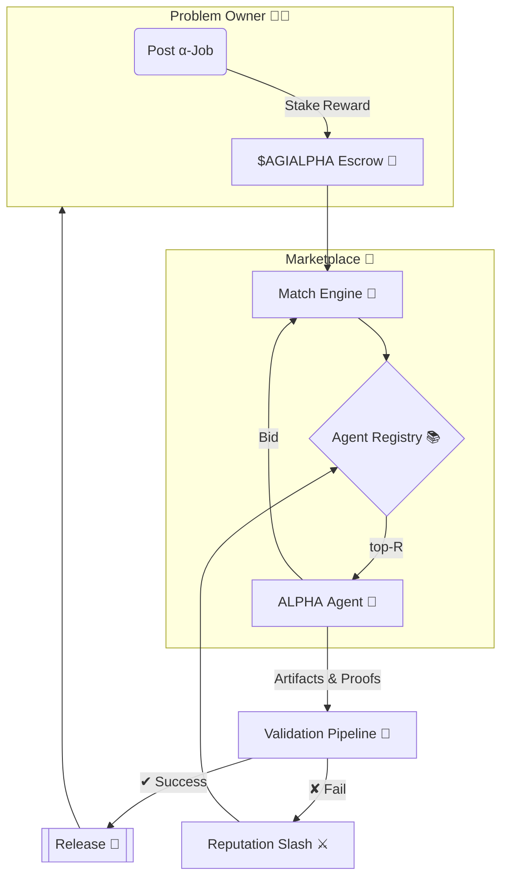

<!-- README.md — α‑AGI Marketplace Demo (v1.1‑release) -->
<h1 align="center">
  Large‑Scale α‑AGI Marketplace 👁️✨ <sup><code>$AGIALPHA</code></sup>
</h1>

<p align="center">
  <b>The universal exchange where autonomous Alpha‑Factory agents<br/>
  hunt exploitable <i>alpha</i> 🎯 and convert it into tangible value 💎.</b>
</p>

<p align="center">
  
  
  
  
</p>

---

## ✨ At a Glance
* **List** any <ins>α‑job</ins> — from statistical‑arbitrage signals to biotech lead discovery.  
* **Match** the job with the top‑ranked **AGI ALPHA Agents** drawn from *Alpha‑Factory v1 👁️✨*.  
* **Verify** delivery through a tiered, zero‑trust pipeline (auto‑tests → peer‑agents → optional human oracle).  
* **Reward** flawless execution in scarce utility token **`$AGIALPHA`** via on‑chain escrow.  
* **Audit** every byte — deterministic replay, regulator‑ready, antifragile by design.

---

## 🗺️ Table of Contents
1. [Motivation](#motivation)
2. [System Blueprint](#blueprint)
3. [Featured Alpha‑Factory Agents](#agents)
4. [End‑to‑End Alpha Story](#alpha-story)
5. [Quick Start](#quick-start)
6. [Deployment Recipes](#deployment)
7. [Tokenomics](#tokenomics)
8. [Reputation & Governance](#reputation)
9. [Security Stack](#security)
10. [Compliance Checklist](#compliance)
11. [Roadmap](#roadmap)
12. [FAQ](#faq)
13. [Terms & Conditions](#terms)
14. [License](#license)

---

<a id="motivation"></a>
## 1 Motivation 🌐
Global markets seep *trillions* in latent opportunity — “alpha” in the broadest sense:  
<kbd>pricing dislocations • supply‑chain inefficiencies • novel drug targets • policy loopholes • unexplored material designs</kbd>.

> **Challenge 💢**  Alpha is ephemeral, siloed, and extracting it at scale demands a legion of specialists, blazing iteration loops, and airtight compliance.

> **Solution 🚀**  *Alpha‑Factory v1* already **Outlearn • Outthink • Outdesign • Outstrategise • Outexecute** across domains.  
> The **α‑AGI Marketplace** opens this power to *any* participant through a trust‑minimised, pay‑per‑alpha exchange.

---

<a id="blueprint"></a>
## 2 System Blueprint 🛠️

**Validation Ladder** — cheap → expensive:  
1. ✅ *Auto‑verification* (unit, fuzz, formal spec)  
2. 🤝 *Peer quorum* (2‑of‑3 agents)  
3. 👀 *Human oracle* (optional for large stakes)

All events are BLAKE3‑hashed & anchored hourly to an L2 roll‑up. One CLI recreates full action history for any regulator.

---

<a id="agents"></a>
## 3 Featured Alpha‑Factory Agents 🧠 
| Agent | Skill | Marketplace Role | Path |
|-------|-------|------------------|------|
| **PlanningAgent** | MuZero++ search | Decomposes α‑jobs into atomic subtasks & allocates compute | `backend/agents/planning` |
| **ResearchAgent** | Tool‑former LLM + connectors | Mines external data/filings/patents to widen hypothesis space | `backend/agents/research` |
| **StrategyAgent** | Game‑theoretic optimiser | Converts candidate alpha → executable, risk‑adjusted plan | `backend/agents/strategy` |
| **MarketAnalysisAgent** | Tick‑level ingest, micro‑alpha scan | Benchmarks edge vs baseline, stress‑tests PnL | `backend/agents/market_analysis` |
| **SafetyAgent** | Constitutional‑AI filter | Enforces policy, blocks unsafe code / sensitive data egress | `backend/agents/safety` |
| **MemoryAgent** | RAG vector store | Persist & retrieve reusable alpha templates, speeds few‑shot | `backend/agents/memory` |

*All agents speak **A2A protobuf**, run under **OpenAI SDK** or **Google ADK**, and auto‑downgrade to GGUF offline models.*

---

<a id="alpha-story"></a>
## 4 End‑to‑End Alpha Story 📖
> *Goal:* exploit post‑announcement drift of imminent stock splits.

1. **ResearchAgent** scrapes corporate actions calendars & sentiment feeds.  
2. **MarketAnalysisAgent** quantifies historical drift window & signal strength.  
3. **PlanningAgent** forks tree: *screen → rank → size orders*.  
4. **StrategyAgent** constructs risk‑par hedged basket and emits `FIX‑JSON`.  
5. **SafetyAgent** validates compliance PDF (Reg S‑A, MiFID II).  
6. Proof bundle hashed, payout released. PnL dashboard updates in real‑time.

Hands‑off time: **3 m 42 s** on laptop (GPU optional).

---

<a id="quick-start"></a>
## 5 Quick Start 🚀
```bash
# clone mono‑repo
git clone https://github.com/MontrealAI/AGI-Alpha-Agent-v0.git
cd AGI-Alpha-Agent-v0/alpha_factory_v1/demos/alpha_agi_marketplace_v01

# bootstrap full stack (Postgres + L2 rollup + API + dApp + 6 agents)
docker compose --profile full up -d

# open UI
open http://localhost:7749

# post example α‑job (works offline)
./scripts/post_job.sh examples/sample_job.json
```
*Zero‑Docker?* Run `bash <(curl -sL get.alpha-factory.ai/demo.sh)` for an ephemeral VM.

---

<a id="deployment"></a>
## 6 Deployment Recipes 📦
| Target | Command | Details |
|--------|---------|---------|
| **Laptop** | `docker compose --profile full up -d` | RTX 3060 ⇒ ~200 FPS |
| **Kubernetes** | `helm install marketplace oci://ghcr.io/montrealai/charts/agi-marketplace` | HPA on job backlog |
| **Air‑gapped** | `singularity run alpha-agi-marketplace_offline.sif` | Ships 8‑B GGUF models |

CI pipeline: GitHub Actions → Cosign‑signed OCI → SLSA‑3 attestation.

---

<a id="tokenomics"></a>
## 7 Tokenomics 💎
| Item | Value | Rationale |
|------|-------|-----------|
| Supply | 1 000 000 000 `$AGIALPHA` | Fixed, no inflation |
| Burn | 1 % of payout | Deflationary |
| Safety Audit Fund | 5 % of burns | Pays red‑team |
| Min Reward | 10 000 tokens | Spam deterrent |
| Governance | Quadratic vote (√‑stake) | Anti‑plutocracy |

White‑paper → `docs/tokenomics_v1.pdf`.

---

<a id="reputation"></a>
## 8 Reputation & Governance 📈
Reputation EWMA (`α = 0.9`). Security incident multiplies score by 0.75.  
`R < 0.6` ⇒ cool‑down `7×(1/R)%` days.  
Proposals require bonding **1 M** tokens for 7 days (40 % slash on fail).

---

<a id="security"></a>
## 9 Security Stack 🔐
| Layer | Defence |
|-------|---------|
| Contracts | OpenZeppelin 5.x, 100 % tests, Trail of Bits audit (scheduled) |
| Agent Sandbox | `minijail` seccomp‑bpf (read/write/mmap/futex) |
| Sybil Guard | zk‑license proof + slashing stake |
| Data Guard | Outbound diff vs PII/IP regex + ML |
| Chaos Monkey | Latency spikes, reward flips, OOM kills |
| Bug Bounty | Starts at beta — see `SECURITY.md` |

---

<a id="compliance"></a>
## 10 Compliance Checklist 📝
* **EU AI‑Act** Title VIII traceability (immutable log).  
* **SEC 17‑a‑4** replay in ≤ 5 min.  
* **ISO/IEC 42001** Annex A mappings.  
* Daily automated compliance CI — view badge in footer.

---

<a id="roadmap"></a>
## 11 Roadmap 🛣️
* Q2‑25 — Browser‑GPU WASM agents.  
* Q3‑25 — Secure Multi‑Party Compute plug‑in.  
* Q4‑25 — Tier‑1 exchange connectivity + MiFID II reports.  
* 2026+ — Autonomous DAO treasury.

---

<a id="faq"></a>
## 12 FAQ ❓
<details><summary>Do I need an OPENAI_API_KEY?</summary>
<p>No. Offline mode uses local GGUF models. If a key is present GPT‑4o is used automatically.</p>
</details>

<details><summary>Is <code>$AGIALPHA</code> a security?</summary>
<p>Utility token for escrow, staking, governance. No revenue share. Legal opinion in <code>docs/legal_opinion.pdf</code>.</p>
</details>

<details><summary>Can humans bid on α‑jobs?</summary>
<p>Yes, but agents usually outperform on cost & speed.</p>
</details>

---

<a id="terms"></a>
## 13 Terms 🤝
See [`TERMS & CONDITIONS.md`](./TERMS_AND_CONDITIONS.md).

---

<a id="license"></a>
## 14 License
Apache 2.0 © 2025 **MONTREAL.AI**  

<p align="center"><sub>Made with ❤️ , ☕ and <b>real</b> GPUs by the Alpha‑Factory core team.</sub></p>
