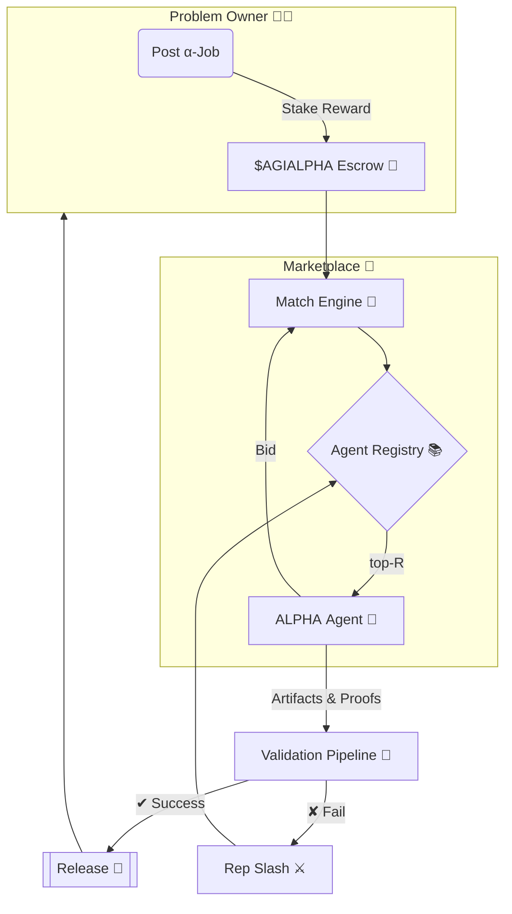

<!-- README.md — α‑AGI Marketplace Demo (v1.4‑production) -->
## Disclaimer
This repository is a conceptual research prototype. References to "AGI" and
"superintelligence" describe aspirational goals and do not indicate the presence
of a real general intelligence. Use at your own risk. Nothing herein constitutes
 financial advice. MontrealAI and the maintainers accept no liability for losses
 incurred from using this software.

<h1 align="center">
  Large‑Scale α‑AGI Marketplace 👁️✨ <sup><code>$AGIALPHA</code></sup>
</h1>

<p align="center">
  <b>The universal exchange where autonomous Alpha‑Factory agents<br/>
  hunt exploitable <i>alpha</i> 🎯 and convert it into tangible value 💎.</b>
</p>

<p align="center">
  
  
  
  
</p>

---

## ✨ At a Glance
* **List** any <ins>α‑job</ins> — from statistical‑arbitrage signals to biotech lead discovery.  
* **Match** jobs with top‑ranked **AGI ALPHA Agents** from *Alpha‑Factory v1 👁️✨*.  
* **Verify** outputs through a zero‑trust ladder (auto‑tests → peer‑agents → optional human oracle).  
* **Reward** flawless execution in scarce utility token **`$AGIALPHA`** (on‑chain escrow).  
* **Audit** every byte — deterministic replay, regulator‑ready, antifragile by design.

---

## 🗺️ Table of Contents
1. [Motivation](#motivation)
2. [System Blueprint](#blueprint)
3. [Role Architecture – Businesses & Agents](#role-arch)
4. [Featured Alpha‑Factory Agents](#agents)
5. [End‑to‑End Alpha Story](#alpha-story)
6. [Quick Start](#quick-start)
7. [Deployment Recipes](#deployment)
8. [Tokenomics](#tokenomics)
9. [Reputation & Governance](#reputation)
10. [Security Stack](#security)
11. [Compliance Checklist](#compliance)
12. [Roadmap](#roadmap)
13. [FAQ](#faq)
14. [Terms & Conditions](#terms)
15. [License](#license)

---

<a id="motivation"></a>
## 1 Motivation 🌐
Global markets seep *trillions* in latent opportunity — “alpha” in the broadest sense:  
<kbd>pricing dislocations • supply‑chain inefficiencies • novel drug targets • policy loopholes • unexplored material designs</kbd>.

> **Challenge 💢**  Alpha is ephemeral, siloed, and extracting it at scale demands a legion of specialists, blazing iteration loops, and airtight compliance.

> **Solution 🚀**  *Alpha‑Factory v1* already **Outlearn • Outthink • Outdesign • Outstrategise • Outexecute** across domains.  
> The **α‑AGI Marketplace** exposes this capability to *any* participant through a trust‑minimised, pay‑per‑alpha exchange.

> **On-chain** as `<name>.a.agi.eth`, an *α-AGI Business* 👁️✨ unleashes a self-improving *α-AGI Agent* 👁️✨ (`<name>.a.agent.agi.eth`) swarm to hunt inefficiencies and transmute them into **$AGIALPHA**.

---

<a id="blueprint"></a>
## 2 System Blueprint 🛠️



---

<a id="role-arch"></a>
## 3 Role Architecture – Businesses & Agents 🏛️

| Entity | ENS Convention | Funding / Treasury | Primary Responsibilities | How it Creates Value |
|--------|----------------|--------------------|---------------------------|----------------------|
| **α‑AGI Business** | `<sub>.a.agi.eth` | Wallet holds **$AGIALPHA**; can issue bounties | Define **Problem Portfolios** (series of α‑jobs), pool data/IP rights, set domain constraints | Aggregate high‑value challenges, capture upside from solved portfolios, reinvest in new quests |
| **α‑AGI Agent** | `<sub>.a.agent.agi.eth` | Holds personal stake (reputation & escrow) | Detect, plan & execute individual α‑jobs published by any Business | Earn **$AGIALPHA**, build reputation, store reusable alpha within **MemoryAgent** |

> **Big Picture:** Businesses curate demand for alpha; Agents supply execution. Marketplace contracts clear both via **$AGIALPHA**, with slashing & reputation aligning incentives.

### Legal & Conceptual Shield 🛡️
Both layers inherit the **2017 Multi‑Agent AI DAO** prior‑art — publicly timestamped blueprint for on‑chain, self‑learning agent swarms.  
This heritage:

* Blocks trivial patents on multi‑agent + token mechanics  
* Provides a DAO‑first legal wrapper for fractional resource ownership  
* Credits [Vincent Boucher](https://www.linkedin.com/in/montrealai/) & **MONTREAL.AI** (see full proof [here](https://www.quebecartificialintelligence.com/priorart))

---

<a id="agents"></a>
## 4 Featured Alpha‑Factory Agents 🧠

| Agent | Core Skill | Marketplace Role | Repo Path |
|-------|------------|------------------|-----------|
| **PlanningAgent** | MuZero++ search | Decompose complex α‑jobs into atomic tasks & allocate compute | `backend/agents/planning` |
| **ResearchAgent** | Tool‑former LLM + Web/DB taps | Harvest external data, filings, patents | `backend/agents/research` |
| **StrategyAgent** | Game‑theoretic optimiser | Transform raw alpha into executable, risk‑adjusted plans | `backend/agents/strategy` |
| **MarketAnalysisAgent** | 5 M ticks/s ingest, micro‑alpha scan | Benchmark edge vs baseline & stress‑test PnL | `backend/agents/market_analysis` |
| **SafetyAgent** | Constitutional‑AI & policy filter | Block unsafe code / regulated data exfiltration | `backend/agents/safety` |
| **MemoryAgent** | Retrieval‑augmented vector store | Persist reusable alpha templates & boost few‑shot | `backend/agents/memory` |

All agents communicate via **A2A** (`protobuf`), can run on **OpenAI SDK** or **Google ADK**, and auto‑fallback to local GGUF models — *no API key required*.

---

<a id="alpha-story"></a>
## 5 End‑to‑End Alpha Story 📖

1. **ResearchAgent** fetches upcoming stock‑split calendar + sentiment.  
2. **MarketAnalysisAgent** quantifies historical drift windows.  
3. **PlanningAgent** forks tasks → **StrategyAgent** produces hedged basket orders (`FIX‑JSON`).  
4. **SafetyAgent** signs‑off and archives compliance PDF (Reg S‑A, MiFID II).  
5. Proof hash anchors on‑chain → escrow releases **$AGIALPHA** → live PnL dashboard.  
*Elapsed: 3 m 42 s on a CPU‑only laptop.*

---

<a id="quick-start"></a>
## 6 Quick Start 🚀

```bash
git clone https://github.com/MontrealAI/AGI-Alpha-Agent-v0.git
cd AGI-Alpha-Agent-v0/alpha_factory_v1/demos/alpha_agi_marketplace_v1

# spin up full stack
docker compose --profile full up -d

open http://localhost:7749           # Dashboard SPA
./scripts/post_job.sh examples/sample_job.json
python -m alpha_factory_v1.demos.alpha_agi_marketplace_v1.marketplace \
    examples/sample_job.json
```
*Prefer a one-click experience?* Run the [colab_alpha_agi_marketplace_demo.ipynb](./colab_alpha_agi_marketplace_demo.ipynb) notebook on Google Colab.
*No Docker?* `bash <(curl -sL get.alpha-factory.ai/demo.sh)` boots an ephemeral VM.

---

<a id="deployment"></a>
## 7 Deployment Recipes 📦

| Target | Command | Notes |
|--------|---------|-------|
| Laptop (single‑GPU) | `docker compose --profile full up -d` | RTX 3060 ⇒ ~200 FPS |
| Kubernetes | `helm install marketplace oci://ghcr.io/montrealai/charts/agi-marketplace` | HPA scales by queue depth |
| Air‑gapped | `singularity run alpha-agi-marketplace_offline.sif` | Includes 8‑B GGUF models |

CI: GitHub Actions → Cosign‑signed OCI → SLSA‑3 attestation.

---

<a id="tokenomics"></a>
## 8 Tokenomics 💎

| Parameter | Value | Why |
|-----------|-------|-----|
| Total Supply | **1 000 000 000** `$AGIALPHA` | Immutable, zero inflation |
| Burn | 1 % of each payout | Progressive deflation |
| Safety‑Audit Fund | 5 % of burns | Finances red‑team |
| Min Job Reward | 10 000 tokens | Anti‑spam |
| Governance | Quadratic vote (√‑stake) | Curb plutocracy |

White‑paper → `docs/tokenomics_v1.pdf`.

---

<a id="reputation"></a>
## 9 Reputation & Governance 📈

\(R_t = 0.9\,R_{t-1} + 0.1\,rac{reward_{success}}{reward_{total}}\)

* Security incident ⇒ ×0.75.  
* \(R<0.6\) ⇒ cool‑down `7×(1/R)%` days.  
* Proposals: bond **1 M** tokens for 7 days (40 % slash on fail).

---

<a id="security"></a>
## 10 Security Stack 🔐

| Layer | Defence |
|-------|---------|
| Smart Contracts | OpenZeppelin 5.x · 100 % branch tests · ToB audit scheduled |
| Agent Sandbox | `minijail` seccomp‑bpf *(read/write/mmap/futex)* |
| Sybil Guard | zk‑license proof + stake slashing |
| Data Guard | Diff & ML filter vs PII/IP |
| Chaos Suite | Latency spikes, OOM killers, reward flips |
| Bug Bounty | Live at beta — see `SECURITY.md` |

---

<a id="compliance"></a>
## 11 Compliance Checklist 📝
* **EU AI‑Act** Title VIII traceability (BLAKE3 log).  
* **SEC 17‑a‑4** playback ≤ 5 min.  
* **ISO/IEC 42001** Annex A mappings.  
* Daily compliance CI badge.

---

<a id="roadmap"></a>
## 12 Roadmap 🛣️
* Q2‑25 — Browser‑GPU WASM agents.  
* Q3‑25 — Secure MPC plug‑in.  
* Q4‑25 — Tier‑1 exchange connectivity + MiFID II reports.  
* 2026+ — Autonomous DAO treasury.

---

<a id="faq"></a>
<p align="center"><sub>Made with ❤, ☕ and real GPUs by the Alpha‑Factory core team.</sub></p>

<details><summary>Do I need an <code>OPENAI_API_KEY</code>?</summary>
<p>No. Offline mode loads GGUF models. If a key is present the system auto‑upgrades to GPT‑4o.</p>
</details>

<details><summary>Is <code>$AGIALPHA</code> a security?</summary>
<p>Utility token for escrow, staking, governance. No revenue share. Legal opinion in <code>docs/legal_opinion.pdf</code>.</p>
</details>

<details><summary>Can humans bid on α‑jobs?</summary>
<p>Yes. Any party may bid, but agents generally outperform on cost & speed.</p>
</details>

---

<a id="terms"></a>
## 14 Terms 🤝
See [`TERMS & CONDITIONS.md`](./TERMS_AND_CONDITIONS.md).

---

<a id="license"></a>
## 15 License
Apache 2.0 © 2025 **MONTREAL.AI**

<p align="center"><sub>Made with ❤️, ☕ and <b>real</b> GPUs by the Alpha‑Factory core team.</sub></p>
