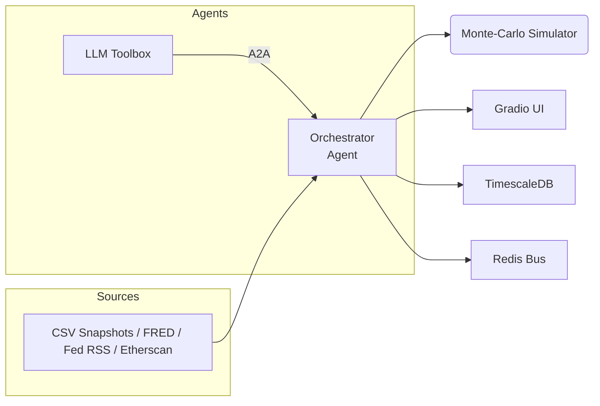

# 🌐 Macro‑Sentinel · Alpha‑Factory v1 👁️✨  
*Cross‑asset macro risk radar powered by multi‑agent α‑AGI*

[](#one‑command‑docker) 
[](#google‑colab) 


> **TL;DR**   Spin up a self‑healing stack that ingests macro telemetry, runs a Monte‑Carlo risk engine, sizes an ES hedge, and explains its reasoning—all behind a Gradio dashboard.

This demonstration is a conceptual research prototype. Any references to AGI or superintelligence describe aspirational goals rather than current capabilities.

---

## ✨ Key capabilities
| Capability | Detail |
|------------|--------|
| **Multi‑agent orchestration** | OpenAI Agents SDK + A2A protocol |
| **LLM fail‑over** | GPT‑4o when `OPENAI_API_KEY` present, Mixtral‑8x7B (Ollama) otherwise |
| **Live + offline feeds** | FRED yield curve, Fed RSS speeches, Etherscan on‑chain flows |
| **Risk engine** | 10 k × 30‑day 3‑factor Monte‑Carlo (< 20 ms CPU) |
| **Action layer** | Draft JSON orders for Micro‑ES futures (Alpaca stub) |
| **Observability** | TimescaleDB, Redis stream, Prometheus & Grafana dashboard |
| **A2A gateway** | Optional Google ADK server via `ALPHA_FACTORY_ENABLE_ADK=1` |

---

## 🏗️ Architecture



---

## 🚀 Quickstart

### One‑command (Docker)

```bash
git clone https://github.com/MontrealAI/AGI-Alpha-Agent-v0.git
cd AGI-Alpha-Agent-v0/alpha_factory_v1/demos/macro_sentinel
python ../../check_env.py --demo macro_sentinel    # verify optional dependencies
./run_macro_demo.sh           # add --live for real‑time collectors
                              # (--live exports LIVE_FEED=1)
```

Export `OPENAI_API_KEY` in your shell (or define it in `config.env`) before
launching. If the variable is absent, the script runs in offline mode. With the
previous issue resolved, the launcher now reads `config.env` automatically when
present.

Offline mode requires an [Ollama](https://ollama.com) server with the
`mixtral:instruct` model available at `http://localhost:11434`. The Docker
stack provisions this container automatically via the `offline` profile, but
when running bare‑metal or inside Colab you must manually start `ollama serve`
first. If the server runs elsewhere, set
`OLLAMA_BASE_URL=http://<host>:11434/v1` in your shell or `config.env`.

Offline sample data is fetched automatically the first time you run the
launcher—no manual downloads required. These CSV snapshots mirror
public data from the [demo‑assets](https://github.com/MontrealAI/demo-assets)
repository and cover roughly March–April 2024 activity.

To reuse existing CSV snapshots or share them across projects,
set `OFFLINE_DATA_DIR=/path/to/csvs` in your shell or `config.env`.

*Dashboard:* http://localhost:7864
*Health:*    http://localhost:7864/healthz
*Grafana:* http://localhost:3001 (admin/alpha)
*ADK gateway:* http://localhost:9000 (when `ALPHA_FACTORY_ENABLE_ADK=1`)

### Google Colab

[Open the notebook ▶](colab_macro_sentinel.ipynb)

### Bare‑metal (advanced)

```bash
pip install -r requirements.txt
macro-sentinel  # or `python agent_macro_entrypoint.py`
```
The entry point pulls minimal CSV snapshots if they are missing so you can run
fully offline.

### Preparing a wheelhouse

Build wheels on a machine with internet access so the demo can be installed
offline:

```bash
pip wheel -r requirements.txt -w /path/to/wheels
```

Pass `--wheelhouse /path/to/wheels` to `check_env.py` as shown below.

### Offline installation

```bash
pip wheel -r requirements.txt -w /media/wheels
WHEELHOUSE=/media/wheels AUTO_INSTALL_MISSING=1 \
  python ../../check_env.py --demo macro_sentinel --auto-install --wheelhouse /media/wheels
```

This mirrors the repository's offline setup instructions so the demo works
without internet access.

---

## ⚙️ Configuration

| Variable | Default | Description |
|----------|---------|-------------|
| `OPENAI_API_KEY` | *(blank)* | Use GPT‑4o when provided; offline Mixtral otherwise |
| `MODEL_NAME` | `gpt-4o-mini` | Any OpenAI completion model |
| `TEMPERATURE` | `0.15` | LLM sampling temperature |
| `OLLAMA_BASE_URL` | `http://ollama:11434/v1` | Offline LLM endpoint |
| `FRED_API_KEY` | *(blank)* | Enables live yield‑curve collector |
| `ETHERSCAN_API_KEY` | *(blank)* | Enables on‑chain stable‑flow collector |
| `TW_BEARER_TOKEN` | *(blank)* | Twitter/X API bearer token for Fed speech stream |
| `PG_PASSWORD` | `alpha` | TimescaleDB superuser password |
| `LIVE_FEED` | `0` | 1 uses live FRED/Etherscan feeds |
| `OFFLINE_DATA_DIR` | `offline_samples/` | Path for CSV snapshots |
| `DEFAULT_PORTFOLIO_USD` | `2000000` | Portfolio USD notional for Monte‑Carlo hedge sizing |
| `ALPHA_FACTORY_ENABLE_ADK` | `0` | 1 exposes ADK gateway on port 9000 |
| `PROMETHEUS_SCRAPE_INTERVAL` | `15s` | Metrics polling frequency |
| `GRAFANA_ADMIN_PASSWORD` | `alpha` | Grafana admin password |

Edit **`config.env`** or export variables before launch.

---

## 📊 Grafana dashboards

| Dashboard | Path |
|-----------|------|
| Macro Events | `macro_stream.json` |
| Risk Metrics | `risk_metrics.json` |

Pre‑provisioned at <http://localhost:3001>.

### Accessing Grafana

Open your browser to `http://localhost:3001` and log in with user `admin` and
`GRAFANA_ADMIN_PASSWORD` (default `alpha`). The `Macro Events` and `Risk Metrics`
dashboards load automatically.

### Tuning Prometheus

Adjust metric collection frequency by setting `PROMETHEUS_SCRAPE_INTERVAL` in
`config.env` before launching, or edit `observability/prometheus.yml` for more
advanced settings.

---

## 🛠️ Directory layout

```
macro_sentinel/
├── agent_macro_entrypoint.py   # Gradio + Agent wiring
├── data_feeds.py               # offline/live feed generator
├── simulation_core.py          # Monte‑Carlo risk engine
├── run_macro_demo.sh           # Docker launcher
├── docker-compose.macro.yml    # Service graph
├── colab_macro_sentinel.ipynb  # Cloud notebook
└── offline_samples/            # CSV snapshots (auto‑synced)
```

---

## 🔐 Security notes
* No secrets are baked into images.
* All containers drop root and listen on  `0.0.0.0` only when behind Docker bridge.
* Network egress is restricted to required endpoints (FRED, Etherscan, ollama).

---

## WARNING: Disclaimer

This demo is **for research and educational purposes only**. It
does not constitute financial advice and should not be relied upon
for real trading decisions. MontrealAI and the maintainers accept
no liability for losses incurred from using this software.

---

## 🩹 Troubleshooting

| Symptom | Fix |
|---------|-----|
| `Health-check failed` | Increase `health_wait` tries or free port 7864 |
| GPU not used | Ensure `nvidia‑docker` runtime and drivers ≥ 535 |
| Colab hangs at tunnel | Re‑run; sometimes Gradio link takes >30 s |

---

## 📜 License
Apache‑2.0 © 2025 **MONTREAL.AI**

Happy alpha‑hunting 🚀
