```mermaid
flowchart LR
  AFV1["Alpha‑Factory v1 Core"]
  MAA["Meta‑Agentic Layer"]
  Providers["FM Providers<br/>(OpenAI / Anthropic / llama‑cpp)"]
  Dataset["Domain Datasets"]
  UI2["Lineage UI"]
  AFV1 --> MAA
  MAA --> Providers
  MAA --> Dataset
  Archive -.-> UI2
```

# Meta‑Agentic α‑AGI 👁️✨ Demo – **Production‑Grade v0.1.0**

> **Elevating Alpha‑Factory v1 into a self‑improving, cross‑industry “Alpha Factory” that systematically  
> Out‑Learn · Out‑Think · Out‑Design · Out‑Strategize · Out‑Execute — without coupling to a single vendor or model.**  
> Inspired by and extending the *Meta‑Agent Search* paradigm from Hu *et al.* (ICLR 2025).

---

## 📌 Purpose & Positioning
This demo operationalises the **Automated Design of Agentic Systems (ADAS)** paradigm and layers:

* **True multi‑objective search** (accuracy, cost, latency, risk, carbon)
* **Open‑weights or API‑based FM back‑ends** (OpenAI, Anthropic, Mistral .gguf …)
* **Automated provenance & lineage visualisation**
* **Antifragile, regulator‑ready safeguards**

into the existing **Alpha‑Factory v1** (multi‑agent AGENTIC α‑AGI) pipeline.

---

## 1 Quick‑start 🏁

```bash
# 1️⃣ Clone & enter demo
git clone https://github.com/MontrealAI/AGI-Alpha-Agent-v0.git
cd AGI-Alpha-Agent-v0/alpha_factory_v1/demos/meta_agentic_agi

# 2️⃣ Environment (CPU‑only default)
micromamba create -n metaagi python=3.11 -y
micromamba activate metaagi
pip install -r requirements.txt        # ≤ 40 MiB wheels

# 3️⃣ Run – zero‑API mode (pulls a gguf via Ollama)
python meta_agentic_agi_demo.py --provider mistral:7b-instruct.gguf

#   …or point to any provider
OPENAI_API_KEY=sk‑… python meta_agentic_agi_demo.py --provider openai:gpt-4o

# 4️⃣ Launch the lineage UI
streamlit run ui/lineage_app.py
```

*No GPU?* llama‑cpp‑python auto‑selects 4‑bit quantisation < 6 GB RAM.

---

## 2 Folder Structure 📁
```
meta_agentic_agi/
├── core/                # provider‑agnostic primitives
│   ├── fm.py            # unified FM wrapper
│   ├── prompts.py       # reusable prompt fragments
│   └── tools.py         # exec sandbox, RAG, vector store
├── meta_search/         # ⬅ evolutionary loop
│   ├── archive.py       # stepping‑stone JSONL log
│   ├── search.py        # NSGA‑II + Reflexion
│   └── scorer.py        # multi‑objective metrics
├── agents/
│   ├── agent_base.py    # runtime interface
│   └── seeds.py         # bootstrap population
├── ui/
│   ├── lineage_app.py   # Streamlit dashboard
│   └── assets/
├── configs/
│   └── default.yml      # editable in‑UI
└── meta_agentic_agi_demo.py
```

---

## 3 High‑Level Architecture 🔍

```mermaid
graph TD
  subgraph "Meta Agent Search Loop"
    MGPT["Meta LLM Programmer"]
    Candidate["Candidate Agent<br/>Python fn"]
    Evaluator["Sandboxed Evaluator"]
    Archive["Archive<br/>(Pareto + Novelty)"]
    MGPT -->|generates| Candidate
    Candidate --> Evaluator
    Evaluator -->|scores| Archive
    Archive -->|context & feedback| MGPT
  end
  UI["Streamlit Lineage UI"] <-->|stream\nlineage| Archive
```





---

## 4 Provider Abstraction ➡️ open‑weights 🏋️‍♀️

`configs/default.yml` (excerpt):

```yaml
provider: mistral:7b-instruct.gguf   # any ollama / llama.cpp id
context_length: 8192
rate_limit_tps: 4
retry_backoff: 2
```

Change **provider** to:

| Value                       | Notes                      |
|-----------------------------|----------------------------|
| `openai:gpt-4o`             | needs `OPENAI_API_KEY`     |
| `anthropic:claude-3-sonnet` | needs `ANTHROPIC_API_KEY`  |
| `mistral:7b-instruct.gguf`  | default local model        |

Wrapper normalises chat/completions, streams via **MCP**, and window‑slides tokens.

---

## 5 Multi‑Objective Search 🎯

*Objective vector* = **[accuracy, cost, latency, hallucination‑risk, carbon]**

* NSGA‑II elitist selection  
* Behaviour descriptor = SHA‑256 of candidate AST  
* Optional human‑in‑the‑loop thumbs up/down (UI)

---

## 6 Security & Antifragility 🛡

* Firejail `--seccomp` + 512 MiB mem‑cgroup sandbox  
* Static analysis (`bandit`) + dynamic taint tracking  
* Live watchdog kills rogue processes > 30 s CPU  
* Chaos‑tests inject tool failures; reward graceful degradation

---

## 7 Extending 🛠
1. **New dataset** – drop `my.pkl` into `data/`, flag `--dataset my`.  
2. **New metric** – subclass `scorer.BaseMetric`, list in `configs/default.yml`.  
3. **New tool** – add `core/tools/foo.py` exposing `__call__(self, query)`.

---

## 8 Roadmap 🗺
* ☐ Hierarchical meta‑meta search  
* ☐ GPU batch infer (Flash‑infer v3)  
* ☐ Offline RL fine‑tune search policy with lineage replay

---

## 9 References 📚
* S. Hu *et al.* “Automated Design of Agentic Systems” ICLR 2025  
* OpenAI “A Practical Guide to Building Agents” (2024)  
* Google ADK docs (2025)

---

© 2025 MONTREAL.AI — Apache‑2.0
