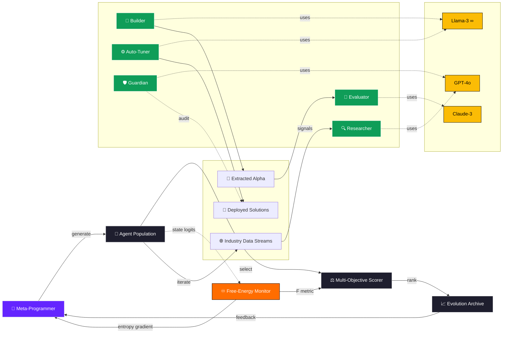
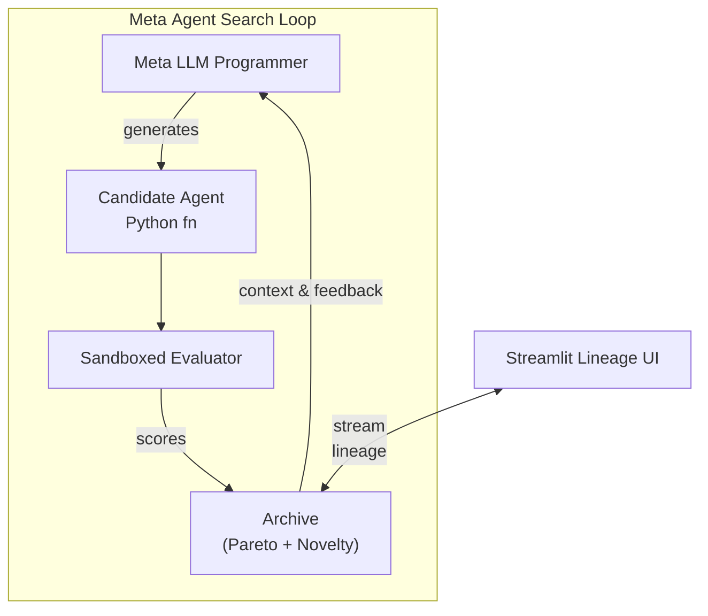
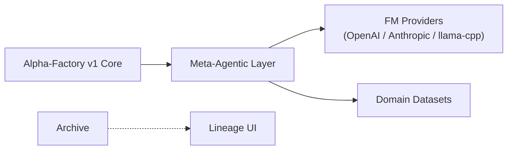

# Meta‑Agentic α‑AGI 👁️✨ Demo v2 – **Production‑Grade v0.1.0**

Identical to **v1** plus a statistical-physics wrapper that logs and minimises **Gibbs / variational free-energy** for each candidate agent during the evolutionary search.

*Metric toggle*: `configs/default.yml → physics_metric: free_energy`  
Implementation: `core/physics/gibbs.py` (≈25 LoC) & 4-line hook in `scorer.py`.

> **Official definition – Meta-Agentic (adj.)**  
> *Describes an agent whose **primary role** is to **create, select, evaluate, or re‑configure other agents** and the rules governing their interactions, thereby exercising **second‑order agency** over a population of first‑order agents.*

> *The term was **pioneered by Vincent Boucher, President of MONTREAL.AI**.*



> **Elevating Alpha‑Factory v1 into a self‑improving, cross‑industry “Alpha Factory” that systematically  
> Out‑Learn · Out‑Think · Out‑Design · Out‑Strategize · Out‑Execute — without coupling to a single vendor or model.**  
> Inspired by and extending the *Meta‑Agent Search* paradigm from Hu *et al.* (ICLR 2025).

---

## 📌 Purpose & Positioning
This demo operationalises the **Automated Design of Agentic Systems (ADAS)** paradigm and layers:

* **True multi‑objective search** (accuracy, cost, latency, risk, carbon)
* **Open‑weights or API‑based FM back‑ends** (OpenAI, Anthropic, Mistral .gguf …)
* **Automated provenance & lineage visualisation**
* **Antifragile, regulator‑ready safeguards**

into the existing **Alpha‑Factory v1** (multi‑agent AGENTIC α‑AGI) pipeline.

---

## 1 Quick‑start 🏁
```bash
# 1️⃣ Clone & enter demo
git clone https://github.com/MontrealAI/AGI-Alpha-Agent-v0.git
cd AGI-Alpha-Agent-v0/alpha_factory_v1/demos/meta_agentic_agi_v2

# 2️⃣ Environment (CPU‑only default)
micromamba create -n metaagi python=3.11 -y
micromamba activate metaagi
pip install -r requirements.txt        # ≤ 40 MiB wheels

# 3️⃣ Run – zero‑API mode (pulls a gguf via Ollama)
python meta_agentic_agi_demo_v2.py --provider mistral:7b-instruct.gguf

#   …or point to any provider
OPENAI_API_KEY=sk‑… python meta_agentic_agi_demo_v2.py --provider openai:gpt-4o

# 4️⃣ Launch the lineage UI
streamlit run ui/lineage_app.py
```
*No GPU?* llama‑cpp‑python auto‑selects 4‑bit quantisation < 6 GB RAM.

### 🎓 Colab notebook

[](https://colab.research.google.com/github/MontrealAI/AGI-Alpha-Agent-v0/blob/main/alpha_factory_v1/demos/meta_agentic_agi_v2/colab_meta_agentic_agi_v2.ipynb)

Spin up the demo end‑to‑end without installing anything. Works offline using open‑weights or with your API keys. The notebook now previews the latest lineage entries after the search loop so you can inspect results directly in Colab.

---

## 2 Folder Structure 📁
```
meta_agentic_agi_v2/
├── core/                # provider‑agnostic primitives
│   ├── fm.py            # unified FM wrapper
│   ├── prompts.py       # reusable prompt fragments
│   └── tools.py         # exec sandbox, RAG, vector store
├── meta_agentic_search/ # ⬅ evolutionary loop
│   ├── archive.py       # stepping‑stone JSONL log
│   ├── search.py        # NSGA‑II + Reflexion
│   └── scorer.py        # multi‑objective metrics
├── agents/
│   ├── agent_base.py    # runtime interface
│   └── seeds.py         # bootstrap population
├── ui/
│   ├── lineage_app.py   # Streamlit dashboard
│   └── assets/
├── configs/
│   └── default.yml      # editable in‑UI
└── meta_agentic_agi_demo_v2.py
```

---

## 3 High‑Level Architecture 🔍




---

## 4 Provider Abstraction ➡️ open‑weights 🏋️‍♀️
`configs/default.yml` (excerpt):
```yaml
provider: mistral:7b-instruct.gguf   # any ollama / llama.cpp id
context_length: 8192
rate_limit_tps: 4
retry_backoff: 2
```

Change **provider** to:

| Value                       | Notes                      |
|-----------------------------|----------------------------|
| `openai:gpt-4o`             | needs `OPENAI_API_KEY`     |
| `anthropic:claude-3-sonnet` | needs `ANTHROPIC_API_KEY`  |
| `mistral:7b-instruct.gguf`  | default local model        |

Wrapper normalises chat/completions, streams via **MCP**, and window‑slides tokens.

---

## 5 Multi‑Objective Search 🎯
*Objective vector* = **[accuracy, cost, latency, hallucination‑risk, carbon]**

* NSGA‑II elitist selection  
* Behaviour descriptor = SHA‑256 of candidate AST  
* Optional human‑in‑the‑loop thumbs up/down (UI)

---

## 6 Security & Antifragility 🛡
* Firejail `--seccomp` + 512 MiB mem‑cgroup sandbox  
* Static analysis (`bandit`) + dynamic taint tracking  
* Live watchdog kills rogue processes > 30 s CPU  
* Chaos‑tests inject tool failures; reward graceful degradation

---

## 7 Extending 🛠
1. **New dataset** – drop `my.pkl` into `data/`, flag `--dataset my`.  
2. **New metric** – subclass `scorer.BaseMetric`, list in `configs/default.yml`.  
3. **New tool** – add `core/tools/foo.py` exposing `__call__(self, query)`.

---

## 8 Roadmap 🗺
* ☐ Hierarchical meta‑meta search  
* ☐ GPU batch infer (Flash‑infer v3)  
* ☐ Offline RL fine‑tune search policy with lineage replay

---

## 9 References 📚
* S. Hu *et al.* “Automated Design of Agentic Systems” ICLR 2025  
* OpenAI “A Practical Guide to Building Agents” (2024)  
* Google ADK docs (2025)

---

© 2025 MONTREAL.AI — Apache‑2.0
