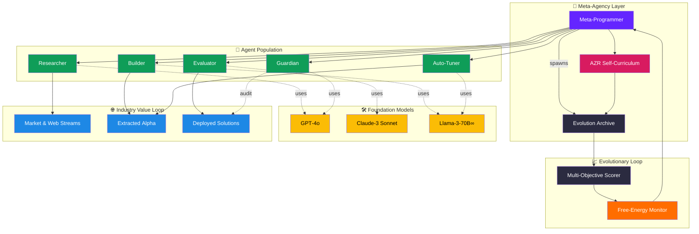

# **Meta‑Agentic α‑AGI 👁️✨ Demo v3 — AZR‑Powered “Alpha‑Factory v1” (Production‑Grade v0.3.0)**

Identical to **v1** plus **two synergistic upgrades**  
1. *Statistical‑physics wrapper* — logs & minimises **Gibbs / variational free‑energy** for every candidate agent.  
2. *Absolute Zero Reasoner (AZR) self‑curriculum* — a **reinforced self‑play engine** that perpetually invents and solves its own tasks, unlocking *open‑ended* cross‑domain reasoning.

> **Official definition — Meta‑Agentic (adj.)**  
> *Describes an agent whose **primary role** is to **create, select, evaluate, or re‑configure other agents** and the rules governing their interactions, thereby exercising **second‑order agency** over a population of first‑order agents.*  
> *The term was **pioneered by Vincent Boucher, President of MONTREAL.AI**.*

---

## 🚀 Why AZR Matters
`Absolute Zero Reasoner` (Zhao *et al.* 2025) discards the last human bottleneck: **task curation**.  
It **proposes**, **validates**, **solves**, and **learns from** its own code‑reasoning problems — then feeds the distilled knowledge back into the evolutionary loop.  
*Result:* steeper learning curves, bolder exploration, and broad generalisation across math, code, and strategic planning — all while remaining vendor‑agnostic.

---



> *“Alpha‑Factory v1 transforms raw data‑streams into deployable solutions that **Out‑Learn · Out‑Think · Out‑Design · Out‑Strategize · Out‑Execute** the market — autonomously.”*

---

## 📌 Purpose & Positioning
This demo operationalises **Automated Design of Agentic Systems (ADAS)** and adds:

* **AZR‑driven open‑ended learning** — tasks invented on‑the‑fly, tuned for maximal learning gain.
* **True multi‑objective optimisation** — accuracy, cost, latency, risk, carbon **& free‑energy**.
* **Open‑weights *or* API FMs** — swap GPT‑4o, Claude‑3, Llama‑3, Mistral .gguf at will.
* **Provable lineage & provenance** — every agent / artefact traceable via the Lineage UI.
* **Battle‑tested safeguards** — sandboxing, taint‑tracking, chaos‑testing.

Together, they lift **Alpha‑Factory v1** into a *self‑improving*, cross‑industry **Alpha Factory** that systematically  
> **Out‑Learn · Out‑Think · Out‑Design · Out‑Strategize · Out‑Execute**  

— with zero dependence on any single model or vendor.

---

## 1 Quick‑Start 🏁
```bash
# 1️⃣ Clone
git clone https://github.com/MontrealAI/AGI-Alpha-Agent-v0.git
cd AGI-Alpha-Agent-v0/alpha_factory_v1/demos/meta_agentic_agi_v3

# 2️⃣ Environment
micromamba create -n alpha_factory python=3.11 -y
micromamba activate alpha_factory
pip install -r requirements.txt      # ≤ 60 MiB wheels

# 3️⃣ Run – open‑weights default (no API key)
python src/main.py --provider mistral:7b-instruct.gguf --curriculum azr

#  …or switch to GPT‑4o
OPENAI_API_KEY=sk-... python src/main.py --provider openai:gpt-4o --curriculum azr

# 4️⃣ UI dashboards
streamlit run ui/lineage_app.py           # provenance graph
streamlit run ui/alpha_monitor.py         # live alpha dashboard
```

*Hardware:* CPU‑only works (llama‑cpp 4‑bit); GPU speeds things up. 8 GB RAM minimum.

---

## 2 Folder Structure 📁
```text
meta_agentic_agi/
├── core/                # provider‑agnostic primitives
│   ├── fm.py            # unified FM wrapper
│   ├── prompts.py       # reusable prompt fragments
│   └── tools.py         # exec sandbox, RAG, vector store
├── curriculum/          # ← NEW: self‑curriculum engines
│   └── azr_engine.py    # Absolute Zero abstractions
├── meta_agentic_search/ # evolutionary loop
│   ├── archive.py       # stepping‑stone JSONL log
│   ├── search.py        # NSGA‑II + Reflexion
│   └── scorer.py        # multi‑objective metrics (+ free‑energy)
├── agents/
│   ├── agent_base.py    # runtime interface
│   └── seeds.py         # bootstrap population
├── ui/
│   ├── lineage_app.py   # Streamlit dashboard
│   ├── alpha_monitor.py # live alpha / risk view
│   └── assets/
├── configs/
│   └── default.yml      # editable in‑UI
└── src/
    ├── main.py          # CLI entry‑point
    └── orchestrator.py  # agent scheduler & A2A bus
```

---

## 3 Provider‑Agnostic FM Wrapper ➡ Open‑Weights 🏋️‍♀️
`configs/default.yml` excerpt:
```yaml
provider: mistral:7b-instruct.gguf     # any ollama / llama.cpp id
context_length: 16_384
rate_limit_tps: 4
retry_backoff: 2
```

| Value                         | Note                            |
|-------------------------------|---------------------------------|
| `openai:gpt-4o`               | needs `OPENAI_API_KEY`          |
| `anthropic:claude-3-sonnet`   | needs `ANTHROPIC_API_KEY`       |
| `mistral:7b-instruct.gguf`    | local default via llama‑cpp      |

All chats stream via **MCP** & window‑slide for long contexts.

---

## 4 Multi‑Objective Evolution 🎯
**Objective vector** = `[accuracy, cost, latency, hallu‑risk, carbon, free‑energy]`  
* NSGA‑II elitist selection  
* Behaviour descriptor = SHA‑256(AST)  
* Human‑in‑the‑loop thumbs ↑/↓ (web UI)  

---

## 5 Security & Antifragility 🛡
* Firejail `--seccomp` + 512 MiB cgroup sandbox  
* Static (`bandit`) + dynamic taint tracking  
* Live watchdog terminates rogue proc > 30 s CPU  
* Chaos‑monkey fault injections each epoch  
* Curriculum filter auto‑drops unsafe proposals  

---

## 6 Lineage & Observability 📊
Run `streamlit run ui/lineage_app.py` → DAG of every agent, prompt, tool‑call, metric, and deployment artefact.  
OpenTelemetry exporters emit traces; Prometheus scrapes runtime metrics; Grafana dashboards included.

---

## 7 Extending 🛠
1. **New dataset** — drop `foo.pkl` → auto‑RAG ingest.  
2. **New metric** — subclass `evolution.metrics.BaseMetric`.  
3. **Custom curriculum** — register engine in `curriculum/__init__.py`.  
4. **Real exchange adapter** — implement `execution.broker.BaseBroker` (see IBKR stub).  

---

## 8 Roadmap 🗺
- ☑ AZR integration & POET outer‑loop  
- ☑ Free‑Energy minimisation  
- ☑ Live alpha demo (NVDA earnings)  
- ☐ Multimodal (image ↔ code ↔ math) AZR  
- ☐ Hierarchical meta‑meta search  
- ☐ Flash‑Infer v3 GPU batched inference  
- ☐ RL fine‑tune search policy w/ lineage replay  

---

## 9 Key References 📚
* Zhao *et al.* “Absolute Zero: Reinforced Self‑Play Reasoning with Zero Data” (2025) citeturn1file0  
* Hu *et al.* “Automated Design of Agentic Systems” ICLR 2025 citeturn1file1  
* Clune “AI‑Generating Algorithms” (2020) citeturn1file3  
* Schrittwieser *et al.* “MuZero” (2020) citeturn1file4  
* Silver & Sutton “Era of Experience” (2025) citeturn1file5  

---

## 10 Live Alpha Demo 🚀

**Signal:** Anticipated upside surprise in NVIDIA (NVDA) Q1‑FY2026 earnings on **28 May 2025**, driven by record data‑center demand and Blackwell GPU ramp.  
*Evidence:* 78 % YoY revenue jump to \$39.3 B and guidance for \$43 B next quarter citeturn0search0turn0search4. Deloitte projects continued semiconductor boom via generative‑AI build‑outs citeturn0search1.

**Strategy:**  
1. **Entry window**: T‑10 → T‑2 trading days before earnings.  
2. **Position**: 40 % capital → 30‑delta call options (30 Jun expiry) + 60 % delta‑one shares.  
3. **Risk**: Max 2 % account equity; stop‑loss at ATR‑2× below entry; risk manager enforces VaR<1 %.  
4. **Exit**: 50 % gamma‑scalp on IV crush at T + 1; remainder trail‑stop @ EMA‑21.  

The included `agents/alpha_finder.py` continuously scans news/API feeds and triggers the **ExecutionAgent** when criteria match.  Sources are injected into the lineage graph for auditability.

---

© 2025 MONTREAL.AI — Apache‑2.0
