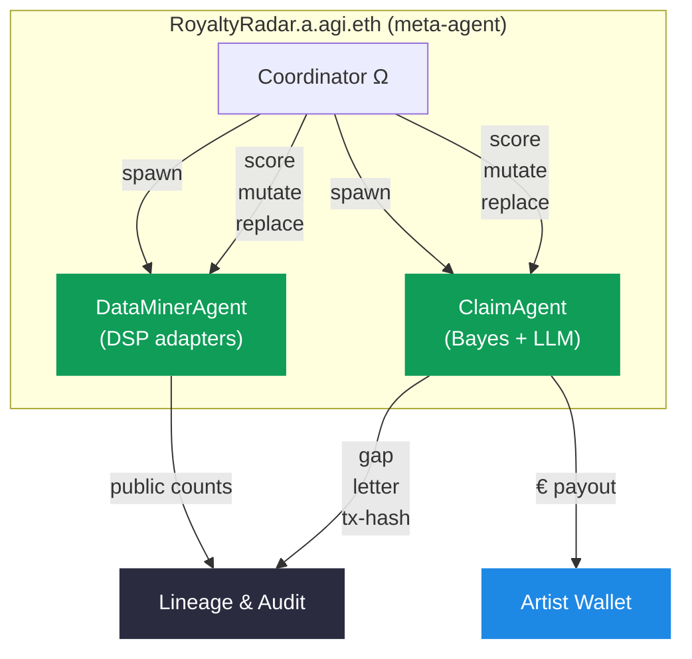

```mermaid
flowchart TD
  %% RoyaltyRadar – Meta-Agentic Flow
  subgraph meta["RoyaltyRadar.a.agi.eth (meta-agent)"]
    ORCH["Coordinator Ω"]
    ORCH -->|spawn| DM["DataMinerAgent<br/>(DSP adapters)"]:::agent
    ORCH -->|spawn| CL["ClaimAgent<br/>(Bayes + LLM)"]:::agent
    ORCH -->|score<br/>mutate<br/>replace| DM
    ORCH -->|score<br/>mutate<br/>replace| CL
  end

  DM -->|public counts| STORE["Lineage & Audit"]:::store
  CL -->|gap<br/>letter<br/>tx-hash| STORE
  CL -->|€ payout| WALLET["Artist Wallet"]:::val

  classDef agent fill:#0f9d58,color:#ffffff,stroke-width:0;
  classDef store fill:#2b2b40,color:#ffffff,stroke-width:0;
  classDef val   fill:#1e88e5,color:#ffffff,stroke-width:0;
```
