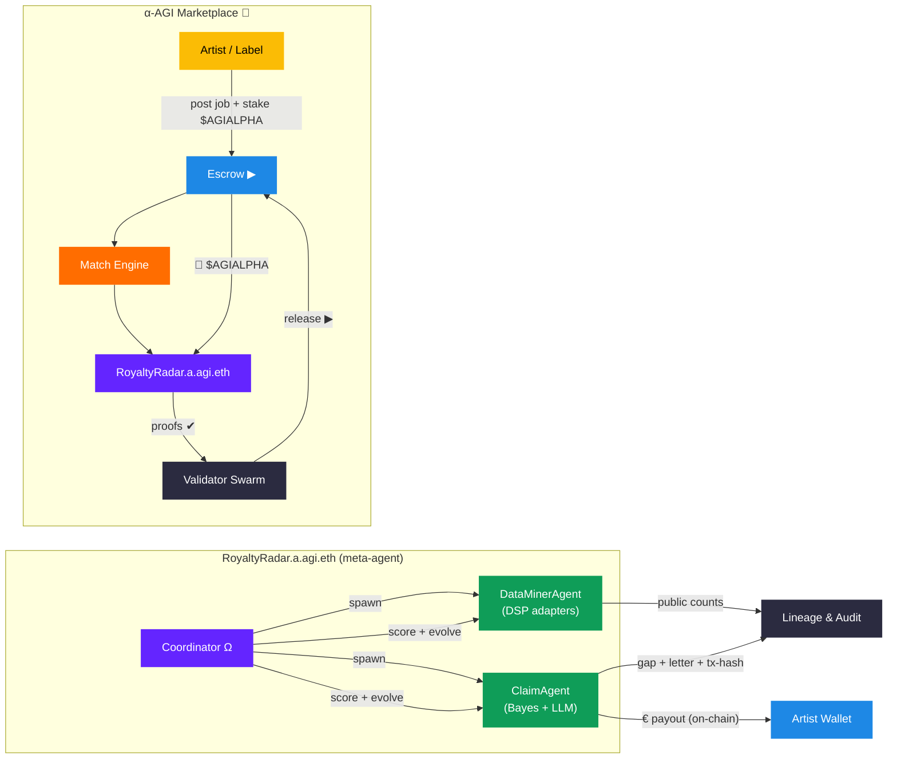

```mermaid
%% RoyaltyRadar 👁️✨ — Meta-Agentic α-AGI Business
flowchart TD

  %% —–––– α-AGI Marketplace ––––—
  subgraph marketplace ["α-AGI Marketplace 🍦"]
    AR["Artist / Label"]:::gold
    ESC["Escrow ▸"]:::blue
    ME["Match Engine"]:::orange
    RR["RoyaltyRadar.a.agi.eth"]:::violet
    VS["Validator Swarm"]:::grey

    AR  -->| "post job + stake $AGIALPHA" | ESC
    ESC -->| "$AGIALPHA" | ME
    ME  --> RR
    RR  -->| "proofs ✔" | VS
    ESC -->| "release ▸" | AR
    RR  -. "reports" .-> ESC
  end

  %% —–––– RoyaltyRadar Internals ––––—
  subgraph royaltyradar ["RoyaltyRadar.a.agi.eth (meta-agent)"]
    COOR["Coordinator Ω"]:::violet
    DM["DataMinerAgent<br/>(DSP adapters)"]:::green
    CL["ClaimAgent<br/>(Bayes + LLM)"]:::green
    STORE["Lineage & Audit"]:::navy
    WAL["Artist Wallet"]:::blue

    COOR -->|spawn| DM
    COOR -->|spawn| CL

    COOR -->| "score + evolve" | DM
    COOR -->| "score + evolve" | CL

    DM -->| "public counts" | STORE
    CL -->| "gap letter + tx-hash" | STORE
    CL -->| "€ payout (on-chain)" | WAL
  end

  %% —–––– Colour palette ––––—
  classDef gold   fill:#e5b80b,color:#000,stroke-width:0;
  classDef orange fill:#ff7043,color:#fff,stroke-width:0;
  classDef blue   fill:#2196f3,color:#fff,stroke-width:0;
  classDef violet fill:#7b1fa2,color:#fff,stroke-width:0;
  classDef green  fill:#2e7d32,color:#fff,stroke-width:0;
  classDef grey   fill:#424242,color:#fff,stroke-width:0;
  classDef navy   fill:#1a237e,color:#fff,stroke-width:0;
```
