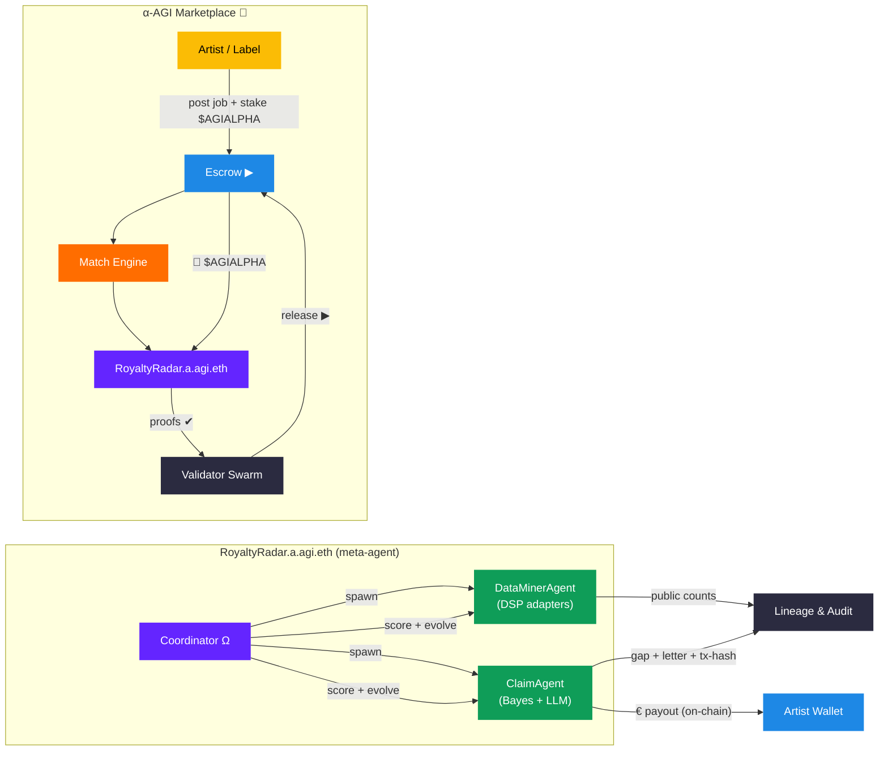

```mermaid
%% ───────────────────────────  PANE A  ───────────────────────────
%% Royalty Radar 👁️✨ – Meta-Agentic Inner Loop
flowchart LR
  subgraph meta["RoyaltyRadar.a.agi.eth  (meta-agent)"]
    ORCH["Coordinator Ω"]:::meta
    ORCH -->|spawn| DM["DataMinerAgent<br/>(DSP adapters)"]:::agent
    ORCH -->|spawn| CL["ClaimAgent<br/>(Bayes + LLM)"]:::agent
    ORCH -->|score + evolve| DM
    ORCH -->|score + evolve| CL
  end

  DM  -- public counts --> STORE["Lineage & Audit"]:::store
  CL  -- gap + letter + tx-hash --> STORE
  CL  -- € payout (on-chain) --> WALLET["Artist Wallet"]:::val

%% ───────────────────────────  PANE B  ───────────────────────────
%% How the Business plugs into the α-AGI Marketplace
  subgraph market["α-AGI Marketplace 🎪"]
    CLIENT["Artist / Label"]:::user
    CLIENT -- post&nbsp;job + stake $AGIALPHA --> ESCROW["Escrow ▶"]:::val
    ESCROW --> MATCH["Match Engine"]:::proc
    MATCH  --> BIZ["RoyaltyRadar.a.agi.eth"]:::meta
    BIZ    -- proofs&nbsp;✔ --> VALID["Validator Swarm"]:::store
    VALID  -- release ▶ --> ESCROW
    ESCROW -- 💎 $AGIALPHA --> BIZ
  end

%% Styling
classDef meta   fill:#6425ff,color:#ffffff,stroke-width:0;
classDef agent  fill:#0f9d58,color:#ffffff,stroke-width:0;
classDef store  fill:#2b2b40,color:#ffffff,stroke-width:0;
classDef val    fill:#1e88e5,color:#ffffff,stroke-width:0;
classDef proc   fill:#ff6d00,color:#ffffff,stroke-width:0;
classDef user   fill:#fbbc05,color:#000000,stroke-width:0;
```
