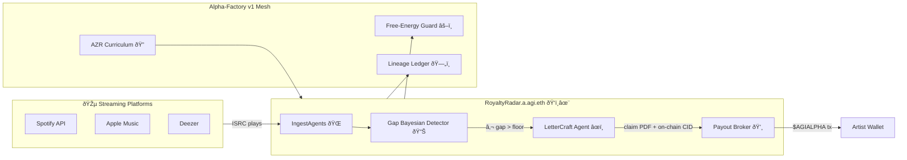

```mermaid
%% Royalty Radar.a.agi.eth – end-to-end value turbine
flowchart LR
    subgraph DSP["🎵 Streaming Platforms"]
        SPOT["Spotify API"]
        APPL["Apple Music"]
        DZ["Deezer"]
    end

    subgraph RoyaltyRadar["RoyaltyRadar.a.agi.eth ðŸ‘ï¸âœ¨"]
        INGEST["IngestAgents ðŸŒ"]
        BAYES["Gap Bayesian Detector 📊"]
        LLM["LetterCraft Agent âœï¸"]
        PAY["Payout Broker 💸"]
    end

    subgraph AF["Alpha-Factory v1 Mesh"]
        AZR["AZR Curriculum ðŸ”"]
        FE["Free-Energy Guard âš–ï¸"]
        LINE["Lineage Ledger 🗄ï¸"]
    end

    DSP -->|ISRC plays| INGEST
    INGEST --> BAYES
    BAYES -->|€ gap > floor| LLM
    LLM -->|claim PDF + on-chain CID| PAY
    PAY -->|$AGIALPHA tx| ARTIST["Artist Wallet"]

    RoyaltyRadar --> LINE
    AZR --> RoyaltyRadar
    RoyaltyRadar --> FE
```
