```mermaid
%% ───────────────────────────  PANE A  ───────────────────────────
%% Royalty Radar 👁️✨ – Meta-Agentic Inner Loop
flowchart LR
  subgraph meta["RoyaltyRadar.a.agi.eth  (meta-agent)"]
    ORCH["Coordinator Ω"]:::meta
    ORCH -->|spawn| DM["DataMinerAgent<br/>(DSP adapters)"]:::agent
    ORCH -->|spawn| CL["ClaimAgent<br/>(Bayes + LLM)"]:::agent
    ORCH -->|score + evolve| DM
    ORCH -->|score + evolve| CL
  end

  DM  -- public counts --> STORE["Lineage & Audit"]:::store
  CL  -- gap + letter + tx-hash --> STORE
  CL  -- € payout (on-chain) --> WALLET["Artist Wallet"]:::val

%% ───────────────────────────  PANE B  ───────────────────────────
%% How the Business plugs into the α-AGI Marketplace
  subgraph market["α-AGI Marketplace 🎪"]
    CLIENT["Artist / Label"]:::user
    CLIENT -- post&nbsp;job + stake $AGIALPHA --> ESCROW["Escrow ▶"]:::val
    ESCROW --> MATCH["Match Engine"]:::proc
    MATCH  --> BIZ["RoyaltyRadar.a.agi.eth"]:::meta
    BIZ    -- proofs&nbsp;✔ --> VALID["Validator Swarm"]:::store
    VALID  -- release ▶ --> ESCROW
    ESCROW -- 💎 $AGIALPHA --> BIZ
  end

%% Styling
classDef meta   fill:#6425ff,color:#ffffff,stroke-width:0;
classDef agent  fill:#0f9d58,color:#ffffff,stroke-width:0;
classDef store  fill:#2b2b40,color:#ffffff,stroke-width:0;
classDef val    fill:#1e88e5,color:#ffffff,stroke-width:0;
classDef proc   fill:#ff6d00,color:#ffffff,stroke-width:0;
classDef user   fill:#fbbc05,color:#000000,stroke-width:0;
```

```mermaid
%% RoyaltyRadar 👁️✨ — Meta-Agentic α-AGI Business (GitHub-safe)
%% ──────────────────────────────────────────────────────────────
classDef gold   fill:#e5b80b,color:#000,stroke-width:0;
classDef orange fill:#ff7043,color:#fff,stroke-width:0;
classDef blue   fill:#2196f3,color:#fff,stroke-width:0;
classDef violet fill:#7b1fa2,color:#fff,stroke-width:0;
classDef green  fill:#2e7d32,color:#fff,stroke-width:0;
classDef grey   fill:#424242,color:#fff,stroke-width:0;
classDef navy   fill:#1a237e,color:#fff,stroke-width:0;

flowchart TD
  %% ════════════ α-AGI Marketplace ════════════
  subgraph MARKETPLACE["α-AGI Marketplace 🍦"] 
    AR["Artist / Label"]:::gold
    ESC["Escrow ▸"]:::blue
    ME["Match Engine"]:::orange
    RR["RoyaltyRadar.a.agi.eth"]:::violet
    VS["Validator Swarm"]:::grey

    AR  -->|post job · stake \$\AGIALPHA| ESC
    ESC -->|funds \$\AGIALPHA| ME
    ME  --> RR
    RR  -->|proofs ✔| VS
    ESC -->|release payout| AR
    RR  -. reports .- ESC
  end

  %% ════════════ RoyaltyRadar Internals ════════════
  subgraph RR_INTERNAL["RoyaltyRadar.a.agi.eth (meta-agent)"]
    COOR["Coordinator Ω"]:::violet
    DM["DataMinerAgent<br/>(DSP adapters)"]:::green
    CL["ClaimAgent<br/>(Bayes + LLM)"]:::green
    STORE["Lineage & Audit"]:::navy
    WAL["Artist Wallet"]:::blue

    COOR -->|spawn| DM
    COOR -->|spawn| CL

    COOR -->|score · evolve| DM
    COOR -->|score · evolve| CL

    DM -->|public counts| STORE
    CL -->|gap letter + tx-hash| STORE
    CL -->|€ payout (on-chain)| WAL
  end
```
