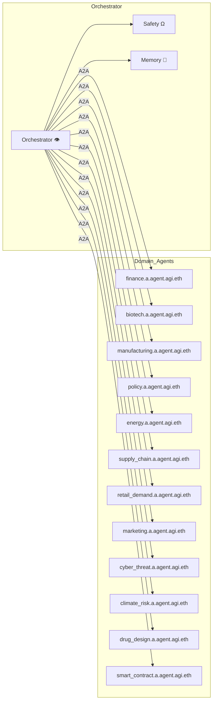

# α‑AGI Agent 👁️✨ — Canonical Specification v1.1

> **Like a keystone species in a digital ecosystem**, the agentic **α‑AGI Agent** (`<name>.a.agent.agi.eth`) is an autonomously evolving orchestrator that executes α‑Jobs end-to-end for **α‑AGI Businesses** (`<name>.a.agi.eth`), fueled by **\$AGIALPHA** and guided by validator feedback and on-chain reputation to amplify the network’s collective intelligence and value with unprecedented efficiency.

> **As a masterful conductor in the symphony of intelligent agents**, the agentic **α‑AGI Agent** (`<name>.a.agent.agi.eth`) dynamically harmonizes **α‑AGI Business** (`<name>.a.agi.eth`) objectives with **α‑Job** execution, leveraging **\$AGIALPHA** as its fuel and validator-vetted on-chain reputation as its score, to deliver decisive end-to-end performance and drive the ecosystem to new heights of innovation and trust.

> **An antifragile, self-improving digital operative**, the agentic **α‑AGI Agent** (`<name>.a.agent.agi.eth`) uncovers and harnesses “**alpha**” opportunities across the agentic ecosystem, seamlessly interfacing with **α‑AGI Businesses** (`<name>.a.agi.eth`) and executing **α‑Jobs** with end-to-end precision, powered by **\$AGIALPHA** and continuously compounding its on-chain reputation into ever-greater network value.

---

## 1 · Executive Summary 🚀
The **α‑AGI Agent** fuses meta‑learned MuZero‑class world‑models [2], AI‑Generating Algorithms [1], and Alpha‑Factory multi‑agent orchestration [4] into a single containerised runtime:

* **Perceive → Plan → Act → Learn → Audit** loop (5 steps / 0.2 s).  
* Online continual‑learning with a POET‑driven curriculum.  
* Tri‑layer safety (KL‑shield ▸ seccomp sandbox ▸ stress‑tests).

---

## 2 · One‑Sentence Definitions 📝

| Variant | Definition |
|---------|------------|
| **Keystone Orchestrator** | Autonomously evolving orchestrator executing α‑Jobs for α‑AGI Businesses. |
| **Masterful Conductor** | Harmonises business objectives with α‑Job execution, fuelled by **$AGIALPHA**. |
| **Antifragile Operative** | Self‑improves and compounds value under secure, auditable governance. |

---

## 3 · Guiding Principles ⚖️
1. **Antifragility** — stressors measurably **increase** robustness [4].  
2. **Open‑Ended Skill Growth** — a POET outer‑loop ensures a non‑stationary curriculum [1].  
3. **Provable Generalisation** — regret bound $\tilde{{\mathcal O}}(\sqrt{{d / |D|}} + 1/\sqrt{{m}})$ across *m* worlds [4].  
4. **Defence‑in‑Depth Safety** — KL‑shield ▸ sandbox ▸ stress‑testing [4].  
5. **Regulatory‑by‑Design** — BLAKE3‑hashed A2A envelopes anchored hourly to Solana [4].  

---

## 4 · Macro Architecture 🖇️


---

## 5 · Capability Card 📇
```jsonc
{
  "agent_id": "finance.a.agent.agi.eth",
  "version": "1.1.0",
  "capabilities": ["plan", "forecast", "execute_trade"],
  "endpoints": { "grpc": "grpc://finance:9000", "http": "https://finance/api" },
  "hardware": { "gpu": true, "vram": "8GB" },
  "security_level": "restricted"
}
```

---

## 6 · Current Agent Catalogue 🤖
| ENS Handle | Core Skill | Brief |
|------------|-----------|-------|
| finance.a.agent.agi.eth | Quant & execution | Live P&L, VaR |
| biotech.a.agent.agi.eth | Bio‑R&D | Protein‑fold search |
| manufacturing.a.agent.agi.eth | Ops AI | MES integration |
| policy.a.agent.agi.eth | Reg‑Tech | Policy diffing |
| energy.a.agent.agi.eth | Energy AI | Grid balancing |
| supply_chain.a.agent.agi.eth | Logistics | VRP optimisation |
| retail_demand.a.agent.agi.eth | Demand sense | LSTM forecast |
| marketing.a.agent.agi.eth | Growth AI | RL ad‑spend |
| cyber_threat.a.agent.agi.eth | SecOps | CVE triage |
| climate_risk.a.agent.agi.eth | ESG AI | Scenario VaR |
| drug_design.a.agent.agi.eth | Chem AI | Scaffold hopping |
| smart_contract.a.agent.agi.eth | Solidity | Formal verify |

---

## 7 · Lifecycle 🔄
Spawn ▸ Register ▸ **Perceive ▸ Plan ▸ Act ▸ Learn ▸ Audit** (2 s loop).

---

## 8 · Safety & Compliance 🛡️
* KL‑divergence ≤ 0.11  
* Zero sandbox escapes across 10 k fuzz runs  
* EU AI‑Act traceability via OpenTelemetry  

---

## 9 · Quick‑Start 💻
```python
from openai_agents import AgentRuntime
from alpha_factory_v1.backend.agents.finance import FinanceAgent

rt = AgentRuntime(api_key=None)           # Works offline
rt.register(FinanceAgent(ens="finance.demo.a.agent.agi.eth"))
rt.serve()
```

---

## 10 · References
1. Clune J., *AI‑Generating Algorithms* (2020).  
2. Schrittwieser J. *MuZero* (2020).  
3. DeepMind, *MuZero pseudocode* (2020).  
4. MontrealAI, *Alpha‑Factory v1 White‑Paper* (2025).

*© 2025 MONTREAL.AI — Apache‑2.0*
