# α‑AGI Agent 👁️✨ — Canonical Specification v1.0

> **Mission (Variant 1 — Keystone Orchestrator)**  
> *Like a keystone species in a digital ecosystem, the agentic **α‑AGI Agent** (`<name>.a.agent.agi.eth`) autonomously evolves and executes α‑Jobs end‑to‑end for its parent **α‑AGI Business**, fuel‑efficiently converting \$AGIALPHA and validator feedback into compounding network value.*  

> **Mission (Variant 2 — Masterful Conductor)**  
> *As a masterful conductor in the symphony of intelligent agents, the **α‑AGI Agent** dynamically harmonises business objectives with α‑Job execution, using on‑chain reputation as its score to deliver decisive performance.*  

> **Mission (Variant 3 — Antifragile Operative)**  
> *An antifragile, self‑improving digital operative that uncovers and harnesses “alpha” across the ecosystem, seamlessly executing α‑Jobs while compounding its reputation into ever‑greater network value.* 

---

## 1 · Executive Summary 🚀
The **α‑AGI Agent** fuses meta‑learned MuZero‑class world‑models citeturn4file2, AI‑Generating Algorithms citeturn4file1, and Alpha‑Factory multi‑agent orchestration citeturn4file4 into a single containerised runtime:

* **Perceive → Plan → Act → Learn → Audit** loop (5 steps/0.2 s).  
* Online continual‑learning with POET‑driven curriculum.  
* Tri‑layer safety (KL‑shield ▸ seccomp sandbox ▸ stress‑tests).

---

## 2 · One‑Sentence Definitions 📝

| Variant | Definition |
|---------|------------|
| **Keystone Orchestrator** | Autonomously evolving orchestrator executing α‑Jobs for α‑AGI Businesses. |
| **Masterful Conductor** | Harmonises business objectives with α‑Job execution, fuelled by \$AGIALPHA. |
| **Antifragile Operative** | Self‑improves and compounds value under secure, auditable governance. |

---

## 3 · Guiding Principles ⚖️
1. **Antifragility** — stressors measurably **increase** robustness. citeturn4file4  
2. **Open‑Ended Skill Growth** — POET outer‑loop ensures non‑stationary curriculum. citeturn4file1  
3. **Provable Generalisation** — regret bound $\tilde{O}(\sqrt{d/|D|}+1/\sqrt{m})$. citeturn4file4  
4. **Defence‑in‑Depth Safety** — KL‑shield ▸ sandbox ▸ stress‑testing. citeturn4file4  
5. **Reg‑by‑Design** — BLAKE3‑hashed A2A envelopes anchored hourly to Solana. citeturn4file4  

---

## 4 · Macro Architecture 🖇️

```mermaid
flowchart LR
  subgraph Orchestrator
    ORC["Orchestrator 👁️"]
    SAF["Safety Ω"]
    MEM["Memory 🧠"]
  end
  subgraph Agents
    FIN["finance.a.agent.agi.eth"]
    BIO["biotech.a.agent.agi.eth"]
    MFG["manufacturing.a.agent.agi.eth"]
    POL["policy.a.agent.agi.eth"]
    ENE["energy.a.agent.agi.eth"]
    SUP["supply_chain.a.agent.agi.eth"]
    RET["retail_demand.a.agent.agi.eth"]
    MKT["marketing.a.agent.agi.eth"]
    CYB["cyber_threat.a.agent.agi.eth"]
    CLM["climate_risk.a.agent.agi.eth"]
    DRG["drug_design.a.agent.agi.eth"]
    SMT["smart_contract.a.agent.agi.eth"]
  end

  ORC -- A2A --> FIN
  ORC -- A2A --> BIO
  ORC -- A2A --> MFG
  ORC -- A2A --> POL
  ORC -- A2A --> ENE
  ORC -- A2A --> SUP
  ORC -- A2A --> RET
  ORC -- A2A --> MKT
  ORC -- A2A --> CYB
  ORC -- A2A --> CLM
  ORC -- A2A --> DRG
  ORC -- A2A --> SMT

  ORC --> SAF
  ORC --> MEM
```


---

## 5 · Capability Card 📇
```jsonc
{
  "agent_id": "finance.<name>.a.agent.agi.eth",
  "version": "1.0.0",
  "capabilities": ["plan", "forecast", "execute_trade"],
  "endpoints": { "grpc": "grpc://finance:9000", "http": "https://finance/api" },
  "hardware": { "gpu": true, "vram": "8GB" },
  "security_level": "restricted"
}
```

---

## 6 · Current Agent Catalogue 🤖
| ENS Handle | Core Skill | Brief |
|------------|-----------|-------|
| finance.&lt;name&gt;.a.agent.agi.eth | Quant & execution | Live P&L, VaR |
| biotech.&lt;name&gt;.a.agent.agi.eth | Bio‑R&D | Protein‑fold search |
| manufacturing.&lt;name&gt;.a.agent.agi.eth | Ops AI | MES integration |
| policy.&lt;name&gt;.a.agent.agi.eth | Reg‑Tech | Policy diffing |
| energy.&lt;name&gt;.a.agent.agi.eth | Energy AI | Grid balancing |
| supply_chain.&lt;name&gt;.a.agent.agi.eth | Logistics | VRP optimisation |
| retail_demand.&lt;name&gt;.a.agent.agi.eth | Demand sense | LSTM forecast |
| marketing.&lt;name&gt;.a.agent.agi.eth | Growth AI | RL ad‑spend |
| cyber_threat.&lt;name&gt;.a.agent.agi.eth | SecOps | CVE triage |
| climate_risk.&lt;name&gt;.a.agent.agi.eth | ESG AI | Scenario VaR |
| drug_design.&lt;name&gt;.a.agent.agi.eth | Chem AI | Scaffold hopping |
| smart_contract.&lt;name&gt;.a.agent.agi.eth | Solidity | Formal verify |

---

## 7 · Lifecycle 🔄
Spawn ▸ Register ▸ Perceive ▸ Plan ▸ Act ▸ Learn ▸ Audit (2 s loop).

---

## 8 · Safety & Compliance 🛡️
KL‑divergence ≤ 0.11, zero sandbox escapes (10 k fuzz), EU AI‑Act traceability via OpenTelemetry.

---

## 9 · Quick‑Start 💻
```python
from openai_agents import AgentRuntime
from alpha_factory_v1.backend.agents.finance import FinanceAgent
rt = AgentRuntime(api_key=None)
rt.register(FinanceAgent(ens="finance.demo.a.agent.agi.eth"))
rt.serve()
```

---

## 10 · References
1. Clune J., *AI‑GAs* (2020) citeturn4file1  
2. Schrittwieser J., *MuZero* (2020) citeturn4file2  
3. DeepMind, MuZero pseudocode (2020) citeturn4file3  
4. MontrealAI, *Alpha‑Factory v1* White‑Paper (2025) citeturn4file4  

*© 2025 MONTREAL.AI — Apache‑2.0*

