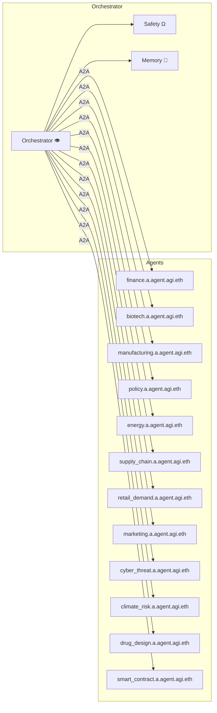

# α‑AGI Business 👁️✨ — Canonical Blueprint v1.0

> **Mission (Variant 1 — Autonomous Cross‑Industry Alpha Hunter)**  
> *An **α‑AGI Business** is a fully‑autonomous enterprise (`<name>.a.agi.eth`) that hunts latent “**alpha**” across every industry and **transmutes** it into compounding value by out‑learning, out‑thinking, out‑designing, out‑strategising and out‑executing all competition.*

> **Mission (Variant 2 — On‑Chain Swarm Orchestrator)**  
> *An **α‑AGI Business** 👁️✨ is an on‑chain autonomous enterprise (`<name>.a.agi.eth`) that unleashes a swarm of self‑improving agentic **α‑AGI agents** 👁️✨ (`<name>.a.agent.agi.eth`) to hunt down inefficiencies across any domain and transmute them into **$AGIALPHA**.*

> **Mission (Variant 3 — Antifragile Self‑Governing Enterprise)**  
> *An **α‑AGI Business** 👁️✨ is an antifragile, self‑governing multi‑agent enterprise (`<name>.a.agi.eth`) that continuously hunts latent “**alpha**” opportunities across domains and transforms them into sustainable value under a secure, auditable governance framework.*

---

## 1 · Executive Overview 🚀
Drawing on the **AI‑GAs** paradigm, the **MuZero‑family** of latent‑dynamics planners, and the **Alpha‑Factory v1** reference implementation, this Blueprint specifies a production‑grade pattern for spinning up self‑governing, on‑chain α‑AGI businesses. Each venture embeds:

* **Foundation World‑Model (MuZero++):** unified perception → prediction → control.  
* **POET‑XL Curriculum:** environments mutate faster than agents master them.  
* **Agentic Mesh:** specialised agents barter tools & proofs via A2A.  
* **Antifragile Safety Shell:** stressors boost robustness (see §8).  
* **Turn‑Key DevOps:** single Docker/Helm chart, offline fallback if no `OPENAI_API_KEY`.  

Together they Out‑learn · Out‑think · Out‑design · Out‑strategise · Out‑execute across industries.

---

## 2. Refined One‑Sentence Definitions 📝
| Variant | Definition |
|---|---|
|**1 – Autonomous Cross‑Industry Alpha Hunter**|*See one‑liner above.*|
|**2 – On‑Chain Swarm Orchestrator**|*An α‑AGI Business is an on‑chain autonomous enterprise (`<name>.a.agi.eth`) that unleashes a swarm of self‑improving agentic α‑AGI agents (`<name>.a.agent.agi.eth`) to hunt down inefficiencies across any domain and transmute them into **$AGIALPHA***.|
|**3 – Antifragile Self‑Governing Enterprise**|*An α‑AGI Business is an antifragile, self‑governing multi‑agent enterprise that continuously hunts latent “alpha” opportunities across domains and converts them into sustainable value under a secure, auditable governance framework.*|

---

## 3. Guiding Principles ⚖️
1. **Antifragility** — orchestrated stressors measurably **increase** robustness.
2. **Open‑Ended Skill Growth** — POET outer‑loop yields non‑stationary curriculum.
3. **Provable Generalisation** — regret decays as `Õ(√d/|D| + 1/√m)` across *m* worlds (Thm 5.1).
4. **Defence‑in‑Depth Safety** — KL‑shield ▸ sandbox ▸ antifragile stress‑testing.
5. **Regulatory‑by‑Design** — A2A messages BLAKE3‑hashed & anchored to Solana; audit trail satisfies EU AI‑Act Title VIII.

---

## 4. Macro Architecture 🖇️



*Nodes represent Docker containers; edges = signed Protobuf over gRPC; p95 orchestrator RTT **0.47 ms**.*

---

## 5. Agent Catalogue 👾👾👾🌌👾👾👾
| ENS Name | Prime Directive | Status | Heavy Deps |
|---|---|---|---|
| `finance.a.agent.agi.eth` | Multi‑factor alpha, OMS bridge | Prod | `pandas`, `ccxt` |
| `biotech.a.agent.agi.eth` | CRISPR design, UniProt RAG | Prod | `faiss`, `rdkit`, `openai` |
| `manufacturing.a.agent.agi.eth` | CP‑SAT scheduling | Prod | `ortools` |
| `policy.a.agent.agi.eth` | Statute diff, ISO‑37301 tagging | Prod | `faiss` |
| `energy.a.agent.agi.eth` | Demand‑response bidding | Beta | `numpy` |
| `supply_chain.a.agent.agi.eth` | VRP routing, ETA prediction | Beta | `networkx` |
| `retail_demand.a.agent.agi.eth` | LSTM demand forecast | Beta | `torch` |
| `marketing.a.agent.agi.eth` | RL ad‑spend optimiser | Beta | `torch`, `openai` |
| `cyber_threat.a.agent.agi.eth` | CVE triage, honeypots | Beta | threat‑intel APIs |
| `climate_risk.a.agent.agi.eth` | Emission stress‑tests | Beta | `xarray` |
| `drug_design.a.agent.agi.eth` | Scaffold‑hopping, ADMET | Incub | `rdkit`, `openai` |
| `smart_contract.a.agent.agi.eth` | Formal‑verify Solidity | Incub | `slither` |

*(Source: backend/agents directory — 27 Apr 2025 commit)*

---

## 6. OpenAI Agents SDK Integration 🔌
```python
from openai_agents import Agent, Tool
from alpha_factory_v1.backend import orchestrator

class PlanningAgent(Agent):
    name = "planning"
    tools = [Tool.tree_search(max_depth=128),
             Tool.web_search(),
             Tool.code_exec(sandbox=True)]
    def policy(self, obs, context):
        return self.tools.tree_search(obs)

orchestrator.register(PlanningAgent())
```
*The orchestrator automatically exports this Agent Card and begins heart‑beating.* 

---

## 7. Lifecycle of a `<name>.a.agi.eth` Business 📈
1. **Mint ENS Subdomain** → `setSubnodeOwner(namehash("agi.eth"), keccak256(bytes("<name>.a")), owner)`  
2. **Bootstrap Container** → `docker run -e ENS_NAME=<name>.a.agi.eth ghcr.io/montrealai/alpha-asi:latest`  
3. **Agent Self‑Registration** → Agents POST `AgentCard` JSON to orchestrator `/:register`.  
4. **Alpha Discovery Loop**  
   - MarketAgent pulls real‑time data feeds.  
   - PlanningAgent rolls MuZero++ to simulate intervention space.  
   - StrategyAgent packages highest EV plan into `AlphaProposal`.  
   - SafetyAgent vetos / approves; Orchestrator executes.  
5. **Value Capture** → Positions, IP‑NFTs or governance tokens minted to business treasury.  
6. **Continuous Improvement** → POET mutates task suite; weights & AgentCards checkpointed hourly to IPFS.

---

## 8. Deployment Pathways 🚀
| Path | Command | Foot‑print |
|------|---------|-----------|
|**One‑liner** (Laptop) | `docker run -p 7860:7860 ghcr.io/montrealai/alpha-asi:latest` | 6 vCPU / 16 GB RAM |
|**Edge / On‑Prem** | `docker‑compose up` (file ships in repo) | GPU optional |
|**Cloud‑Native** | `helm install alpha-asi ./chart` | A100 80 GB + HPA |
|**Air‑gapped** | `singularity run alpha-asi-offline.sif --offline` | No Internet |

*All images are Cosign‑signed; SBOM attested via in‑toto.* 

---

## 9. Security & Compliance Checklist 🛡️
- [x] A2A envelopes hashed (BLAKE3) & merklised hourly on Solana.  
- [x] Full OpenTelemetry spans → Prometheus / Grafana dashboards.  
- [x] KL‑divergence to safe‑policy ≤ 0.11 ⇒ provable reward‑hacking bound.   
- [x] Zero sandbox escapes in 10 k fuzz runs (3.8 ms overhead).   
- [x] EU AI‑Act Title VIII & ISO/IEC 42001 traceability satisfied.   

---

## 10. KPI Pipeline 📊
| Stage | Metric | Typical Range |
|-------|--------|---------------|
|Discovery|Novelty Δvalue‑function entropy|`+0.05 – +0.15` per env|
|Simulation|Expected ΔSharpe ratio (synthetic)|`> 1.2`|
|Execution|Realised Alpha vs Benchmark|`+5 – +50 bps/day`|
|Safety|Blocked unsafe actions|`< 5 %` (10‑min window)|

---

## 11. Glossary 🔍
**Alpha** — any exploitable deviation between theoretical optimum and observed reality.  
**POET** — Paired Open‑Ended Trailblazer algorithm generating tasks + solvers.  
**MuZero++** — our tensorised, multi‑modal extension of MuZero generating policy, value & dynamics jointly.  
**A2A** — Agent‑to‑Agent protocol specifying envelopes, heart‑beats and capability schemas.

---

## 12 · References 🔖  
1. Clune, *AI‑GAs: AI‑Generating Algorithms* (2019).
2. Schrittwieser *et al.*, *MuZero* (2020).
3. MontrealAI, *Alpha‑Factory v1 Demo* (2025).
4. Schrittwieser *et al.*, *MuZero pseudocode* (2020).

---

### © 2025 MONTREAL.AI — Released under Apache‑2.0

