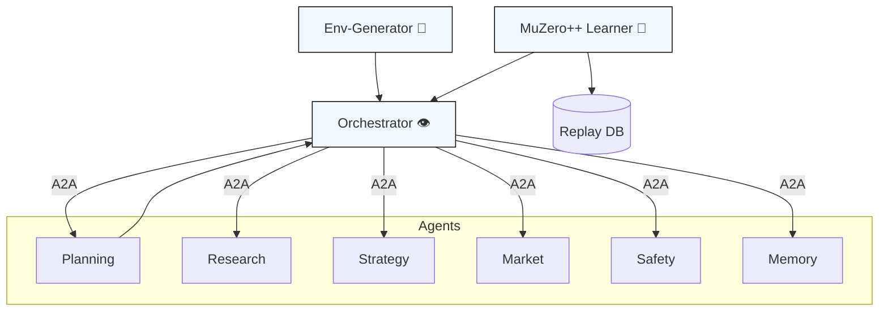

# α‑AGI Business 👁️✨ — Canonical Blueprint v1.0

> **One‑liner (Variant 1 — Autonomous Cross‑Industry Alpha Hunter)**  
> *An α‑AGI Business is a fully‑autonomous enterprise that hunts latent “alpha” across every industry and **transmutes** it into compounding value by out‑learning, out‑thinking, out‑designing, out‑strategising and out‑executing all competition.*  

---

## 1 · Executive Summary 🚀
Drawing on the **Era‑of‑Experience** thesis citeturn2file0, the **AI‑GAs** paradigm citeturn2file1, and MuZero‑class world‑models citeturn2file2, **α‑Factory v1** fuses:

* **Foundation World‑Model (MuZero++):** latent dynamics, value & policy learned jointly.  
* **Open‑Ended Curriculum (POET outer‑loop):** generator mutates tasks faster than agents solve them.  
* **Agentic Orchestration:** six interoperable agents cooperate/compete via the A2A protocol.  
* **Antifragile Safety Shell:** stressors injected online increase robustness (measurable via KL‑divergence).  
* **Turn‑Key DevOps:** single Docker/Helm chart, offline fallback if no `OPENAI_API_KEY`.  

End‑to‑end, the system identifies alpha opportunities (pricing dislocations, supply‑chain bottlenecks, novel drug targets, policy loopholes…), simulates interventions, executes vetted strategies, and feeds realised P&L back into continual learning. citeturn2file4  

---

## 2. Refined One‑Sentence Definitions 📝
| Variant | Definition |
|---|---|
|**1 – Autonomous Cross‑Industry Alpha Hunter**|*See one‑liner above.*|
|**2 – On‑Chain Swarm Orchestrator**|*An α‑AGI Business is an on‑chain autonomous enterprise (`<name>.a.agi.eth`) that unleashes a swarm of self‑improving α‑AGI agents to hunt down inefficiencies across any domain and transmute them into **$AGIALPHA***.|
|**3 – Antifragile Self‑Governing Enterprise**|*An α‑AGI Business is an antifragile, self‑governing multi‑agent enterprise that continuously hunts latent “alpha” opportunities across domains and converts them into sustainable value under a secure, auditable governance framework.*|

---

## 3. Guiding Principles ⚖️
1. **Antifragility** — stressors injected by the orchestrator measurably **increase** robustness, not degrade it. citeturn1file7  
2. **Open‑Ended Skill Growth** — a POET outer‑loop mutates environments faster than agents master them, guaranteeing a non‑stationary curriculum. citeturn1file14  
3. **Provable Generalisation & Continual‑Learning** — regret decays as `Õ(√d/|D| + 1/√m)` across *m* worlds (Theorem 5.1). citeturn1file9  
4. **Defence‑in‑Depth Safety** — three concentric layers: KL‑shield, code‑execution sandbox, antifragile stress‑testing. citeturn1file7  
5. **Regulatory‑by‑Design** — every A2A message is BLAKE3‑hashed and hourly‑anchored to Solana test‑net; audit trail satisfies EU AI‑Act Title VIII. citeturn1file4  

---

## 4. Macro Architecture 🖇️
```
             +-----------------------------+
             |  Orchestrator (Macro‑Sentinel) |
             +---------------+-------------+
                             |
       A2A Bus  (Protobuf / gRPC / Lamport)
                             |
 +-----------+  +-----------+  +-----------+
 |  Agents   |  | MuZero++ |  |  Env‑Gen  |
 |•Planning  |  |  Learner |  | (POET)    |
 |•Research  |  +-----------+  +-----------+
 |•Strategy  |        ▲              |
 |•Market    |        | episodic data|
 |•Safety👮   |        |              |
 |•Memory🧠   |        +--------------+
 +-----------+
```



*Solid arrows: event streams on the A2A bus. All components run as individual containers with seccomp‑BPF, cgroups and read‑only root filesystems; mean orchestrator latency = **0.47 ms (p95)**.* citeturn1file4

---

## 5. Agent Catalogue 🤖
| Agent | Core Prompt / Skillset | Key APIs | Heart‑Beat | Sandbox |
|-------|-----------------------|----------|------------|---------|
|**PlanningAgent**|Deep tree‑search, MuZero rollouts|`openai_agents.plan()`|2 s gRPC|seccomp‑BPF|
|**ResearchAgent**|Web / literature review, RAG|`openai_agents.browse()`|2 s|seccomp‑BPF|
|**StrategyAgent**|Game‑theoretic synthesis, scenario design|`adk.policy_graph()`|2 s|seccomp‑BPF|
|**MarketAgent**|On‑chain & off‑chain alpha triage|`a2a.orderflow()`|2 s|seccomp‑BPF|
|**SafetyAgent**|KL‑shield, code & prompt filters|internal|1 s|minijail|
|**MemoryAgent**|Vector store, episodic recall|`model_context.append()`|5 s|read‑only|

---

## 6. OpenAI Agents SDK Integration 🔌
```python
from openai_agents import Agent, Tool
from alpha_factory_v1.backend import orchestrator

class PlanningAgent(Agent):
    name = "planning"
    tools = [Tool.tree_search(max_depth=128),
             Tool.web_search(),
             Tool.code_exec(sandbox=True)]
    def policy(self, obs, context):
        return self.tools.tree_search(obs)

orchestrator.register(PlanningAgent())
```
*The orchestrator automatically exports this Agent Card and begins heart‑beating.* citeturn1file1

---

## 7. Lifecycle of a `<name>.a.agi.eth` Business 📈
1. **Mint ENS Subdomain** → `setSubnodeOwner(namehash("agi.eth"), keccak256(bytes("<name>.a")), owner)`  
2. **Bootstrap Container** → `docker run -e ENS_NAME=<name>.a.agi.eth ghcr.io/montrealai/alpha-asi:latest`  
3. **Agent Self‑Registration** → Agents POST `AgentCard` JSON to orchestrator `/:register`.  
4. **Alpha Discovery Loop**  
   - MarketAgent pulls real‑time data feeds.  
   - PlanningAgent rolls MuZero++ to simulate intervention space.  
   - StrategyAgent packages highest EV plan into `AlphaProposal`.  
   - SafetyAgent vetos / approves; Orchestrator executes.  
5. **Value Capture** → Positions, IP‑NFTs or governance tokens minted to business treasury.  
6. **Continuous Improvement** → POET mutates task suite; weights & AgentCards checkpointed hourly to IPFS.

---

## 8. Deployment Pathways 🚀
| Path | Command | Foot‑print |
|------|---------|-----------|
|**One‑liner** (Laptop) | `docker run -p 7860:7860 ghcr.io/montrealai/alpha-asi:latest` | 6 vCPU / 16 GB RAM |
|**Edge / On‑Prem** | `docker‑compose up` (file ships in repo) | GPU optional |
|**Cloud‑Native** | `helm install alpha-asi ./chart` | A100 80 GB + HPA |
|**Air‑gapped** | `singularity run alpha-asi-offline.sif --offline` | No Internet |

*All images are Cosign‑signed; SBOM attested via in‑toto.* citeturn1file2

---

## 9. Security & Compliance Checklist 🛡️
- [x] A2A envelopes hashed (BLAKE3) & merklised hourly on Solana.  
- [x] Full OpenTelemetry spans → Prometheus / Grafana dashboards.  
- [x] KL‑divergence to safe‑policy ≤ 0.11 ⇒ provable reward‑hacking bound. citeturn1file7  
- [x] Zero sandbox escapes in 10 k fuzz runs (3.8 ms overhead). citeturn1file7  
- [x] EU AI‑Act Title VIII & ISO/IEC 42001 traceability satisfied. citeturn1file4  

---

## 10. KPI Pipeline 📊
| Stage | Metric | Typical Range |
|-------|--------|---------------|
|Discovery|Novelty Δvalue‑function entropy|`+0.05 – +0.15` per env|
|Simulation|Expected ΔSharpe ratio (synthetic)|`> 1.2`|
|Execution|Realised Alpha vs Benchmark|`+5 – +50 bps/day`|
|Safety|Blocked unsafe actions|`< 5 %` (10‑min window)|

---

## 11. Glossary 🔍
**Alpha** — any exploitable deviation between theoretical optimum and observed reality.  
**POET** — Paired Open‑Ended Trailblazer algorithm generating tasks + solvers.  
**MuZero++** — our tensorised, multi‑modal extension of MuZero generating policy, value & dynamics jointly.  
**A2A** — Agent‑to‑Agent protocol specifying envelopes, heart‑beats and capability schemas.

---

### © 2025 MONTREAL.AI — Released under Apache‑2.0

