[See docs/DISCLAIMER_SNIPPET.md](../DISCLAIMER_SNIPPET.md)

# 🌐 Macro‑Sentinel · Alpha‑Factory v1 👁️✨

{.demo-preview}

[See docs/DISCLAIMER_SNIPPET.md](../../../docs/DISCLAIMER_SNIPPET.md)
This repository is a conceptual research prototype. References to "AGI" and "superintelligence" describe aspirational goals and do not indicate the presence of a real general intelligence. Use at your own risk. Nothing herein constitutes financial advice. MontrealAI and the maintainers accept no liability for losses incurred from using this software.
Each demo package exposes its own `__version__` constant. The value marks the revision of that demo only and does not reflect the overall Alpha‑Factory release version.


# 🌐 Macro‑Sentinel · Alpha‑Factory v1 👁️✨  
*Cross‑asset macro risk radar powered by multi‑agent α‑AGI*

[](#one‑command‑docker) 
[](#google‑colab) 


> **TL;DR**   Spin up a self‑healing stack that ingests macro telemetry, runs a Monte‑Carlo risk engine, sizes an ES hedge, and explains its reasoning—all behind a Gradio dashboard.

This demonstration is a conceptual research prototype. Any references to AGI or superintelligence describe aspirational goals rather than current capabilities.

---

## ✨ Key capabilities
| Capability | Detail |
|------------|--------|
| **Multi‑agent orchestration** | OpenAI Agents SDK + A2A protocol |
| **LLM fail‑over** | GPT‑4o when `OPENAI_API_KEY` present, Mixtral‑8x7B (Ollama) otherwise |
| **Live + offline feeds** | FRED yield curve, Fed RSS speeches, Etherscan on‑chain flows |
| **Risk engine** | 10 k × 30‑day 3‑factor Monte‑Carlo (< 20 ms CPU) |
| **Seeded runs** | Use `MonteCarloSimulator(seed=42)` for reproducible results |
| **Action layer** | Draft JSON orders for Micro‑ES futures (Alpaca stub) |
| **Observability** | TimescaleDB, Redis stream, Prometheus & Grafana dashboard |
| **A2A gateway** | Optional Google ADK server via `ALPHA_FACTORY_ENABLE_ADK=1` |

---

## 🏗️ Architecture

```mermaid
flowchart LR
    subgraph Agents
        A[LLM Toolbox] -->|A2A| B[Orchestrator<br/>Agent]
    end
    B --> C(Monte‑Carlo Simulator)
    B --> D[Gradio UI]
    B --> E[TimescaleDB]
    B --> F[Redis Bus]

    subgraph Sources
        G[CSV Snapshots / FRED / Fed RSS / Etherscan]
    end
    G --> B
```



---

## 🚀 Quickstart

### One‑command (Docker)

```bash
git clone https://github.com/MontrealAI/AGI-Alpha-Agent-v0.git
cd AGI-Alpha-Agent-v0/alpha_factory_v1/demos/macro_sentinel
python ../../check_env.py --demo macro_sentinel    # verify optional dependencies
./run_macro_demo.sh           # add --live for real‑time collectors
                              # (--live exports LIVE_FEED=1)
```

Export `OPENAI_API_KEY` in your shell (or define it in `config.env`) before
launching. If the variable is absent, the script runs in offline mode. With the
previous issue resolved, the launcher now reads `config.env` automatically when
present.

Offline mode requires an [Ollama](https://ollama.com) server with the
`mixtral:instruct` model available at `http://localhost:11434`. The Docker
stack provisions this container automatically via the `offline` profile using
`ollama/ollama:0.1.32`, but when running bare‑metal or inside Colab you must
manually start `ollama serve` first. If the server runs elsewhere, set
`OLLAMA_BASE_URL=http://<host>:11434/v1` in your shell or `config.env`. To
upgrade or pin a different version, edit `docker-compose.macro.yml` and rebuild
with `docker compose build --pull`.

Offline sample data is fetched automatically the first time you run the
launcher—no manual downloads required. These CSV snapshots mirror
public data from the [demo‑assets](https://github.com/MontrealAI/demo-assets)
repository and cover roughly March–April 2024 activity.

These CSVs are pinned at revision `90fe9b623b3a0ae5475cf4fa8693d43cb5ba9ac5` of
the demo-assets repo. Set `DEMO_ASSETS_REV=<sha>` to override when refreshing
the snapshots. Run `python refresh_offline_data.py --revision <sha>` to
synchronize them with a different commit from the external repository.

To reuse existing CSV snapshots or share them across projects,
set `OFFLINE_DATA_DIR=/path/to/csvs` in your shell or `config.env`.

*Dashboard:* http://localhost:7864
*Health:*    http://localhost:7864/healthz
*Grafana:* http://localhost:3001 (admin/alpha)
*ADK gateway:* http://localhost:9000 (when `ALPHA_FACTORY_ENABLE_ADK=1`)

### ADK gateway

Expose a Google ADK endpoint by setting `ALPHA_FACTORY_ENABLE_ADK=1` before
launching the stack:

```bash
ALPHA_FACTORY_ENABLE_ADK=1 ./run_macro_demo.sh
```

Require an authentication header by also exporting `ALPHA_FACTORY_ADK_TOKEN`:

```bash
export ALPHA_FACTORY_ENABLE_ADK=1
export ALPHA_FACTORY_ADK_TOKEN=mysecret
./run_macro_demo.sh
```

Interact with the running gateway using `curl` or the `google-adk` CLI:

```bash
curl -X POST http://localhost:9000/v1/tasks \
     -H "x-alpha-factory-token: mysecret" \
     -H "Content-Type: application/json" \
     -d '{"agent": "risk_agent", "content": "hedge 100 ES"}'

google-adk create-task --host http://localhost:9000 \
                       --agent risk_agent \
                       --content "hedge 100 ES" \
                       --token mysecret
```

See [`../../backend/adk_bridge.py`](../../backend/adk_bridge.py) for advanced
configuration options such as custom bind addresses.

### Google Colab

[Open the notebook ▶](colab_macro_sentinel.ipynb)

### Bare‑metal (advanced)

```bash
pip install -r requirements.txt
macro-sentinel  # or `python agent_macro_entrypoint.py`
```
The entry point pulls minimal CSV snapshots if they are missing so you can run
fully offline.

### Preparing a wheelhouse

Build wheels on a machine with internet access so the demo can be installed
offline:

```bash
pip wheel -r requirements.txt -w /path/to/wheels
```

Pass `--wheelhouse /path/to/wheels` to `check_env.py` as shown below.

### Offline installation

```bash
pip wheel -r requirements.txt -w /media/wheels
WHEELHOUSE=/media/wheels AUTO_INSTALL_MISSING=1 \
  python ../../check_env.py --demo macro_sentinel --auto-install --wheelhouse /media/wheels
```

This mirrors the repository's offline setup instructions so the demo works
without internet access.

For a concise overview of the offline workflow see
[the repository guide](../../../docs/OFFLINE_INSTALL.md).

---

## ⚙️ Configuration

| Variable | Default | Description |
|----------|---------|-------------|
| `OPENAI_API_KEY` | *(blank)* | Use GPT‑4o when provided; offline Mixtral otherwise |
| `MODEL_NAME` | `gpt-4o-mini` | Any OpenAI completion model |
| `TEMPERATURE` | `0.15` | LLM sampling temperature |
| `OLLAMA_BASE_URL` | `http://ollama:11434/v1` | Offline LLM endpoint |
| `FRED_API_KEY` | *(blank)* | Enables live yield‑curve collector |
| `ETHERSCAN_API_KEY` | *(blank)* | Enables on‑chain stable‑flow collector |
| `STABLE_TOKEN` | `0xA0b86991c6218b36c1d19D4a2e9Eb0cE3606e48` | ERC‑20 token used for stablecoin flow tracking |
| `TW_BEARER_TOKEN` | *(blank)* | Twitter/X API bearer token for Fed speech stream |
| `PG_PASSWORD` | `alpha` | TimescaleDB superuser password |
| `REDIS_PASSWORD` | *(blank)* | Optional password for the Redis cache |
| `LIVE_FEED` | `0` | 1 uses live FRED/Etherscan feeds |
| `POLL_INTERVAL_SEC` | `15` | Seconds between macro event polls (1 offline) |
| `OFFLINE_DATA_DIR` | `offline_samples/` | Path for CSV snapshots |
| `DEFAULT_PORTFOLIO_USD` | `2000000` | Portfolio USD notional for Monte‑Carlo hedge sizing |
| `ALPHA_FACTORY_ENABLE_ADK` | `0` | 1 exposes ADK gateway on port 9000 |
| `ALPHA_FACTORY_ADK_TOKEN` | *(blank)* | Require `x-alpha-factory-token` header when set |
| `PROMETHEUS_SCRAPE_INTERVAL` | `15s` | Metrics polling frequency |
| `GRAFANA_ADMIN_PASSWORD` | `alpha` | Grafana admin password |

Edit **`config.env`** or export variables before launch.

---

## 📊 Grafana dashboards

| Dashboard | Path |
|-----------|------|
| Macro Events | `macro_stream.json` |
| Risk Metrics | `risk_metrics.json` |

Pre‑provisioned at <http://localhost:3001>.

### Accessing Grafana

Open your browser to `http://localhost:3001` and log in with user `admin` and
`GRAFANA_ADMIN_PASSWORD` (default `alpha`). The `Macro Events` and `Risk Metrics`
dashboards load automatically.

### Tuning Prometheus

Adjust metric collection frequency by setting `PROMETHEUS_SCRAPE_INTERVAL` in
`config.env` before launching, or edit `observability/prometheus.yml` for more
advanced settings.

---

## 🛠️ Directory layout

```
macro_sentinel/
├── agent_macro_entrypoint.py   # Gradio + Agent wiring
├── data_feeds.py               # offline/live feed generator
├── simulation_core.py          # Monte‑Carlo risk engine
├── run_macro_demo.sh           # Docker launcher
├── docker-compose.macro.yml    # Service graph
├── colab_macro_sentinel.ipynb  # Cloud notebook
└── offline_samples/            # CSV snapshots (auto‑synced)
```

---

## 🔐 Security notes
* No secrets are baked into images.
* All containers drop root and listen on  `0.0.0.0` only when behind Docker bridge.
* Network egress is restricted to required endpoints (FRED, Etherscan, ollama).

---

## WARNING: Disclaimer

This demo is **for research and educational purposes only**. It
does not constitute financial advice and should not be relied upon
for real trading decisions. MontrealAI and the maintainers accept
no liability for losses incurred from using this software.

---

## 🩹 Troubleshooting

| Symptom | Fix |
|---------|-----|
| `Health-check failed` | Increase `health_wait` tries or free port 7864 |
| GPU not used | Ensure `nvidia‑docker` runtime and drivers ≥ 535 |
| Colab hangs at tunnel | Re‑run; sometimes Gradio link takes >30 s |

---

## 📜 License
Apache‑2.0 © 2025 **MONTREAL.AI**

Happy alpha‑hunting 🚀


[View README](../../alpha_factory_v1/demos/macro_sentinel/README.md)
